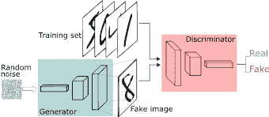
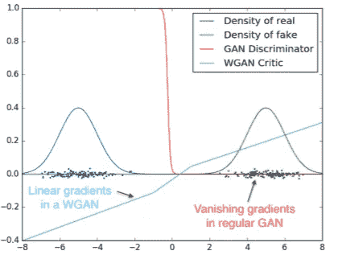
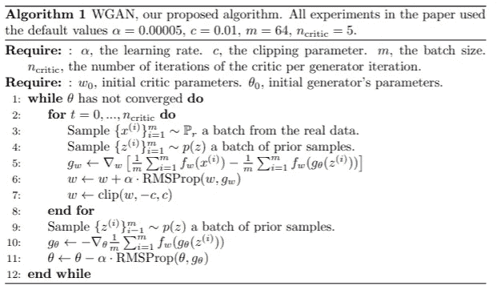
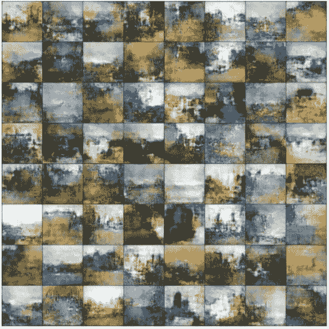

# WGAN 如何使用人工智能像莫奈一样绘画

> 原文：<https://medium.com/analytics-vidhya/how-to-use-ai-to-paint-like-monet-5d7178c6ddc5?source=collection_archive---------2----------------------->

创造新材料，特别是艺术等创造性材料，长期以来一直被视为机器学习算法无法完成的任务。幸运的是，随着机器学习的普及和生成对抗网络(GAN)架构的创建，我们现在可以用数学来形式化艺术创作的过程。这使得我们可以训练机器学习模型，以莫奈等著名艺术家的风格再造艺术。

这篇文章将探索 Wasserstein GAN 架构，其设计背后的直觉，以及它与 GAN 的关系。下面我还包括了一些用这种技术生成的示例图像。要了解更多关于原始 GAN 架构的信息，以及它如何工作的技术描述，请参考我以前的文章:[*py torch 中 GAN 的介绍。*](/geekculture/introduction-to-the-gan-in-pytorch-bba920347b01)

在 [Unsplash](https://unsplash.com?utm_source=medium&utm_medium=referral) 上[安德里安·瓦雷亚努](https://unsplash.com/@freephotocc?utm_source=medium&utm_medium=referral)拍摄的照片

# 概观

这种生成新艺术品的过程与任何其他机器学习工作流都非常相似。我们首先必须获得包含相关示例的图像数据集。在这种情况下，我能够在 Kaggle 上找到莫奈画作的数据集。下一步是在数据集上训练我们的人工智能——也就是所谓的“模型”。模型的目标将是生成令人信服的绘画，理论上我们可以用任何算法或传统的统计学习技术如回归来做到这一点；然而，神经网络在这类任务上要好得多。一旦我们完成训练，我们就能生成莫奈风格的前所未见的图像。下面我们只描述一种可能的(但有效的)技术来做我们刚刚描述的事情。

# 甘的直觉

比方说，我们想训练一个模型来画出莫奈风格的画。在其核心，GAN 由两个[神经网络](https://news.mit.edu/2017/explained-neural-networks-deep-learning-0414)组成，它们相互进行游戏。有一个生成器网络试图生成莫奈风格的图像，还有一个鉴别器网络旨在区分生成器的画作和真正的莫奈画作。生产者因欺骗鉴别者认为其假画是真的而获得奖励，而鉴别者因正确区分真画和假画而获得奖励。随着时间的推移，每个网络在各自的任务上变得更好，结果是一个可以产生非常令人信服的绘画的生成器。

值得注意的是，这个相同的过程可以应用于许多领域，包括艺术、音乐和文学，以生成某个作者风格或样本领域的新材料。这也是 DeepFakes 创作背后的驱动过程。

# 什么是瓦瑟斯坦甘？

在这里，我们描述区分 WGAN 和 GAN 的技术方面。如果你不熟悉机器学习，其中一些术语可能没有意义，没关系。你需要了解的只是 GAN 是如何工作的，以及 WGAN 是如何改进这个过程的。您应该从本节学到的主要内容是，WGAN 架构让生成器和鉴别器更好地了解其预测中存在多少误差。也就是说，发生器的图像与一组真正的莫奈画作有多么不同，鉴别器未能区分真假画作的程度有多严重。概念永远比公式重要。

WGAN 架构是对原始 GAN 架构的改进。从根本上说，WGAN 和 GAN 架构的最大区别在于梯度如何传播到发生器。

为了计算 GAN 架构的损失(误差),生成器被训练以产生与真实数据分布中的图像近似的图像。我们的目标是最小化真实数据分布和生成器产生的数据分布之间的距离——生成器应该始终产生我们会与真实莫奈画作混淆的图像。测量该距离的一种传统方法是通过测量两个分布之间的交叉熵。两个概率分布之间的交叉熵越低，它们彼此对应得越好。

WGAN critical 提供的平滑渐变。图片来自[1]

WGAN 使用一种称为 Wasserstein 损失的不同的误差度量，这只是测量两个概率分布之间的相似性的不同方式。Wasserstein 距离不是测量交叉熵，交叉熵决定了一个分布相对于另一个分布编码了多少信息，而是将每个分布视为具有质量的物体，并计算在物理意义上，如果我们要在两个分布之间的距离上传输这个质量，将一个分布转换为另一个分布需要多少能量。出于这个原因，瓦瑟斯坦距离也被称为[推土机距离](https://homepages.inf.ed.ac.uk/rbf/CVonline/LOCAL_COPIES/RUBNER/emd.htm)。

这个指标是任意的，那么它到底有多好呢？答案在于实际的机器学习算法是如何表现的。例如，存在交叉熵可以变得无穷大的情况，例如，如果其中一个分布为零。当这种情况发生时，损耗的梯度变得不确定，并且因为 GAN 使用该梯度来学习如何改变其参数以更好地最小化其误差，所以该模型根本不学习。此外，在最小化交叉熵和产生更令人信服的图像之间没有直接关联，误差可以剧烈波动，但仍然产生良好的图像。同样，误差可能看起来非常低且稳定，但仍然对应于非常差的图像质量。通过实验，我们可以验证较低的 Wasserstein 损失对应于较高质量的图像，因此我们可以更容易地解释这种损失。这对于实施这些算法的工程师来说是一个优势，因为他们可以验证训练是否按预期进行，并且可以期待更稳定的训练过程。

# 为什么有效？

这种技术与任何其他神经网络技术的工作方式相同，我们本质上学习“可行”绘画的概率分布，并且在生成步骤中，我们产生可能属于这种分布的图像。

让我们考虑这样一种情况，我们希望用 GAN 产生一个 256 x 256 x 3 的图像，并且我们的输入图像具有相同的尺寸。这里我们有 256 个像素的高度和宽度，每个像素有 3 个通道代表红色、绿色和蓝色值。如果我们查看这样一幅图像中所有可能像素值的集合，并将其与莫奈画作中找到的所有像素值的集合进行比较，我们会发现后者的像素分布更受限制——这是显而易见的，因为可能的莫奈画作远少于可能的图像。在训练过程中，我们的模型学习了真正的莫奈画作在颜色、风格、纹理等方面的共同属性。所有这些属性都编码在像素值中，因此另一种思考方式是*我们的模型学习可能的像素值的分布，当以 256 x 256 x 3 格式排列时，类似于莫奈的油画*。

当我们需要创建一幅新的绘画时，模型可以从它估计的分布中抽取一幅图像，这幅图像很可能类似于真实绘画的风格，但将是全新的！

# 培养

WGAN 架构的训练过程与 GAN 的训练过程相同(更多关于这个[在这里](/geekculture/introduction-to-the-gan-in-pytorch-bba920347b01))。只有两个关键区别。

WGAN 算法。图片来自[1]

首先，鉴别器不是输出一个描述图像是真是假的分类，而是输出一个描述它所考虑的图像“质量”的实数。真实图像应该被分配一个高的分数，而假图像被分配一个低的分数。因为鉴别器只是对图像评分，而不是区分真假图像，所以它在 WGAN 架构中被称为批评家。

其次，批评家比生成器更经常地被训练——我们经常在每次生成器迭代中对批评家迭代 10 或 20 次。这是使用瓦瑟斯坦损失的另一个结果。直觉上，一个更好的批评家会产生一个更好的生成器，因为生成器对它做得有多好有更好的想法。然而，在原始 GAN 架构中，如果鉴别器超过发生器，这可能导致发生器接收到非常小的梯度，结果根本无法学习，我们被迫尝试保持他们的技能水平，即使游戏继续进行。瓦瑟斯坦损失避免了这一点，事实上鼓励训练批评家达到最优，允许我们训练一个更优的发电机，而没有任何不稳定性。

# 结果

使用 WGAN 架构，我在一组莫奈的画作上进行训练，并生成了一些令人信服和兴奋的例子。随着更多的计算能力和更多的训练时间，结果可能会更好。以下结果是使用通过 Kaggle 提供的 Nvidia Tesla P100 的结果，培训花费了大约 9 个小时。通过使用更大的网络、更多的 GPU 和一次训练几天，研究取得了更好的结果。

这是发生器如何随着训练变得更好而改变一组输出图像的时间推移。请注意它是如何学习与莫奈风格相关的主题、配色方案和纹理的。

生成的图像在训练中的演变

以下是一些最终的图像:

# 结论

WGAN 架构是生成现有数据的令人信服的新样本的强大方法。它在许多领域都有应用，并且是一种使用机器学习来创作艺术的奇妙技术。迄今为止，已经提出了许多替代架构，其中许多在定性图像质量方面优于 WGAN，包括 WGAN 的变体以及 StyleGAN 等新架构。

要探索代码并为您自己的图像重现训练过程，请查看 GitHub 库[这里](https://github.com/123epsilon/WGANMonetGeneration)。ReadME 文件还链接到原始 Kaggle 内核，在那里您可以看到更多的视觉效果并访问我使用的数据集。

[1]https://arxiv.org/abs/1701.07875

[2][https://en.wikipedia.org/wiki/Cross_entropy](https://en.wikipedia.org/wiki/Cross_entropy)

[3]https://arxiv.org/abs/1704.00028

[4]https://arxiv.org/abs/1406.2661

[5][https://towards data science . com/wasser stein-distance-gan-begin-and-progressive-growing-gan-7e 099 f 38 da 96](https://towardsdatascience.com/wasserstein-distance-gan-began-and-progressively-growing-gan-7e099f38da96)

.