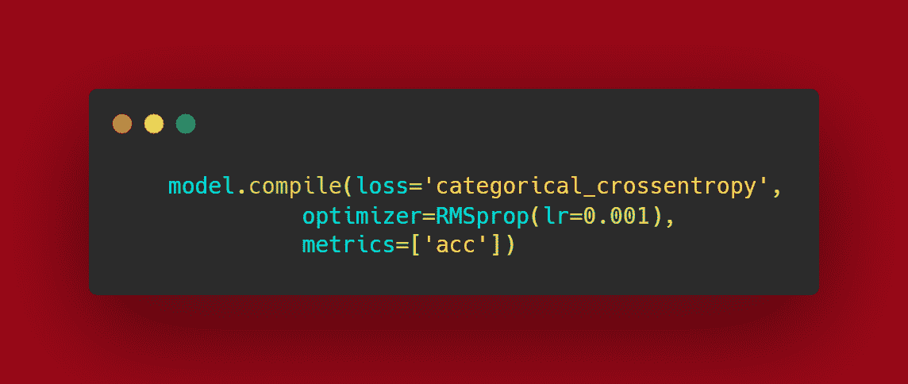

# 如何使用潜力满满的 CNN 模型？

> 原文：<https://medium.com/analytics-vidhya/how-to-use-cnn-models-with-full-potential-2bc16d5f82a6?source=collection_archive---------7----------------------->

# 什么是 CNN 模型？

CNN 模型是一种深度学习算法，用于训练分类模型。然而，使用 CNN 模型的方式取决于图像/视频(每秒帧数)是否计入每个示例中。

CNN 模型有两种主要的分类问题:

1.  二元分类
2.  多类分类

## 二元分类:

二元分类处理 2 个类别，即只有 2 种类型的图像是模型中特定的输入。

**举例:**

*   猫和狗
*   苹果和芒果

在这种分类模式下，整个 CNN 模型非常相似，除了输出层之外没有任何变化。在输出层，我们只使用一个神经元和 Sigmoid 激活函数，因为它更可靠，并且处理二进制预测。Sigmoid 激活函数仅预测一个介于 0 和 1 之间的值。

## 多类分类:

相反，在多类分类中，你有优势对 2 种以上的图像进行分类。所以这里你可以有从 2 到 n 的任意数量的类。

**举例:**

*   猫，狗，人。
*   任何 N 个水果。
*   任意 N 辆车。

这里有两种以上的图像类型，我们使用不同的方法。这里，输出层由 N(即，作为神经元数量的图像类型总数)和名为 Softmax 的激活函数组成，以进行预测。

# 如何将 CNN 模型用于上述任何一种情况？

首先，这两种类型没有太大区别。因此，将根据项目需要建立模型。

基本 CNN 模型包含 4 个主要层:

1.  Con2d
2.  Maxpooling2d
3.  变平
4.  稠密的

而一个更复杂、功能更强大的 CNN 模型由更少的层组成，上面有 4 层:

1.  批量生产
2.  拒绝传统社会的人

以下是如何使用它们的快照。

## 基本 CNN 模型:

正如我上面提到的，一个 4 层将完成工作，调整你的图像尺寸，数据集大小(每种类型的图像数量)，我将在稍后的数据扩充部分讨论。因此，目前这个基本的 CNN 可以解决大多数分类问题。层的形成取决于图像的尺寸。

**举例:**

如果图像是 100×100，您需要将尺寸减小到 8×8 或 7×7 的最佳尺寸。

如果图像是 500×500，那么你可能需要添加更多的层。因此，您可以打印模型摘要来检查尺寸减少到了多少。

## 复杂的 CNN:

在这里，你可以看到我添加了几层，它们与其他几层结合在一起。将逐一讨论合并这些层背后的原因:

然而，添加批量归一化层通过输入层的归一化显著减少训练深度网络所需的训练时期的数量，使得 CNN 模型更快且更稳定。

因此，添加丢弃层有助于移除包含相同值的不明确节点。Dropout 有助于避免过度拟合，因为它删除了大多数重复的节点，这些节点也在每个时期后给 CNN 模型相同的值。

在建立了 CNN 模型之后，它需要被编译。

**注:**此处的损耗变量根据 CNN 模型类型(二进制或多进制)而变化，因此需要进行相应的改变。

# 那么，数据是如何进入 CNN 模型的呢？

有一个被称为**数据增强**的部分，它在数据被发送到管道之前处理数据预处理。数据扩充不过是基本的图形操作(如旋转、平移、缩放等)。所有这些操作都是在模型执行过程中发生的，使用数据扩充的主要原因是为了避免使用其他库进行手工数据预处理。

正如我上面提到的，数据扩充在具有较小数据集(每种图像类型几百个)的项目中起着巨大的作用。最好保持最佳的数据集大小，每个图像类型/类别至少有 200 个图像，尺寸为 100 X 100。

即使这被认为是较小的，但数据扩充可以帮助您在运行时创建每个映像的更多副本，您无需担心在哪里存储这些副本，因为它们存储在 RAM 中，执行后创建的副本会被销毁。

这是数据扩充块的样子。

正如你所看到的，这里给出的操作是合并到一个库中的基本图像处理功能。

# 结论:

CNN 模型的使用方式易于理解和实现。如果您非常了解您的模型和数据集属性，那么在需要不同修改的自定义数据集上训练您自己的模型可以很容易地完成。

## 参考资料:

1.  h[ttps://medium . com/analytics-vid hya/multi-class-classification-using-CNN-For-custom-dataset-7759865 BD 19？source = friends _ link&sk = e 54 faf 08 bbf 2e 3c 73 aabbccdc5d 7480 c](/analytics-vidhya/multi-class-classification-using-cnn-for-custom-dataset-7759865bd19?source=friends_link&sk=e54faf08bbf2e3c73aabbccdc5d7480c)
2.  引用:
    Https://Medium。com/Analytics-vid hya/Multi-Class-Classification-Using-Cnn-For-Custom-Dataset-7759865 BD 19？source = Friends _ link&Sk = e 54 faf 08 bbf 2e 3c 73 aabbccdc5d 7480 c