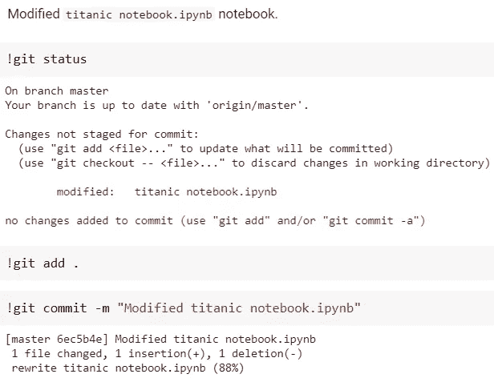

# 如何通过 Google Drive 将 Google Colab 与 GitHub 配合使用

> 原文：<https://medium.com/analytics-vidhya/how-to-use-google-colab-with-github-via-google-drive-68efb23a42d?source=collection_archive---------0----------------------->

在本教程中，我们将讨论如何将 **Google Colab** 与 **GitHub** 一起用于我们的数据科学、机器学习项目，并使用 **Google Drive** 作为云数据存储。我来介绍一下这些产品。

1.  Colaboratory，简称 **Colab** ，是谷歌研究院的产品。它允许任何人通过浏览器编写和执行任意 python 代码，特别适合机器学习、数据分析和教育。
2.  **GitHub** 是一个用于版本控制和协作的代码托管平台。它让你和其他人在任何地方一起工作。从而允许无缝协作，而不损害原始项目的完整性。
3.  **Google Drive** 提供文件存储和同步服务，允许用户在其服务器上存储文件，跨设备同步文件，以及共享文件。它向用户提供 15 GB 的免费存储空间。

下图描述了这些产品如何相互作用，


图片由作者提供 GitHub、Colab 和 Drive 之间的交互

# 第一步:使用 colab 笔记本作为外壳

1.  访问[谷歌合作实验室](https://colab.research.google.com/)网站
2.  点击*新建笔记本*按钮。初始化并打开一个空白笔记本

# 步骤 2:将 Google Drive 安装到 Google Colab 笔记本上

*   运行下面的脚本来安装你的 Google Drive

```
**from** google.colab **import** drive
drive.mount('**/content/drive**')
```


作者截图——验证谷歌账户

*   单击链接以验证用户 Google 帐户
*   选择您要安装的相应 Google Drive 帐户，然后单击登录
*   将验证码复制并粘贴到输入单元格中
*   恭喜你。你的谷歌硬盘已经安装好了，


作者截图——安装了 Google Drive

# 步骤 3:更改当前工作目录

*   下面的 shell 命令会将当前工作目录设置为，
    `/content/drive/MyDrive/Github`

```
%cd **/content/drive/MyDrive/Github/**
```

**注意:**你的 Google Drive 的主目录在，`/content/drive/MyDrive/`

# 步骤 4:生成 GitHub 访问令牌

现在是生成 GitHub 令牌的时候了，这个令牌可以用来访问 GitHub API。

*   访问 [GitHub](https://github.com/) 网站并登录您的账户。
*   进入*设置*，导航至*开发者设置*，然后点击*个人访问令牌*。您的页面应该看起来像这样，


作者截图—[https://github.com/settings/tokens](https://github.com/settings/tokens)

*   点击页面右上角的*生成新令牌*按钮。
*   点击*选择范围*部分下的 *repo* 复选框，如图所示。


作者截图—生成新的访问令牌

了解有关访问令牌的[范围的更多信息。](https://docs.github.com/en/developers/apps/scopes-for-oauth-apps)

*   现在，点击页面底部的*生成令牌*按钮。现在，页面应该看起来像这样，


由作者生成的访问令牌的屏幕截图

您已经成功地为您的 GitHub 帐户生成了访问令牌。我们将使用这个令牌来访问 GitHub API。**注意:**不要像我一样公开你的访问令牌，我将只在本教程中使用。

现在，出现了两种不同的情况。

1.  从头开始创建一个**新的 git 存储库**
2.  从 GitHub 克隆一个**现有的 git 存储库**

根据您的要求，遵循以下步骤，

# 第五步。答:创建一个新的 Git 库

按照下面的步骤直接在 Google Drive 中从头开始创建一个新的 git 存储库，

## 第五步。A.1:初始化新的 Git 存储库

*   使用`git init <directory>`初始化 git。在本教程中，我们将使用 *titanic* 存储库。
*   将您的工作目录更改为创建的存储库。
*   使用`ls`命令列出文件和文件夹。


作者截图— git init 命令

## 第五步。A.2:使用 Git 存储库

*   是时候将文件和文件夹添加到您的工作目录中了。
*   `git status`查看工作目录和暂存区的状态。
*   `git add`将工作目录中的变更添加到暂存区。

了解有关如何将 Kaggle 数据集下载到 Google Colab 的更多信息。


作者截图—将文件添加到工作目录

*   按照您的要求添加文件和文件夹后，使用`git commit -m "message"`提交您的工作。

## 第五步。答 3:在 GitHub 上创建一个新的存储库

一旦您对您的工作感到满意，并希望将您的提交保存到 GitHub，请遵循以下步骤，

*   访问 [GitHub 官方](https://github.com/)网站，用账号登录。
*   在 GitHub 中创建新的资源库。**注意:**不要用`README`、`.gitignore`或`license`文件初始化存储库。这个空的存储库将等待您的代码。不要担心，你可以在 Google colab(本地机器)中创建这些文件，或者在 GitHub 上创建第一个`git push`之后。


作者截图——在 GitHub 上创建新的存储库

## 第五步。答 4:将您的提交上传到 GitHub

在将提交推送到 GitHub 帐户之前，您需要配置您的 Google Drive git 存储库。为此，请遵循以下步骤，

*   从您的 GitHub 帐户创建一组变量，

```
https://github.com/<username>/<repository> 
```

1.  `username` —您的 GitHub 用户名。在我们的例子中，它是`MohammedIsmailP`。
2.  `repository` —已创建存储库。在我们的例子中，它是`titanic`。
3.  `git_token` —您的个人访问令牌(*请勿公开*)。

*   将上述变量中的`remote`添加到 git 中，

```
git remote add <remote-name> https://{git_token}@github.com/{username}/{repository}.git
```

*   使用`git push`命令提交，

```
git push -u <remote-name> <branch-name>
```


作者截图—将提交推送到 GitHub

恭喜你！！您已经成功地将您的提交推送到 GitHub。我们在 GitHub 验证一下吧。


作者截图 GitHub 中反映的 git 提交

# 第五步。b:克隆一个现有的 Git 存储库

按照下面的步骤将 GitHub 中现有的 git 存储库克隆到您的 Google Drive 中，

*   转到您的 GitHub 存储库来克隆存储库。
*   点击*代码*按钮，复制如图所示的网址，


作者截图— GitHub 存储库页面

*   在克隆您的 GitHub 库之前，您需要您的 GitHub 访问令牌。也从你的 GitHub 帐户中提取一组变量。

1.  `username` —您的 GitHub 用户名。在我们的例子中，它是`MohammedIsmailP`。
2.  `repository` —创建的存储库。在我们的例子中，它是`titanic`。
3.  `git_token` —您的个人访问令牌(*不公开*)。

```
git clone https://{git_token}@github.com/{username}/{repository}
```


作者截图——带有 GitHub 访问令牌的 git 克隆

恭喜你！！您已经成功克隆了您的 GitHub 资源库。您可以开始处理您的存储库，并通过使用`git commit -m "message"`提交来保存您的工作。



作者截图—提交对 Git 的更改

一旦您对您的工作感到满意，并希望将您的提交保存到 GitHub，您可以使用`git push`命令将您的提交推送到 GitHub。


作者截图—将提交推送到 GitHub

恭喜你！！您已经成功地将您的提交推送到 GitHub。你可以在 GitHub 里验证一下。


作者截图 GitHub 中反映的 git 提交

就是这样！我们的教程到此结束！！我们已经成功学习了“如何通过 Google Drive 将 Google Colab 与 GitHub 配合使用”。我希望你喜欢这个教程。但是等等，我们从来没有学过‘如何运行存储在 Google Drive 中的笔记本’。别担心，我也会搞定的。

# 如何运行存储在 Google Drive 中的笔记本

要运行存储在 Google Drive 中的笔记本，请按照以下步骤操作。

*   打开您的 [Google Drive](http://drive.google.com/) 并使用您的帐户登录。
*   在 Google Drive 中找到你的笔记本，右击笔记本打开*动作*菜单，悬停在*打开*，选择*谷歌合作*，如图所示。


作者截图——从 Google Drive 打开笔记本到 Google 协作室

*   所需的笔记本将在 Google Colab 的新标签页中打开。
*   将您的 Google Drive 安装到 Google Colab(参考步骤 2)。
*   更改工作目录(参考步骤 3)。


作者截图——安装 Google Drive 并更改工作目录

*   然后执行您的代码。

就是这样！很简单，不是吗？希望，有帮助。快乐学习！！

# 参考

1.  【OAuth 应用的范围
2.  [如何将 Kaggle 数据集下载到 Google Colab](/analytics-vidhya/how-to-download-kaggle-datasets-into-google-colab-via-google-drive-dcb348d7af07)
3.  从 [Git 手册](https://guides.github.com/introduction/git-handbook/)中了解更多关于 Git 和 GitHub 的信息