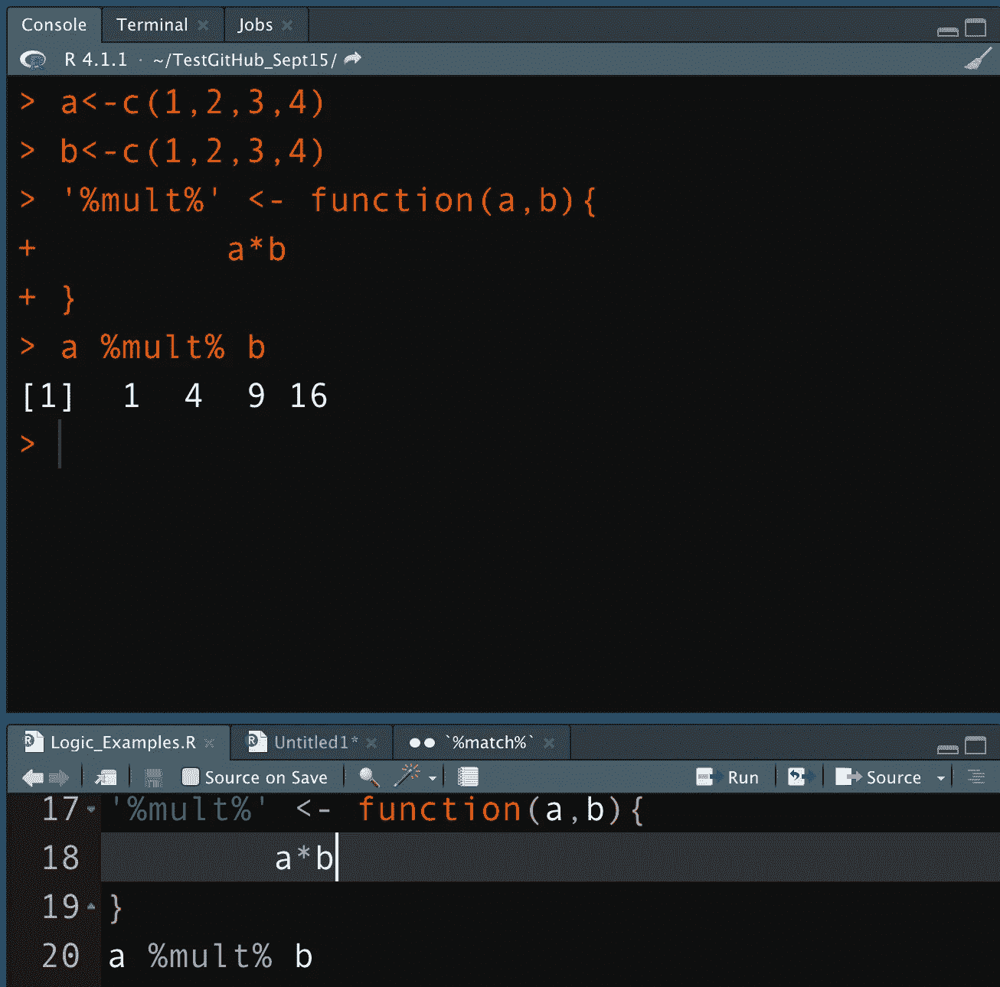

# R 编程中如何使用中缀运算符

> 原文：<https://medium.com/analytics-vidhya/how-to-use-infix-operators-in-r-programming-49a6b25ed597?source=collection_archive---------8----------------------->

## 中缀函数(操作符)可以帮助清理您的数据模型并维护操作顺序的偏好

在 R 编程中创建和调用中缀函数的例子

R 编程中的大多数函数都是用括号中的参数集编写的。但是偶尔，参数的顺序需要不同的格式来保持预期的顺序…