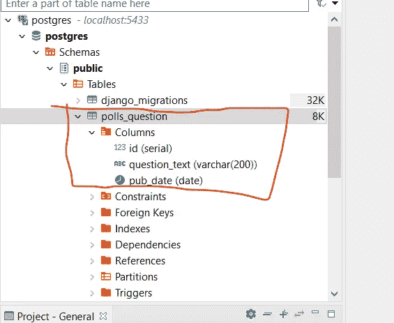
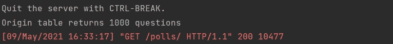
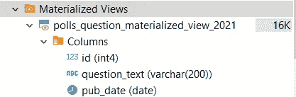
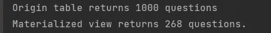

# 如何在 Django 中使用物化视图

> 原文：<https://medium.com/analytics-vidhya/how-to-use-materialized-view-in-django-3b91f71f718a?source=collection_archive---------0----------------------->

Django 是最流行的 Python Web 框架之一。它是基于“模型-模板-视图”模式设计的。在 Django 中，模型充当数据(数据库)的接口。由于每个模型都与数据库中的每个物理表相关联，我开始考虑是否有可能让 ORM 处理更高级的数据库特性，即视图和物化视图。结果不仅仅是伟大！

视图和物化视图是查找 SQL 查询的结果。它们之间的主要区别是物化视图将结果存储为一个实际的表，而视图不是。从技术角度来说，视图和物化视图有利于重复查询。它们提高了查询速度。从业务的角度来看，它们可以用于声明不同团队/部门使用的数据范围。问题是我们如何在 Django 中利用这个特性？

以下是我的研究结论——ORM 可以很好地处理物化视图而不是视图。很有道理，不是吗？因为物化视图是一个物理表。ORM 应该能联想到。关于视图，ORM 有一个类似的称为“管理器”的机制，我将在以后写另一篇文章向您介绍。让我们继续我们的物化视图教程。

属国

1.  Python 3.7
2.  Django 2.2.x
3.  psyco pg 2-二进制 2.8.6

在本教程中，我将使用 PostgreSQL 数据库。一定要选择您想使用的任何关系数据库。为了让 Python 与 PostgreSQL 数据库“对话”，我们需要 pip 安装 **psycopg2-binary** 。此外，您可能需要在自己的机器上设置一个本地 PostgreSQL 数据库，以便 Django 项目中的模型可以连接。

# 步骤 0。创建本地数据库

如下下载并安装 PostgreSQL 引擎。按照步骤操作。您应该能够创建一个本地数据库。

https://www.postgresql.org/download/

关于数据库客户端，我想用 DBeaver 社区版。有很多选择。这取决于你。

[](https://dbeaver.io/) [## DBeaver

### 免费的多平台数据库工具，适用于开发人员、数据库管理员、分析师和所有需要工作的人…

dbeaver.io](https://dbeaver.io/) 

# 第一步。构建模型以创建源表

在**民调** app 中的 models.py，声明一个**问题**模型如下。

```
from django.db import models

class Question(models.Model):
    question_text = models.CharField(max_length=200)
    pub_date = models.DateField(null=True, default=None)
```

如下运行迁移命令。等待第一个命令产生影响，然后再运行第二个命令。

```
python manage.py makemigration polls
python manage.py migrate polls
```

这应该会在数据库中创建一个 **polls_question** 表。在我的例子中，我的本地数据库名是 **postgres** 。该表位于**公共**模式下。各列如下所示。



让我们将一些数据填充到表格中。

运行下面的命令，应该会把我们带到 Django 控制台。

```
python manage.py shell
```

在控制台中复制并粘贴以下代码。点击**进入**。它应该插入 1000 行。现在我们有足够的数据来测试！

```
from polls.models import Question
import string
import random
import datetimeN = 10
questions = []
for each in range(1000):
    res = ''.join(random.choices(string.ascii_uppercase + string.digits, k=N))
    syear = random.randint(2018, 2021)
    smonth = random.randint(1, 12)
    sdate = random.randint(1, 20)
    pub_date = datetime.date(year=syear, month=smonth, day=sdate)
    questions.append(Question(question_text=res, pub_date=pub_date))Question.objects.bulk_create(questions)
```

# 第二步。在源表上创建查找查询

在 **polls** app 的 **views.py** 中，选择 **polls_question** 表中的所有数据，添加查找查询。

```
from django.shortcuts import render
from polls.models import Question
import datetimedef index(request):
    questions = Question.objects.all()
    print('Origin table returns {} questions'.format(questions.count()))return render(request, 'polls/index.html')
```

启动项目。在浏览器中打开[http://127 . 0 . 0 . 1:8000/polls/](http://127.0.0.1:8000/polls/)。我们应该在控制台中看到如下的打印结果。它返回 1000 行。这是我们所期待的。



# 第三步。在数据库中创建实体化视图

在 PostgreSQL 控制台中，运行以下 SQL 命令生成一个物化视图，该视图仅包含发布日期在 2021 年或之后的数据。

```
create materialized view polls_question_materialized_view_2021 as
select * from polls_question
where pub_date>='2021-01-01'
```

我们应该在如下的物化视图类别下看到它。



# 第四步。构建模型并将其与物化视图相关联

在**polls**app 的【models.py 中，创建一个模型 **Question2021** 如下图。

```
class Question2021(models.Model):
    question_text = models.CharField(max_length=200)
    pub_date = models.DateField(null=True, default=None) class Meta:
        managed = False
        db_table = 'polls_question_materialized_view_2021'
```

显式声明 db_table 很重要，这样 Django 就可以在模型和物化视图之间建立连接。请不要运行迁移。因为物化视图已经通过 SQL 命令手动创建。另外，我们需要确保**管理的**属性为假。这确保了 Django 不会在我们将来在 **polls** 应用上运行迁移时错误地创建表。

# 第五步。在物化模型上创建查找查询

通过选择**问题 2021** 模型上的所有数据添加查找查询，并在控制台中打印退货数量。代码应该如下所示。

```
from django.shortcuts import render
from polls.models import Question, Question2021def index(request):
    questions = Question.objects.all()
    print('Origin table returns {} questions'.format(questions.count()))questions_2021 = Question2021.objects.all()
    print('Materialized view returns {} questions.'.format(questions_2021.count()))return render(request, 'polls/index.html')
```

启动项目。在浏览器中打开[http://127 . 0 . 0 . 1:8000/polls/](http://127.0.0.1:8000/polls/)。我们应该在控制台中看到如下两个打印结果。实体化视图返回的行数少于源表返回的行数。果然有效！



# 结论

在本文中，我们在数据库中创建了物化视图，并将其与 ORM 模型相关联。很简单，是吗？从架构的角度来看，希望它能让您更好地了解如何管理您的数据查询引擎。感谢阅读。敬请关注。

如果你感兴趣的话，我已经把这个项目上传到这里了。

[](https://github.com/slow999/DjangoAndMaterializedView) [## slow 999/djangoandmaterialized view

### 通过在 GitHub 上创建一个帐户，为 slow 999/DjangoAndMaterializedView 开发做出贡献。

github.com](https://github.com/slow999/DjangoAndMaterializedView) 

我在上面拍了视频。请看下面。谢了。