# 了解置信区间:使用新冠肺炎疫苗样本

> 原文：<https://medium.com/analytics-vidhya/how-to-use-number-of-covid-19-vaccinated-people-from-our-neighbourhood-to-extrapolate-age-ae2dc2897c6?source=collection_archive---------6----------------------->

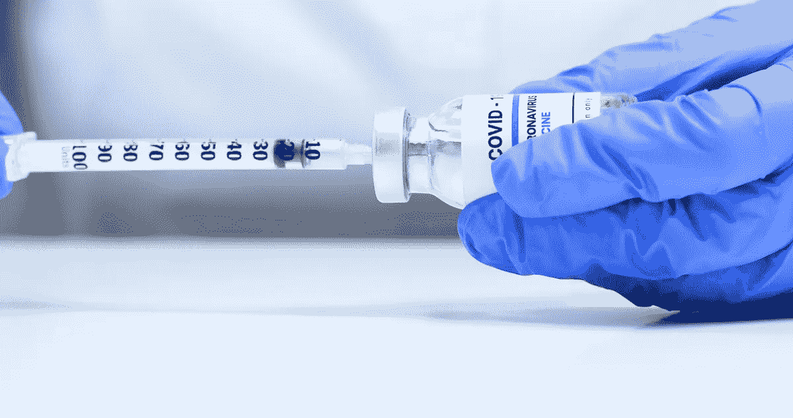

图片取自[https://midstatemedical.org/about/news-press/news-detail?articleid = 32548&public id = 395](https://midstatemedical.org/about/news-press/news-detail?articleid=32548&publicId=395)

美国总统几周前宣布，如果你完全接种了疫苗，就没有必要戴口罩。但是我们如何相信人们是否对他们的疫苗接种状况说了实话。我们不能不戴口罩到处向每个人索要疫苗接种证明。

我们希望了解“我们城市有多少人接种了疫苗”，以了解接种疫苗的人是否仍应采取预防措施。

如果我们想从我们很容易收集到的数据中得到关于城市中疫苗接种的想法，那岂不是非同寻常？我们将在接下来几分钟内完成这项工作。

让我们先弄清楚一些统计学术语。

# **样本统计**

样本统计是从数据中计算出的任何数字，它告诉我们关于数据的一些事情。我们将使用比例作为我们实验的样本统计。

比例可以使用以下公式计算:

接种疫苗的人数/样本中的总人数

# **中心极限定理**

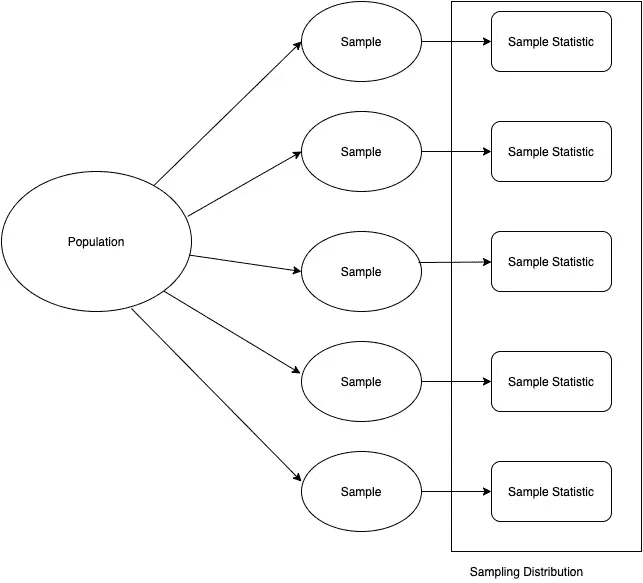

如果我们将所有样本的统计数据按其出现的频率绘制成图，它将接近正态分布，其平均值非常接近总体平均值，标准偏差将比总体标准偏差小得多。

以下是来自总体的 200 个随机样本，平均值为 0，标准偏差为 20，每个样本的大小为 30。

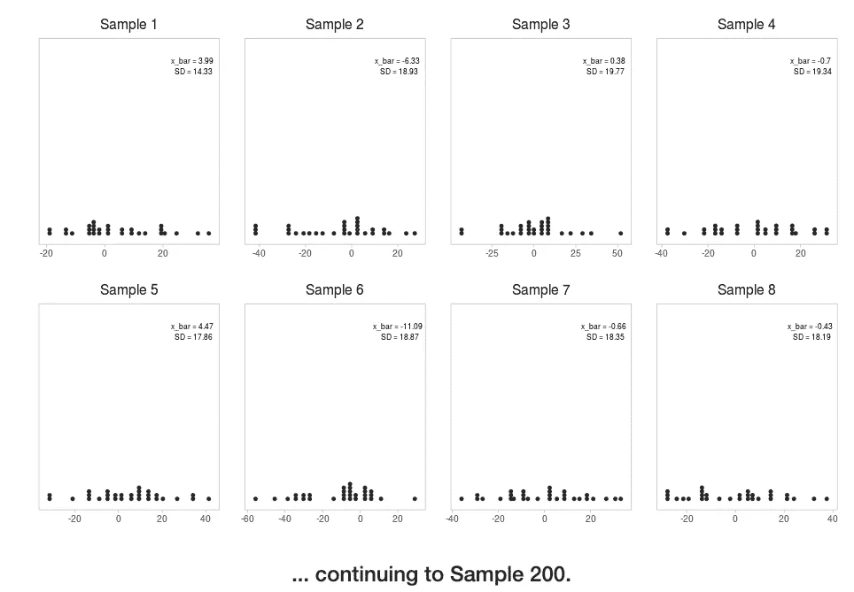

图片取自[https://gallery.shinyapps.io/CLT_mean/](https://gallery.shinyapps.io/CLT_mean/)

我们将计算上述每个样本的样本平均值，并绘制成图。抽样分布如下所示:

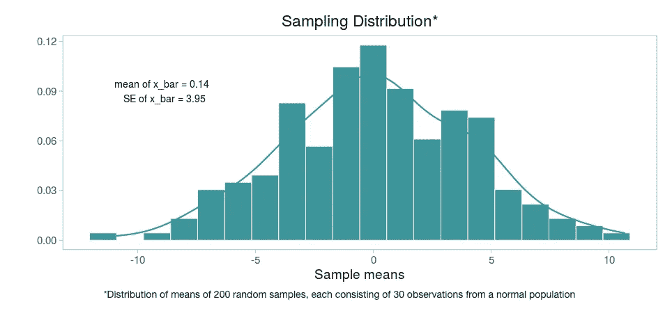

图片取自[https://gallery.shinyapps.io/CLT_mean/](https://gallery.shinyapps.io/CLT_mean/)

如你所见，它看起来几乎正常。

您可以尝试更改每个变量的值，并检查它在分布中产生的差异。可以用这个工具多实验:[https://gallery.shinyapps.io/CLT_mean/](https://gallery.shinyapps.io/CLT_mean/)

**中心极限定理**陈述“如果我们从总体中随机抽取大小为 n 的样本。样本统计的分布。抽样分布将接近正态分布，以总体平均值μ为中心，标准偏差等于总体标准偏差除以样本大小的平方根σ/sqrt(n)”

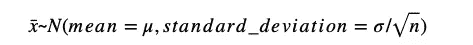

其中 n 是每个样本的大小

在我们的实验中，当被问及是否接种过疫苗时，人们可以回答是或否。由于我们的数据是绝对的，我们不会有任何平均值，所以我们将使用比例。

# **比例中心极限定理**

它指出“如果我们从总体中随机抽取 n 个样本。样本比例的分布将接近正态分布，以总体比例 p 为中心，标准误差与样本大小成反比”

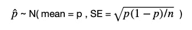

其中 n 是每个样本的大小。p 是人群中接种疫苗的人的年龄百分比。

正如我们所见，该公式与我们使用的样本数量无关。如果满足以下条件，即使只有一个样本，我们也能得出类似的结果:

1.  **独立性**:抽样观测值必须是独立的。要做到这一点，必须进行随机抽样。我们应该使用少于 10%的人口，以确保随机抽样。在我们的实验中，我们使用了 100 人的样本，这绝对少于城市人口的 10%。
2.  **样本量**:样本中至少要有 10 次成功和 10 次失败。在我们的样本中，我们将成功定义为接种疫苗。在我们的样本中，100 人中有 24 人接种了疫苗，所以我们有 24 个成功，76 个失败。

当这些条件满足时，我们可以假设它将遵循正态分布。

# **置信区间**

置信区间是高于和低于样本比例的一组值，包含概率等于定义的置信水平的未知总体比例。置信区间的计算方法如下:

点估计误差幅度

在我们的情况下，点估计是由 p̂表示的样本比例

# **误差幅度**

> 一个**误差幅度**告诉你**你的结果将会与真实人口值**相差多少个百分点。例如，95%的置信区间和 4%的误差意味着在 95%的时间里，您的统计数据将在真实总体值的 4 个百分点以内。

可以使用 **Z* x 标准误差**计算误差范围。让我们看看每一个都意味着什么。

# **Z*(临界值)**

它描述了要覆盖数据中一定量的总变化(即 90%、95%、99%)离分布的平均值有多远。

这取决于我们将使用什么样的置信度值。例如，如果我们使用 95%的置信水平，我们得到 Z*为 1.96，记住 95%的置信水平是指分布的中间值。

> z 的临界值是与[标准正态模型](https://www.statisticshowto.com/probability-and-statistics/normal-distributions/)下的面积相关的项。临界值可以告诉你任何特定变量的概率。

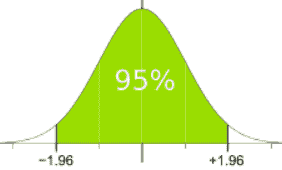

图片取自 https://www.mathsisfun.com/data/confidence-interval.html

您可以在下图中检查一些常用置信水平的临界值:

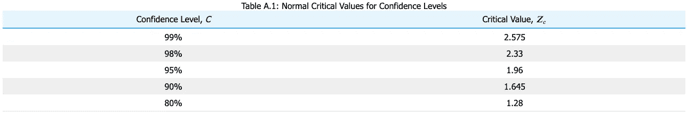

图片摘自[https://stats . libre texts . org/Book shelves/introductive _ Statistics/Book % 3A _ Statistics _ Using _ Technology _(科萨克)/12% 3A _ Appendix-_ Critical _ Value _ Tables/12.02% 3A _ Normal _ Critical _ Values _ for _ Confidence _ Levels](https://stats.libretexts.org/Bookshelves/Introductory_Statistics/Book%3A_Statistics_Using_Technology_(Kozak)/12%3A_Appendix-_Critical_Value_Tables/12.02%3A_Normal_Critical_Values_for_Confidence_Levels)

# **标准误差**

比例的标准差定义为样本比例关于总体比例的分布。更具体地说，标准误差是统计标准偏差的估计值。它与标准差有相似的性质，因为两者都是离差的度量。它用于查找样本的准确性和效率。

考虑 p 是人口比例，p̂是样本比例。

因此，比例标准误差的公式定义如下:

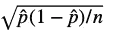

其中 p̂定义为成功次数/样本量

**使用置信区间估计比例:**

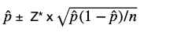

> 以社区为基础的随机样本进行健康调查对于获取无法接触到的人群至关重要，但如果接触参与者的努力不够，这些调查可能会有偏差。

假设我们有社区中接种疫苗人数的数据。由于目前何时接种疫苗完全取决于个人的判断，我们可以假设这是随机抽样。

假设我们对居住在我们社区的 100 人(在相同时间内有资格接种疫苗)进行了调查，其中 24 人目前已接种疫苗。我们想在这个样本的基础上计算出这个城市中接种过疫苗的人的年龄百分比。

接种疫苗的人口百分比=(24/100) *100 =24%

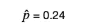

标准误差可计算如下:

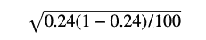

结果是大约 0.0427

90%置信水平的 Z*值是 1.645(查看上表)

我们可以通过以下步骤找到 90%置信水平的置信区间:

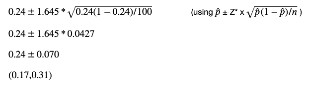

# **置信区间的解释**

我们有 90%的信心，该市 17%至 31%的人口已经接种疫苗。

我们可以看到，置信区间非常宽，基于此很难做出任何决定。

如果我们将样本大小增加到 500，而保持其他一切不变，区间将缩小到(0.20，0.27)。

这意味着如果我们增加样本量，置信区间就会缩小。这是因为随着样本量的增加，样本比例趋向于成为人口比例。

您可以对任何这样的 case 语句使用此方法。我们可以对新冠肺炎感染者做类似的分析，并推断到这个城市。然而，新冠肺炎是一种传染性病毒，从某个特定的社区获取数据会有偏差，因为在某个特定的社区，由于社区传播，可能会有很多感染，而在另一个地区，甚至可能没有一例 covid。无论我们做什么 case 语句，我们都需要确保随机抽样的发生。

快乐学习！

**参考:**

1.  https://bmjopen.bmj.com/content/4/12/e005791
2.  [https://www . statistics show to . com/probability-and-statistics/find-critical-values/#:~:text = 2。-，关键的%20 值% 20 的%20Z，关键的% 20 值% 20 的%201.28](https://www.statisticshowto.com/probability-and-statistics/find-critical-values/#:~:text=2.-,Critical%20Value%20of%20Z,a%20critical%20value%20of%201.28) 。
3.  Coursera 上的推断统计课程，由[Mine etinkaya-Rundel](https://medium.com/u/b5573cb88a35?source=post_page-----ae2dc2897c6--------------------------------)
4.  [https://www . science direct . com/topics/mathematics/sample-statistic #:~:text = A %20 sample % 20 statistic % 20(或%20just，哪个% 20 是%20a%20random%20experiment。](https://www.sciencedirect.com/topics/mathematics/sample-statistic#:~:text=A%20sample%20statistic%20(or%20just,which%20is%20a%20random%20experiment.)
5.  [https://www . scribbr . com/FAQ-asked-questions/what-a-critical-value/](https://www.scribbr.com/frequently-asked-questions/what-is-a-critical-value/)
6.  [https://www . statisticshowto . com/probability-and-statistics/hypothesis-testing/margin-of-error/](https://www.statisticshowto.com/probability-and-statistics/hypothesis-testing/margin-of-error/)
7.  [https://gallery.shinyapps.io/CLT_mean/](https://gallery.shinyapps.io/CLT_mean/)
8.  https://www . chegg . com/homework-help/definitions/standard-error-of-The-proportion-31 #:~:text = The % 20 standard % 20 error % 20 of % 20 The，standard % 20 deviation % 20 of % 20a % 20 statistics。&text =标准% 20 误差% 20 of % 20 比例% 20is %反过来，总数% 20 数量% 20 of % 20 观察值。