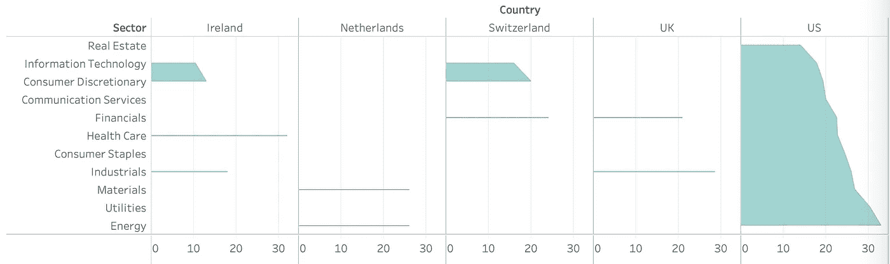
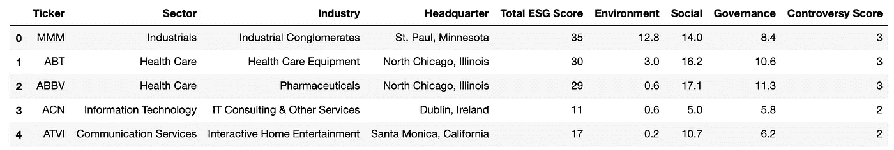
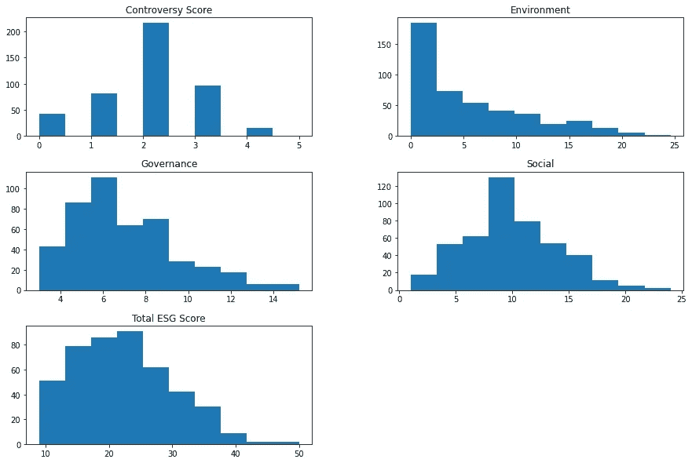
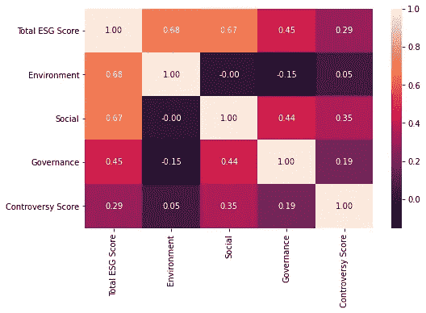
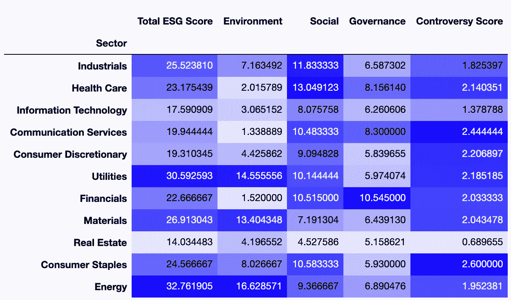
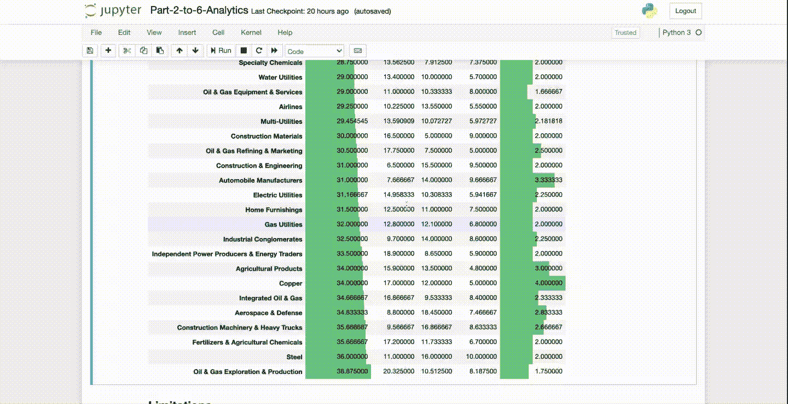
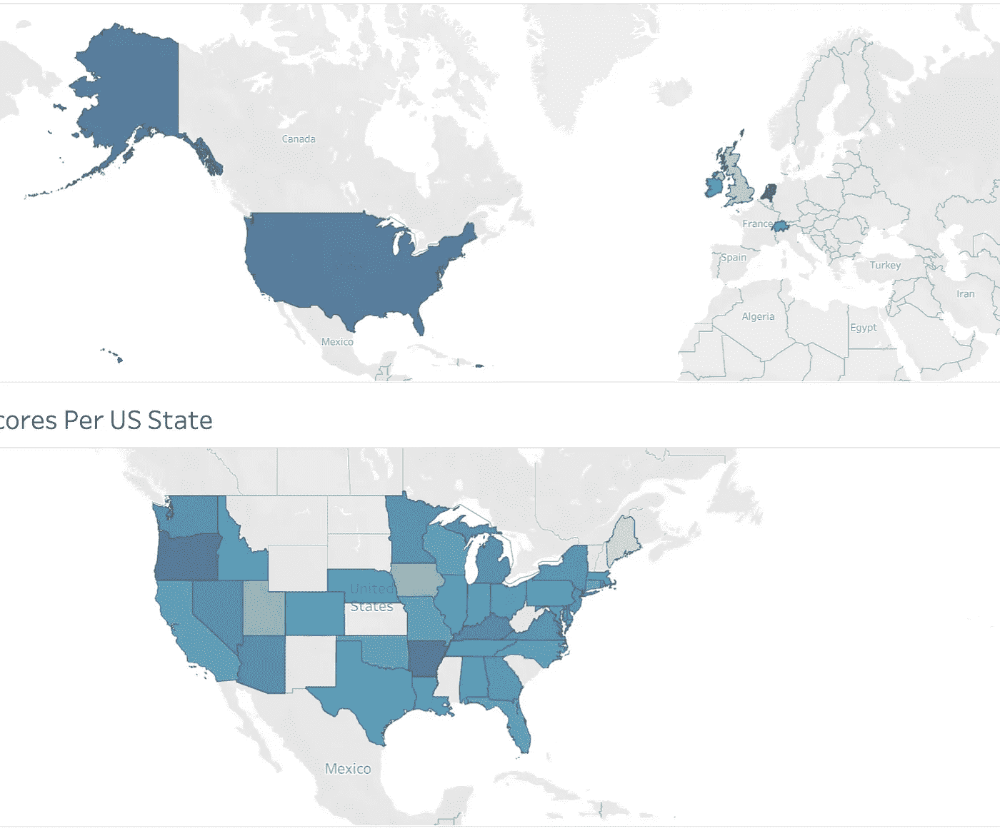
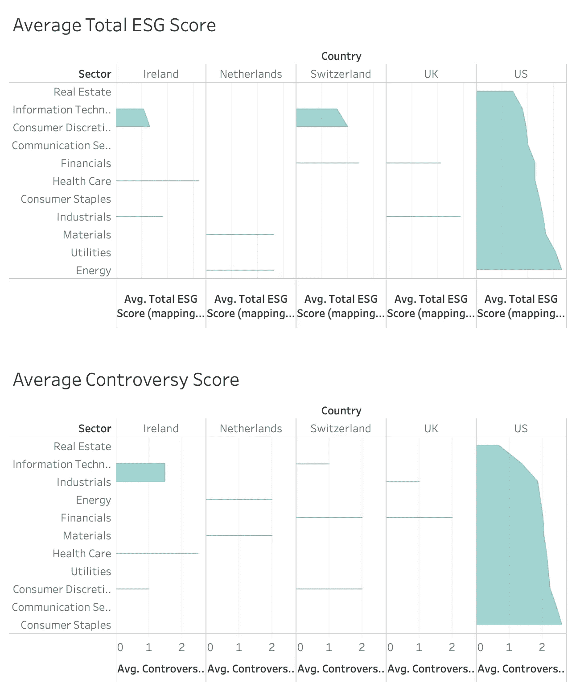

# 如何使用在线 ESG 分数？

> 原文：<https://medium.com/analytics-vidhya/how-to-use-online-esg-scores-6620c645213?source=collection_archive---------11----------------------->

在 2017 年炎热的苏格兰夏天，我正在完成我的硕士论文，该论文旨在将公司的财务表现与其可持续性联系起来。由于缺乏系统的全球报告和合规性，以及现成的 ESG 数据，我决定阅读并提取可持续发展报告中的碳足迹。在审查了 50 多家能源密集型公司后，我发现只有 17 家有可用数据。

由于那次经历，我对越来越多的 ESG 数据变得可用感到非常惊讶。诚然，在公司如何遵守披露要求以及如何更及时地收集数据方面仍然存在挑战，个人投资者直接获取数据并采取行动也存在障碍。然而，这些在线 ESG 数据集对于理解我们的行为如何影响地球和社会是非常宝贵的。

下面是我希望通过这篇文章回答的四个问题:

1.  ESG 总分是如何从个人 E/S/G 评级中得出的？
2.  就 ESG 风险而言，哪些部门和行业表现最佳和最差？
3.  可以使用基于 ESG 分数和部门的线性回归机器学习模型来预测争议分数吗？
4.  标准普尔 500 公司之间的争议得分有什么地理模式吗？

## 第一部分.数据

由于它的易用性，我使用了雅虎上标准普尔 500 公司的 ESG 分数。通过网络搜集融资。这些 ESG 分数由 Sustainalytics(独立 ESG 研究的领导者之一)提供。在清理和整合公司信息数据后，有 452 家公司的数据可用。

数据集中的前 5 行

我们先来看看分数是如何分布的(注意分数越低表示未管理风险越低)。值得注意的是，争议分数是对称分布的，大多数公司(超过 200 家)在 2 和 3。ESG 总分从 0 到 50，数据向右倾斜，表明得分低于平均值的公司更多。

数据集中 5 个数值字段的分布

> “Sustainalytics 的 ESG 风险评级评估公司的企业商业价值在多大程度上受到环境、社会和治理问题的影响。"

每个 E/S/G 分数的构造是另一个有趣的话题，它不在本文的范围之内。相反，我们先来看看总分是如何从其他三个中得出的。从下面的热图来看，E 和 S 因素与得分的相关性似乎比治理更强，相关性分别为 0.68 和 0.67，而 G 因素仅为 0.45。

分数类别之间的相关性

从数据来看，总 ESG 得分似乎是每个 E/S/G 得分的简单相加，但在部署线性回归模型(得分为 0.99)后，它表明尽管这些得分被认为权重约为 1(这意味着，它主要是它们的直接总和)，但不同的行业也在总得分中发挥作用，例如，房地产行业的公司被分配 0.54 的系数，信息技术行业为 0.43。

这就引出了 Sustainalytics 如何构建其 ESG 得分。其方法包括自上而下的子行业风险评估，然后引入一个针对公司特定评级进行调整的测试版:

> 要获得公司特定 ESG 发行的风险得分，需将子行业风险得分乘以公司发行的 beta

## 第二部分。哪些行业的 ESG 风险最低(也最高)？

从自上而下的方法来看，该数据集可能有助于制定行业倾斜战略。按行业分组，数据显示，房地产、信息技术和非必需消费品是风险最小的，而能源、公用事业和材料排名最高。

每个部门的平均分数

有趣的是，尽管总体环境得分是高总体 ESG 得分的主导因素，但有些行业的高总体 ESG 风险主要是高社会或治理得分的结果，如医疗保健、金融和通信服务。

更具体地说，我将数据细分为子行业，发现表现最好的是房地产服务**、**人力资源&就业服务、技术分销商。相反，石油和天然气的开采，钢铁和化肥，农用化学品都是最危险的。

子行业级别排名

## **第三部分。理解争议分数**

鉴于 Sustainalytics 的争议评分是基于对公司的 ESG 事件和事件的持续监控和解释过程，因此它可以更具动态性和前瞻性。例如，如果最近有一起针对某家公司的诉讼，投资者能够判断争议程度在不久的将来可能会如何发展是很重要的。这促使我理解如何使用机器学习来预测这些分数。首先，我再次使用线性回归模型。

争议分数的预测模型

该模型在测试集中仅获得 0.3 左右的分数，该测试集从单个 E/S/G 分数和部门中抽取变量，因此它可能不是一个有效的争议分数模型。这证实了我们从上面第一幅热图中得出的结论。在未来的项目中，可以探索更多数据的进一步模型。

位置在投资组合构建中被广泛使用，因此我也对寻找潜在的地理模式感兴趣。有了这个由美国公司主导的数据集，美国的数据点比其他地方都多，因此我放大以更仔细地观察州的水平。

[*查看互动仪表盘*](https://public.tableau.com/shared/49FSK8KQB?:display_count=y&:origin=viz_share_link)

荷兰和美国的平均争议分数似乎相对较高，在 2 分左右。各国之间的差异不是很大，但英国的得分明显较低，为 1.3 分。

在美国，州一级的最高平均分是 3 分，最低分在犹他州、爱荷华州和缅因州，最高分在俄勒冈州和阿肯色州。

[*查看互动仪表盘*](https://public.tableau.com/views/CountriesandSectors/Dashboard1?:language=en-GB&:display_count=y&publish=yes&:origin=viz_share_link)

## 结论

1.  ESG 总分不是公司 E/S/G 评级的简单总和，还应考虑行业。
2.  在所有影响 ESG 总分的因素中，环境因素的权重最高。一个潜在的原因是，与社会和治理方面相比，环境因素更容易衡量，也有更长的跟踪记录。可持续金融在很大程度上是绿色金融。
3.  从 ESG 的角度来看，房地产、信息技术和非必需消费品的风险最小，而能源、公用事业和材料的风险最高。一些整体风险较高的行业与较高的社会或治理得分有关，而不是环境，如医疗保健、金融和通信服务。
4.  标准普尔 500 公司没有对不同国家进行有力的比较，在提到的 5 个国家中，英国的争议分数最低。
5.  不能从 E/S/G 评级和部门线性预测争议分数。一个部门在不同的国家可能有很大的争议，例如非必需消费品(1 个在爱尔兰，2 个在瑞士)。

请随意查看该项目的 [GitHub 资源库](https://github.com/EvelynLinn/Data-Science-Portfolio)并探索更多内容。