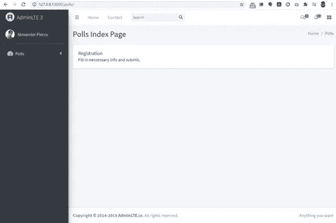
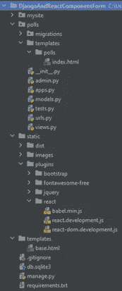
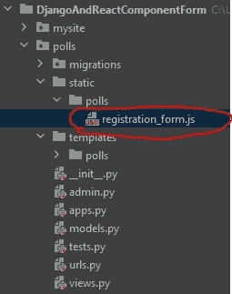
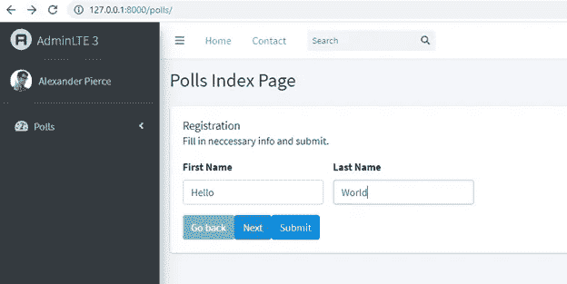
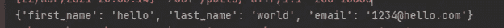
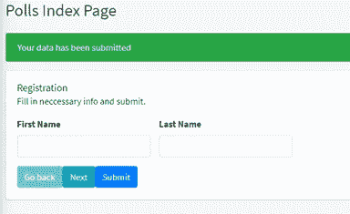
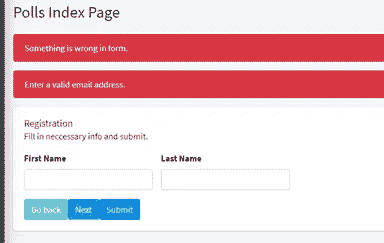
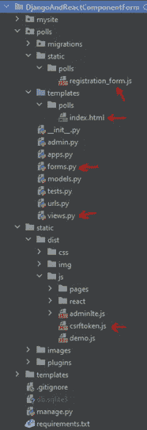

# 如何在 Django 中使用 React 困难的方法

> 原文：<https://medium.com/analytics-vidhya/how-to-use-react-in-django-the-hard-way-6ef2bf8c5d6f?source=collection_archive---------1----------------------->

在[的上一篇文章](/analytics-vidhya/how-to-add-react-js-into-django-24e79e67e992)中，我们已经学习了如何在 Django 中使用 React.js 的基础教程。主要关注前端，和 Django view 联系不大。我知道这还不够。困难来了。

在本文中，我们将深入探讨 web 应用程序中的一个常见特性——表单提交。Django 的传统方式是在后端构建表单，并在主模板中呈现它。如果您需要用户和 GUI 之间的一些交互，请添加 JS 代码。缺点是，如果表单 GUI 很复杂，前端代码可能很难维护。因为表单很可能需要手动呈现。另外，我们可能还需要为表单交互创建和导入一个专用的 JS 文件。请记住，有时一个页面可能有多个表单。真让人头疼！我们需要能把 HTML 和 JS 放在一个文件里的东西。然后反应过来救援。由于其基于组件的设计，我们可以在 JS 文件中为每个表单维护模板和交互代码。它使主模板干净。当你读到本文结尾的结论时，你就会明白我的意思了。

按照本文中的步骤，我们将构建一个完整的工作流，它依赖于前端的 React 和后端的 Django。正如我在上一篇文章中提到的，我仍然打算使用 Django 作为一个 web 框架。这篇文章可能要求你对 React 组件、JSX 语法、Django 表单和 Bootstrap 有基本的了解。在教程的最后，我们将创建一个表单小部件，并能够提交 POST 请求。

依赖关系:

1.  Python 3.7
2.  Django 2.2.x
3.  反应 17
4.  AdminLTE 3.0.5(关于这个主题库，请参见我之前的教程)

# 步骤 0。临时项目和目标

我已经上传了 1.0.0 版本的草稿项目。点击下面的链接，下载“ScratchProject”。zip 文件。

[https://github . com/slow 999/djangoeriactcomponentform/releases/tag/1 . 0 . 0](https://github.com/slow999/DjangoAndReactComponentForm/releases/tag/1.0.0)

让我们开始计划，看看我们有什么。在**127 . 0 . 0 . 1:8000/polls**/page 中，我们的目标是在白盒中添加一个表单小部件。



目标页面

scratch 项目的架构如下。我们将主要工作在**民调** app 和**index.html**模板。React 和 JSX 库维护在**静态/插件/react/** 文件夹中。



暂存项目的模式

# 添加 CSRF 脚本

Django 的安全机制之一是通过 CSRF 中间件来防止跨站点请求伪造。每当发出 POST 请求时，它都是必需的。因为我们使用 React 在模板中呈现表单，所以使用的传统方式不再适用。相反，我们需要手动操作。这个脚本的目标是产生一个 CSRF 令牌元素，这个元素需要添加到表单中。代码片段如下。

让我们将这个脚本导入到 **extra_js** 块中的**index.html**文件中。

```

   <script src="" type="text/babel"></script>

```

# 步骤 2 添加表单划分和反应表单脚本

在**index.html**文件中，添加一个分部并分配 id“registration _ form”。我们将在本部分中呈现反应形式。下面是代码片段。

```
<div class="col-lg-12">
   <div class="card">
     <div class="card-body">
       <h5 class="card-title">Registration</h5>
       <p class="card-text">
         Fill in neccessary info and submit.
       </p>
       <div id="registration_form"></div>
     </div>
   </div>
</div>
```

在 **polls** app 中创建一个**静态**文件夹。在我们刚刚创建的**静态**文件夹中，创建 **polls** 文件夹。然后在我们刚刚创建的 **polls** 文件夹中创建 **registration_form.js** 。这可能会令人困惑。一张照片意味着千言万语。您可能会想到下面的模式。



registration_form.js 文件路径

在 **registration_form.js** 文件中，我们将 React form 构建为一个组件。我将在几分钟内粘贴代码片段。值得一提的是

1.  这个表单小部件有两个步骤。GUI 由“返回”和“下一步”按钮控制。元素的可见性由 **d-none** 类控制。
2.  CSRF 令牌输入通过<csrftoken>在</csrftoken>
3.  提交行为由 **handleSubmit** 函数控制。

代码片段如下。

最后，将该脚本导入到 **extra_js** 块中的**index.html**中。我们期待以下结果。

```

   <script src="" type="text/babel"></script>
   <script src="" type="text/babel"></script>

```

启动项目并检查结果。表单小部件是活的！此时，提交按钮将引发异常。让我们在下一步解决这个问题。



目标页面的屏幕截图

# 步骤 3 添加 Django 表单

Django 表单的用途是验证表单输入。我们称之为后端验证。在 **polls** app 中，创建一个 **forms.py** 文件。并添加以下代码。请注意我们使用表格。验证电子邮件值模式的 EmailField。

# 第四步修改视图功能

在 **polls/views.py** 文件中，我们的目标是做以下事情。

1.  添加发布请求案例
2.  使用我们在上一步中构建的注册表单来验证输入
3.  生成消息

我们期待如下代码。请注意，我们将在控制台中打印输入。

现在我们需要在模板中呈现消息。在 polls/templates/polls/**index.html**文件中，在主要内容划分前添加以下代码。这段代码涵盖以下情况。

1.  如果提交成功，它会在绿色框中显示成功消息。
2.  如果表单输入无效，它会在一个红框中显示错误消息。

```
<div class="content">
   <div class="container-fluid">
     
       
         
           <div class="alert alert-danger" role="alert">
         
           <div class="alert alert-{{ message.tags }}" role="alert">
         
           {{ message }}
         </div>
       
     

     
     <div class="alert alert-danger" role="alert">
       {{ form.non_field_errors }}
       
         
           {{ error }}
         
       
     </div>
     
   </div>
</div>
```

下面是完整的民意调查/模板/民意调查/**index.html**文件。

至此，我们已经完成了一切。让我们看看最终产品！填写数据并提交。我们应该会在控制台中看到类似的输入，如下所示。



控制台打印

前端应该有如下成功消息。



目标页面中的成功消息

错误信息如下。



目标页面中的错误消息

最终模式如下。



最终模式

# 结论

在本教程中，我们充分利用了 Django 和 React。React 负责呈现复杂的 GUI。index.html 的**文件是主模板。我们没有将表单模板和 js 代码转储到主模板中，而是构建了一个 **registration_form.js** 来封装表单组件。我们所需要做的就是导入它，并告诉 React 我们希望将表单渲染到哪个部门。此外，这个 React 表单组件也可以在其他页面中重用。Django 负责处理 HTTP 请求并提供必要的验证。整个系统运行在 Django web 框架上，该框架通过 CSRF 令牌提供安全机制。现在享受华丽的图形用户界面，无需担心安全性！希望这位建筑师能对你目前的项目有所提示。**

如果你感兴趣，我已经把这个项目上传到我的 GitHub 上了。项目名称为 DjangoAndReactComponentForm。

[https://github.com/slow999/DjangoAndReactComponentForm](https://github.com/slow999/DjangoAndReactComponentForm)

感谢阅读。我想知道你对 React + Django 组合的想法。请在下面留下你的评论。敬请关注。

我在上面拍了视频。请查看以下内容。