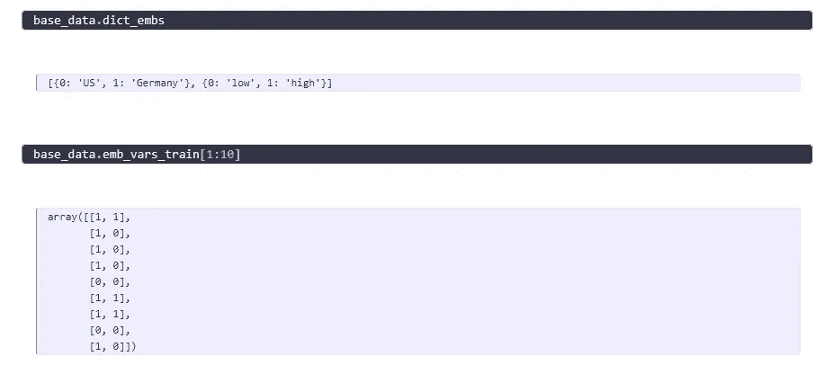
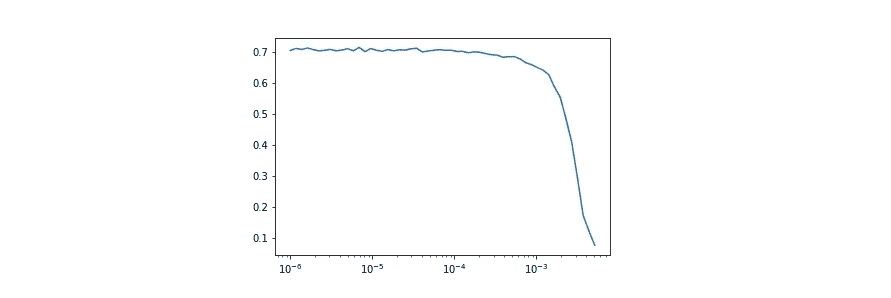

# 如何使用软件工程改进数据科学代码

> 原文：<https://medium.com/analytics-vidhya/how-to-use-software-engineering-to-improve-data-science-code-b2b131cbc9d0?source=collection_archive---------1----------------------->

卡尔·帕夫洛维奇在 [Unsplash](https://unsplash.com?utm_source=medium&utm_medium=referral) 的照片

# 为什么数据科学必须停止生产意大利面条式的代码

作为一个普通的数据科学家，我知道这种痛苦。通常，我们所做的在过程上是非常简单的，但是不知何故，这几乎总是以一个变得如此复杂的代码结束，很难保持跟踪。此外，大多数数据科学家并不真正关心软件工程，而是到处使用函数和类，而没有首先对其进行任何适当的思考。诚然，我也做过那样的代码。

一段时间以来，我想改变这一点。在阅读了一些关于软件工程的书籍和文章，看了大量的 YouTube 教程之后(非常感谢互联网！)我想出了一些每个数据科学家如何能够并且应该改进她的代码的想法。让我们从我发现对我的每个数据科学项目都有帮助的基本设计模式开始。

# 信息专家原则

这个原则很简单，但是当你从项目的开始就应用它时，它会帮助你写出更干净、更漂亮的代码。这意味着你的软件设计(最终，这就是我们正在写的)应该遵循数据管道。这在行动中意味着什么？让我给你举个简单的例子:

这里发生的情况是，与数据相关的所有内容现在都存储在 BaseData 类中。这个类中的每一个函数都需要数据，并直接获取数据，因此不需要跳转到其他对象或方法来实现这一点。所以我的第一条建议是:把你的数据放在一起！

接下来，我将使用这些数据传递给我们管道中的下一个点。只是为了让你知道，我在这里所做的实际上是对我的一个[早期项目](/analytics-vidhya/time-series-classification-with-convolutions-ed5cb33b1e3b)的重构，在这里我将使用 PyTorch 中的卷积神经网络来对时间序列进行分类。因此，为了使用 PyTorches 的功能，数据需要放在所谓的数据加载器中。

如果您想更深入地了解这到底是做什么的，只需进入 dataloaders.py 文件。基本上，它将 train_data 分为 train 和 validation，然后从中创建 PyTorch 数据集。然后可以将其放入数据加载器。现在，我可以使用三个不同的数据加载器，但是我还是想把我的数据放在一起，这就是为什么我创建了一个名为 DataBunch 的类(命名和想法是从 fastai 偷来的)，在这个类中，我把我所有的数据放在一个地方。

此外，要知道我只使用了一个配置文件。我经常在不同的文件中看到带有不同类型的常量(即配置)的代码，这使得以后调试代码或更改设置变得非常困难。所以请把你的常数放在一个地方。

现在让我们更深入地了解一下，我们如何以一种更灵活的方式使用一种巧妙的方法来构建模型:

这里首先要注意的是，我将 Conv1d 层的基本结构组合到了一个函数中。每个 Conv1d 层都应该有一个 BatchNorm，后跟一个 ReLU。你可以随意调整。然后，在下一步中，我创建了一个函数，它基本上使 Conv1d 层重复，给定您提供的参数列表。因此，基于这个参数列表，你可以有 1、2、3、4 层或者你想要的任意多层。然后，这又被用于分类器类，这是我们的主要模型。卷积部分，这里称为 *self.raw* ，然后根据我们指定的架构外观进行构建。该模型的其余部分我保持相当灵活，如果你想也可以改变。但是让我们来看看实际情况:

所有用大写字母写的东西实际上都是在配置文件中定义的，但是为了看清楚这里发生了什么，我只是把它们放在这个代码片段中。因此，如果我想添加另一个层，我可以进入我的配置文件并更改它，这样我就有三个具有不同内核和步长的层。当做实验时，你可以在你的配置中提供不同的设置，然后在你的第二个模型中使用它们。不要低估将参数放在一个地方的想法。

下一个大的部分是直接连接到信息专家原则。让我们从学习者开始，一个基于这个原则的简单想法。在训练模型时，我们需要另一个类来保存所有需要的信息，即学习者。学习者需要什么信息？数据、模型、损失函数和优化器:

接下来，我们需要为我们的流程构建管道，姑且称之为 runner。我们传入负责数据和建模部分的学习者。流道本身只引导数据流:

我希望每个数据科学家都知道的最后一个想法是回调。基本上，这意味着我们调用不同的函数，并利用它们的行为。为了能够清楚地指出应该在哪里应用回调，我添加了像*self(‘after _ epoch’)*这样的东西。这让我们可以轻松地创建自己的回调函数，我们可以在任何需要的地方使用它:

在创建了回调基类之后，我们想要使用的每一个回调都继承了它。以 LR_Find 回调为例:这将在一个批处理开始之后和每个步骤之后应用。这些我们已经在我们的 Runner 类中定义了。现在我们可以像这样使用这些回调函数:

我们可以添加各种回调，也可以触发 Tensorboard 运行作为回调:

这已经触发了 Tensorboard 的*运行*并保存在这个文件夹中。我们现在可以通过在终端中键入 *tensorboard — logdir=runs* 来看看这个:

暂时就这样了。我希望现在对信息专家原则的想法更熟悉一些，并且我可以给你一些如何重构你现有的数据科学项目的想法。如果你想仔细看看回购协议，这里是:[回购](https://github.com/lschmiddey/data-science-software-principles)。

拉塞

*原载于 2021 年 10 月 27 日*[*https://lschmiddey . github . io*](https://lschmiddey.github.io/fastpages_/2021/04/10/DeepLearning_TabularDataAugmentation.html)*。*