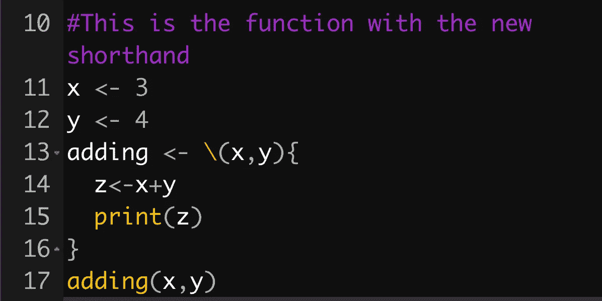

# 如何在 R 编程 4.1 (R 4.1)中使用新的函数符号

> 原文：<https://medium.com/analytics-vidhya/how-to-use-the-new-function-symbol-in-r-programming-4-1-r-4-1-c7cd2ac27b98?source=collection_archive---------1----------------------->

函数的新正斜杠语法是 R 4.1 的特色

r 编程版本 4.1 引入了管道操作符——你可以在我之前的[帖子](/analytics-vidhya/how-to-use-the-new-pipe-in-r-4-1-f7bf748a465d?sk=04075d197cb4d0656966d4e62dafbe46)中读到。管道本质上是一种简化编码语法的简写方式。

另一种符号速记是可用的。这个是功能用的。函数速记，一个反斜杠，有助于进一步简化基于 R 的编码语法，并且，像新的…