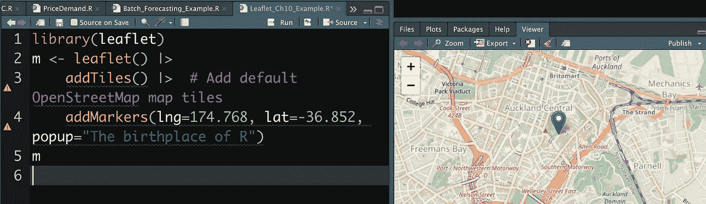

# 如何使用 R 4.1 中的新管道

> 原文：<https://medium.com/analytics-vidhya/how-to-use-the-new-pipe-in-r-4-1-f7bf748a465d?source=collection_archive---------5----------------------->

## 一个简单的新管道扩展了 R 编程中的可读性选项

使用管道，比如 R 中新的原生管道，简化了函数在代码中的显示方式，从而简化了直观调试函数的能力

当用编程语言创建一个函数时，对该语言的更新会产生新的维护难题——开发人员必须重写一段代码才能识别它。但是在 R 的情况下，一个新的基本函数在嵌套代码行方面提供了一些简单性。