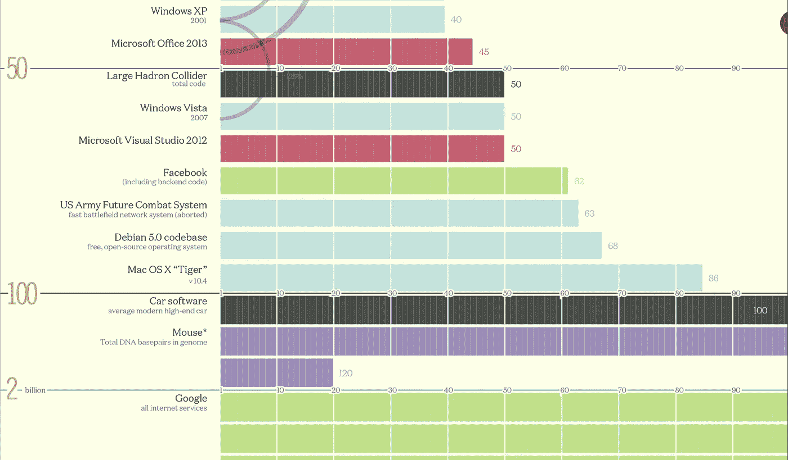
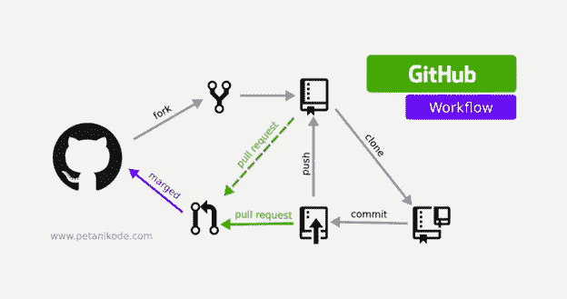
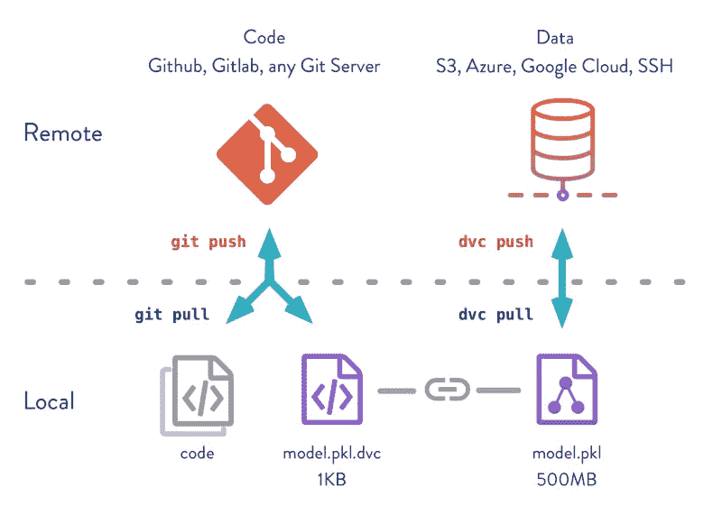
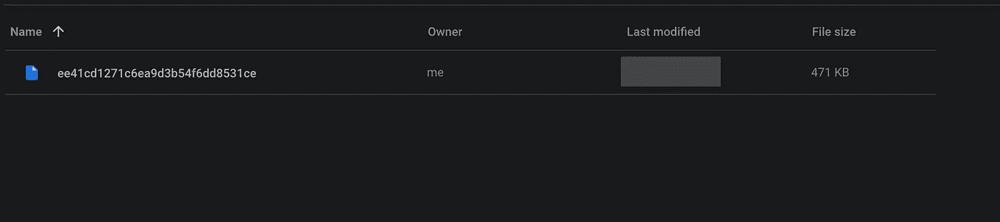

# 如何对机器学习代码和数据集进行版本控制

> 原文：<https://medium.com/analytics-vidhya/how-to-version-your-machine-learning-code-and-datasets-183206611096?source=collection_archive---------12----------------------->

# 版本控制



写一个 Windows 需要多少百万个代码？

你有没有问过自己，我们的操作系统或搜索引擎有多大，有多复杂？根据数据，Windows XP 包含 4000 万行代码，脸书包含 6200 万行代码，谷歌包含 20 亿行代码[1]。这些数字是巨大的，你可能想知道“他们的工程师如何合作维护这些代码，并确保这些公司的每个工程师在同一时间拥有相同版本的相同代码？”。如果我们谈论他们开发人员的数量，这些大公司有数千名工程师维护这些庞大的系统。答案是我们需要使用版本控制软件。

# 使用 Git



Github 工作流程

现在我们有了 Git 这样一个非常稳定成熟的版本控制软件。还有其他软件具有相同的目的，如 SVN 和 Mercurial。但是在本文中，由于 Git 的流行，我将只讨论它。在本地使用 Git 非常简单，在完成几个初始化步骤和学习几个语法之后，你就可以开始控制你的代码版本了。但有趣的是 Git 有几个提供者可以在云中托管你的代码，比如 Github、Gitlab 和 Bitbucket。他们允许你在他们的云服务中自由地备份你的代码和他们的版本历史，你可以邀请其他人来合作你的项目。基于上图，Git 的工作流程非常简单。在您的本地计算机中，您可以将代码添加到 git 中，然后提交它。在所有的更改完成后，您可以将它推送到远程服务器(在本例中是 Github 服务器)，其他工程师可以将它拉过来并开始协作[2]。我会给你一个小教程来开始你的 git 之旅。

# 安装 Git

首先你可以从这个链接下载 git([https://git-scm.com/downloads](https://git-scm.com/downloads))。安装过程结束后，您可以使用该命令检查 git 是否已经安装在您的计算机中。

```
$ git --version
```

有时在开始使用 git 之前，您还需要确定您的 Git 用户名和电子邮件。

```
$ git config --global user.email ["you@example.com](mailto:%22you@example.com)"
$ git config --global [user.name](<http://user.name/>) "Your Name"
```

为您的存储库创建一个新文件夹(存储库是存放您的源代码的地方),并在您的存储库中初始化版本控制。

```
$ mkdir your_repository
$ cd your_repository
$ git init
```

# 创建您的第一个提交

初始化之后，您可以创建一个新文件(例如 python 文件)并将其添加到 git 中，然后提交它。之后，您可以通过 log 命令查看日志。

```
$ touch hello_world.py
$ git add .
$ git commit -m "My first commit"
$ git log
```

# 提高你的水平

Git 非常有用，目前被认为是机器学习工程师、软件工程师和数据科学家的主要工具。但是如果我们想更深入地了解 Git，它有几个限制，其中之一就是处理大文件。Git 被设计用来处理源代码文件，它们的大小通常小于 1 MB。在机器学习项目的情况下，我们的数据集会比这个大，Git 处理起来很麻烦。目前，Git 有一个名为 Git LFS 的服务来处理大文件，但我将向您介绍另一个名为 DVC(数据版本控制)的解决方案。

# 使用 DVC(数据版本控制)



数据版本控制工作流

DVC 或数据版本控制是一个类似 git 的版本控制软件或库，它使用 Git 作为主干来创建数据集版本[3]。根据上面的图片，我们可以看到 DVC 的工作流程。首先，我们需要将文件添加到 DVC，然后 DVC 将为这些文件创建元数据。这些元数据将被提交给 git，并用于数据版本控制。DVC 的有趣之处在于，我们可以使用云提供商，如 S3、Azure、Google Cloud，甚至 Google Drive 作为我们的数据存储库(在实现中，我们将在 Github 中存储源代码，在 Google Drive 中存储大量数据)。像 Git 一样，我会给你一个非常简单的教程来开始你的本地 DVC。

# 安装 DVC

你可以通过这个链接下载 DVC([https://dvc.org](https://dvc.org))。如果你是 macOS 用户或者 Linux 用户，可以通过 brew 或者 apt 安装。安装完成后，使用下面的命令确保它正常工作。安装完成后，我们希望在本教程中使用我们的“your_repository”存储库。您需要使用 Git 教程将目录更改为“your_repository”文件夹，然后初始化 DVC。

```
$ brew install dvc
$ dvc --version
```

安装完成后，我们希望在本教程中使用我们的“your_repository”存储库。您需要使用 Git 教程将目录更改为“your_repository”文件夹，然后初始化 DVC。

```
$ dvc init
```

之后，您可以使用 git 提交更改。

```
$ git status
Changes to be committed:
        new file:   .dvc/.gitignore
        new file:   .dvc/config
        ...
$ git add .
$ git commit -m "Initialize DVC"
```

下一步是创建任何大型数据集文件或将其复制到“your_repository”文件夹中。(在本例中，我将创建一个空的 CSV 文件)

```
$ touch dataset.csv
$ dvm add dataset.csv
$ git add .
$ git commit -m "Add dataset"
```

恭喜，您已经为数据集添加了版本控制。

# 添加远程云存储

如果我们只在本地计算机中存储数据集的版本，这种体验是不方便的。我们的项目会变得越来越大，所以我们需要与其他工程师分享我们的数据集。我们将添加远程云存储，将我们的数据保存在云中，以便其他人可以访问和提取它。首先，你可以在你的 Google Drive 内部创建一个新的文件夹，然后你可以从 URL 中复制文件夹 ID。


```
$ dvc remote add -f --default myremote gdrive://<your folder id>                                                                                             
$ git add .dvc/config
$ git commit -m "Configure remote storage"
```

之后，您可以提交配置文件，并开始将数据集推送到您的 Google Drive 存储。您的文件将出现在您的文件夹目录中，您可以随时随地提取它们。



最后的话

你的机器学习项目会变得更大，你会邀请其他工程师来贡献和合作。Git 和 DVC 是很好的工具，可以让我们确保项目中的每个人同时拥有相同的代码和数据集状态。

# 参考

[1]:https://www . informationisbeautiful . net/visualizations/百万行代码

[2]:https://git-scm.com/doc

[3]:https://dvc.org