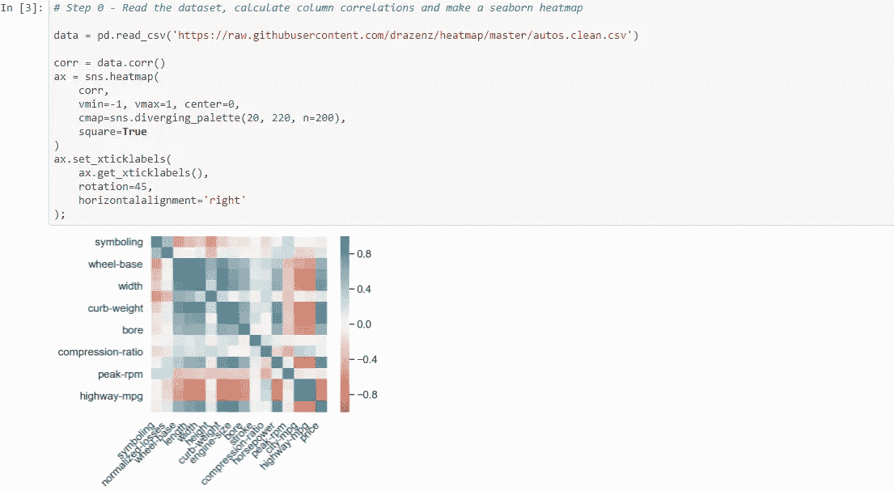

# 如何用 Python 可视化最佳故事讲述实践

> 原文：<https://medium.com/analytics-vidhya/how-to-visualize-the-best-story-telling-practices-with-python-1aec28b35c08?source=collection_archive---------6----------------------->

众所周知，Python 是当今最流行的编程语言之一，不仅是技术公司，所有类型的企业都需要它

企业已经收集了有关其记录和业务活动的数据，需要专家来分析并提供分析，以帮助他们做出决策，避免灾难性的陷阱，利用新产品创意来产生更好的利润和收入，同时改善内部管理活动和外部业务活动，并衡量指数因素(如政治、气候甚至新的立法)如何准确地影响他们的活动和工作(在一定程度上或完全影响)。因此，Python 编程是一个有价值的工具，它让分析师和开发人员能够完全控制数据可视化。像 PowerBI 和 Tableau 这样的替代商业智能软件可以限制。

这可以帮助他们雄辩地讲述故事，让公司董事会做出更明智的决策。

# *如何用 Python 写你的第一个基本代码*

```
name = 'Muhammad Ammar Jamshed'
age = 24
Profession = 'Data Analyst'
print(name,'is',age,'years old and is a',Profession)
```

因此，这段代码的输出将是

```
Muhammad Ammar Jamshed is 24 years old and is a Data Analyst
```

因此，正如您在上面看到的，我们只是提到了 **"name"** 来获得输出**" Muhammad Ammar jam shed "**，而我们分别对**"年龄"和" is "**进行编码来获得它的输出，因为我们已经在 name 中存储了**" Muhammad Ammar jam shed "**，我们只需打印(name)来获得**" Muhammad Ammar jam shed "**的输出，但是由于我们没有存储**"年龄"**

现在为了实现可视化，有两种方法可以实现，要么导入一个库，要么设计你自己的函数，我会进一步解释。现在，我想让你看看下面的区别。

**使用功能制作可视化热图**

```
**import** **pandas** **as** **pd**
**import** **numpy** **as** **np**
%matplotlib inline
**from** **matplotlib** **import** pyplot **as** plt
**from** **pylab** **import** rcParams
rcParams['figure.figsize'] = 7,7 
**import** **seaborn** **as** **sns**
sns.set(color_codes=**True**, font_scale=1.2)

%config InlineBackend.figure_format = 'retina'
%load_ext autoreload
%autoreload 2*# Step 0 - Read the dataset, calculate column correlations and make a seaborn heatmap*

data = pd.read_csv('https://raw.githubusercontent.com/drazenz/heatmap/master/autos.clean.csv')

corr = data.corr()
ax = sns.heatmap(
    corr, 
    vmin=-1, vmax=1, center=0,
    cmap=sns.diverging_palette(20, 220, n=200),
    square=**True**
)
ax.set_xticklabels(
    ax.get_xticklabels(),
    rotation=45,
    horizontalalignment='right'
);
```



这个热图功能的设计归功于我在卡拉奇国际律师协会的老师和他的学生。

现在我们来看看如何通过使用 Python 后端已经编码好的名为 **seaborn** 的库来实现


在这里可以看到，我们只需要编写一句代码来显示与上面类似的热图，以显示单个数据集内不同列的缺失值之间的关系，这是通过使用 **missingno** 的库来完成的，我们将其作为 **mn** 导入，并使用 python 的后端热图功能。

# 我们应该用给定的库进行可视化，还是设计我们自己的函数并将其与它们合并？

是的，这是我这篇文章的主要观点。因此，在我们决定是开始设计我们自己的功能还是使用已经给定的库之前，取决于你的公共演讲和互动技能:

你能在多大程度上简化复杂的统计计算？

**你能让数据中的错误听起来像是对公司有利吗？**

**你能把给定的发现呈现给大量的观众吗，即使你的视觉化图像显示不准确？**

如果您能够做到以上三点，那么您应该直接使用库并删除数据集中不相关的列，但是如果您不能，那么建议您使用或设计自己的用户设计函数来可视化您的图表，因为您可以控制和编辑在您选择的图表中可视化的所有类型的数据，这样可以以非常简单的形式向您的受众显示，并且只需要最少的沟通。

# **使用 Python 用户定义函数的高级可视化**

在这里，我将为您提供一些用户定义的函数，以便在导入 **matplotlib** 库后绘制可视化效果，因为在 python 中，如果不导入它，就无法绘制任何东西。

```
*# you can use this advanced function to create an entire plot using seaborn with multiple x bases*
*# you can change the colour according to your needs to in the parenthesis after context*
**with** plt.style.context("dark_background"):
    fig, axes =plt.subplots(ncols=3, sharey=**True**,
                            gridspec_kw={'width_ratios':[2,1,1], 'wspace':0})
    y ='age'
    xs =['chol','trestbps','thalach']
    **for** x, ax **in** zip(xs, axes):
        ax.scatter(df[x],df[y])
        ax.set_xlabel(x)
        axes[0].set_ylabel(y)
```


用 Kaggle 的心脏病患者数据可视化

```
*# Contour plots, using broader shapes to show data(ca be used for resource location by geologists)* spacing = np.linspace(0,10,200) x, y = np.meshgrid(spacing, spacing) z = (np.sin(x) + np.cos(y) + 2 * np.arcsinh(x * y))**2 plt.contour(x,y,z, levels=20) plt.colorbar();
```


主要用于基于地质和地理的数据

```
*# if you wanna make it more detailed*
c = plt.contour(x,y,z,levels=20)
plt.clabel(c,inline='True', fmt='**%0.1f**')
plt.colorbar();
```


更详细

# 流形学习

它遵循 sklearn 算法

```
methods = [
    ("LLE", manifold.LocallyLinearEmbedding(n_neighbors=20,method='standard')),
    ("LTSA", manifold.LocallyLinearEmbedding(n_neighbors=20,method='ltsa')),
    ("Hessian LLE", manifold.LocallyLinearEmbedding(n_neighbors=20,method='hessian')),
    ("Modified LLE", manifold.LocallyLinearEmbedding(n_neighbors=20,method='modified')),
    ("Isomap",manifold.Isomap()),
    ("MDS",manifold.MDS(n_init=1)),
    ("SE",manifold.SpectralEmbedding()),
    ("t-SNE",manifold.TSNE()),
]
fig, axes =plt.subplots(nrows=2,ncols=4)
**for** (name,method), ax **in** zip(methods, axes.flatten()):
     print(f"Running**{**name**}**")
     g = method.fit_transform(data)
     ax.scatter(g[:,0],g[:,1],c=t)
     ax.set_title(name)
     ax.set_xticklabels([])
     ax.set_yticklabels([])
```


流形学习可视化

所以在这里我向你展示了一些用于不同目的的高级可视化功能的例子，如果你想了解更多，你可以从下面给出的 GitHub 配置文件中获得代码。

[我的 GitHub 账号- >点击这里](https://github.com/AmmarJamshed/Data-manip-with-Pandas-and-other-basic-libraires/blob/main/Udemy%20course%20(Data%20manip%20with%20Pandas).ipynb)

# 结论

我希望您喜欢阅读我的文章，并且它会在您使用 python 进行数据分析和机器学习工程的工作中派上用场。关于数据科学概念和数据分析工作的任何建议，或者使用我的自由职业服务来满足您的需求，您可以在 LinkedIn 上与我联系。

[我的 LinkedIn 账户](https://www.linkedin.com/in/goto-resumemuhammad-ammar-jamshed-029280145/)