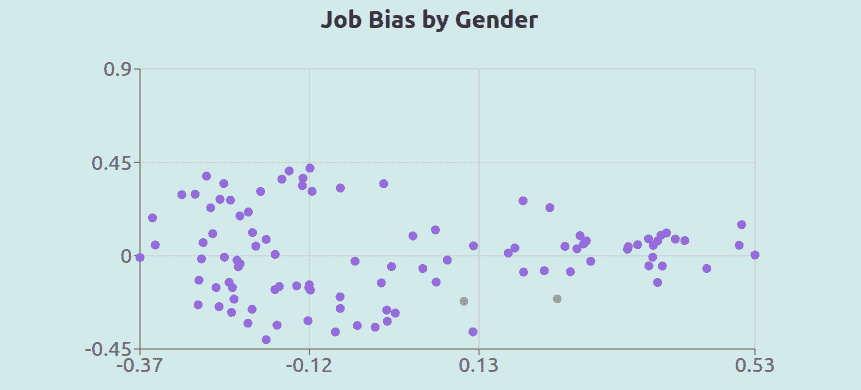
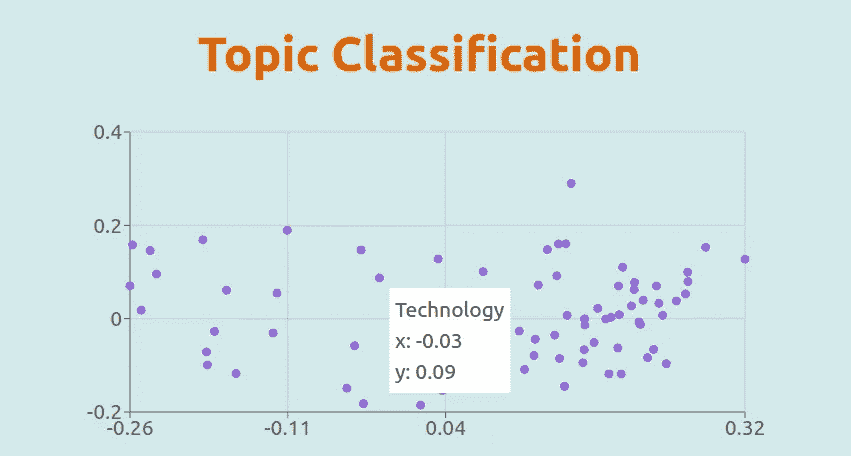

# 如何可视化人类语言

> 原文：<https://medium.com/analytics-vidhya/how-to-visualize-word-embeddings-7ed0fb047089?source=collection_archive---------22----------------------->

## 和七个让你开始创业的想法！



右边的绿点代表“女人”这个词，紫点代表前 100 个高薪工作。这些工作中只有 32 个更接近“女人”而不是“男人”**来源:** [borgez.ml](http://borgez.ml)

> 一张图片胜过千言万语。*那么，如果我们能在一个图表中总结一份 1000 字的文件会怎么样？*

图表和仪表板用于模拟财务和数字数据。它们是分析师和投资者分析、交流和制定战略的首选工具。但是直到几年前，使用图表来可视化人类语言还是不可能的。今天，单词嵌入使文本文档处理更快，更容易聚合，分析更有利可图。

单词嵌入是意义的数字表示，它们是自然语言处理研究的悠久传统与深度学习的最新进展相结合的结果。**用向量表示意义**使数据科学家能够像处理数字一样对单词进行数学运算。这些包括应用程序中使用的加法、减法和比较，如谷歌的搜索引擎。我的随笔"[什么是单词嵌入？](/geekculture/what-are-word-embeddings-6f6f677b13ce?sk=45ba2e778d00838e42cf78a8d2386c58)”很好地深入介绍了这个主题。

单词嵌入可视化从将文本转换成矢量开始。然后，减少其维数来绘制它们。**本文通过四个步骤中的每一个来绘制单词嵌入。**并使用 TensorflowJS、React 和 recharts 提供 TypeScript 中的示例代码。我将通过探讨主题分类问题来举例说明这一点。最后，分享 7 个你可以利用该技术实现的创业想法。


照片由[对比](https://unsplash.com/@comparefibre?utm_source=medium&utm_medium=referral)[上的纤维](https://unsplash.com?utm_source=medium&utm_medium=referral)和

## 1.将数据集符号化

这一切都始于干净的数据。TensorflowJS [通用语句编码器](https://github.com/tensorflow/tfjs-models/tree/master/universal-sentence-encoder#universal-sentence-encoder-lite) **将** **单词**，句子，甚至是短文段**转换成矢量**。但是如果数据集不符合这种格式，您可以使用正则表达式对其进行分段:

```
// Split a text by words.
const wordTokenizer = (text:string) => text.match(/(\b[^ $]+\b)/g)// Split it by sentences.
const sentenceTokenizer = (t:string) => t.match( /[^.!?]+[.!?]+/g )// Split by paragraphs.
const paragraphTokenizer = (text:string) => text.split("\n")
```

## 2.用 TensorflowJS 建模

获得单词 embeddings 很容易。首先加载两个依赖项:Tensorflow 和**句子编码器模型**。然后，加载模型；这将触发一个网络请求，需要几秒钟时间。最后，将标记化的数据集作为字符串数组提供给模型，并将输出转换成 JavaScript 数组。

```
import { load } from '@tensorflow-models/universal-sentence-encoder'import '@tensorflow/tfjs'// Turn an array of texts into word-embeddings.
const vectorize = (text:string[]) => {
  const model = await load()
  const tensors = await model.embed(text)
  const embeddings = await tensor.array()
  return embeddings
}
```

## 3.降维

TensorflowJS 输出是 512 维向量；试图绘制它们是一种嵌合体的努力。幸运的是，有几种降维技术。一种常见、有效且**简单的技术**是[主成分分析](https://en.wikipedia.org/wiki/Principal_component_analysis)。

npm 模块 ml-pca 是在 Typescript 中压缩矢量的一个优秀的轻量级选择。为了使用它，我们首先基于 TensorflowJS 输出创建一个新模型，并使用该模型**预测二维向量。**

```
import { PCA } from 'ml-pca'// Reduce the dimensionality of word embeddings.
reduceDimensionality = (embeddings:number[][]) => {
  const pca = new PCA(embeddings)
  const matrix = pca.predict([embeddings], {nComponents:2})
  const reducedVectors = matrix.to2DArray()[0]
  return reducedVectors
}
```

## 4.用反作用力画出来

最后一步是使用 ReactJS 和 [recharts](https://recharts.org/) 绘制它。我们将从将我们的标记化数据集映射到缩减的向量开始。然后导入散点图，并添加相应的颜色、道具和样式，将其转换为 React 组件。最后选标题:不要小看这一步。一定要明确**你想用剧情传达什么。**

```
import { ScatterChart, Scatter, Tooltip } from 'recharts'interface iData {name:string, x:number, y:number}
interface iEmbeddingsPlot {title:string, data:iData[]} const EmbeddingsPlot = ({title, data}:iEmbeddingsPlot) => <div>
  <h1> { title } </h1>
  <ScatterChart data={data}>
    <Tooltip/>
    <RechartScatter data={data} fill={colors[i]} />
  </ScatterChart>
</div>
```

# 示例:按主题的文档可视化



主题分类图表示例。题目越靠左，技术性越强。垂直维度代表个人(顶部)与社会(底部)。**来源:** [borgez.ml](https://borgez.ml)

为了说明这个过程，考虑映射一个由主题标记的文档数组。这些是我们可能面临的一些挑战:

1.  文档大小对于通用句子编码器来说太大。
2.  主题数量太多，无法在图表中为每个主题指定唯一的颜色。
3.  我们需要使用该工具对未标记的文档进行分类。

Shay Palachy 写了一篇出色的 39 分钟指南，概述了用于嵌入文档的不同技术。对于上面的例子，我选择了一种更实用的方法，通过句子对文本进行标记，并对它们进行平均来找到**最终文档的嵌入。**

我用类似的程序在图表上画出每个主题。对对应于相同主题的每个文档取向量的平均值。**平均值是对文本数据应用数学运算得出的值**的一个很好的例子。

最后一步:**预测未标注文档的主题。**我们可以应用支持向量机(SVM)等机器学习算法，训练神经网络，或进行地理查询，以在 2D 向量空间中找到最近的主题。关于这个主题的更多信息，请参考我的教程:“ [**如何创建文字推荐引擎**](/geekculture/how-to-develop-a-text-recommendation-engine-99d3b46effdb?sk=508c65e2139bfdfbd8043b2090ee1bd7) ”

# 额外收获:7 个基于单词嵌入的创业想法

1.  **Kluster:** 产品评论聚合技术。
2.  **优质潜在客户:**根据潜在客户网站的语言自动确定他们的资格。
3.  **HR-Rec:** 推荐引擎寻找最佳前景。
4.  **旅游:**根据体验，而不是位置，对餐馆、酒店和目的地进行分组。
5.  **ReadFlix:** 每天晚上下班后找到最适合阅读的内容。
6.  **healty:**监控企业沟通和组织文化的仪表板。
7.  **Matchy:** 根据想法加入人，而不是外貌。

这些想法都有相同的概念:分析文本数据并创造可视化效果来帮助决策。我很乐意详述这些想法，或者在 LinkedIn 上与我联系，讨论 MVP。你觉得，哪个想法最有上升空间？

> “每当你看到一个成功的企业，有人曾经做出了一个勇敢的决定。”― **彼得·德鲁克**

*感谢您的阅读。我希望你喜欢这个故事！更多关于* ***自然语言处理*** *的内容，可以考虑* [*给我一个跟随*](https://santiagoq.medium.com/) *。我很想在评论中听到你的想法，你的掌声将会非常受欢迎。🙏*