# 如何赢得客户之战？

> 原文：<https://medium.com/analytics-vidhya/how-to-win-the-battle-for-customer-3012772cab48?source=collection_archive---------6----------------------->

## 该项目基于 Sparkify Udacity 数据集分析客户流失

西蒙·诺在 [Unsplash](https://unsplash.com?utm_source=medium&utm_medium=referral) 上的照片

# 摘要

## **用机器学习算法检测音乐行业的客户流失**

客户流失率可以定义为客户停止与某个实体做生意的损耗率。客户选择不购买或不与该特定企业互动。该项目将使用机器学习算法来预测客户流失，并将利用 Udacity 提供的 Sparkify 数据集。

娱乐业(尤其是电影和音乐领域)市场的快速增长和扩张导致了该行业的激烈竞争。因此，企业主需要找到创新的商业模式，以保持其不断的客户，避免客户流失，并保持基础订户。这可以通过加强服务来留住现有客户，同时避免增加获取客户的成本。音乐平台或任何服务提供商的首要目标是避免客户希望退出公司服务的流失现象。该项目将包括数据分析，特征工程，建模，并提出客户流失的结论。

# **简介**

如今，有很多不同的服务，你可以在那里看电影、听音乐或获取每日新闻更新等。有些是免费的，有些不是。如何决定使用哪种服务？您取消订购或决定不再使用该服务的频率如何？

一方面，对于客户来说，这种竞争是一种优势。客户可以用更少的钱/更好的条件获得相同甚至更好的内容。另一方面，作为一家公司，这种发展是一场噩梦。竞争者从不睡觉。作为一家公司，你必须根据客户的需求，以最好的条件提供无可挑剔的服务。

对于许多公司&音乐服务提供商来说，困难在于如何识别顾客真正想要的是什么？如何说服客户留下来或者改为付费订阅？然而，与此同时，要预测什么时候花钱打折，以鼓励顾客留下来，并让那些不打算离开的顾客不要“不必要地”花钱。

出于上述原因，该项目将测试不同的机器学习方法以及 Spark for Big Data processing，以搜索隐藏模式，从而识别客户流失。

这种方法对于企业主获得对当前流失的洞察力至关重要，以便制定流失预防措施，评估客户获取渠道，用于营销和广告，同时监控运营成本。这种 ML 方法可以帮助公司提高服务、产品和营销工作的效率。

# 该项目的结构如下:

第 1 部分:数据探索和分析

第 2 部分:数据预处理

2.1 重量平衡

2.2 特征工程

第 3 部分:建模和性能评估

第四部分:结论和建议

# **第一部分:**数据探索与分析

> **我们如何防止客户流失？**

为此，我将使用 Sparkify 数据集探索并构建一个机器学习模型。总的来说，Sparkify 是一个像 Spotify 一样的虚拟音乐服务，用户可以选择免费但有广告的音乐列表，或者没有广告的付费订阅。

下图显示了有关客户行为的日志数据模式，其中包含有关用户所听歌曲或艺术家的不同信息、时间戳、设备、位置或他们是否有任何服务问题等。

除了 18 个特征之外，数据集还包含 286500 行。然而，仔细观察我们可以发现 8346 个 userId 是空的。问题是我们能无忧无虑地删除这些行吗？下表显示错误数量很低。空用户标识的主要原因来自于主页以及注册或登录之前。

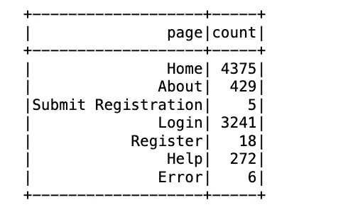

此外，我们没有关于用户的任何其他信息，如位置、歌曲、艺术家等。

因此，我认为现在可以从数据集中删除这些行了。清洁步骤后，让我们对其他功能有一个概述。“itemInSession”(每次会话的项目数)和“length”(歌曲的长度，以秒为单位)似乎是有希望的数据点。总的来说，我们可以看到，用户似乎喜欢这个平台，例如，平均每期 114 首歌曲，每首歌曲 2.5 分钟。

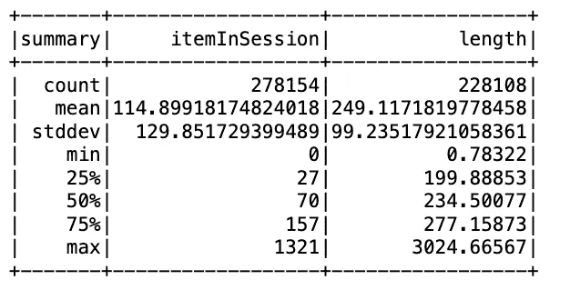

在我们从数据探索开始之前，必须提到的是，客户流失分析处理的是现实生活中的大数据。出于这个原因，我使用 [Pyspark](https://spark.apache.org/docs/latest/api/python/) 构建整个项目。Pyspark 是一个 Python API，用于 spark 分析和处理大数据，以及内置的机器学习、SQL、图形处理和流式处理解决方案。尽管为了简单起见，我使用了数据的子集，但是所提供的解决方案可以在 Spark 集群中大规模使用。

**哪些因素对取消订阅有影响？**

现在，让我们深入研究一下数据！首先，我从客户层面开始，不管他们是否免费使用 Sparkify。零阶段意味着不取消服务的客户取消了服务。柱状图清楚地表明，大多数用户更愿意免费使用带广告的服务，而不是付费使用。尽管如此，仍有大量客户决定取消订阅，尽管他们不需要为此付费。

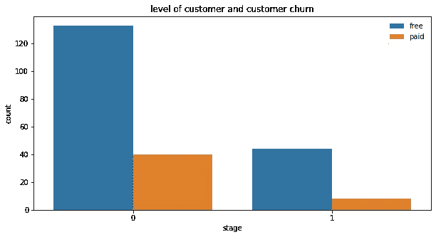

转到性别柱状图，我们可以看到男性比女性更容易跳槽。但是，这种差别并不大。

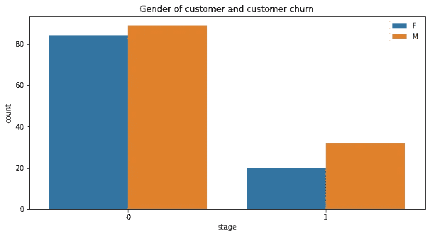

分析的下一步是探索普通人从何而来。在本例中，我使用了实体“location ”,并提取了所需的关于州和城市的信息。下面的两个图表显示了不同州和城市的客户流失情况。总的来说，我们可以看到，加利福尼亚州、佛罗里达州和德克萨斯州的客户数量最多。此外，即使有些州没有客户流失的问题，他们也没有大量的用户。

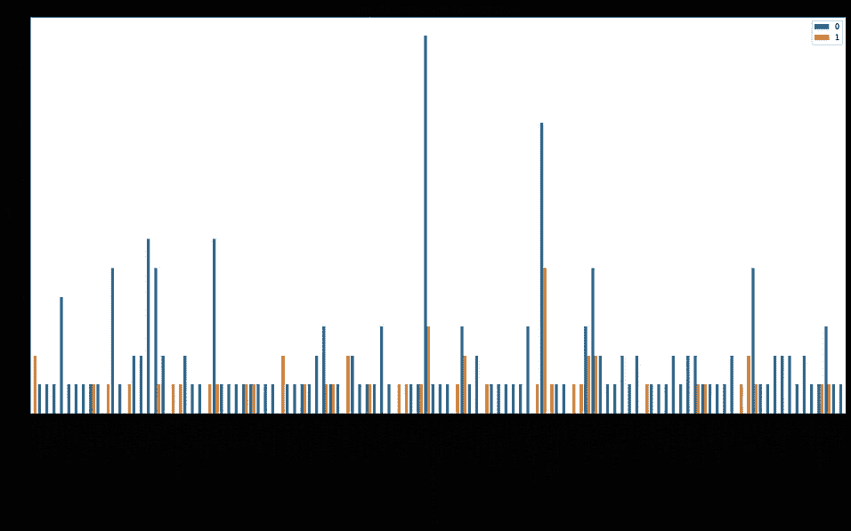

为了向用户提供可靠的服务，了解客户使用的设备类型至关重要。令人惊讶的是，客户更喜欢的主要不是移动设备，而是台式机。记住，我们正在调查音乐服务。应该考虑这种洞察力，找出原因，从而吸引更多的客户。

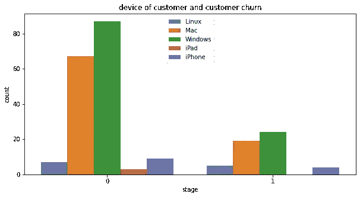

到目前为止，我们调查了客户位置、性别和设备的个人特征。但是所提供的服务如何呢？顾客如何利用它？因此，第二步是更深入地探究拒绝和不拒绝的顾客的行为。

在我们开始之前，我们应该调查一下，音乐平台对用户有多大的吸引力。从周一到周日，我们的活跃用户数量大致相同吗？有趣的是，我们可以看到，在周一和周四之间，活跃用户(每月至少访问音乐平台一次的用户)的数量几乎相同(恒定),周五达到峰值，之后急剧下降。

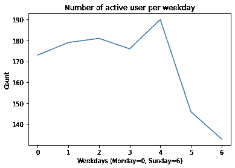

下一步是仔细观察用户与平台的互动。相比那些留下来的用户，他们与音乐服务的互动更频繁吗？首先，我们从每节的艺术家和歌曲数量开始。下面的方框图显示了不同之处，特别是，没有搅拌的用户比搅拌的用户听了更多的艺术家的音乐。

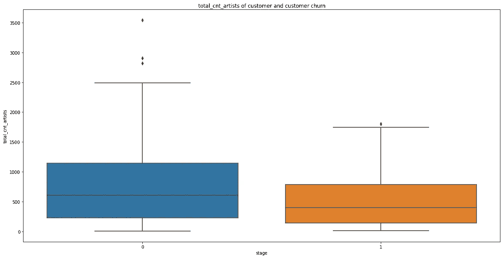

同样可以应用于每个会话的歌曲的最小、最大和平均数量。

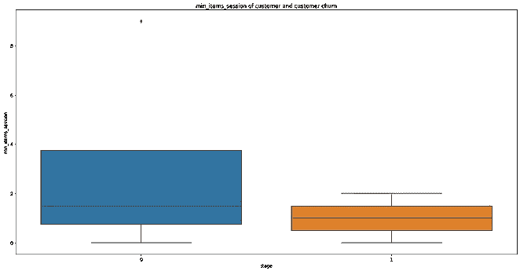

其次，客户多长时间投一次赞成票/反对票？这是其中一种模式，它强调了客户的参与程度。

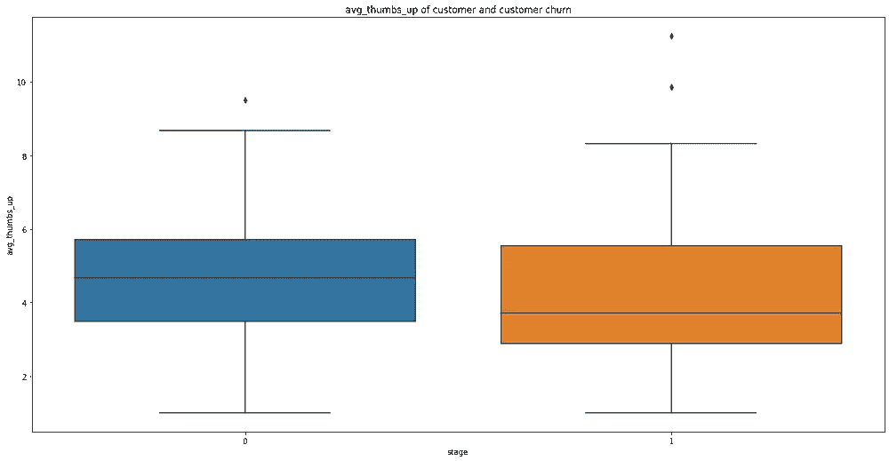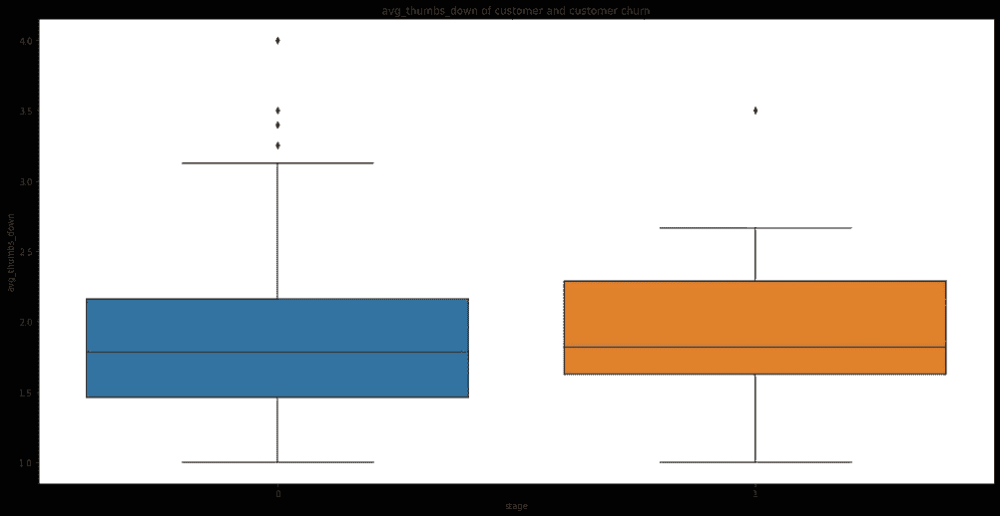

上面的两个方框图显示，比较“竖起大拇指”的平均值，两组之间没有太大的差异。与此同时，活跃用户仍然比搅拌者更频繁地“否定”。

客户流失的第三点是用户得到的广告和错误的数量。他们是被广告的金额惹恼了，还是服务有太多问题？

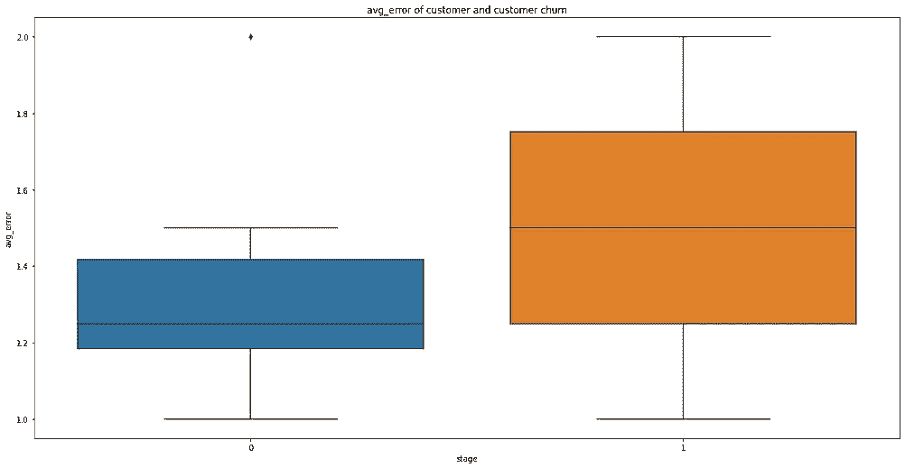

事实上，上面的图表清楚地表明，搅动的用户对平台有更多的挑战。在这种情况下，通常需要并建议进行更深入的调查:从技术上确定为什么会发生这种情况并消除它，以及从业务上分析如何提供更好的客户支持。此外，比较广告的数量，除了一些离群值，搅动的客户得到稍多的广告。

# 第 2 部分:数据预处理

在项目的第一部分，我们调查了活跃客户和不活跃客户的行为差异。此外，我们观察了哪些因素对客户流失有影响。因此，预测的目标是结合收集的洞察力，并基于这些模式构建稳定的模型。

因此，我们将从两个步骤开始:

2.1 重量平衡

2.2 特征工程

# 2.1 重量平衡

在我们开始特征选择之前，我们应该确保数据集中具有更多条目的类不会占主导地位，并且不会比其他类对模型有更大的影响。下表显示，与离开的客户相比，我们拥有大约 3 倍于仍在使用音乐平台的客户的数据。因此，在这个任务中，我们要处理不平衡的数据集。什么当然很好。否则，Sparkify 公司会被认为(在这种情况下)陷入了一个巨大的问题...然而，这种不平衡的数据集对于机器学习来说是一个缺点。原因是:

> 机器学习算法通常优化奖励或成本函数，该函数被计算为在拟合过程中看到的训练示例的总和，决策规则很可能偏向多数类。(塞巴斯蒂安·拉什卡&瓦希德·米尔贾利利《Python 机器学习》:2017 年)

为此，使用“ [weightCol](https://stackoverflow.com/questions/33372838/dealing-with-unbalanced-datasets-in-spark-mllib) ”实现了重新平衡权重函数，只是不要将所有实例权重都视为 1.0。重新平衡按如下方式完成:

# **2.2 特色工程**

第 1 部分让我们深入了解客户和客户行为。因此，基于这一观察，我在机器学习中使用了以下数字特征，如艺术家总数、每次会话的最大/最小/平均项目数、平均错误数、平均广告数以及平均竖起/放下拇指数。使用 Pyspark 标准定标器对数值特征进行定标。

我将只包括等级和设备类型。尽管与数据集中的用户数量 225 和州的数量 58/ 112 城市相比，关于州和城市的数据看起来有希望，但是这些特征将导致高维数以及高基数(太多唯一值),并且如果我们使用整个(12 GB)数据集来训练模型，则使用它们将是有意义的。

# 第三部分:**建模和性能评估**

> 我们能多好地预测客户流失？

在第 3 部分中，我测试了不同的机器学习方法。为此，我选择了四种算法:

1.物流回收

2.线性 SVC

3.随机森林

4.梯度增强树分类器

为了分析不同模型的结果，我将数据集分为训练、验证和测试(70%、15%、15%)。

**绩效评估指标**

模型选择和性能评估的另一个关键步骤是澄清哪种指标将用于比较和参数调整。正如我之前提到的，客户流失项目处理不平衡的数据集。出于这个原因，我们不能使用准确性，因为最终我们会为没有搅动的客户提供好的结果，而为取消订阅的客户提供差的结果，即使我们仍然有可接受的准确性。

因此，用于比较和优化的主要度量将是[**F1-得分**](https://spark.apache.org/docs/latest/mllib-evaluation-metrics.html) (精确度-阳性预测值和召回率的组合-真阳性率)。在这种情况下，次要类别的不良表现将被纳入衡量标准。

我们也将考虑的第二个指标是“ROC 曲线下面积”。ROC——集中于假阳性率和真阳性率的受试者操作特征，总结了应用不同阈值的混淆矩阵的结果。一般来说，对角线图形意味着随机猜测。最好的模型位于左上角，对角线以下的模型最差。从 ROC 曲线我们可以计算出“ROC 曲线下的面积”。AUC 的范围值是从 0 到 1，其中具有 100%正确预测的模型的值为 1，否则为 0。

# **结果**

现在所有的分析都完成了，让我们看看结果。

比较的基准是使用所有算法的默认值以及重新平衡数据集的集成功能来训练模型。

上面的性能指标表显示，与其他方法相比，梯度增强树和随机森林具有最佳结果(在测试数据集上)。由于这个事实，可视化可以定义分类器的好坏，请看一下混淆矩阵。

现在的问题是，我们能通过参数调整来改善结果吗？

有趣的是，如果我们观察训练数据集上的混淆矩阵，那么来自四种算法的梯度提升树在过拟合方面具有最大的挑战。

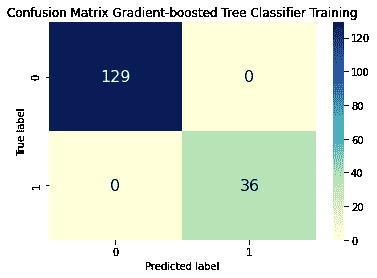

由于梯度推进树的过度拟合，我增加了最大深度，减少了迭代次数。迭代次数的增加允许模型产生更多的树，从数据集中学习更多的内容，并提高训练集的准确性。然而，这导致了测试集上较差的通用性。关于“最大深度”，该参数负责捕获数据的信息。大树有更多的分裂，比小树更精确。

**最佳参数**:“maxIter”:50，“max depth”:6

在随机森林的情况下，主要参数是树的数量以及“最大深度”(对于梯度增强的树)。通常，树的数量越多，有助于收集关于训练数据集的更多信息。然而，这导致了大量的培训。实际上，参数调整是基于 [Spark](https://spark.apache.org/docs/latest/mllib-ensembles.html) 的建议。

**最佳参数**:“数量树”:10，“最大深度”:8

在逻辑回归的情况下，我调整了迭代次数，elasticNetParam(它是 L1 和 L2 正则化的混合，以避免在更多迭代的情况下过度拟合。如果迭代次数太大，该参数降低复杂度)以及用于 L2 正则化的 regParam。

LinearSVC 被排除在参数调整之外，因为其结果甚至比逻辑回归更差。此外，LinearSVC 的训练需要比逻辑回归多 10 倍的时间。

逻辑回归不能改善测试集的结果，但是验证集的结果稍微好一些。

**最佳参数** : 'maxIter' : 10，' regParam': 0.1，' elasticNetParam': 0.0

**模型评估和验证**

回到参数优化，我们可以发现，以及逻辑回归和梯度提升树确定的迭代次数为 10 和 50(相对较少，默认值为 100)。关于最大深度，最佳参数是预期的较大值 6 梯度增强树(默认 3)和 8 随机森林(默认 4)。一个可能的原因是，训练集太小，大量的迭代以及较大的树将导致过拟合。总的来说，所有三个模型的结果大致相同。有了这个数据子集，上述结果是可以达到的最好结果。为了更加稳健，推荐更多的数据点和附加特征。

为了得出进一步的结论，如何在未来改进模型，我也支持特征重要性图。

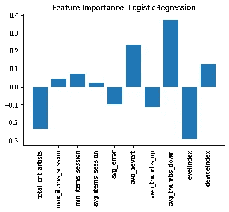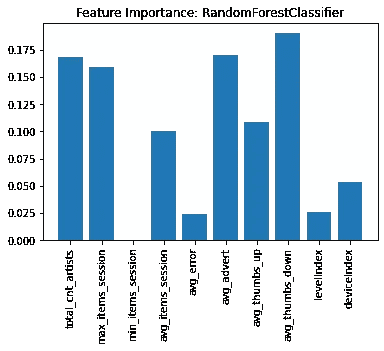

由于逻辑回归随机森林不能在测试集上取得更好的结果。然而，它可以在验证集上击败逻辑回归。

**理由**

项目的结果清楚地表明，梯度增强的树遭受过度拟合。此外，随机森林方法比梯度增强树快 10 倍，比逻辑回归快 4 倍。尤其是在大数据的情况下，这种约束会产生巨大的差异。对于进一步的工作，我建议使用随机森林算法。事实上，该项目的主要目标是一方面防止用户流失，另一方面避免误报(公司不想减少为忠诚用户花钱的利润)。该解决方案应该能够在一天中的任何时间尽可能快地收集见解。

# 第四部分:**结论和建议**

在这个项目中，我们使用 Pyspark(机器学习客户流失预测)探索了包含客户流失信息的数据集。

1.我们观察了用户不同的**个人属性，以发现**冲动**为什么一些客户倾向于退出订阅或根本不使用音乐平台**

2.我们仔细分析了用户**日志数据**以检测**隐藏模式**和**收集洞察力**哪些因素影响了离开或不离开的决定

3.最后，我们使用数据子集建立不同的**预测模型**来识别**客户流失**，并调整不同的参数以获得更好的结果。

事实上，这个项目的主要目标是通过 Spark 使用机器学习技术来实现分析、数据探索和预测，所获得的知识以及代码本身可以用于 Spark 集群中的大数据培训。此外，分类特征(如州和城市信息)的集成可以显著提高模型性能。

**未来建议和限制:**

**局限性**

这个项目的限制是(除了其他限制之外)它只涉及数据的子集。因此，我建议在下一步(未来的工作)中，需求应该包括对整个数据集的训练，而不仅仅是子集。

**未来建议**

对**客户流失/客户流失**的预测分析只是一个识别潜在客户行为模式的指标。因此，建议企业更进一步，使用其他 **ML 方法，有效地将客户流失转化为客户** **保留。**

**规定性分析、预测性分析、描述性分析、诊断性分析和结果分析**是任何企业都不应忽视的保留分析类型。

**未来作者的作品**

由于分析不涉及音乐流派或风格，因此仍然有一些有趣的问题:

> 为什么很少有客户使用移动设备听音乐？

如果你喜欢上面的分析，请点击这里查看我的 GitHub。