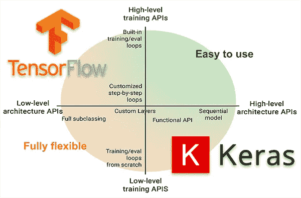
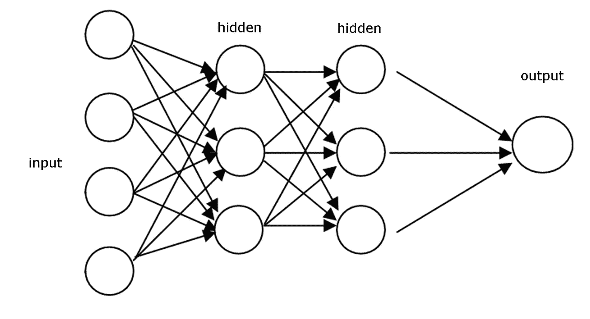

# 如何在 Tensorflow 中从头开始编写神经网络(不使用 Keras)

> 原文：<https://medium.com/analytics-vidhya/how-to-write-a-neural-network-in-tensorflow-from-scratch-without-using-keras-e056bb143d78?source=collection_archive---------1----------------------->

来源:[图片搜索](https://www.pyimagesearch.com/2019/10/21/keras-vs-tf-keras-whats-the-difference-in-tensorflow-2-0/)

# 介绍

编写一个简单的前馈神经网络可能是你掌握深度学习之旅的第一步。今天，有无数的库和框架可用于开发机器学习模型。开发机器学习模型的两个最著名和最常用的框架是 Tensorflow 和 PyTorch。Keras 已经集成到 Tensorflow2.0 中，这无疑使以 Tensorflow 为主干编写任何机器学习代码变得更加容易。但是，如果您是该领域的初学者，您可能希望从头开始编写代码，以便了解模型的来龙去脉。我在互联网上搜索可以帮助我在 TensorFlow 中编写简单前馈神经网络的基本代码的资源，但没有找到任何资源。所以，我想到了自己写一个。以下是完成它的方法！

# **为什么不用 Keras？**

## 1.keras 模型和基本模型之间的学习差异

Keras 是一个非常简单的库，可以帮助你毫不费力地用 python 编写机器学习代码。它又快又简单又干净！然而，在引擎盖下，Keras 做了大量的工作来为您提供这种无缝的体验。如果你在 Tensorflow 的 github 知识库上查看像`model.fit()`或`model.train()`这样的函数的后端代码，你会发现它们包含了许多优化，如热启动和硬件层面上的函数优化实现。这些技巧肯定会让你的代码运行得更快，但这并不总是意味着你的模型正在学习它应该学习的方式。作为比较，如果你写一个简单的 2-3 层神经网络代码，使用和不使用 keras，你会发现两个程序的损耗曲线有很大的不同。不使用 keras 编写的基本代码的损耗曲线将指示损耗值从高数值下降到低数值，而 keras 代码的损耗值将首先从低数值开始，并且与前一编码器不同，不会显著下降到较低值。这并不意味着 keras 模型不学习，而是意味着在基本代码中发生的学习的幅度大于在 keras 代码中发生的学习的幅度。优化 keras 代码就像剥一缕头发。

**2。更好地控制架构的执行** 有时候，你的架构可能不是一个简单的序列神经网络。它可能包含剩余/跳过连接或多个子神经网络。在这种情况下，您需要对您的架构的执行进行更多的控制。拥有一个定制代码对于这样的用例来说无疑是非常方便的。

用于比较的一些其他来源:
1。[https://www.javatpoint.com/tensorflow-vs-keras](https://www.javatpoint.com/tensorflow-vs-keras)2。[https://www . pyimagesearch . com/2019/10/21/keras-vs-TF-keras-whats-the-difference-in-tensor flow-2-0/](https://www.pyimagesearch.com/2019/10/21/keras-vs-tf-keras-whats-the-difference-in-tensorflow-2-0/)

# TL；速度三角形定位法(dead reckoning)

下面是一个简单的前馈神经网络的例子，它包含两个隐藏层，学习使用梯度下降优化来预测`mnist`数字。

简单前馈神经网络

> 我假设您已经下载了 mnist 数据集

在上面的代码片段中，我为一个网络创建了一个类并初始化它。`n_layers`包含网络中每层的节点数
使用`tf.Variable()`函数初始化每个权重和偏差矩阵
我们保存`self.params`中的所有参数以备将来使用

在正向传递中，我们对矩阵执行线性代数。
您应该在 predict()函数中的激活函数之后返回完整的输出。在上面的代码片段中，Z3 是 logits，Y 是最终的预测输出。

如上所述，你可以使用`tf.compat.v1.losses.sigmoid_cross_entropy()`或`tf.compat.v1.losses.softmax_cross_entropy()`，他们所做的就是在逻辑上应用 sigmoid 或 softmax 激活函数，然后计算损耗。为了使用这些功能，标签应该是一个热点矢量格式。更多信息，你可以参考以下链接，
1。[https://mmuratarat.github.io/2018-12-21/cross-entropy](https://mmuratarat.github.io/2018-12-21/cross-entropy)T21【2】。[https://gombru.github.io/2018/05/23/cross_entropy_loss/](https://gombru.github.io/2018/05/23/cross_entropy_loss/)

上述函数可用于执行反向传播。这可能是整个计划中最重要的部分。上述函数可作为 TensorFlow 中`model.fit()`的替代函数。

这就对了。这就是如何在 TensorFlow 中构建一个非常基本的前馈神经网络，而无需使用任何像 Keras 这样的高级库。它的其余部分，如批处理加载器和评估指标的函数，很容易开发，因此我跳过了它们。

✌️和平