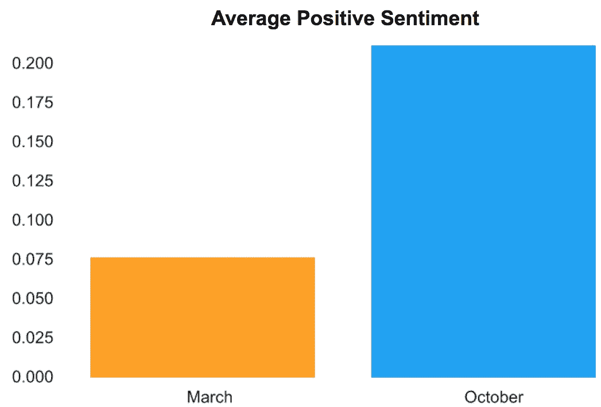
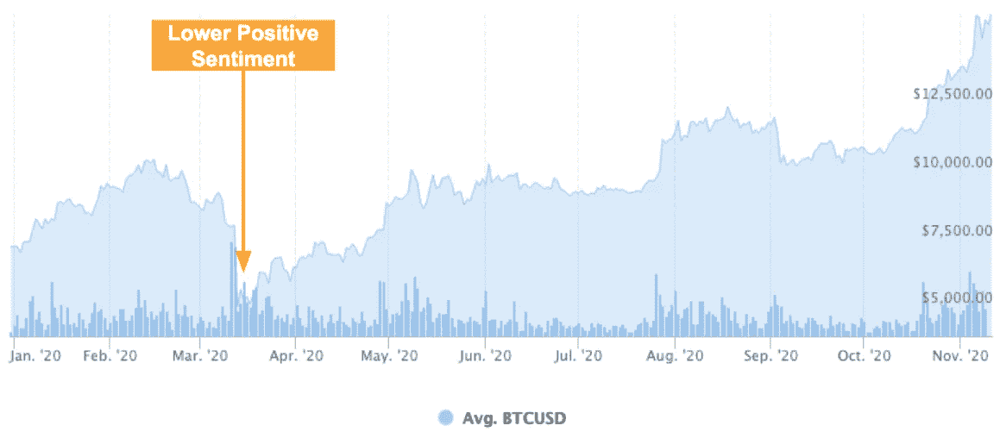
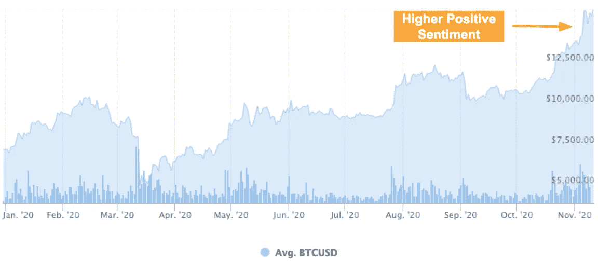
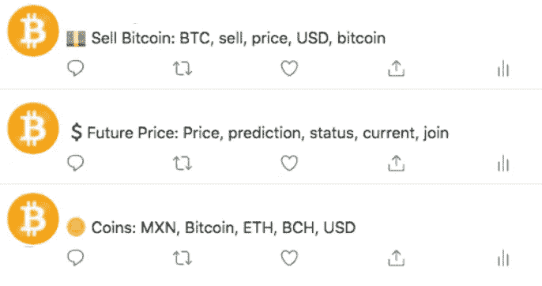
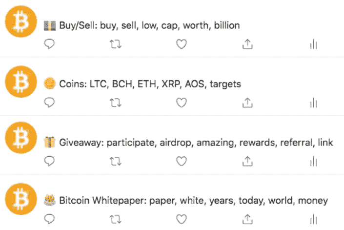
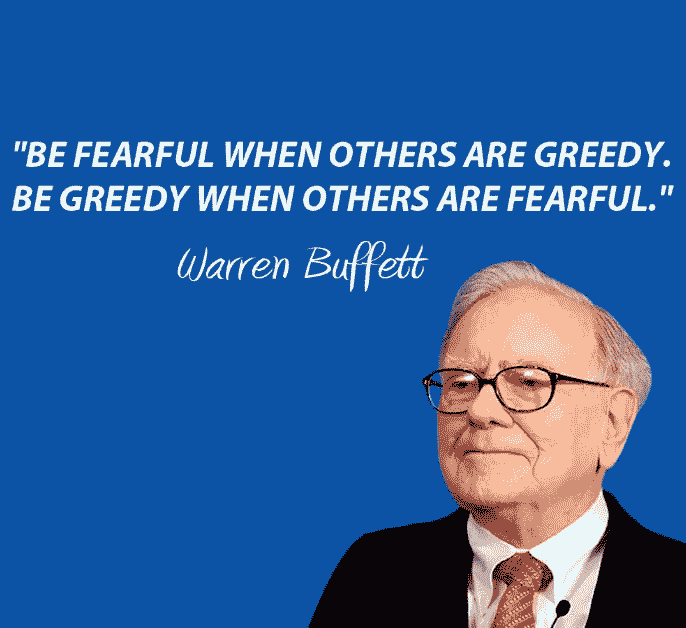

# Twitter 如何推动比特币的价格

> 原文：<https://medium.com/analytics-vidhya/how-twitter-drives-bitcoins-price-646481121e01?source=collection_archive---------12----------------------->

*一条推文的情绪能推动加密货币市场吗？*

如果你只想看视频

作为 2017 年以来比特币的信徒，我买入了那种情绪或“炒作”，从未放手。我敢肯定，你们中的许多人都在想，为什么我当时不干脆卖掉，因为我相信比特币将推动货币体系的未来，并迫使当前的货币体系发生变化。然而，就目前而言，问题仍然是，是什么推动了比特币的当前价格？

首先，让我们快速了解一下我是如何得出这个分析推特和比特币之间相关性的猜想的背景。在我们经历了 2017 年史诗般的巨大垃圾箱火灾后不久，我开始交易比特币和其他加密货币。你会问为什么吗？因为我被贪婪和对永恒财富的渴望所驱使。嗯，经过近一年的日内交易和摆动交易，学习了不同的指标，如相对强弱指数，MACD，振荡指标等。我意识到我是一个投机商人。那时我已经买了比特币，我知道这是我的长期投资。我最终采用了另一种策略，美元成本平均法。如果你不熟悉这个术语，我建议你去谷歌一下，因为这可能是你将学到的最好的金融术语之一。这个概念是，我每个月都买入一点比特币，不管它的大幅波动，从长远来看，理想情况下我的投资应该是绿色的。然而，最终，我开始思考，我终于，*科学地*，得出了以下结论:

> 比特币的价格是由民众情绪驱动的

在我的数据科学训练营期间，我在思考如何将 NLP(自然语言处理)和我对比特币的热爱结合起来。啊哈！到推特！


图片由 [AC & M 文化营销](https://acmconnect.com/blog/twitters-top-secret-project-revealed-more-new-features-announced-and-hashflag-galore/)的 Giovanna Torres 拍摄

当前的问题是:推特上的情绪会影响比特币的价格吗？请记住，我可以选择任何形式的电子通讯方式，如电报和 WhatsApp 信息、脸书帖子等等。但是我在推特上决定了。

下一步，我制定了一个计划:

1.  **从 Twitter 上抓取两个不同时间段的推文进行比较。**
2.  **确定这些推文的正面/负面情绪得分。**
3.  **将情绪与给定时间段内的价格进行比较。**
4.  **确定我的结论。**
5.  **打造 app 向公众展示。**

这是一个非常简单明了的计划。所以让我们开始工作吧！

图片来自 [Imgur](https://i.imgur.com/dcuRXEZ.gif)

# Twitter 有一个 API 叫做 Tweepy…

…你可以用它来访问他们的推文。首先，我需要申请一个开发者账户。我上了推特，创建了开发者账户，24 小时内我就被批准了，瞧！这对你来说可能会更长，因为它会有所不同。有了开发人员帐户，我就有了我一直在寻找的密钥:

```
consumer_key = os.environ.get(‘CONSUMER_KEY’)consumer_secret = os.environ.get(‘CONSUMER_SECRET’)access_token = os.environ.get(‘ACCESS_TOKEN’)access_token_secret = os.environ.get(‘ACCESS_SECRET’)
```

然而，你一次可以抓取多少条推文是有限制的。这是我的过程中的一个瓶颈，但幸运的是我被介绍给了 SNScrape。我需要做的就是用给定的参数调用 SNScrape，如下所示:

```
!snscrape twitter-search “#Bitcoin since:2020–11–01 until: 2020–11–02” > btc_tweets_daily.txt
```

[1] J. Dinco，[通过 SNScrape & Tweepy](/@jcldinco/downloading-historical-tweets-using-tweet-ids-via-snscrape-and-tweepy-5f4ecbf19032) (2020)，[https://medium . com/@ jcldinco/Downloading-historical-Tweets-using-Tweet-IDs-via-SNScrape-and-Tweepy-5 F4 ecbf 19032](/@jcldinco/downloading-historical-tweets-using-tweet-ids-via-snscrape-and-tweepy-5f4ecbf19032)

我指定 SNScrape 在 Twitter 上搜索从 2020 年 10 月底开始带有标签“比特币”的推文的*链接*，并将其放入一个文本文件中。到目前为止，我在 SNScrape 上所做的只是将*链接*到前面提到的 Tweets。

一旦我有了链接，我就提取出 Tweets 的 id，它们在链接的末尾，我把它们输入 Tweepy。这里的诀窍是，Tweepy 不喜欢你开始向它索要太多，所以你需要用下面的函数分批分解它:

```
chunks = (total_count — 1) // 50 + 1for i in range(chunks): batch = ids[i*50:(i+1)*50] result = fetch_tw(batch)
```

这样 Tweepy 一次抓取 50 个 id，它不会屏蔽你，你会得到你需要的所有推文。抱歉推特，我保证这有助于更大的利益，但他们不都是这么说的吗？

现在我已经通过 Tweepy 输入了推文 id，我拥有了 2020 年 10 月以来所有的 15，000+推文。然后，我在 2020 年 3 月底继续做同样的事情，以便有一组推文与之进行比较。

# 现在，我们进行预处理！

我所有的推文都被抓取了，你将学到的关于抓取的第一条规则是它可以非常非常肮脏。所以我们首先需要清理推文。我们需要摆脱网址，提及，标签，小写，删除空白和停用词，等等。在这项研究中，我放弃了表情符号和表情符号，我知道它们会对情绪产生很大影响，但由于时间限制，我需要加快速度。我使用了一个名为 Tweet-Preprocessing、Gensim 和 Regex 的 Python 库的组合，如下所示:

```
def preprocess_tweet(row): text = row[‘tweet’] text = p.clean(text) 
    #clean to normal text removes hashtags and emojis text = re.sub(r’[^\w]’, ‘ ‘, text) #Removes all symbols text = text.lower() # lowercases all words text = re.sub(r’\d+’, ‘’, text) # Removes numbers text = re.sub(‘RT[\s]+’, ‘’, text) # Removing RT text = re.sub(‘https?:\/\/\S+’, ‘’, text) # Removing hyperlink text = remove_stopwords(text) #removes stopwords text = re.sub(r’\W*\b\w{1,2}\b’, ‘’, text) 
    #Removes words between 1 and 2 characters shortreturn textdf_tweets[‘tweet’] = df_tweets.apply(preprocess_tweet, axis=1)df_tweets[‘tokens’] = df_tweets[‘tweet’].apply(word_tokenize)
```

[2] S. Srijith，[高效的推文预处理](https://www.kaggle.com/sreejiths0/efficient-tweet-preprocessing) (2020)，[https://www . ka ggle . com/sreejiths 0/Efficient-Tweet-预处理](https://www.kaggle.com/sreejiths0/efficient-tweet-preprocessing)

现在我的推文已经完全进入了情绪分析了！

图片来自 Garfield.com

# **对于情感分析…**

…我用了 TextBlob。它确定了两个分数:极性(推文的积极/消极)和主观性(推文的主观/客观)。出于这个目的，我只关注极性得分，因为我想知道推特用户在给定时间对比特币的感受。

[3] Randerson， [Twitter 情绪分析](/better-programming/twitter-sentiment-analysis-15d8892c0082) (2020)，[https://medium . com/better-programming/Twitter-sensition-Analysis-15d 8892 c 0082](/better-programming/twitter-sentiment-analysis-15d8892c0082)

现在我有了分数，我必须确定什么意味着什么。所以我用给定的参数创建了一个新列。

1.  **如果极性得分低于 0，则为负面情绪**
2.  **如果等于 0，则为中性情绪**
3.  **还有什么，这是一种积极的情绪**

这是结果…



啊哈！10 月底价格飙升时的极性得分为 0.214，而 3 月底价格大幅下跌时的极性得分为 0.0734。十月份的分数几乎是三月份分数的 3 倍！现在，我们需要查看这些时期的实际价格。

到 2020 年 3 月中旬/月底，比特币的价格急剧下降到 5500 美元左右



作者的图片灵感来自 [Coinmarketcap](https://coinmarketcap.com/currencies/bitcoin/)

到 2020 年 10 月底，价格急剧飙升至 15000 美元左右



作者的图片灵感来自 [Coinmarketcap](https://coinmarketcap.com/currencies/bitcoin/)

我甚至用潜在语义分析(LSA)、非负矩阵分解(NMF)、pyLDAvis 和 Corex 做了一些主题建模，以观察在给定的时间框架内大多数推文都在谈论什么。关于 2020 年 3 月，请参见下文:



作者的图片灵感来自 [Twitter](https://twitter.com/qridwan102)

有一个讨论出售比特币的话题，它与比特币的价格下跌和每个人的恐慌性抛售产生共鸣。

图片来自 [Giphy](https://giphy.com/gifs/this-is-fine-dumpster-fire-floating-1rNWZu4QQqCUaq434T)

然后当价格在 10 月底呈指数增长时，话题都在谈论免费赠品。



作者的图片灵感来自[推特](https://twitter.com/qridwan102)

*旁注，如果你曾看到有人提到比特币被赠送，那就往相反的方向跑。他们很可能是想骗你。*

图片来自@Liam_Thorne_ on [Twitter](https://twitter.com/liam_thorne_/status/1129886165052657665)

# 总之…

……人们的情绪或他们对比特币的看法*肯定与价格*相关。然而，要记住的一点是，这不是唯一的因素。例如，Paypal 在 2020 年 10 月 21 日宣布，他们将允许其用户在其平台上买卖比特币，我敢肯定这让许多个人冲到它的门口并开始购买。

[](https://newsroom.paypal-corp.com/2020-10-21-PayPal-Launches-New-Service-Enabling-Users-to-Buy-Hold-and-Sell-Cryptocurrency) [## PayPal 推出新服务，允许用户购买、持有和出售加密货币

### 11/12/20 更新:我们很高兴地宣布，美国所有符合条件的 PayPal 账户持有人现在都可以购买、持有和…

newsroom.paypal-corp.com](https://newsroom.paypal-corp.com/2020-10-21-PayPal-Launches-New-Service-Enabling-Users-to-Buy-Hold-and-Sell-Cryptocurrency) 

然后，当价格在 3 月份下跌时，可能是许多用户在加密保证金交易网站 Bitmex 上被清算，以及由于一群比特币“鲸鱼”(拥有大量比特币的个人)抛售了足够多的比特币以推动市场(是的，这种情况会发生)。

[](https://www.forbes.com/sites/billybambrough/2020/03/19/major-bitcoin-exchange-bitmex-has-a-serious-problem/?sh=29bf1e774f7d) [## 以下是导致比特币价格“极端”下跌的原因

### 上周，比特币和加密货币市场震惊了，当时比特币价格一度跌至 4000 美元以下…

www.forbes.com](https://www.forbes.com/sites/billybambrough/2020/03/19/major-bitcoin-exchange-bitmex-has-a-serious-problem/?sh=29bf1e774f7d) 

无论哪个因素影响比特币的价格，有一点是肯定的，那就是人们对任何一种货币的情绪不管是美元还是比特币都很重要。根据不同的情绪，它会导致信任或缺乏信任。因此，如果你要投资，投资要谨慎，但要始终如一。正如沃伦·巴菲特所说…



图片来自[催化剂投资](http://catalystinvesting.org/media/wysiwyg/catalyst/best-investing-quotes-to-lead-you-through-any-market/be-fearful-when-other-are-greedy.jpg)

# 最后…

…请不要忘记查看我的应用程序。这与我的研究有些不同，因为我没有抓取推文，而是使用 NewsAPI 收集上个月的文章，并根据这些文章来确定情绪。这种方向的改变对应用程序来说是最有效的，因为抓取 30，000+条推文将需要很长时间，并且可能会失去用户的注意力。下面来看看吧！

[BTCSentiment.herokuapp.com](https://btcsentiment.herokuapp.com/)

请记住，这些信息都不是博客帖子或应用程序本身的官方财务建议。谢谢大家！

# 请看我的其他作品…

…在我的网站、Github repository 和 LinkedIn 上查看我的所有项目。让我知道我下一步应该做什么！

[RidwanAlam.com](https://ridwanalam.com/)

[](https://github.com/ridwan102) [## ridwan102 —概述

### 钻研软件工程世界，继续推动人类创新北极代码库贡献者…

github.com](https://github.com/ridwan102) [](https://www.linkedin.com/in/ridwanalam/) [## Ridwan Alam —数据科学家— Metis | LinkedIn

### 顶尖技能:Python，回归建模，分类，无监督学习，主题建模，情感分析…

www.linkedin.co](https://www.linkedin.com/in/ridwanalam/)