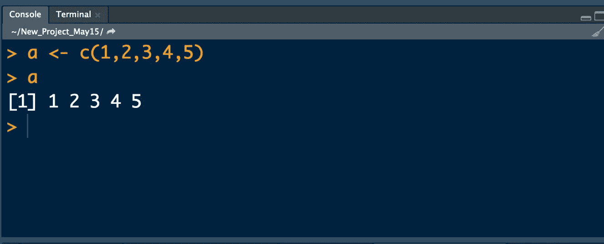

# 向量如何影响 R 编程中何时使用 While 循环

> 原文：<https://medium.com/analytics-vidhya/how-vectors-influence-when-to-use-for-while-loops-in-r-programming-23fe8db63b97?source=collection_archive---------4----------------------->

R 编程中的一个向量(来源 Pierre DeBois)

For 或 while 循环是编程的一个基本部分——你几乎可以在每个基础教育网站上看到这样的例子。它们在 R 编程中的使用也不例外。但是使用循环时必须考虑程序的底层结构，以创建有效的程序。当你能够优化你的代码来处理向量时，r 编程脚本运行得最好。

到…