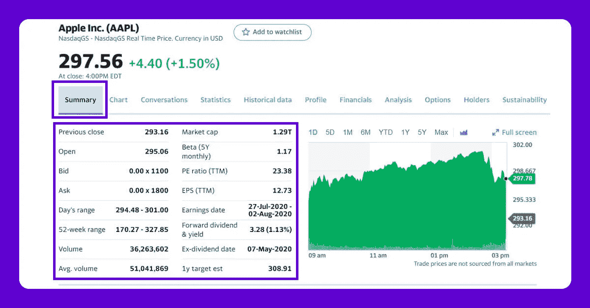
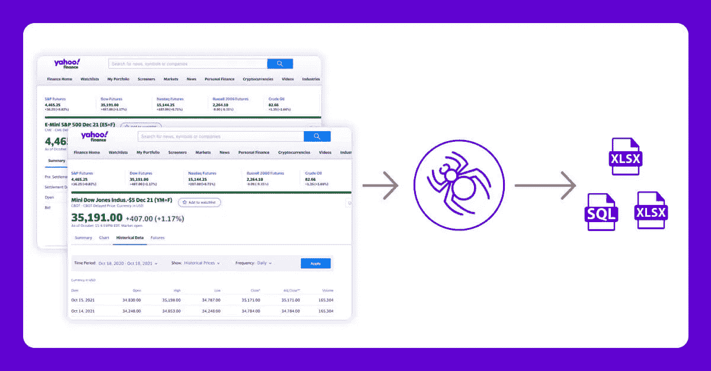

# 如何使用网络抓取来提取雅虎财经数据:股票价格、出价、价格变化等等？

> 原文：<https://medium.com/analytics-vidhya/how-web-scraping-is-used-to-extract-yahoo-finance-data-stock-prices-bids-price-change-and-more-b5f97d09c181?source=collection_archive---------3----------------------->


对于科技公司来说，股票市场是一个巨大的数据库，每秒钟都有数百万条记录更新！因为提供财务数据的公司非常多，一般都是通过[实时网络抓取 API](https://www.webscreenscraping.com/real-time-api.php) 来完成的，API 总是有高级版本的。雅虎财经是股票市场信息的可靠来源。这是一个高级版本，因为雅虎也有一个 API。相反，你可以在网站上免费获得任何公司的股票信息。

尽管它在股票交易者中非常受欢迎，但在包括谷歌金融在内的许多大型竞争对手都失败的市场中，它仍然坚持了下来。对于那些对股票市场感兴趣的人，雅虎提供股票市场和公司的最新消息。

# 拯救雅虎财务的步骤

*   从雅虎财经创建搜索结果页面的 URL。
*   使用 [Python](https://www.webscreenscraping.com/hire-python-developers.php) 请求下载搜索结果页面的 HTML。
*   使用 LXML-LXML 滚动页面，并允许您使用 Xpaths 导航 HTML 树结构。我们已经为代码所需的细节定义了 Xpaths。
*   将下载的信息保存到 JSON 文件中。

我们将提取以下数据字段:



您需要安装 Python 3 包来下载和解析 HTML 文件。

# 剧本

```
from lxml import html
import requests
import json
import argparse
from collections import OrderedDict
def get_headers():
return {"accept": "text/html,application/xhtml+xml,application/xml;q=0.9,image/webp,image/apng,*/*;q=0.8,application/signed-exchange;v=b3;q=0.9",
"accept-encoding": "gzip, deflate, br",
"accept-language": "en-GB,en;q=0.9,en-US;q=0.8,ml;q=0.7",
"cache-control": "max-age=0",
"dnt": "1",
"sec-fetch-dest": "document",
"sec-fetch-mode": "navigate",
"sec-fetch-site": "none",
"sec-fetch-user": "?1",
"upgrade-insecure-requests": "1",
"user-agent": "Mozilla/5.0 (Windows NT 10.0; Win64; x64) AppleWebKit/537.36 (KHTML, like Gecko) Chrome/81.0.4044.122 Safari/537.36"}
def parse(ticker):
url = "http://finance.yahoo.com/quote/%s?p=%s" % (ticker, ticker)
response = requests.get(
url, verify=False, headers=get_headers(), timeout=30)
print("Parsing %s" % (url))
parser = html.fromstring(response.text)
summary_table = parser.xpath(
'//div[contains(@data-test,"summary-table")]//tr')
summary_data = OrderedDict()
other_details_json_link = "https://query2.finance.yahoo.com/v10/finance/quoteSummary/{0}?formatted=true&lang=en-US®ion=US&modules=summaryProfile%2CfinancialData%2CrecommendationTrend%2CupgradeDowngradeHistory%2Cearnings%2CdefaultKeyStatistics%2CcalendarEvents&corsDomain=finance.yahoo.com".format(
ticker)
summary_json_response = requests.get(other_details_json_link)
try:
json_loaded_summary = json.loads(summary_json_response.text)
summary = json_loaded_summary["quoteSummary"]["result"][0]
y_Target_Est = summary["financialData"]["targetMeanPrice"]['raw']
earnings_list = summary["calendarEvents"]['earnings']
eps = summary["defaultKeyStatistics"]["trailingEps"]['raw']
datelist = []
for i in earnings_list['earningsDate']:
datelist.append(i['fmt'])
earnings_date = ' to '.join(datelist)
for table_data in summary_table:
raw_table_key = table_data.xpath(
'.//td[1]//text()')
raw_table_value = table_data.xpath(
'.//td[2]//text()')
table_key = ''.join(raw_table_key).strip()
table_value = ''.join(raw_table_value).strip()
summary_data.update({table_key: table_value})
summary_data.update({'1y Target Est': y_Target_Est, 'EPS (TTM)': eps,
'Earnings Date': earnings_date, 'ticker': ticker,
'url': url})
return summary_data
except ValueError:
print("Failed to parse json response")
return {"error": "Failed to parse json response"}
except:
return {"error": "Unhandled Error"}
if __name__ == "__main__":
argparser = argparse.ArgumentParser()
argparser.add_argument('ticker', help='')
args = argparser.parse_args()
ticker = args.ticker
print("Fetching data for %s" % (ticker))
scraped_data = parse(ticker)
print("Writing data to output file")
with open('%s-summary.json' % (ticker), 'w') as fp:
json.dump(scraped_data, fp, indent=4)
```

# 执行刮刀

假设脚本名为 yahoofinance.py。如果您在命令提示符或带有-h 的终端中键入代码名。

```
python3 yahoofinance.py -h
usage: yahoo_finance.py [-h] ticker
positional arguments: ticker optional arguments: -h, --help show this help message and exit
```

股票代码，通常被称为股票代码，用于识别公司。

为了找到苹果公司的股票数据，我们将进行如下论证:

```
python3 yahoofinance.py AAPL
```

这将在脚本所在的文件夹中生成一个名为 AAPL-summary.json 的 JSON 文件。

这是输出文件的样子:

```
{
"Previous Close": "293.16",
"Open": "295.06",
"Bid": "298.51 x 800",
"Ask": "298.88 x 900",
"Day's Range": "294.48 - 301.00",
"52 Week Range": "170.27 - 327.85",
"Volume": "36,263,602",
"Avg. Volume": "50,925,925",
"Market Cap": "1.29T",
"Beta (5Y Monthly)": "1.17",
"PE Ratio (TTM)": "23.38",
"EPS (TTM)": 12.728,
"Earnings Date": "2020-07-28 to 2020-08-03",
"Forward Dividend & Yield": "3.28 (1.13%)",
"Ex-Dividend Date": "May 08, 2020",
"1y Target Est": 308.91,
"ticker": "AAPL",
"url": "http://finance.yahoo.com/quote/AAPL?p=AAPL"
}
```

这段代码将用于获取不同公司的股票市场数据。如果你希望经常浏览数百页，有很多事情你必须知道。

# 为什么要执行雅虎财经数据抓取？



如果你正在处理[股票市场数据](https://www.webscreenscraping.com/stock-market-research-and-financial-data-scraping.php)，并且需要一个干净、免费、值得信赖的资源，雅虎财经可能是最好的选择。不同的公司简介页面具有相同的格式，因此，如果您构建一个脚本来从微软财务页面抓取数据，您可以使用相同的脚本来从苹果财务页面抓取数据。

如果任何人都无法选择如何抓取雅虎财务数据，那么最好是聘请一个有经验的网络抓取公司，如网络屏幕抓取。

如有任何疑问，请立即联系 Web Screen Scraping 或索取免费报价！！

*最初发表于*[*【https://www.webscreenscraping.com】*](https://www.webscreenscraping.com/how-web-scraping-is-used-to-extract-yahoo-finance-data-stock-prices-bids-price-change-and-more.php)*。*