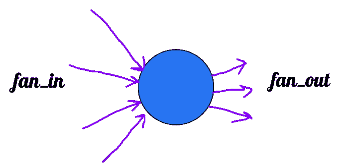

# 如何在神经网络中初始化权重(快速修订版)

> 原文：<https://medium.com/analytics-vidhya/how-weights-are-initialized-in-neural-networks-quick-revision-adceac6c3cc9?source=collection_archive---------8----------------------->

*改变深度学习轨迹的关键因素*

照片由[🇸🇮·扬科·菲利](https://unsplash.com/@itfeelslikefilm?utm_source=medium&utm_medium=referral)在 [Unsplash](https://unsplash.com?utm_source=medium&utm_medium=referral) 上拍摄

神经网络是现代深度学习的基本概念之一。本文仅涵盖神经网络初始化的方式和原因，因此我假设您了解神经网络的基本知识(*特别是前向传播和反向传播概念*)。

> 那么，什么是初始化呢？

初始化是一种给神经元初始权重的方法，通过这些技术，我们可以在训练模型之前分配随机值，而不是零和常量值。

> **我们为什么需要它？**

当我们不知道为什么要使用它时，使用它又有什么意义呢？使用它的主要原因有三个。

1.  原因之一是它可以避免训练后期的**消失、爆炸渐变问题**。消失梯度问题是指当权重在训练过程中不变时出现的问题(*出现在权重被初始化为远小于 1* )。爆炸梯度问题是指当权重持续快速增加时出现的问题(*当权重初始化大于 1* 时出现)
2.  另一个原因是它可以加快训练过程，因为它可以通过优化初始化学习得更快。

> 它有哪些类型？如何/何时使用？

主要有三种类型的权重初始化，它们在实际应用中非常有效。

1.  均匀分布
2.  泽维尔/戈拉特分布
3.  He 初始化

图 1 —一个神经元的示意图，fan_in 表示输入层的数量，fan_out 表示输出层的数量

# 均匀分布

是一种初始化，其中权重是均匀分布的。计算初始重量范围的公式如下

# Xavier / Gorat 初始化

对于使用 Sigmoid，Tanh 作为激活函数的**神经网络来说，这种初始化被证明非常好。大体上有两种类型，**

> 泽维尔师范

权重值由平均值和标准偏差为零的**正态分布**分配

> 泽维尔制服

权重值由具有以下公式的均匀分布分配

# He 初始化

这种初始化对于使用 ReLU 作为激活函数的**神经网络来说是很好的。大体上有两种类型，**

> 何制服

权重值由具有以下公式的均匀分布分配

> 他正常吗

权重值由平均值为零且标准偏差为的正态分布分配

耶！就这样，我们已经学习/快速复习了神经网络初始化背后的公式和概念。同样，如果你想详细了解这一点，我推荐你阅读[这](https://machinelearningmastery.com/weight-initialization-for-deep-learning-neural-networks/#:~:text=The%20normalized%20xavier%20initialization%20method,number%20of%20outputs%20from%20the)，你可以在这里想象[的概念。
感谢您的阅读！](https://www.deeplearning.ai/ai-notes/initialization/)

下次见…