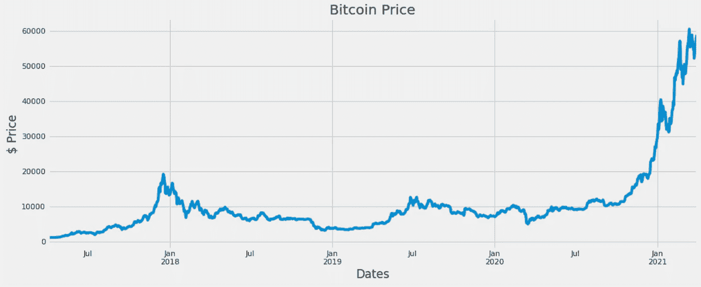
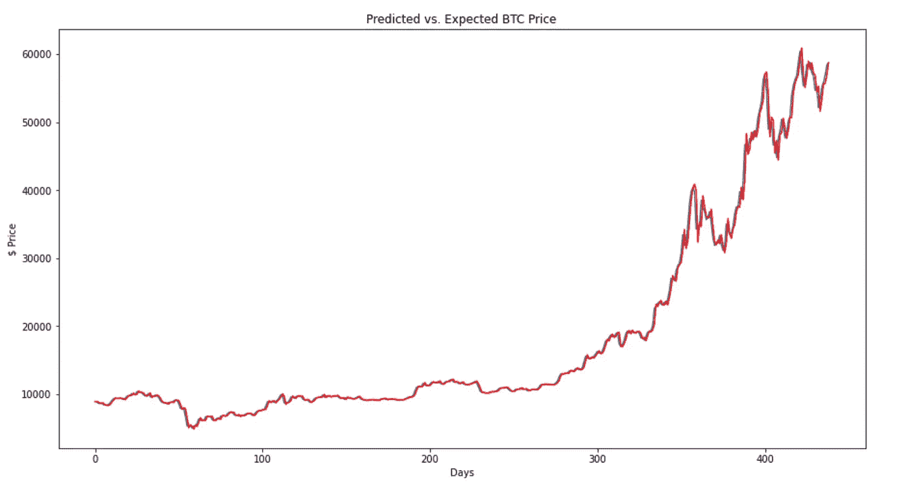
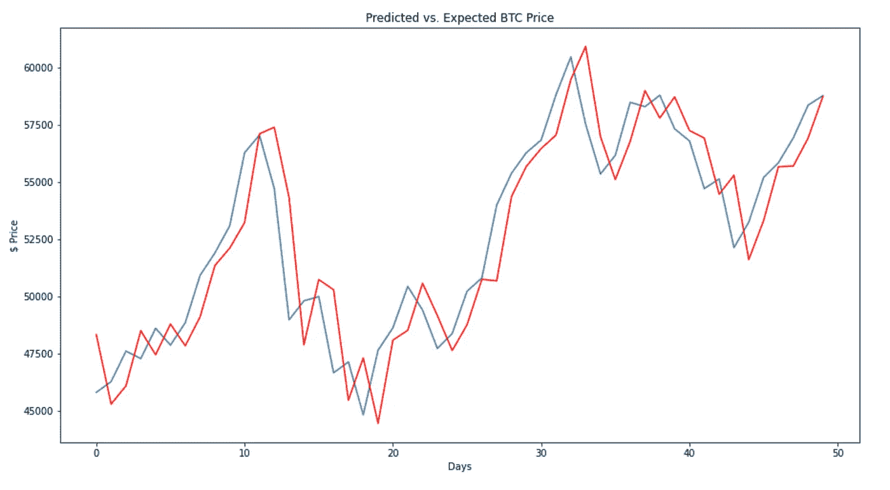
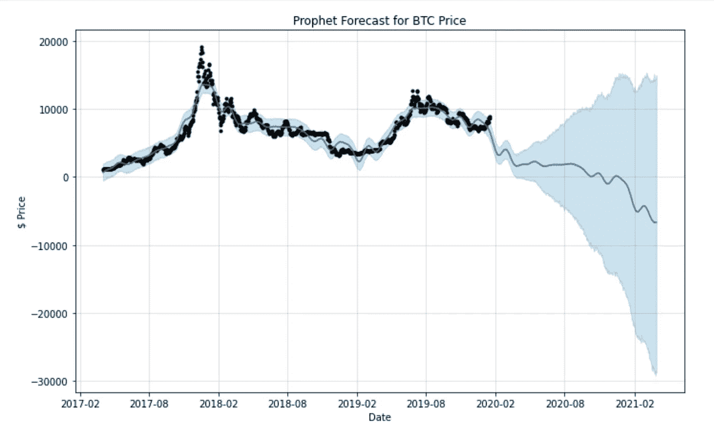
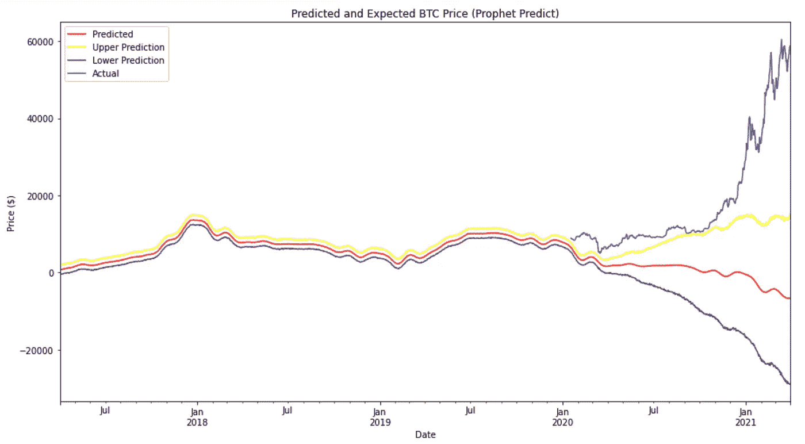
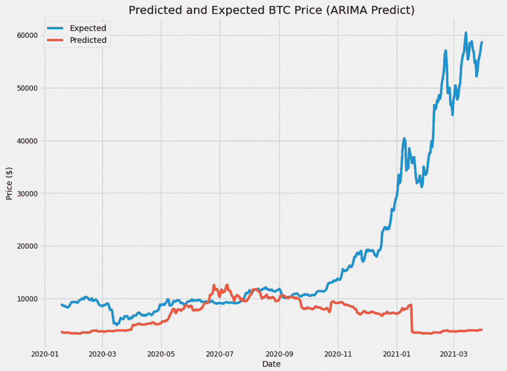
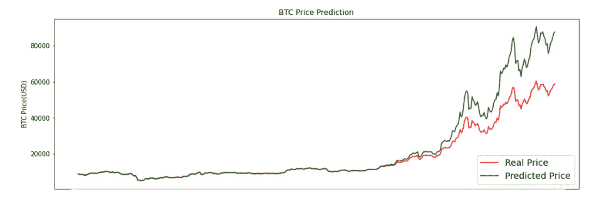
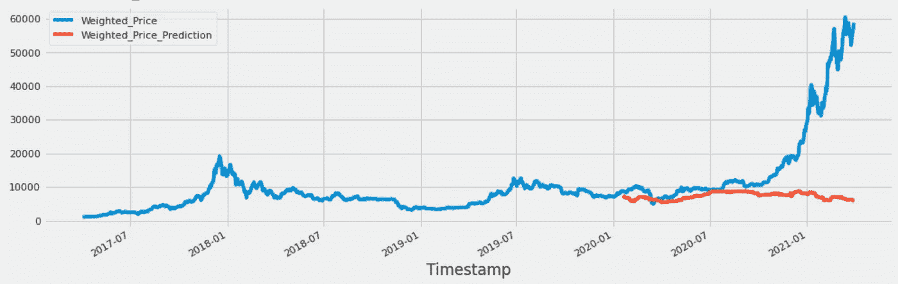
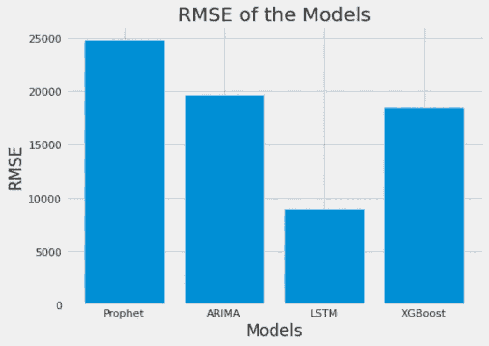

# 机器学习模型能多好地预测比特币的价格？

> 原文：<https://medium.com/analytics-vidhya/how-well-can-machine-learning-models-predict-the-price-of-bitcoin-f036fdecdc03?source=collection_archive---------0----------------------->

## 通过 Python 中的 ARIMA、XGBoost、Prophet 和 LSTM 模型预测比特币价格

## 介绍

随着越来越多的人/组织开始采用加密货币比特币，比特币继续成为世界头条新闻，并越来越受欢迎。在本文中，我将测试 Python 中 4 种不同机器学习模型的比特币预测能力:ARIMA、预言家、XGBoost 和 LSTM。通过将数据分成测试和训练集，我将比较每个模型的性能，并得出哪个性能最好的结论。这里是 [Github 库](https://github.com/AaronFlore/Forecasting_BitcoinPrices)。

## 探索性数据分析

虽然几个月前我已经在我的上一篇媒体文章[日交易比特币:使用历史比特币数据的探索性分析](/analytics-vidhya/day-trading-bitcoin-an-exploratory-analysis-using-historical-bitcoin-data-c0865383ebf5)中探索和分析了这个[比特币数据集](https://www.kaggle.com/mczielinski/bitcoin-historical-data)，但我确实想调整我将用来训练各种模型的数据。我没有使用 2012 年 1 月至 2021 年 3 月的所有比特币数据，而是决定将数据限制在最近 4 年，因为这是比特币价格开始波动和变得不稳定的时候。

我使用了下面的比特币价格数据(图 1)。然而，接下来我需要为我的训练和测试数据决定一个数据分割。由于价格在 2021 年 1 月飙升如此之高，我知道这些模型不会准确预测这种发展。因此，我决定将培训和测试分成 70%和 30%。这 30%的分割允许模型在不可预测的峰值之前预测大量的值。

图 1 —比特币价格，从 2021 年 3 月开始的过去 4 年

## 测试模型的标准化程序

正如我刚才所说的，每个模型将在时间序列的前 70%进行训练，然后在剩余的 30% (439 天)根据其预测值进行测试。我将使用每个模型测试的均方根误差(RMSE)来确定最佳模型。RMSE 是残差的标准差，或者更简单地说，是残差的分布程度。

## 基线 RMSE:滚动预测 ARIMA 模型

我首先创建了一个滚动预测 ARIMA 模型，以获得一个伟大的 RMSE 是什么的基线。然而，由于这个模型预测的是每天滚动的增量，因此与其他模型进行比较是不公平的。如下图所示(图 2)，预测用红色表示，实际价格用蓝色表示。然而，我们必须放大更多才能区分这两者。

图 2-最近 439 天的滚动 ARIMA 预测

一旦放大到过去 50 天(图 3)，模型的日复一日的滞后是清晰可见的。这个模型产生了一个 RMSE: 914.737，它向我们表明了一个好的 RMSE 是什么样子的，以及我们在其他模型中应该以什么为目标。

图 3-最近 50 天的滚动 ARIMA 预测

## 1.先知模型

Prophet library 是一个由脸书开发的开源库，旨在自动预测时间序列数据。这个模型主要侧重于预测趋势和季节性。然而，由于它的易用性，我决定先用默认设置实现这个模型。如下图(图 4)先知模型预测比特币价格会下跌。此外，该模型还提供了上限和下限估计(阴影区域的边缘)。虽然上限估计具有精确的斜率方向，但与测试数据相比，该模型表现不佳。

图 4 —预言者预测，包括上限和下限(阴影)

蓝色是实际测试数据与红色预测数据的对比(图 5)。

图 5 —与实际测试数据相比的 Prophet 模型

很明显，该模型没有很好地预测 RMSE: 24810.845。

## 2.ARIMA 模型

接下来是 ARIMA，首字母缩写代表自回归综合移动平均线。ARIMA 是一种广泛用于分析和预测时间序列数据的统计方法。它由时间序列数据中的一套标准结构组成，并提供了一种简单而强大的方法来进行熟练的时间序列预测。ARIMA 模型有 3 个参数(p，d，q ),表示使用的特定 ARIMA 模型。我只是简单地应用了我过去在不同时间序列数据上使用的参数，这可能会导致一个不利的模型(图 6)。

图 6 — ARIMA 价格预测与实际价格对比

如果我不得不重做这个实验，我肯定会对数据进行更适当的探索，以便计算出 p、d、q 参数。然而，在完成 LTSM 模型后，我不认为对 ARIMA 的任何调整会允许像 LTSM 这样低的 RMSE。这款 ARIMA 车型的最终 RMSE 是 19633.653。

## 3.LTSM 模型

长短期记忆(LSTM)模型是一种能够学习观察序列的递归神经网络。这使得它们成为非常适合时间序列预测的深度学习网络。然而，通常情况下，LTSM 会与像比特币一样不稳定和不可预测的时间序列数据集进行斗争。在尝试应用我的数据的艰苦过程之后，我终于训练了这个模型。在我的最终拟合中，我使用了 50 个历元和“亚当”优化器。下图是模型预测与实际测试数据价格的对比。

图 7 — LTSM 预测与实际价格

这是 RMSE 最成功的模型:8950.128

## 4.XGBOOST 型号:

XGBoost 是目前最流行的机器学习算法之一。不管手头的预测任务的类型如何；回归，或者说分类。众所周知，XGBoost 提供了比其他机器学习算法更好的解决方案。事实上，自诞生以来，它已经成为处理结构化数据的“最先进”的机器学习算法。但是，在这种情况下，我们将对时间序列数据使用它。因此，该模型需要从日期时间索引中创建时间序列特征，以便在预测时与其目标价格标签一起使用。不幸的是，最终这个模型并不公平。

图 8 — XGBoost 模型

同样，这可能是因为参数选择不当，或者只是因为 XGBoost 模型不是专门针对时间序列的。然而，我相信 LTSM 模式已被证明具有最低的 RMSE，因此是最好的。XGBoost 的最终 RMSE 是 18483.212。

## 比较和结果

实验的最终结果如下图 9 所示。事实证明，长短期记忆模型在处理比特币价格等不稳定且难以预测的数据时最为有效。

图 9 —最终的 RMSE 模型结果

## 结论

这个比特币数据集由极其不稳定和异常的时间序列数据组成。因此，我毫不惊讶地发现，模型很难预测最近 439 天的价格。此外，我承认我可以为这些模型和库选择更好、更明智的参数，以使结果更加公平。然而，我认为 LSTM 模型的低 RMSE 证明了神经网络在机器学习中的强大。我很想在未来更多地探索 RNN 的金融时间序列数据！

感谢阅读！