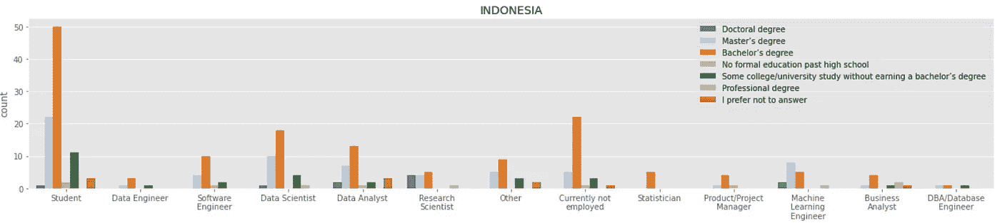

# 你应该如何学习数据科学

> 原文：<https://medium.com/analytics-vidhya/how-you-should-learn-data-science-b657977841f9?source=collection_archive---------20----------------------->

## 3 2020 年 Kaggle 数据科学和机器学习调查的结果，面向有抱负的印度尼西亚数据人才

在 [Unsplash](https://unsplash.com?utm_source=medium&utm_medium=referral) 上由 [Mufid Majnun](https://unsplash.com/@mufidpwt?utm_source=medium&utm_medium=referral) 拍摄的照片

# 动机

这一整年，由于疫情，我们被迫不停地适应。尤其是对我们中的一些人来说，他们不得不进行职业转换，甚至失业。学生们，尤其是印度尼西亚的学生，因为很多原因不习惯于网上学习，正努力以同样的速度学习。

这个疫情也告诉我们，在现实中，大多数政府决策过程都是基于**数据**。我们现在更加关注数据。

相比之下，负责提取见解并为决策过程做出贡献的人仍然是受欢迎的。

所以…

印尼是缺少数据科学家，还是总体来说数据人才**很多**？

除此之外，印度尼西亚数据科学家或机器学习工程师的状态到底如何？

对于有抱负的数据科学家来说，在(后)疫情环境的驱动下，他们应该如何学习数据科学？

通过探索 [*2020 Kaggle 机器学习&数据科学调查*](https://www.kaggle.com/c/kaggle-survey-2020/data) ，我们将试图揭开那些问题的答案。

# 调查一瞥

首先，我们来看一下调查数据。

*   该调查在 10 月份持续了 3.5 周。在清理数据之后，它由超过 39 个问题的 20，036 个回答组成。
*   问题由**选择题**和**选择题**组成。
*   经验最少的受访者比经验最多的受访者被问的问题更少。
*   如果只有回答者符合某些标准，则会提出一些问题。
*   因此，从本质上来说，有许多缺失的价值。

印度尼西亚在哪里？

印度尼西亚排在第 15 位，受访者不到 500 人。印度位居榜首，比印尼高出 10 倍。往好的方面看，我们是唯一一个对 Kaggle 调查贡献前 15 名的东南亚国家。

高级学位，像硕士和博士，都在前 3 名

大多数被调查者都有较高的学位。准确地说，超过 50%的受访者拥有学士和硕士学位。这是否意味着我们需要读硕士才能成为数据科学家？我们会看到的。

Python(仍然)被推荐

到目前为止，Python 是最推荐有抱负的数据科学家首先学习的编程语言。

# 限制

> 在所有 20，036 名受访者中，除去不相关的受访者(只回答前 3 个问题的人)，我们只得到 280 名居住在印度尼西亚的受访者

作为比较，我们决定创建 3 个子组，分别是**印度尼西亚**、**东南亚**和**全球**。作为参考，东南亚和全球分别有 498 名和 18791 名受访者。

图片来自[维基百科](https://en.wikipedia.org/wiki/Southeast_Asia)

> 我们发现在数据集中有 9 个国家属于东南亚亚组，不包括印度尼西亚，它们是文莱、柬埔寨、老挝、马来西亚、菲律宾、缅甸、新加坡、泰国、东帝汶和越南。

# 印度尼西亚的数据人才

我们称**数据人才**为在日常工作中处理数据的任何人，或正在学习并希望从事在很大程度上依赖数据的工作的任何人，例如数据工程师、数据分析师或调查数据中存在的任何头衔。

为了了解印度尼西亚数据人才的状况，我们考察了他们的职称和教育背景。

我的第一个期望是`Data Scientist`是调查中选出的最受欢迎的角色(嗯，这是 Kaggle 的调查)。但是，正如我们所看到的，`Student`是最受欢迎的角色。事实上，它是所有子群中被选择最多的角色。

> 这表明许多受访者正处于学习过程中。

这三个小组之间的另一个相似的特征是，选择的最后三个角色是`Data Engineer`、`Statistician`和`DBA/Database Engineer`。

与印度尼西亚和全球的受访者相比，其他东南亚国家的受访者似乎更像是非专业的有抱负的数据科学家。`Data Scientist`在印度尼西亚和全球排名前 5。它甚至是印尼第二大热门职位。

考虑专业或非专业受访者计划在上述未来 2 年内获得的正式教育背景。

虽然`Master's Degree`是所有受访者中受教育程度最高的，但这个案例与印度尼西亚不同。大多数印尼受访者的背景是`Bachelor's Degree`。一个偏差是`Machine Learning Engineer`，它的大部分背景是`Master's Degree`。

如果我们比较全球的状况，`Master's Degree`是最常见的教育背景。事实上，`Research Scientist`要求更高的学位，博士或硕士，而在印度尼西亚，学士、硕士和博士之间只有细微的差别。虽然与全球相比，这还不算多。

# 最常用的数据科学工具和平台

有许多工具、库或平台可以帮助进行数据科学项目。大部分是开源的，有些是付费的。

全红色条形图表示这是一个多项选择题，彩色条形图表示多项选择题

当然，Python 是印度尼西亚和其他两个子群体经常使用的主要编程语言，与 SQL 和 r 一起(可能是并行的)，这产生了最常用的 IDE，仍然属于 Jupyter 家族(Lab，Notebook 等)。).

> 有趣的是，在印度尼西亚，Julia 根本没有被用于学习或数据科学项目。而在其他海洋国家和全球范围内，一些受访者已经尝试使用朱莉娅。

而对于托管笔记本，Colab 和 Kaggle 笔记本分别占据了第一和第二的位置。在我的情况下，我开始使用 [Deepnote](https://deepnote.com/) ，我的一些笔记本项目被变成了使用 Binder 的交互式笔记本。但是，与其他小组相比，似乎其他受访者并不使用它。

面向其他东南亚国家(左)和全球(右)的托管笔记本电脑产品

在库方面，Matplotlib 和 Seaborn 的组合是使用最多的可视化库。同样的故事也适用于机器学习库，其中 Scikit-learn、TensorFlow、Keras 和 PyTorch 按降序排列。

让我惊讶的是*本地开发环境*，像 JupyterLab，RStudio 等。，是其他 2 个小组使用的主要工具，而印度尼西亚的大多数受访者仍然使用 Excel 或 Google Sheets 等基本软件作为他们分析数据的主要工具。

为其他东南亚国家(左)和全球(右)分析数据的主要工具

# 有抱负的印度尼西亚数据科学家应该如何学习

对于一个有抱负的数据科学家来说，尤其是那些居住在印度尼西亚的人，非常推荐学习 Python 作为你的第一次编程接触。或者如果没有，至少你应该先把重点放在 Python 上。

线性或逻辑回归等基本方法是最常用的算法。因为它为更复杂的模型构建了一个重要的基础，所以您可能希望首先开始消化这些基础知识。

> 在所有小组中，仍有少数受访者定期使用`evolutionary approaches`。对进化方法的极大尊重！

在计算机视觉领域，图像分类和目标检测等下游任务可能会成为专业人员或研究科学家的例行公事。因此，处理这类任务的方法是最常用的三种方法之一，还有其他通用视觉工具，如 PIL、cv2、skimage 等。

同时，在 NLP 领域，像 word2vec 或 fastText 这样的单词嵌入是使用最多的 NLP 方法之一。这是因为需要单词嵌入/向量来应用其他高级方法，如编码器-解码器模型或变换器语言模型。

东南亚国家(左)和全球(右)的核心活动

现在，如果我们观察上述关于 SEA 国家和全球工作中核心活动的可视化，他们在工作中有相同程度的紧迫性。正如我们所见，**分析和理解数据以影响产品和商业决策**成为一件常规但最重要的事情。

虽然在印尼，分析数据以影响产品仍然是最受欢迎的核心活动，但**数据基础设施**仍然是第二个必须要做的活动。只有这样，他们才专注于**原型**、**部署模型**，然后**研究**。即使是改进现有模型的**迭代**与其他 2 个子群相比也是工作中最低的公民。

# 关键要点

*   与全球拥有硕士学位的数据专业人员相比，印度尼西亚的大多数数据专业人员都是学士学位。不过，我们不能说这是否是一种缺失。
*   到目前为止，Python 仍然是数据科学中不可替代的编程语言。
*   像 Microsoft Excel 或 Google Sheets 这样的传统软件是分析和探索数据的主要统计工具。而在全球范围内，像 JupyterLab 或 RStudio 这样的本地开发环境是主要工具，在其他 SEA 国家也是如此(传统软件几乎相同)
*   像线性或逻辑回归这样重要的基础方法仍然值得首先学习。除了它是基础的，它们仍然被用作第一个模型迭代，或者它仅仅是使用最低成本和良好性能的正确模型。
*   尽管 Coursera 是其他两个子群体中最受欢迎的 MOOC，但印度尼西亚的受访者大多使用 Kaggle Learn 课程来学习数据科学。
*   在印度尼西亚，数据管道可能仍然是一个问题，因为大多数受访者将其视为仅次于分析和理解数据的第二重要工作。
*   印度尼西亚的数据人才可能仍处于发展阶段，他们试图连接所有重要的端到端数据管道，同时他们还学习应用有趣的机器学习模型。

*所有生成可视化的代码都可以在* [*我的 GitHub*](https://github.com/syahrulhamdani/how-you-should-learn-data-science/tree/main) *的笔记本中获得。*