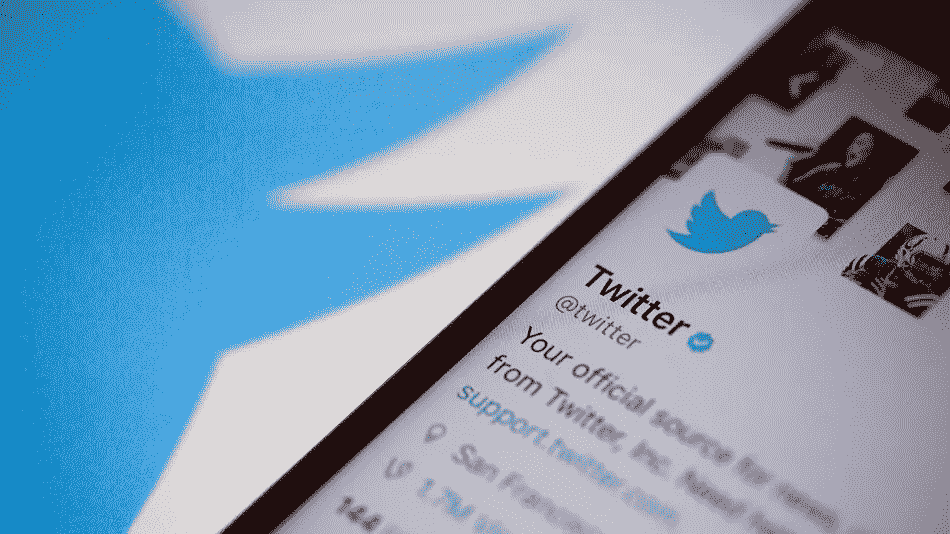

# 2021 过得怎么样？推特情感分析(NLP)

> 原文：<https://medium.com/analytics-vidhya/hows-2021-going-twitter-sentiment-analysis-nlp-e62e4e8f3767?source=collection_archive---------19----------------------->

NLP 数据科学项目，旨在了解人们对 2021 年的看法。

在 2020 年变成了一场灾难之后，我们都满怀希望地期待着 2021 年。我决定进行一次 Twitter 情绪分析，看看新年是否对我们有利。几个小时之内，我就能收集到 37621 条推文，使用以下短语作为搜索查询: