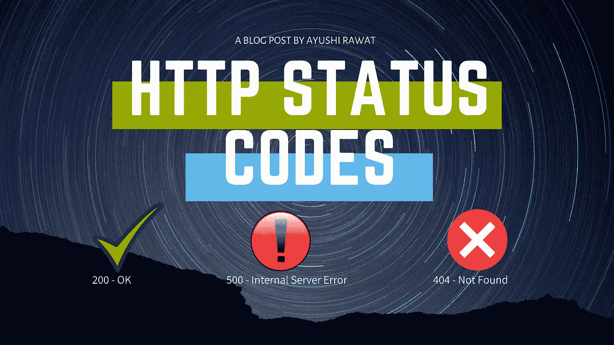

# 您必须知道的 HTTP 状态代码

> 原文：<https://medium.com/analytics-vidhya/http-status-codes-that-you-must-know-818cc9a62e9f?source=collection_archive---------10----------------------->

读者你好！

每当客户端向服务器发送请求时，响应总是包含一个状态代码。您可能不会总是看到它，但它会在每次客户端与服务器交互时返回。嗯，即使你不是程序员，你也会知道 404 未找到错误。

在这篇博文中，我们将讨论所有关于 HTTP 及其响应状态代码的内容。每当你遇到一张小抄，就把它当作一张小抄，供你参考。

# 这个博客将会涵盖什么

```
1\. What is HTTP?
2\. What is Status code?
3\. 1XX - Informational codes
4\. 2XX - Success codes
5\. 3XX - Redirection codes
6\. 4XX - Client error codes 
7\. 5XX - Server error codes
```

*我们开始吧！*

# 什么是 HTTP？

HTTP 代表超文本传输协议。根据维基百科的定义:

> 超文本传输协议是分布式、协作式超媒体信息系统的应用层协议。

HTTP 是一种客户端-服务器协议，是网络上任何数据交换的基础。客户端和服务器之间的每次交互都称为一条消息。HTTP 消息是请求或响应。客户端设备向服务器提交 HTTP 请求，服务器通过向客户端发回 HTTP 响应进行回复。

# 什么是状态代码？

对于每个客户端请求，服务器都会用一个代码来响应，这个代码有助于传达请求的状态。这是一种快速检查请求是否成功的方法，而不需要对响应体进行投资。

这些代码由三个数字组成，表示 web 元素的状态。状态代码基本上分为五个标准组，可以通过代码的第一个数字来识别。它们如下:

1.  **1XX —信息代码**
2.  **2XX —成功代码**
3.  **3XX —重定向代码**
4.  **4XX —客户端错误代码**
5.  **5XX —服务器错误代码**

让我们简要地看一下每一组，并讨论最常见的状态代码。



# 1XX —信息响应

信息性响应表明请求已被接收和理解。它是在请求处理继续进行期间临时发布的。

**100 —继续:**服务器已经收到请求头，客户端应该继续发送请求体。它表明客户端请求是好的并且正在处理。

**101 —切换协议:**请求者请求服务器切换协议，服务器同意切换。基本上，请求可能涉及文件操作，需要很长时间来完成请求。

**102 —处理:**此代码表示服务器已经收到请求并正在处理，但是还没有响应。

**103 —早期提示:**用于在最终 HTTP 消息之前返回一些响应头。

# 2XX —成功

此类状态代码表示客户端请求的操作已被接收、理解和接受。

**200 —正常:**成功 HTTP 请求的标准响应。一切正常，请求的资源已经通过消息体返回。

**201 —已创建:**请求已被满足，导致新资源的创建，并且服务器已确认它。

**202 —已接受:**该代码表示服务器已经收到并正在处理请求，但是还没有响应。

**204 —无内容:**服务器成功处理了请求，没有返回任何内容。通常，PUT 方法用于 204 响应。

# 3XX —重定向

这组状态码表示客户端必须采取额外的操作来完成请求。

**301 —永久移动:**这表示该 URL 已被永久移动。这用于通知浏览器所请求的文件已被移动，并可用于从不再存在的页面重定向。

**305 —使用代理:**请求的资源只能通过代理获得，代理的地址在响应中提供。

**307 —临时重定向:**在这种情况下，响应代码指示所请求的资源已经被临时移动到另一个 URI。但是，将来的请求仍应使用原始的 URI。

# 4XX —客户端错误

这类状态代码适用于错误似乎是由客户端引起的情况。

**400 —错误请求:**由于错误的语法导致错误，服务器无法或不会处理请求。

**401 —未授权:**响应类似于 *403 禁止*，但专门用于需要认证但认证失败或尚未提供认证的情况。请求的文件可以是受保护的文件。

403 —禁止的:请求包含有效数据，并且被服务器理解，但是服务器拒绝操作。服务器可能没有权限与客户端共享该文件。

**404 —找不到:**请求的资源找不到或不存在，但将来可能可用。

**405-不允许的方法:**请求的资源不支持请求方法；例如，对只读资源的 PUT 请求。

**414 URI 太长:**提供的 URI 太长，服务器无法处理，因为太多数据被编码为 GET 请求的查询字符串。

**429 太多请求:**用户在给定时间内发送了太多请求，有助于提高安全性。

# 5XX —服务器错误

当客户端提出有效请求时，您可能会遇到服务器错误，服务器无法满足该请求。

**500 —内部服务器错误:**遇到与任何其他类错误都不匹配的意外情况时显示的错误消息。

**501 —未实现:**服务器要么不识别请求方法，要么缺乏满足请求的能力。

**502 —错误的网关:**服务器充当网关，在发出请求时收到来自服务器的无效响应。

**503 —服务不可用:**服务器无法处理该请求，因为它超载或停机维护。

这就是这篇文章的全部内容，到此为止！我希望这篇文章对你有用。谢谢你的阅读，如果你已经到目前为止，请喜欢这篇文章，它会鼓励我写更多这样的文章。请分享您的宝贵建议，感谢您的真诚反馈！

我创建关于职业、博客、编程和生产力的内容，如果你对此感兴趣，请与你的朋友和关系人分享这篇文章。你也可以订阅我的时事通讯，在我每次写东西的时候得到更新！

我强烈推荐你去看看 YouTube 上的视频，别忘了订阅我的频道。我很乐意在推特|[LinkedIn](https://www.linkedin.com/in/ayushi7rawat/)与你联系。

你绝对应该看看我的其他博客:

*   [Python 3.9:你需要知道的一切](https://ayushirawat.com/python-39-all-you-need-to-know)
*   [GitHub CLI 1.0:你需要知道的一切](https://ayushirawat.com/github-cli-10-all-you-need-to-know)
*   [如何制作自己的谷歌 Chrome 扩展](https://ayushirawat.com/how-to-make-your-own-google-chrome-extension-1)
*   [从 Python 运行 Javascript】](https://ayushirawat.com/run-javascript-from-python)
*   [使用 Python 自动化 WhatsApp](https://ayushirawat.com/automate-whatsapp-using-python)
*   [使用 Python 自动提供 Cowin 疫苗槽](https://ayushirawat.com/automate-cowin-vaccine-slots-availablity-using-python)
*   [什么是竞争性编程](https://ayushirawat.com/what-is-competitive-programming-or-beginners-guide)

# 资源:

*   [en.wikipedia.org/wiki/Hypertext_Transfer_Pr..](https://en.wikipedia.org/wiki/Hypertext_Transfer_Protocol)
*   en.wikipedia.org/wiki/List_of_HTTP_status_c..

在我的下一篇博客文章中再见，保重！！