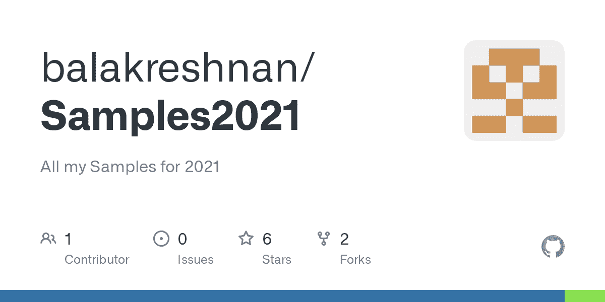

# Azure 机器学习中的拥抱脸变形金刚

> 原文：<https://medium.com/analytics-vidhya/huggingface-transformers-in-azure-machine-learning-8fa2664181d?source=collection_archive---------1----------------------->



# 如何使用拥抱脸模型

# 先决条件

*   Azure 帐户
*   Azure 存储
*   Azure 机器学习服务
*   Github 帐户和存储库
*   Azure 服务主帐户
*   向服务主要贡献者提供对机器学习资源的访问
*   Azure Keyvault 存储秘密
*   用服务主体机密更新密钥库
*   这将自动化训练代码并注册模型

# 步伐

*   登录 ml.azure.com
*   启动您计算实例
*   去笔记本开始写代码
*   请注意，如果需要，请升级您的 aml sdk

# 装置

```
pip install transformerspip install transformers[torch]
```

# 密码

*   测试情感模型

```
from transformers import pipeline; 
print(pipeline('sentiment-analysis')('we love you'))
```

*   让我们试试伯特模型

```
from transformers import BertTokenizer, FlaxBertForQuestionAnsweringtokenizer = BertTokenizer.from_pretrained('bert-base-uncased')
model = FlaxBertForQuestionAnswering.from_pretrained('bert-base-uncased')question, text = "Who was Jim Henson?", "Jim Henson was a nice puppet"
inputs = tokenizer(question, text, return_tensors='jax')outputs = model(**inputs)
start_scores = outputs.start_logits
end_scores = outputs.end_logits
```

*   现在运行 GPT2 模型

```
from transformers import GPTNeoForCausalLM, GPT2Tokenizer
model = GPTNeoForCausalLM.from_pretrained("EleutherAI/gpt-neo-1.3B")
tokenizer = GPT2Tokenizer.from_pretrained("EleutherAI/gpt-neo-1.3B")prompt = "In a shocking finding, scientists discovered a herd of unicorns living in a remote, " \
         "previously unexplored valley, in the Andes Mountains. Even more surprising to the " \
         "researchers was the fact that the unicorns spoke perfect English."input_ids = tokenizer(prompt, return_tensors="pt").input_idsgen_tokens = model.generate(input_ids, do_sample=True, temperature=0.9, max_length=100,)
gen_text = tokenizer.batch_decode(gen_tokens)[0]
```

*   另一个 GPT2

```
import tensorflow as tf
from transformers import GPT2Tokenizer, TFGPT2DoubleHeadsModeltokenizer = GPT2Tokenizer.from_pretrained('gpt2')
model = TFGPT2DoubleHeadsModel.from_pretrained('gpt2')# Add a [CLS] to the vocabulary (we should train it also!)
num_added_tokens = tokenizer.add_special_tokens({'cls_token': '[CLS]'})embedding_layer = model.resize_token_embeddings(len(tokenizer))  # Update the model embeddings with the new vocabulary sizechoices = ["Hello, my dog is cute [CLS]", "Hello, my cat is cute [CLS]"]
encoded_choices = [tokenizer.encode(s) for s in choices]
cls_token_location = [tokens.index(tokenizer.cls_token_id) for tokens in encoded_choices]input_ids = tf.constant(encoded_choices)[None, :]  # Batch size: 1, number of choices: 2
mc_token_ids = tf.constant([cls_token_location])  # Batch size: 1outputs = model(input_ids, mc_token_ids=mc_token_ids)
lm_prediction_scores, mc_prediction_scores = outputs[:2]
```

*   Prophnet 样本

```
from transformers import ProphetNetTokenizer, ProphetNetEncoder
import torchtokenizer = ProphetNetTokenizer.from_pretrained('microsoft/prophetnet-large-uncased')
model = ProphetNetEncoder.from_pretrained('patrickvonplaten/prophetnet-large-uncased-standalone')
inputs = tokenizer("Hello, my dog is cute", return_tensors="pt")
outputs = model(**inputs)last_hidden_states = outputs.last_hidden_state
```

*   开启 AI GPT 2

```
from transformers import GPT2Tokenizer
tokenizer = GPT2Tokenizer.from_pretrained("gpt2")
tokenizer("Hello world")['input_ids']
tokenizer(" Hello world")['input_ids']
```

*   飞马 xsum

```
from transformers import PegasusForConditionalGeneration, PegasusTokenizer
import torch
src_text = [
    """ PG&E stated it scheduled the blackouts in response to forecasts for high winds amid dry conditions. The aim is to reduce the risk of wildfires. Nearly 800 thousand customers were scheduled to be affected by the shutoffs which were expected to last through at least midday tomorrow."""
]model_name = 'google/pegasus-xsum'
device = 'cuda' if torch.cuda.is_available() else 'cpu'
tokenizer = PegasusTokenizer.from_pretrained(model_name)
model = PegasusForConditionalGeneration.from_pretrained(model_name).to(device)
batch = tokenizer(src_text, truncation=True, padding='longest', return_tensors="pt").to(device)
translated = model.generate(**batch)
tgt_text = tokenizer.batch_decode(translated, skip_special_tokens=True)
assert tgt_text[0] == "California's largest electricity provider has turned off power to hundreds of thousands of customers."
```

*   以后还会有更多

*最初发表于*[*【https://github.com】*](https://github.com/balakreshnan/Samples2021/blob/main/AzureML/hugginface1.md)*。*