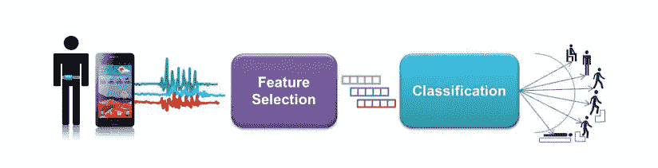
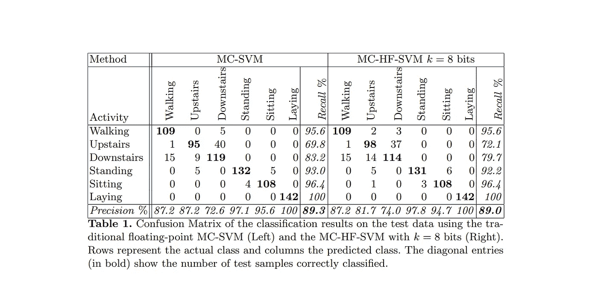
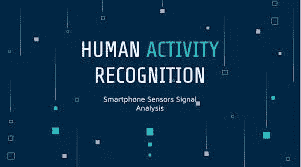

# 使用多类硬件友好的 SVM 在智能手机上识别人体活动(第一部分)

> 原文：<https://medium.com/analytics-vidhya/human-activity-recognition-on-smartphones-using-a-multiclass-hardware-friendly-svm-part-1-7aec0d266347?source=collection_archive---------16----------------------->

娜塔莎·康奈尔在 [Unsplash](https://unsplash.com?utm_source=medium&utm_medium=referral) 上的照片

本博客分为两个部分，在这一部分中，我们将尝试使用一篇多类硬件友好的 SVM 研究论文来逐一总结来自 [***智能手机上的人体活动识别的所有概念。在第二篇博客中，我们将尝试基于这种研究论文方法来解决人类活动识别问题。***](https://upcommons.upc.edu/bitstream/handle/2117/101769/IWAAL2012.pdf;jsessionid=644F1FF264A1818A75E49876CE24150C?sequence=1)

> 链接到研究论文👉 [***点击这里***](https://upcommons.upc.edu/bitstream/handle/2117/101769/IWAAL2012.pdf;jsessionid=644F1FF264A1818A75E49876CE24150C?sequence=1)

# 摘要

为了获得人体活动的读数，传感器被连接到人体(受试者)上。智能手机是惯性传感器，但它们在能量和计算能力方面是有限的，所以大卫·安吉塔和他的团队提出了一种新的硬件友好的多类分类方法。该方法采用标准 SVM，并利用定点算法来降低计算成本。它在保持类似精度的同时，在计算成本方面给出了显著的改进。

# 摘要

先前用于识别的 ML 方法包括朴素贝叶斯、支持向量机、基于阈值的和马尔可夫链。

为了理解多类硬件友好的 SVM 概念，我们首先要理解什么是硬件友好的 SVM (HF-SVM)？ 和 W ***帽子是多类？***

1.  **硬件友好的 SVM (HF-SVM)** 概念首先由 Angita 等人提出。该方法在 SVM 分类器的前馈阶段利用定点运算，以便允许在硬件有限的设备中使用该算法。
2.  在**多类**中，他们选择了 [***一对一(OVA)***](https://towardsdatascience.com/multi-class-classification-one-vs-all-one-vs-one-94daed32a87b) 方法，因为它的准确性可与其他分类方法相媲美，并且与例如 [***一对一(OVO)***](https://towardsdatascience.com/multi-class-classification-one-vs-all-one-vs-one-94daed32a87b) 方法相比，它的学习模型使用更少的内存。

活动识别流程管道(来源——论文截图)

# 实验结果

为了评估算法的性能，使用从受试者处收集的 AR 数据集进行了一组实验。结果如下图所示，

实验表明，对于该数据集，k = 6 比特足以实现与使用 64 比特浮点运算的 MC-SVM 方法相当的性能。

对于 k = 8，MC-SVM 和 MC-HF-SVM 之间的混淆矩阵的结果如下:

# 结论

MC-HF-SVM 方法是一种有吸引力的方法，可用于医疗保健应用的环境智能系统，如智能手机上的活动监控。

如果你想让我写任何研究论文的摘要，请告诉我[(kadamrahulj0909@gmail.com)](http://kadamrahulj0909@gmail.com)