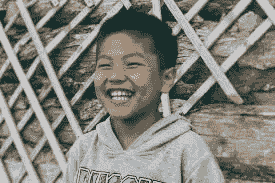
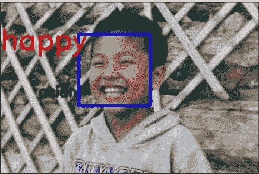
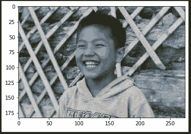
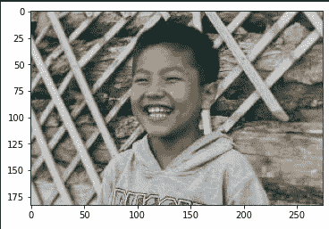
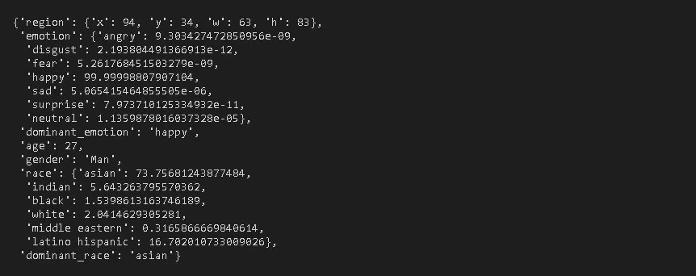
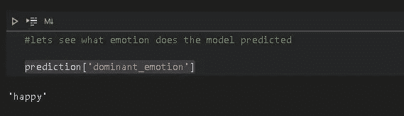
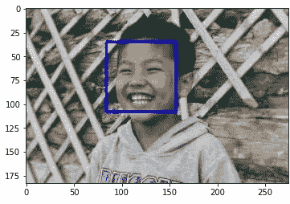
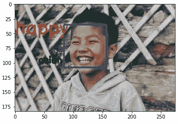

# 用 python 实现人脸、情感和种族检测

> 原文：<https://medium.com/analytics-vidhya/human-face-emotion-and-race-detection-with-python-86ca573e0c45?source=collection_archive---------0----------------------->

## 一个迷你 OpenCV 机器学习项目。

我们使用 OpenCV、deepface 库和 Haar cascode _ frontal face _ default . XML 文件来检测图像中人的人脸、面部情绪和种族。

检测前

检测后

> *从*[*【https://unsplash.com/photos/vtwjyEelY08】*下载此图片](https://unsplash.com/photos/vtwjyEelY08)

在开始之前，我假设您了解 python 基础知识，并且已经安装了 python

其他需要安装的设备有:

> *Opencv —使用<pip install Opencv-python>*安装
> 
> *deepface —使用< pip 安装 deepface >* 进行安装
> 
> *matplotlib—使用< pip 安装 matplotlib>进行安装*
> 
> *从*[https://raw . githubusercontent . com/opencv/opencv/master/data/haarcascades/haarcascade _ frontalface _ default . XML](https://raw.githubusercontent.com/opencv/opencv/master/data/haarcascades/haarcascade_frontalface_default.xml)*下载 haarcascade _ frontalface _ default . XML，并将其保存在与您的项目相同的文件夹中。*

## Haar cascode _ frontal face _ default . XML 文件是什么？

这是一个预先训练好的文件，用于检测人脸并给出一些点，这些点用于在人脸上绘制矩形、正方形或任何形状。

现在让我们进入编码部分(我在 jupyter 笔记本上做这个)。

首先，让我们导入所需的库并加载 happy_boy.jpg(我们之前下载的图像),并显示该图像。

输出:

每次当我们显示图像时，它将在 BGR，在显示之前，我们需要将它转换成彩色照片，以显示它的颜色。为此，我们使用 cv2 中的 cvtColor()函数。

输出:

# 使用 Deepface 预测图片中的人/孩子的情绪和种族

导入 DeepFace，分析我们的 color_img。

它将分析图像，并将检测到的情绪和比赛保存到“预测”变量中。

让我们看看它预测了什么

输出:

在输出中，预测值是 dominant_emotion 和 dominant_race。剩下所有用来预测情绪和种族的点。我们必须只看到主导情绪和主导种族，这是我们的预测。

我们可以像访问任何其他字典数据类型一样访问 dominant_emotion 和 dominant_race 的键值。

所以 DeepFace.analyze()预测了孩子的情绪— *快乐*和种族— *亚洲人。*

# 检测人脸

使用 OpenCV 检测人脸非常简单。

我们只需要*Haar cascade _ frontal face _ default . XML*文件和 OpenCV 库来检测图像中的人脸。这是代码。

输出:

# 聚在一起

正如你所看到的，我们检测了图像中孩子的情绪、种族和面部，现在是最后一部分，把所有的都整合在一起。这意味着现在我们要在图像上显示情感和种族。

输出:

如果你不知道/不理解我们在 cv.putText()中写的所有东西的功能，这里的语法如下

> *cv.putText(img，'*我们要放在*上的文字，'*我们要放文字*的位置，字体，文字大小，颜色，文字粗细，文字纹理)*

这就是我们如何发现一张脸，人类情感和种族。

现在去为其他图像和你的图像也尝试这样做。

我们也可以使用网络摄像头或前置摄像头，但它非常慢。您可以访问该代码的存储库(下面给出了链接)(文件名:deep_face.py)。

如果你想看这个项目，请访问这个链接[https://github . com/Raj 26 Kumar/human _ emotion _ race _ detection/blob/main/face _ emotion . ipynb](https://github.com/raj26kumar/human_emotion_race_detection/blob/main/face_emotion.ipynb)

感谢阅读。