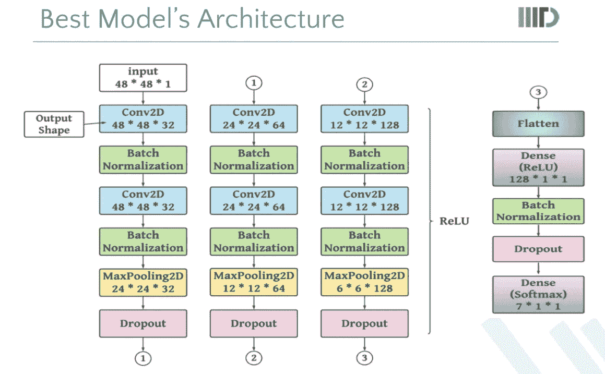
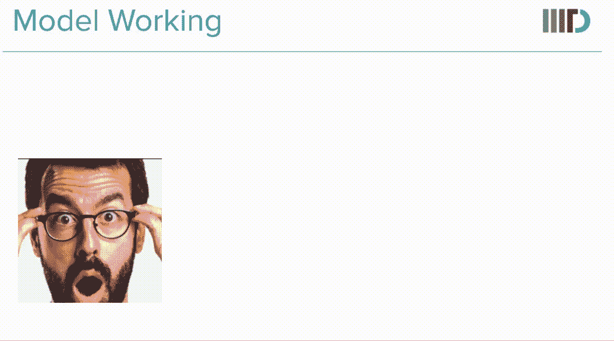
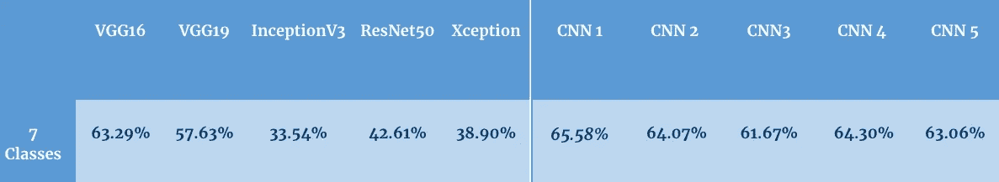
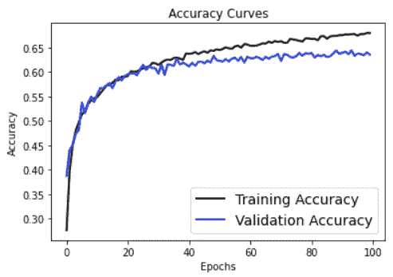
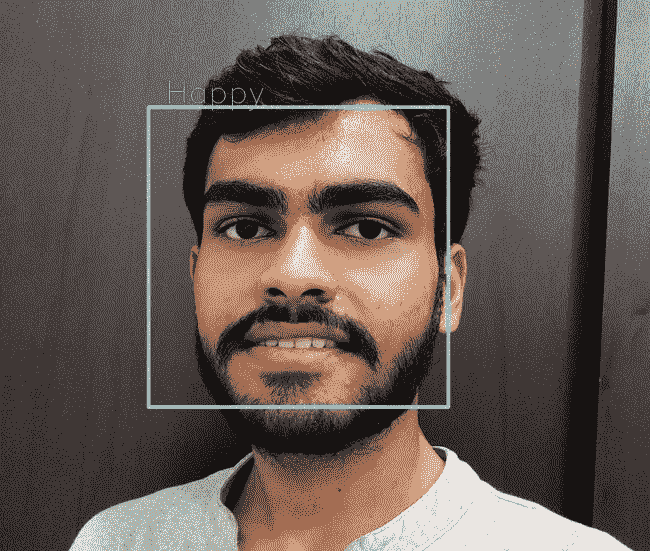

# 人脸情感识别系统

> 原文：<https://medium.com/analytics-vidhya/human-face-emotion-recognition-system-460436ee2393?source=collection_archive---------2----------------------->

> 今天我们将讨论**从一个人的图像中识别情感**。我们要用的数据集，取自 [kaggle](https://www.kaggle.com/) ，命名为**面部表情识别** ( [FER2013](https://www.kaggle.com/msambare/fer2013) )。这是一个非常流行的情感识别数据集，包含七种不同情感类别的图像。

**动机:**情绪在识别一个人的情绪中起着至关重要的作用。一般有六种原始情绪:快乐、悲伤、愤怒、恐惧、惊讶、厌恶、蔑视。可以看出，研究工作集中在四种主要情绪上，即快乐、悲伤、愤怒和中立。此外，识别情绪在摄像头监控捕捉嫌疑人的过程中发挥着重要作用；例如，在害怕的人的情况下，发出警报的系统会有所帮助。情感识别系统可以用作各种应用的子模块，如推荐音乐和各种摄像机监控系统。

> **数据预处理**

至于识别情绪，模型更容易预测图像是否倾斜或翻转。所有这些都在 Kaggle 提供的数据集中处理。我们所需要做的就是，下载数据集并将其存储在 shape **(样本数* 48 * 48 * 1)的 NumPy 数组中。**所有图像都是形状(48 * 48 * 1)。为了方便起见，我们将它存储在数组中，或者我们也可以使用来自 *keras.preprocessing.image，*的 ImageDataGenerator 类将它保存在文件夹中进行数据扩充，这完全由您决定。

> **模型架构&工作**

在应用各种 CNN(卷积神经网络)架构之后，以下模型架构给出了良好的准确性。同样的架构进一步采取了 ***四级分类并集成了五级情感分类的模型。***

CNN 模型架构

下面的 GIF 展示了 CNN 模型的工作原理，使用 ***OpenCV*** 模块将原始图像转换成 48*48*1 的形状。之后，CNN 模型将此图像作为输入，并使用 ***Conv2D、BatchNormalization、MaxPooling2D、dropool***层应用所有 3 个块。每个块只从图像中提取重要的特征，池层通过提取重要的(最大)特征将图像的大小减少一半(通过稍微模糊的图像和缩小的大小来显示，只是为了更好的可视化)。

> **结果&评估**

7***——类别(愤怒、高兴、悲伤、中性、惊讶、恐惧、厌恶)*** 分类采用上述模式:

不同型号和 CNN 变体的精确度

预定义的模型，如 VGG 模型、例外模型等。，太多了。这就是为什么 CNN 的被使用。下图显示了 CNN 架构的 ***精度与纪元图*** 。

CNN 模型的精度与时期图

***在 4 类(愤怒、悲伤、快乐、中性)*** 分类中，使用相同的 CNN 架构，准确率从 ***的 65.58%提高到*** 的 73.58%。

> **集成技术:**这种方法产生了很好的效果，首先为每个情感类别单独训练模型，然后将它们结合起来预测测试数据。发现对于 **5 类(快乐、悲伤、中性、愤怒、惊喜)情绪，**模型给出了 **75.3%** 的准确度，这明显优于最好的 CNN 模型对于 4 & 7 类情绪的准确度。虽然这种方法是使用相同的 CNN 架构，但这些 CNN 的组合，给出了不可思议的结果。

为了检查随机图像上的模型结果，我们首先必须构建一个模块，从原始图像中获取人脸图像。这个任务是使用 OpenCV 的 ***cv2*** 模块 ***完成的。*** 取图像后，模型预测人脸图像的情感。让我们来看一个我在自己的图像上尝试的输出。

该模型预测了上面这张图片的快乐情绪。

> **结论**

取得的结果是可喜的。该系统具有高精度和快速响应时间，这使得它适合于大多数实际目的。使用 OpenCV 模块提取人脸，然后检测情绪，使得系统对特定数据更加鲁棒。所提出的 CNN 架构在七类情感识别的情况下给出了 65.58%的准确度，在四级情感识别的情况下给出了 73.58%的准确度。使用集成方法，模型的精度大大提高，对五类分类给出了*75.3%***0.753 F1 分*** 。*

> *代码和数据集*

* [## FER-2013 年

### 从图像中学习面部表情

www.kaggle.com](https://www.kaggle.com/msambare/fer2013)  [## deepankarkansal/信息检索

### numpy(用于处理数组和数学计算的库，如线性代数、傅立叶变换等。)ast(库…

github.com](https://github.com/deepankarkansal/Information_Retrieval/tree/main/Endsem_Project) 

# 参考

1.  [项目报告](https://github.com/deepankarkansal/Information_Retrieval/blob/main/Endsem_Project/IR_Project_Report.pdf)(也包含音乐推荐系统，不在本文讨论范围之内)
2.  弗兰·科斯·乔莱。例外:具有深度可分卷积的深度学习。IEEE 计算机视觉和模式识别会议论文集，第 1251-1258 页，2017 年。
3.  Ananya Dhar 和 Bilal N. Shaikh Mohammad。使用面部特征提取和深度学习的音乐情感识别。SSRN 学术论文 ID 3560840，社会科学研究网络，纽约州罗彻斯特，2020 年 4 月。
4.  拉斐尔·卡布雷多·埃米尔·伊恩诉阿斯卡隆。基于情感的音乐推荐系统。基于歌词的音乐情绪识别，3:1–8，2015。
5.  Shlok Gilda、Husain Zafar、Chintan Soni 和 Kshitija Waghurdekar。集成面部情感识别和音乐情绪推荐的智能音乐播放器。2017 年无线通信、信号处理和网络国际会议(WiSPNET)，第 154–158 页。IEEE，2017。*