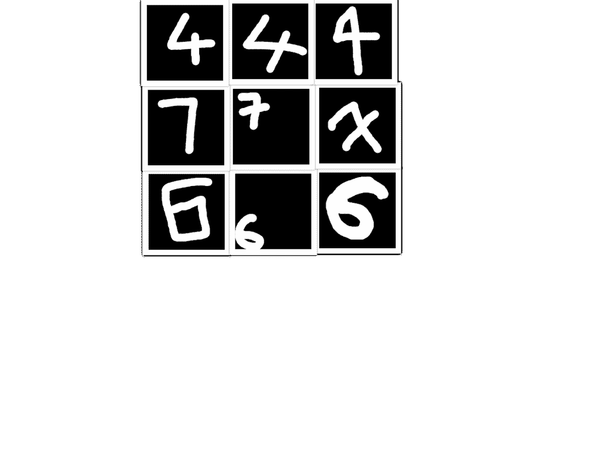

# 使用 MNIST 数据集的人工验证(带代码)

> 原文：<https://medium.com/analytics-vidhya/human-verification-using-mnist-dataset-with-code-dc3477c17909?source=collection_archive---------19----------------------->

# 介绍

在本文中，我们将使用多层神经网络对手写数字进行分类。我们将使用这种分类来构建人工验证系统，因为我们要求人工书写一个 3 位数的数字，检查书写是否正确，并验证用户输入的数字。因为他们有很多方法来写一些数字，他们可以写在盒子的任何地方，我们使用 open CV 来获得完美的大小图像，使用 ML 来预测数字，并使用 JavaScript 来验证数字。对于预测，我们使用一个 3 隐层神经网络。在 MNIST 数据集中，我们得到一个 28*28 大小的图像数据集，其中每个数据集在每个方向上都被 4 个像素包围。我们在 MNIST 数据集上取得了 97.23%的数字分类成功率。

[GitHub](https://github.com/srinivaskool/Human_Verification)

[*现场试玩*](https://srinivaskool.github.io/Human_Verification/)

# 数据分析和可视化

MNIST 数据由 70，000 张手写数字图像组成。我们将遵循从预处理到预测数字的步骤。我们将从理解计算机如何理解图像开始。

我们将图像转换成整数数组。我们可以用红、蓝、绿三个数字来表示图像的每一个像素。但是 MNIST 数据图像是灰度的，所以我们只有两个通道，白色和黑色。因此，如果数组元素值是 255，这意味着像素是白色的，而值 0 表示黑色。0 到 255 之间的其他值代表灰色。

图:带标签的 MNIST 数据集的前 16 位数字。

现在让我们看看 MNISTS 数据集中数字之间的分布。下面是分布的频率表和圆环图(70，000 张图片)。

当数据的范围是 0 到 1 而不是 0 到 255 时，机器学习得更好，因此对于归一化，我们使用最小-最大归一化，这种情况下导致每个数组元素除以 255。在日常生活中，我们可以用不同的方式书写一个数字，所以很难预测这个数字。我们需要将 60，000 幅图像的数据分成训练集、测试集和验证集。我用 50，000 张图像训练我们的模型，为了验证，我们使用 10，000 张图像和剩余的 10000 张图像进行测试。这里的验证样本帮助我们选择最佳模型和约束条件。

表格:表格显示了 70.000 个手写图像的 MNIST 数据集的分布

清理和预处理数据的主要部分已经由修改后的[国家标准与技术研究院](https://www.blogger.com/u/3/blog/post/edit/6845097395694165650/453712064123607061#)完成。图像的大小是 28*28，但数字将只有 20*20 大小，所以图像被放在中间，所有 4 个边上都有 4px 填充。让我们看看测试数据集中数字的分布。数字 9 出现的频率最高，这意味着在测试数据集中有很多手写的 9 位数字。

表:上表显示了测试集中数字的分布。

# 神经网络

这是一个带有输入和输出层的 3 隐层神经网络。这叫做多层感知器。我们可以在反向传播的帮助下计算每两个神经元之间的关联权重，以获得更好的结果。除了最后一层是 SoftMax，所有层都使用 Relu 作为激活函数，因为我们需要进行分类，所以我们希望在最后一步中获得概率，以确定最高概率作为预测数字。

图:我创建的多层层感知器的完整图。

我们没有使用 Keras 来实现分类，因为我们需要使用 tensorboard 来查看每个时期的损失/成本函数。从张量板上看到损失函数，我们可以得到学习率和几个历元的最佳值。

# 准确性分析

我们可以从不同颜色的描述表中看到，该表显示了不同模型的准确性和成本，训练集和验证集的学习率分别为 0.0001 和 0.001。

从上面的图中我们可以看到，在前 15 个时期精度增加了很多，然后我们可以看到精度几乎保持不变，直到第 50 个时期。所以我们用了 25 个纪元来训练这个模型。为了获得更高的精度，我们将 0.0001 作为学习率。当学习率为 0.001 时，精度从较高的点开始，并且总是高于学习率为 0.0001 时的精度。在两种学习率下，验证集的准确度总是低于训练集。这里没有过度拟合。

# 成本函数分析

我们可以从不同颜色的描述表中看到，该表显示了不同模型的准确性和成本，训练集和验证集的学习率分别为 0.0001 和 0.001。

图:该图显示了训练和验证集的学习率为 0.001，0.0001 的不同时期的成本函数。

从上图可以看出，当学习率为 0.001 时，成本函数的起点比学习率为 0 时低。0001.50 个纪元的成本也和 25 个纪元差不多。所以我们继续 25 个纪元，学习率为 0.001。验证集的成本总是高于训练集。从成本函数中，我们可以确定，随着我们在开始时高度增加时期，成本降低，但是在 15 个时期之后降低。总的来说，我们可以看到成本函数随着更多的时期而降低，而精确度随着时期的数量而增加。当学习率为 0.001 而不是 0.0001 时，我们可以看到精度的巨大提高和成本函数的巨大降低。下表给出了模型的最终约束条件。

表:模型考虑的所有值。

在对数据进行预处理时，像数字 2、5、9…这样的标签都将被转换为 one-hot-encoding，这意味着在该行中，只有数字的索引是 1，而所有其他的都是 0。为了包括来自外层的内层的输入，使用所有外层与它们和内层之间的权重的矩阵乘法。初始权重和偏差取自标准偏差为 0.01 的截断正态分布，这里我们使用偏差，因为它改变了激活函数。我们使用 Adam 优化器，对于损失函数，我使用 SoftMax 交叉熵函数。

# 数字分类的结果:-

下表显示了历元数的精度，我们可以看到，随着历元数的增加，精度会增加，但随着时间的推移，精度增加的差异会减小。

表:该表显示了 25 个历元的精度。

测试数据集的准确率为 0.9723 或 97.23%。

数字分类的混淆矩阵如下所示。

如果我们有真阳性(TP)、真阴性(TN)、假阳性(FP)、假阴性(FN)，那么计算不同的度量就很容易了。

表格:表格显示了真实的积极，真实的消极

为了计算不同的度量，如准确度、F 值和精确度，我们可以使用需要知道它们的公式。这是公式表，通过查看上表或混淆矩阵中的值来计算每个数字的不同度量。

例如，如果我们想计算数字 9 的 F1 分数，我们可以得到(2 * 0.987)/((2 * 0.987)+0.00289+0.090989)= 0.9546。同样，我们可以找到每个数字的精确度和 F1 分数。

# 我们对真实手写数字图像的模型预测(不是来自数据集)

下图分别显示了 4、7、6 的不同写法。该模型预测第一行中的每个数字为 4，第二行中的每个数字为 7，最后一行中的每个数字为 6。

