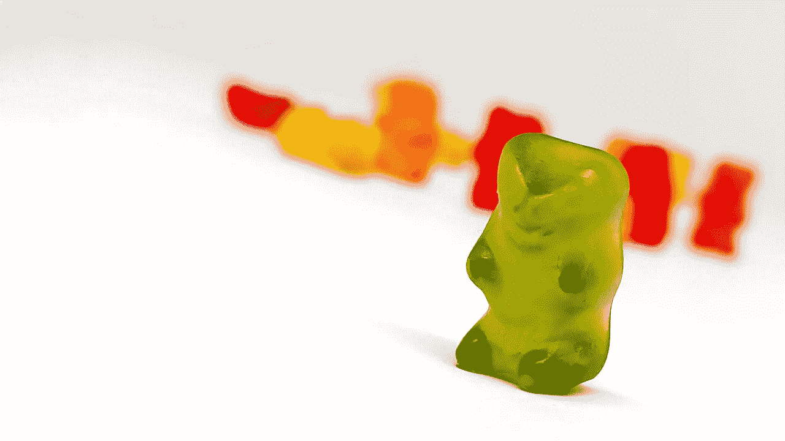

# 人类并不完美，但算法也不完美

> 原文：<https://medium.com/analytics-vidhya/humans-are-not-perfect-but-so-arent-algorithms-1527217d870e?source=collection_archive---------17----------------------->

## 了解以提高…

[摇滚猴子](https://unsplash.com/@rocknrollmonkey?utm_source=unsplash&utm_medium=referral&utm_content=creditCopyText)在 [Unsplash](https://unsplash.com/@rocknrollmonkey?utm_source=unsplash&utm_medium=referral&utm_content=creditCopyText) 上的照片

我的茶好了。我需要放一些音乐，这样就可以专注于写作。然而，经过几分钟的搜索，YouTube 算法似乎比我做得更好。是的…当我按下播放键时，我认出了我最喜欢的一首歌。

作为一个热情的自学者，我没有资格解决人工智能的伦理问题。虽然我有一些顾虑，但我更喜欢处理这个问题的技术方面。看到算法如何成为我们生活的一部分，我觉得很兴奋。当然，我以后会写的。但是现在，让我们关注一个特殊的例子。

## 面部识别

照片由 [Allef Vinicius](https://unsplash.com/@seteph?utm_source=unsplash&utm_medium=referral&utm_content=creditCopyText) 在 [Unsplash](https://unsplash.com/s/photos/eyes?utm_source=unsplash&utm_medium=referral&utm_content=creditCopyText) 上拍摄

过去几年见证了面部识别的兴起。过去看起来像科幻小说的东西现在在每部智能手机上都可以找到。像中国或美国这样的国家大规模使用这些技术。然而，我怀疑面部识别的发明者会想到 FaceApp 或 FaceSwap。

它需要不止一篇文章来详细解释它是如何工作的。但在大多数情况下，它依赖的是人工智能中叫做*机器学习*的部分。

> "机器学习是对通过经验自动改进的计算机算法的研究."
> 
> ***—机器学习，汤姆·米切尔，麦格劳·希尔，1997。***

我喜欢把这比作训练狗坐下。通过反复试验，人们奖励其成功，直到预期的结果出现。

考虑给一个算法输入大量的数据和信息。例如，一个人提供许多图片，并告诉当一个人包含脸。每次算法成功，都会得到“奖励”。当失败时，它会自动适应以产生更好的结果。这个迭代过程发生多次，直到预期的结果出现。

这种方法并不局限于面部检测，而是有许多应用。例如，一个人可以训练一个算法，用于对象检测、文本挖掘、设计优化、图像处理…

## 构建算法的诀窍？

照片由[丹金](https://unsplash.com/@danielcgold?utm_source=unsplash&utm_medium=referral&utm_content=creditCopyText)在 [Unsplash](https://unsplash.com/s/photos/recipe?utm_source=unsplash&utm_medium=referral&utm_content=creditCopyText) 上拍摄

取一些原料，遵循一些特定的步骤，再加上一点运气，你可能最终会得到一些可食用的东西。然而，这取决于厨师……就像算法一样，一份食谱接受输入，即原料，然后将它们转化为输出，即饭菜。

尽管其不可否认的教育品质，食谱类比缺乏理解关键算法概念所必需的抽象。与可能模棱两可的配方相反，算法是具体的。它们是一组指令，定义明确，适合在有限的空间和时间内解决特定的问题。

因此，要构建一个算法，必须定义它的目标。输入是什么？有什么约束吗？预期的结果是什么？

选择型号也是流程中的一个关键部分。俗话说，条条大路通罗马。然而，人们仍然不得不选择最好的……事实上，同一个问题往往有多种解决方案。这种选择对最终的性能和精度有很大的影响。

他们可能存在一个建立算法的方法。当然，人们总是可以利用模糊性。然而，我怀疑这是否有助于理解每一个问题的所有细节…

设计算法是一个迭代的过程。它包括许多尝试、错误和许多微调。

## 算法有偏差吗？

照片由[托马斯·戈德弗罗伊德](https://www.pexels.com/@thomas-godefroid-57768006?utm_content=attributionCopyText&utm_medium=referral&utm_source=pexels)从[派克斯](https://www.pexels.com/photo/bear-candies-gummy-7909186/?utm_content=attributionCopyText&utm_medium=referral&utm_source=pexels)拍摄

在我之前的文章中，我提到了模拟中的一些错误。

令人尴尬的失败甚至戏剧性的失败[都有可能发生。不幸的是，错误是任何算法所固有的。因此，了解它们对于预防它们是至关重要的。](https://www.seattletimes.com/opinion/king-county-government-must-turn-its-back-on-facial-recognition-technology/)

当我开始用 C 编写代码时，我遇到了一些最烦人的错误。那时候我还挺年轻的。当我注意到调试器无法检测到一些失败的原因时，我感到很惊讶。程序可能在没有任何警告或中断的情况下运行。尽管如此，它可能会有意想不到的结果。

电脑是愚蠢的。它做人们让它做的事，不多也不少。我的一位老师曾经说过，“错误通常出现在键盘前。”我通常不喜欢被称为错误。然而，他关于编程的观点是正确的……一个人可能交换两个变量，调用错误的函数，甚至忘记转换单位。但是，调试器不会检测到这些问题。

一个著名的例子发生在 1999 年，当时美国宇航局由于改装问题丢失了一艘宇宙飞船。1996 年，[一个愚蠢的溢出错误](https://hownot2code.com/2016/09/02/a-space-error-370-million-for-an-integer-overflow/)导致了第一枚阿丽亚娜 5 号火箭的毁灭和 3.7 亿美元的损失。总而言之，这也发生在最好的人身上。

其他错误是由于统计。例如，为了进行计算，通常需要统计总体的一个子集。这叫做抽样。根据样本推断总体假设总会导致错误。

一个人可以在 20 到 30 岁之间的所有男性中挑选 100 名受试者，并注意到其中 60%的人身高超过 1.7 米。得出所有男人都是如此的结论是一个粗心的预测。另一个样本可能显示了 50/50 的比例…

然而，人们可以通过增加样本量直到达到总体的样本量来减少抽样误差。此时，误差趋于零。但是，在某些情况下，这可能很困难，甚至是不可能的。

有很多类型的错误。有些是随机的，有些不是。但是，当它们变得系统化时，人们反而会谈论偏见。

我们人类是有偏见的。我们带着狭隘的眼镜看世界。我们试图用我们有限的知识去理解它。因此，不管是有意还是无意，我们都会做出选择。而且，在每一个选择中都有我们的感知。

人们可以希望算法会比我们做得更好。然而，由于开发商的决定，他们没有。有偏见的算法会对特定人群产生不公平的结果。

模型是基于设计者知识的假设。而且，如果这个模型有偏差，那么产生的算法也会有偏差。

例如，人们可以尝试模拟人类头骨在撞击过程中的行为。但是，这个系统是否应该被认为是各向同性的呢？回答这个问题就是做选择。其准确性将取决于结果的质量。

数据生成和采样的方式也很关键。而且，当一个人以不均匀概率对总体进行抽样时，可能会出现偏差。例如，一个被训练成只识别白人面孔的算法在呈现其他种族时会出错。

[偏差的原因是多方面的](https://news.utdallas.edu/science-technology/racial-bias-facial-recognition-2020/)。爱丽丝·奥图尔博士指出:

> “每个人都在寻找一个简单的解决方案，但事实上，我们概述了偏见可能发生的不同方式——它们没有一个是相互排斥的——这使这篇论文成为一篇警示文章。如果你试图修复一个算法，要意识到有多少不同的事情正在发生。”
> 
> ***—爱丽丝·奥图尔博士***

## 避免偏见

没有神奇的方法可以消除偏见。这是必然的。然而，人们需要减轻它们的影响。

从意识开始。承认偏见的潜在存在增加了避免可能导致偏见出现的常见错误的机会。

**数据是关键。**算法的输入需要提前仔细分析。人们必须利用资源和专业知识来检测偏差，并确保每个样本都代表总体。

**接受自己并非无所不知，倾听他人的意见**是更好的模型化的第一步。每个问题都是独特的，没有单一的解决方案可以避免偏见。

**继续测试。**在安全可控的环境下评估算法是一回事。这是另一个真实世界的数据。

避免偏见是一项复杂而耗时的任务。工作中经常要处理。然而，我相信这是值得努力的。我唯一的希望就是也能说服你。正如数学家、数据科学家和作家凯茜·奥尼尔所说:

> “我心中最重要的目标是说服人们停止盲目信任算法，并假设它们天生公平客观。”
> 
> ***—凯茜·奥尼尔***