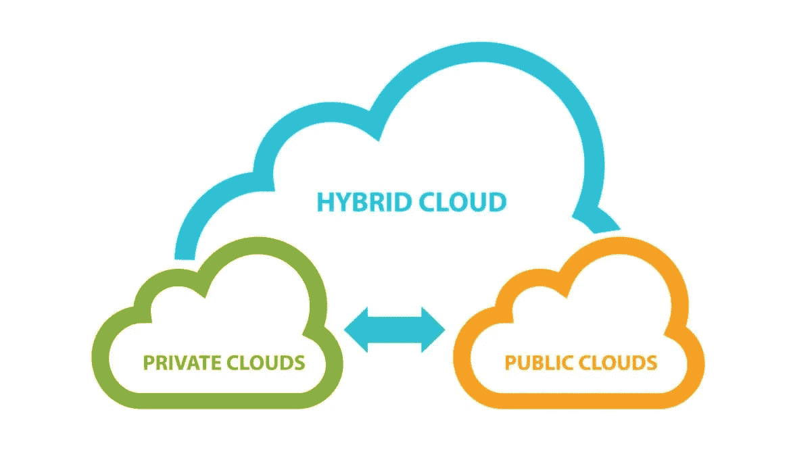
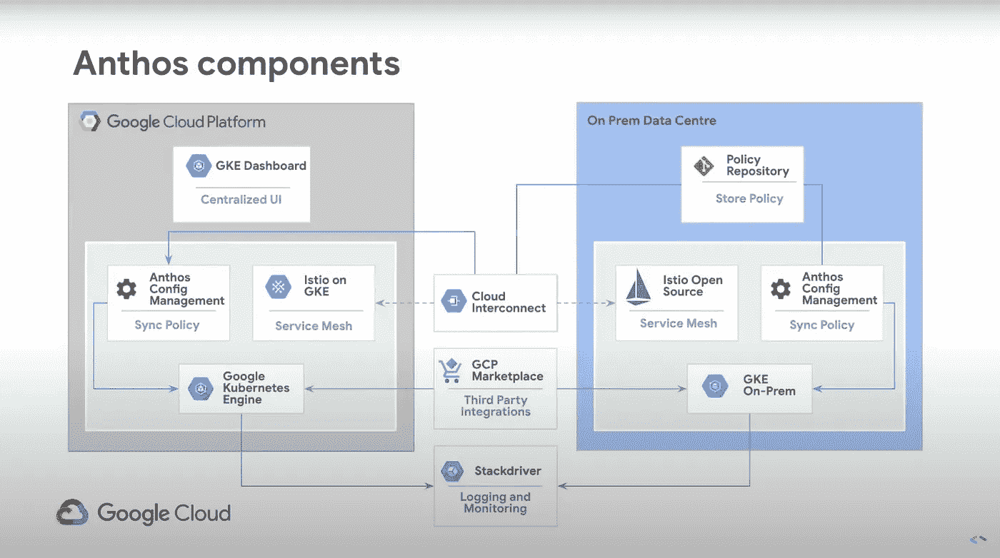
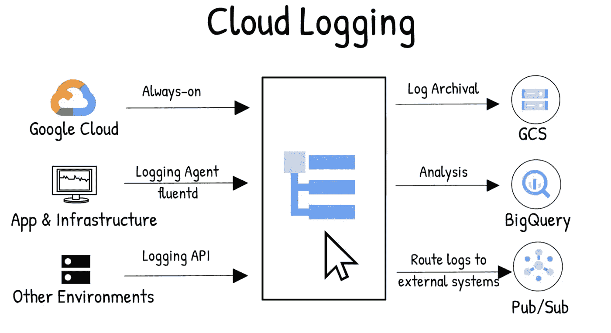
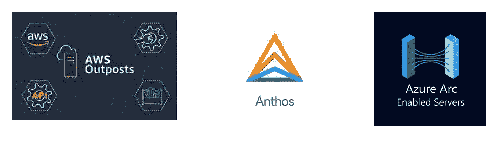

# 混合云+谷歌 Anthos

> 原文：<https://medium.com/analytics-vidhya/hybrid-cloud-google-anthos-22df451577ab?source=collection_archive---------11----------------------->

> 对于每周一次发送到你收件箱的类似内容，请在[bitsofcloud.substack.com](http://bitsofcloud.substack.com)关注我

虽然我倾向于认为战斗已经结束，云计算已经完全取代了替代模型，但企业工作流向云的过渡仍处于非常早期的阶段。据估计，到 2020 年，只有 20%的企业工作负载在云数据中心运行，其余大部分在内部部署中运行。虽然将工作负载转移到云的趋势正在加速，特别是借助新冠肺炎疫情创造的顺风，但到 2023 年，可能不超过 40%的工作负载将在云中运行。

如今，许多企业在称为混合云的架构中运行其应用程序。

> *混合云——有时也称为混合云——是一种将内部数据中心(也称为私有云)与公共云相结合的计算环境，允许数据和应用程序在它们之间共享。*

私有云是公司拥有的数据中心，只有他们自己的应用程序在上面运行，只有他们自己的数据被存储。公共云是由云提供商拥有和运营的数据中心，其中的资源可以由希望避免管理自己的硬件的用户租用。美国“三大”公共云提供商是亚马逊、微软和谷歌。

来源:[https://www . esds . co . in/blog/hybrid-cloud-orchestration/# s hash . ggxewr 6v . dpbs](https://www.esds.co.in/blog/hybrid-cloud-orchestration/#sthash.ggxeWR6V.dpbs)

# 为什么选择混合云？

云计算在灵活性和速度方面提供了超过私有云(即内部部署)部署的巨大优势，但鉴于企业 IT 的当前状态，内部部署仍然存在，甚至提供了超过云的一些优势，这有许多合理的原因。

内部数据中心仍然是大多数大公司 IT 架构的一部分的一个原因是将所有工作负载迁移到公共云所需的时间和投资。虽然初创公司和新公司可以从一开始就享受纯云计算的优势，但大多数更大、更成熟的公司早在过去 15 年的云革命之前就已经存在，因此已经在私有数据中心的基础上构建了自己的应用程序。将应用程序迁移到云中不仅需要立即的工程时间来重写应用程序的各个部分以在不同的环境中运行，还需要用公共云部署所需的一系列技能来重新培训整个部门。

其次，许多人认为，在巨大的工作负载下，与云计算相比，在内部运行应用程序实际上可以降低成本。这一点受到了广泛的争论，当云公司和本地基础设施提供商在争论他们所理解的世界状况时，很难找到公正的观点。但从短期来看，继续在本地运行已经部署在该环境中的应用程序无疑可以节省成本。Gartner 估计，将工作负载迁移到云中会使迁移第一年的 IT 成本增加 60%以上。

只要本地部署仍然比一次性将所有东西迁移到云中有一些好处，公司就需要帮助管理生活在两个完全不同的环境(也称为混合云)中的 IT 基础设施的复杂性。

# 介绍 Google Anthos

Anthos 是谷歌云平台(GCP)提供的一套产品，包括一套工具，公司可以使用这套工具来管理多个环境中的应用程序。Anthos 可以用来节省管理混合云部署的时间，因为它与本地数据中心集成，然后提供一组与用于管理 GCP 云环境的 API 相匹配的 API。

来源:https://www.youtube.com/watch?v=42RmVrM7B7E

上图摘自谷歌开发者倡导者 Ankur Kotwal 在 2019 年 GCP 会议上的一次演讲。当然，图中有很多东西需要解开，解释每个组件超出了本文的范围。然而，单个平台如何管理混合基础架构的一个有用示例是 *Stackdriver* 组件，它是一个用于应用程序监控和日志存储的工具。

*Stackdriver* (刚刚在 Q2 2020 年被更名为谷歌*云运营*包中的一个组件)最初是通过 2014 年收购一家同名公司与 GCP 整合的。日志管理是软件监控和可观察性的一个重要方面，并且经常带来惊人的复杂性。

来源:[https://www.youtube.com/watch?v=42RmVrM7B7E](https://www.youtube.com/watch?v=42RmVrM7B7E)

虽然上图并不是为了展示混合云环境中的日志管理，但是“其他环境”部分可以很容易地想象为一个或多个内部数据中心，部署了混合云的公司必须维护这些数据中心。实际上，软件开发和部署期间出现的任何问题都需要查看应用程序生成的日志来诊断问题。直观地说，在一个地方查看这些应用程序日志可以为 IT 团队节省工作时间。

Anthos 提升混合云团队速度的另一个例子是 *Anthos 配置管理，*如上面 GCP 和本地部署中的 Anthos 组件图所示。

来自 GCP 的网站:

> *借助 Anthos Config Management，您可以在所有基础设施上创建通用配置，包括自定义策略，并在内部和跨云应用。⁴*

应用程序配置是在应用程序启动时或运行时注入到应用程序中的值，它定义了应用程序逻辑操作的界限或变量。举一个虚构的例子，如果您正在构建一个照片共享应用程序，您可能会定义一个配置变量来限制用户每天允许上传的照片数量。在保持核心应用程序逻辑不变的情况下，您可以交换这个限制的各种值来改变数字本身。

Anthos 配置管理可帮助混合云团队管理公共云和其内部数据中心中的应用程序，方法是与 kubernetes(无论部署在何处)集成，并为团队提供一个单一的集中式位置，在该位置可以动态监控和更改 kubernetes 和其他配置。就像 Stackdriver 处理应用程序日志一样，Anthos 配置管理最终节省了时间，并使团队能够更快地移动。

# 谷歌 Anthos 的竞争对手

虽然上面的内容特别关注混合云部署(在公共云和私有云之间划分工作负载)，但 Google Anthos 也可以在多云部署上运行。多重云指的是跨多个公共云部署应用程序的实践(例如，同时部署到 GCP 和 AWS)。这样做有助于企业避免供应商锁定，或者过于依赖单一公司作为自己的云平台供应商。

启用多云意味着谷歌 Anthos 可以让客户更容易地在谷歌的竞争对手，即 AWS 和微软 Azure 的数据中心运行工作负载。这种关系产生了有趣的竞争定位，因为 GCP 试图与其他公共云很好地集成，同时也与他们直接竞争市场份额。

当然，AWS 和 Azure 有自己的解决方案，可以解决 Google Anthos 解决的同样的问题。AWS 的解决方案被称为 *AWS 前哨、*，微软的是 *Azure Arc* 。

Azure Arc 和 Google Anthos 采取了非常相似的方法。这两种解决方案都试图灵活地允许客户在任何云(公共或私有)中运行他们的工作负载，只要他们的应用程序是容器化的，并且数据中心与核心 GCP 或 Azure 软件集成。

Aws Outposts 采取了一种不同的方法，向客户所在地提供 Aws **硬件和软件**资源，以便在本地提供 AWS 体验和 AWS APIs。多年来，AWS 一直在宣传企业计算的公共云方法，因此它在 2018 年宣布推出前哨是一个惊喜。⁵

鉴于 Anthos 和 Arc 在选择硬件和数据中心类型方面提供了灵活性，我认为这些解决方案可能更好地服务于已经在自己的硬件上进行了大量投资的大型客户，而前哨可能更好地服务于工作负载较小、希望避免采购和管理新硬件的客户。

无论采取哪种方法，底线都是一样的。大型企业需要混合云部署，而这些部署给 IT 组织带来了复杂性。在未来几年，减少管理此类部署中的摩擦的解决方案将拥有越来越多的市场机会。

1.  [https://www . Gartner . com/smarterwithgartner/Gartner-预测云计算和边缘基础设施的未来/](https://www.gartner.com/smarterwithgartner/gartner-predicts-the-future-of-cloud-and-edge-infrastructure/)
2.  [https://azure . Microsoft . com/en-us/overview/what-is-hybrid-云计算/](https://azure.microsoft.com/en-us/overview/what-is-hybrid-cloud-computing/)
3.  [https://blogs . Gartner . com/Marco-meinardi/2018/11/30/public-cloud-beat-running-your-data-center/](https://blogs.gartner.com/marco-meinardi/2018/11/30/public-cloud-cheaper-than-running-your-data-center/)
4.  [https://cloud.google.com/anthos/config-management](https://cloud.google.com/anthos/config-management)
5.  [https://iamondemand . com/blog/Google-anthos-azure-arc-AWS-outpost-the-race-to-dominate-hybrid-and-multi cloud/](https://iamondemand.com/blog/google-anthos-azure-arc-aws-outposts-the-race-to-dominate-hybrid-and-multicloud/)