# 混合推荐系统 Web 应用第 1 部分:使用 PostgreSQL 的探索性数据分析

> 原文：<https://medium.com/analytics-vidhya/hybrid-recommendation-system-web-application-part-1-exploratory-data-analysis-with-postgresql-642ed890c06b?source=collection_archive---------4----------------------->

本文是端到端机器学习项目系列的一部分，其中我将从头开始为基于回归的电影推荐系统构建一个 web 应用程序，该系统是基于内容和协作过滤算法的混合。


丹尼斯·简斯在 [Unsplash](https://unsplash.com/s/photos/movies?utm_source=unsplash&utm_medium=referral&utm_content=creditCopyText) 拍摄的照片

# 介绍

在过去的二十年里，推荐系统已经成为最先进的算法，可以被视为谷歌、亚马逊和网飞等公司的成功因素。推荐系统的主要目的是向一组用户提供他们可能感兴趣的相关推荐。本文是端到端机器学习项目系列的一部分，其中我将从头开始为基于回归的电影推荐系统构建一个 web 应用程序，该系统是基于内容和协作过滤算法的混合。

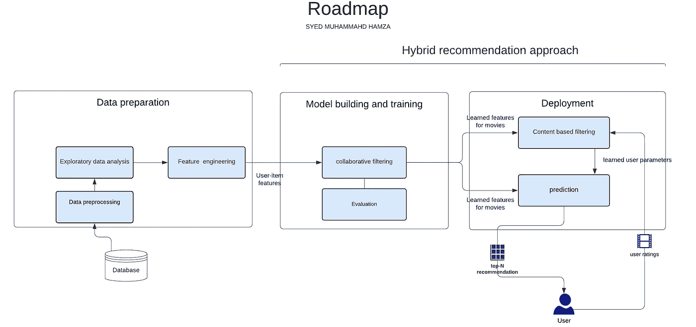

在本系列的这一部分中，我将使用 PostgreSQL 执行探索性的数据分析。我在这个项目中使用 PostgreSQL for EDA 的唯一原因是，大多数申请任何数据角色的新手都应该有在口袋中使用 SQL 的经验，在 EDA 中使用 SQL 可以让您至少演示一下，使用 PostgreSQL for EDA 还可以让您了解关系数据库是如何工作的，数据是如何存储的，更重要的是如何从数据库中获取数据。SQL 是一种非常灵活的声明性语言，可以用来提出一组丰富的查询，以从数据库中获取数据。我将使用 SQL 查询进行数据操作，用于当今几乎每一种图形 EDA 技术，以及一些主要用于可视化的其他 python 库。

如果你对这个项目感兴趣，我的 [**Github**](https://github.com/SyedMuhammadHamza/Hybrid-recommendation-system-web-application) 上有关于这个项目的所有详细描述代码。

web 应用程序部署在 Heroku 上，将在本系列的后半部分讨论，但是如果您想知道最终产品的外观，请随意浏览下面的链接。

 [## 电影推荐系统

### 赛义德·穆罕默德·哈姆扎双击此处获取说明说明 1)请考虑对至少二十种不同的…

smhxrecommendersystemapp.herokuapp.com](https://smhxrecommendersystemapp.herokuapp.com/) 

**注意:**熟悉 SQL(连接、子查询、视图等。)是这部分系列的前提。如果您不熟悉 SQL，可以完全跳过本文，从下一部分开始，因为这是本系列中唯一涉及 EDA 的 SQL 和 PostgreSQL 的部分，并且不是下一部分的先决条件。

# 带有 ODBC 的 PostgreSQL 数据库

**PostgreSQL** 是一个强大的开源对象关系数据库系统，为了与我的 PostgreSQL 数据库服务器建立连接，我将使用 ODBC(开放式数据库连接),这是一个标准，它规定如果你通过这个协议写入这个标准 API，那么你就可以使用 ODBC，它实现了 DBMS 的独立性。ODBC 驱动程序可以被认为类似于打印机驱动程序或其他驱动程序，为应用程序提供一组标准的函数。所有主要的 DBMS 都有驱动程序，如 Oracle、PostgreSQL、MySQL 和 Microsoft SQL Server，但是在 python 代码中使用它之前，您必须手动安装您选择的 DBMS 并配置其驱动程序。

**用 ODBC 设置和访问 PostgreSQL】**

**第一步**:从这里安装 PostgreSQL

[](https://www.postgresql.org/) [## 一种数据库系统

### PostgreSQL 是一个强大的开源对象关系数据库系统，经过 30 多年的积极开发…

www.postgresql.org](https://www.postgresql.org/) 

**步骤 2** :下一步是设置 ODBC(开放式数据库连接),遵循以下链接中指定的步骤

[注意]:跳过(连接到 PostgreSQL 服务器[ [top](https://help.interfaceware.com/v6/connect-to-postgresql-from-windows-with-odbc#) ])并从 Setup ODBC [ [top](https://help.interfaceware.com/v6/connect-to-postgresql-from-windows-with-odbc#) ]开始

[](https://help.interfaceware.com/v6/connect-to-postgresql-from-windows-with-odbc) [## 使用 ODBC 从 Windows 连接到 PostgreSQL 界面软件帮助中心

### 本文解释了如何使用官方 PostgreSQL ODBC 驱动程序 psqlodbc 连接到 PostgreSQL，当使用…

help.interfaceware.com](https://help.interfaceware.com/v6/connect-to-postgresql-from-windows-with-odbc) 

**第三步**:打开第一步安装了 PostgreSQL 的 SQL Shell，执行以下语句

```
CREATE DATABASE DRecommenderSystem_db;
```

现在，我将在名为 PostgreSQL_Database_wrapper.py 的 Python 文件中为 PostgreSQL 定义一个名为 PostgreSQLconnection 的帮助器类，这将节省我大量的时间，因为我已经为每个模块包含了 docstrings，**请在继续之前阅读一下**此处的。

# 使用 PostgreSQL 进行探索性数据分析

## **数据集:**

数据集由 [GroupLens](https://grouplens.org/about/what-is-grouplens/) 提供，可以从这里[下载](https://grouplens.org/datasets/movielens/)它包含以下文件(links.csv、movies.csv、ratings.csv 和 tags.csv)

> *“该数据集(ml-latest-small)描述了来自电影推荐服务 MovieLens 的五星评级和自由文本标记活动。它包含 9742 部电影的 100836 个评级和 3683 个标签应用。这些数据由 610 名用户在 1996 年 3 月 29 日至 2018 年 9 月 24 日之间创建。这个数据集是 2018 年 9 月 26 日生成的。”*

## 正在加载数据集

导入库

```
**import** **pandas** **as** **pd**
**import** **numpy** **as** **np**
**import** **seaborn** **as** **sns**
**import** **matplotlib.pyplot** **as** **plt**#Loading data from csv files into pandas dataframes**moviesData=pd.read_csv(r'ml-latest-small\movies.csv')
ratingsData=pd.read_csv(r'ml-latest-small\ratings.csv')
linksData=pd.read_csv(r'ml-latest-small\links.csv')
tagsData=pd.read_csv(r'ml-latest-small\tags.csv')***'''
I have one column named Timestamp in my RatingData dataframe I've to rename it to something else before inserting data into SQL tables because the timestamp is a data type in SQL
'''***ratingsData['timestamp'] = pd.to_datetime(ratingsData['timestamp'], unit='s')
ratingsData.columns = ['userId', 'movieId','rating' ,'timing']**
```

## 在 PostgreSQL 中创建表

我已经将我的四个 CSV 数据文件加载到 pandas 数据框中，下一步是建立到 PostgreSQL 数据库的连接，为每个数据框创建表，并将数据插入其中。

```
*'''
importing PostgreSQLconnection class from my PostgreSQL_Database_wrapper file and creating an instance of it
'''* **from PostgreSQL_Database_wrapper import PostgreSQLconnection
db=PostgreSQLconnection("DRecommenderSystem_db","postgres","*********","localhost")**
```

MovieLens 数据集由四个[。csv]文件，即(`links.csv`、`movies.csv`、`ratings.csv`和`tags.csv`)我已经将这些文件加载到熊猫的数据帧中。现在，我将使用 SQL 创建表，并通过调用 PostgreSQL_Database_wrapper.py 中定义的 PostgreSQL connection . create _ table()并将 SQL 语句作为参数传递给它，从这些表中的这些数据帧加载数据。

这里我有四个表，都有**主键约束**

> 外键约束通过将包含外键的子表中的一列或一组列引用到父表中的主键列或一组列来标识数据库表之间的关系。

**和外键约束。**

> PRIMARY KEY 约束唯一标识表中的每条记录。

最重要的是，在查看数据框中的数据后，我注意到我的数据不在**第一范式(1NF)** 中

> 第一范式(1NF)是关系数据库中关系的属性。当且仅当每个属性的定义域只包含原子时，关系才是第一范式。

这意味着每个属性/字段/列应该只包含一个值，因此一个字段实例中的值列表违反了 1NF 格式，我有两个有问题的表。第一个是具有属性/字段/列的标记“tag ”,在一个字段的实例中包含多个值。类似地，在表“MovieData”的情况下，我有属性/字段/列“generes ”,在一个字段的实例中包含多个值。通常，当设计 DBMS 的模式时，您必须确保您的数据在 1NF 中，这将始终保持正确。如果您在概念设计中遵循标准的 ER 图，ER-model 在字段/属性中实施原子性，在逻辑设计的下一阶段，您将 ER-Model 转换为数据模型(最有可能是关系模型现在回到我的问题，我将做一些愚蠢的事情，假设像“generes”和“tag”这样的字段中的值是一个很长的原子字符串，因为我不会创建任何关键的重要应用程序来使用这个数据库并强制执行要遵循的标准，如果是这样的话，我将首先为每个非原子字段进行一次热编码，这将扩展列/字段的数量。

```
*#sql statement to create table*
sqlstatement='''CREATE TABLE Movies(
              movieId INT,
              title text,
              genres text,
              PRIMARY KEY(movieId)
              )'''
db.create_table(sqlstatement, ' Movies')
*#sql statement to create table*
sqlstatement='''CREATE TABLE Rating(
              userId INT,
              movieId INT,
              rating REAL,
              timing TIMESTAMP,
              PRIMARY KEY(movieId,userId),
              FOREIGN KEY(movieId) 
                  REFERENCES Movies(movieId)
              )'''
db.create_table(sqlstatement, ' Ratings')
*#sql statement to create table*
sqlstatement='''CREATE TABLE Links(
              movieId INT,
              imdbId INT,
              tmdbId REAL,
              PRIMARY KEY(movieId)
              )'''
db.create_table(sqlstatement, ' Links')
*#sql statement to create table*
sqlstatement='''CREATE TABLE Tags(
              userId INT,
              movieId INT,
              tag text,
              PRIMARY KEY(movieId,userId),
              FOREIGN KEY(movieId) 
                  REFERENCES Links(movieId)
              )'''
db.create_table(sqlstatement, ' Tags')
```

以下是作为上述代码电影，评级，链接和标签的结果，在数据库中创建的表格

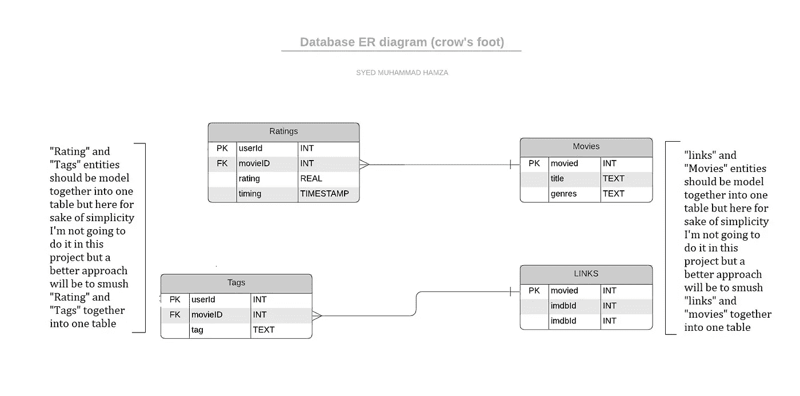

从我的 ER 图中可以看出，我有四个实体，每个表一个，还有它们的主键和外键，为了演示关系，我使用了 crowfoot 符号。

## 将数据从数据帧加载到表中

创建表后，现在我必须将数据框中的数据加载到表中

```
*'''*
*Accessing cursor attribute of PostgreSQLconnection object that itself holds an object of the cursor then using it to insert data*
*into my tables(it's a bad practice to access any attribute from outside of your class it violates encapsulation and information*
*hiding, unfortunately, there is no way to enforce information hiding in python that's why hacks like this one will work but make*
*sure whenever you define your classes they are as loosely coupled as possible always follow SOLID principles) tbh I forgot to* 
*implement insert_data method in PostgreSQLconnection class that's the reason I'm accessing it from outside* *'''*cursor = db.cursor
**for** row **in** moviesData.itertuples():
    cursor.execute('''
                        INSERT INTO Movies(movieId,title,genres)
                        VALUES (?,?,?)
                        ''',
                        row.movieId,
                        row.title,
                        row.genres
                  )
db.db_connection.commit()
print("successfully inserted data from DataFrame into table")
**for** row **in** ratingsData.itertuples():
    cursor.execute('''
                        INSERT INTO Rating(userId,movieId,rating,timing)
                        VALUES (?,?,?,?)
                        ''',
                        row.userId,
                        row.movieId,
                        row.rating,
                        row.timing
                  )
db.db_connection.commit()
print("successfully inserted data from DataFrame into table")
**for** row **in** linksData.itertuples():
    cursor.execute('''
                        INSERT INTO Links(movieId,imdbId,tmdbId)
                        VALUES (?,?,?)
                        ''',
                        row.movieId,
                        row.imdbId,
                        row.tmdbId
                  )
db.db_connection.commit()
print("successfully inserted data from DataFrame into table")
**for** row **in** tagsData.itertuples():
    cursor.execute('''
                        INSERT INTO Tags(userId,movieId,tag)
                        VALUES (?,?,?)
                        ''',
                        row.userId,
                        row.movieId,
                        row.tag
                  )
db.db_connection.commit()
print("successfully inserted data from DataFrame into table")
```

现在我为 EDA 做好了一切准备。通过使用 sql 查询的 EDA 可以比在 Pandas 数据帧上更灵活，但要小心，它可能是一把双刃剑，因为它不是很有效这是我在这里使用 PostgreSQL 的唯一原因，因为大多数申请任何数据角色的新手都应该有一些关于 SQL 的经验，在 EDA 中使用 SQL 可以让你证明这一点，尽管如此，你可以在用于 EDA 的 Postgresql 数据库中提出灵活的查询是惊人的。

## 十大分级电影

在这里，我将分级和电影表连接起来，然后创建名为“MoviesWithRatings”的视图，并对该视图执行查询 MoviesWithRating 以提取排名前十的电影，然后绘制图表

```
*#taking Join of tables(Rating and movies) then creating View(MoviesWithRatings) of result*
command ='''
CREATE VIEW MoviesWithRatings AS
    SELECT Rating.userId,Rating.movieId,Rating.rating,Movies.title
    FROM Rating
    LEFT JOIN Movies
    ON Rating.movieId = Movies.movieId;
'''
db.run_command(command)*#executing query over view* 
query = '''
SELECT title, count(movieid) AS movies_count
FROM MoviesWithRatings
GROUP BY title,movieid
ORDER BY movies_count DESC
LIMIT 10;
'''
query_result=db.run_query(query)plt.figure(figsize=(15, 8)) barh = plt.barh(query_result['title'], query_result['movies_count'], color='blue') plt.title(' top ten most rated movies ') plt.xticks(np.arange(0, 400, 50)) plt.tight_layout()
```

输出看起来像这样，

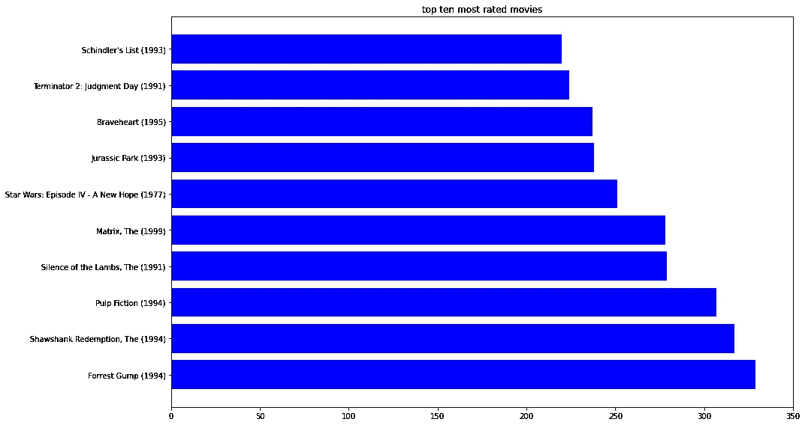

**观察:**天哪！结果与你在腐烂的西红柿和 IMDb 上发现的非常相似。事实上，这些都是有史以来最伟大的电影，因为各种原因而经久不衰——它们提供了曲折的情节，给我们带来了我们爱上的角色，描绘了改变我们的经历，并以令人难以置信的电影制作工艺让我们兴奋不已，但最重要的是，这个结果验证了我从 MovieLens 获得的小数据集具有足够的代表性，可以用于培训。

## 导演中最受欢迎的类型

现在，我对每种类型提出查询，以计算包含该类型的电影的数量，作为“generes”字段/属性/列中的子字符串，并将结果附加到一个列表中，供以后用于绘制它

```
# extracting all unique genres from string field genres 
genres_unique = pd.DataFrame(moviesData.genres.str.split('|').tolist()).stack().unique()
genres_list=genres_unique[:len(genres_unique)-1]
genres_count=[]#QUERY
**for** genre **in** genres_list:
    query = '''
    SELECT count(Movies.movieId) 
    FROM  Movies
    where Movies.genres LIKE '%'''+genre+'''%'
    '''
    query_result=db.run_query(query)
    genres_count.append(query_result.iloc[0]['count'])data=pd.DataFrame({'x': genres_list, 'y': genres_count})
data=pd.DataFrame({'x': genres_list, 'y': genres_count})
plt.subplots(figsize=(10,5))
sns.barplot(x=data.x, y=data.y, palette="rocket")
plt.xticks(rotation=-45)
plt.title('Most popular genres among directors');
```

输出看起来像这样，

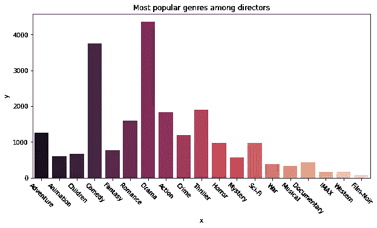

**观察:**导演们似乎用“戏剧”这种类型来导演电影，这最有意义，因为所有其他类型都需要一个像样的预算，导演中接下来最受欢迎的两种类型是“喜剧”和“惊悚片”，同样的推理也适用于这两种类型，但鉴于**相关性不是因果关系**

## 每年的评级数量

让我们继续，现在试着检查每年收视率的增长情况，我预计会呈指数增长，因为每天加入互联网的用户数量呈指数增长，在这种情况下**相关性**是**因果关系**

```
*#executing Nested query over table rating*
query = '''
SELECT year,count(year)
FROM( SELECT rating.movieId,EXTRACT(year FROM rating.timing) AS year
      FROM rating) AS derivedTable
GROUP BY year
ORDER BY year DESC;

'''
query_result=db.run_query(query)plt.subplots(figsize=(10,5))
plt.plot(query_result)

plt.grid(**True**)
plt.title('Number of ratings each year');
```

输出看起来像这样，

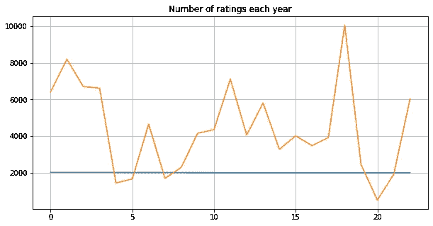

**观察:**哼！鉴于每天全世界越来越多的人加入互联网，我期待收视率每年呈指数级增长！哪里出了问题？这个结果表明，这个小的 MovieLens 数据集是精选的，这就是为什么它不能充分反映真实数据，而且这个小数据集只有 1 MB，这就是为什么我使用这个 265 MB 的[数据集](https://files.grouplens.org/datasets/movielens/ml-latest.zip)来训练部署的模型。

## 评级分布

让我们探索一下

(1)用户如何基于流派对电影进行评级，数据集中有多少不同的流派，它们是如何分布的？

```
*#executing query over rating table*
query = '''
SELECT rating
FROM Rating
'''
rating_result=db.run_query(query)
rating_result.hist(bins=9, grid=**False**, edgecolor='w',density = **True**, label ='All genres', figsize=(10,5))
*#extracting out all genre from moviesData using pandas*
genres_unique = pd.DataFrame(moviesData.genres.str.split('|').tolist()).stack().unique()
genres_list=genres_unique[:len(genres_unique)-1]
*#executing Nested queries within looping structure over table join of rating and movies and doing string comparision for each genre*
**for** genre **in** genres_list:
    query = '''
    SELECT rating
    FROM(SELECT Rating.userId, Rating.movieId, Rating.rating, Movies.genres
         FROM Rating
         LEFT JOIN Movies
         ON Rating.movieId=Movies.movieId) AS derivedTable
    WHERE genres LIKE '%'''+genre+'''%'
    '''
    query_result=db.run_query(query)
    query_result.rating.plot(grid=**False**,  kind='kde', label=genre,figsize=(10,5))
plt.legend(loc=(1.05,0), ncol=2)
plt.xlim(0,5)
plt.xlabel('Movie rating')
plt.title('Movie rating histograms')
plt.show()
```

输出看起来像这样，

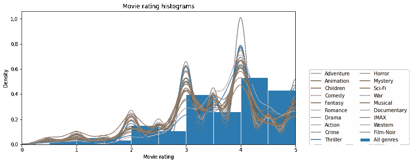

**观察:**查看每种类型的评分分布，似乎它们都有一个非常相似的分布，有点偏右，平均值约为 3.5，这是正常的，因为 3-5 之间的评分是用户在给电影评分时的首选。

## 时间序列分析

我的数据中的时间戳类型允许使用时间序列分析进一步探索我的数据，时间序列分析是一种强大的技术，它可以通过将数据分解为不同的循环趋势来帮助我理解我的数据中的各种时间模式。

考虑到过去发生的事情，时间序列分析还可以让我预测一个变量的水平在未来将如何变化。有时，时间序列分析也有助于在特征工程中提出一组更好的特征。

## **每周电影评分趋势**

```
*#from pandas.tools.plotting import andrews_curves*
genres_list=genres_list[:5]
plt.figure()
*#executing Nested queries within looping structure over table join of rating and movies and doing string comparision for each genre*
**for** genre **in** genres_list:
    query = '''
    SELECT rating,timing
    FROM(SELECT Rating.userId, Rating.movieId, Rating.rating, Movies.genres,Rating.timing
         FROM Rating
         LEFT JOIN Movies
         ON Rating.movieId=Movies.movieId) AS derivedTable
    WHERE genres LIKE '%'''+genre+'''%'
    ORDER BY timing DESC
    '''
    query_result=db.run_query(query)
    query_result['timing']=pd.to_datetime(query_result['timing'])
    query_result.set_index('timing', inplace=**True**)
    query_result.resample("W").mean().plot(marker="o", markersize=1,figsize=(20,5))
    plt.title(genre+' Movie rating trends by week')
```

输出看起来像这样，

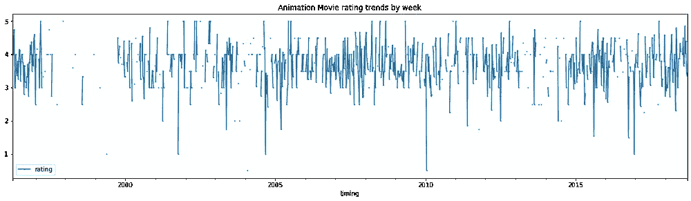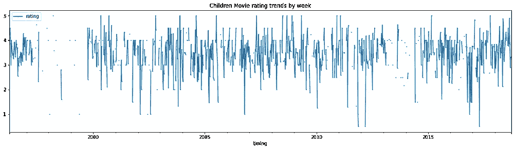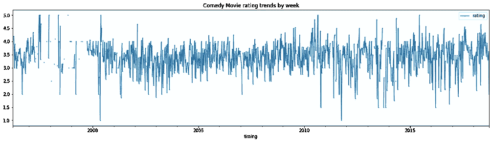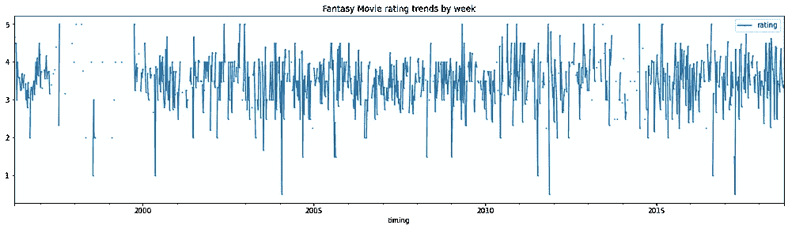

**观察:**当以周为基础重新取样时，电影分级中没有周趋势，它是每个流派的随机循环时间序列。

## 电影分级趋势(按年份)

让我们重新取样，看看我的电影收视率是否有年度趋势

```
genres_list=genres_list[:5]
plt.figure()
*#executing Nested queries within looping structure over table join of rating and movies and doing string comparision for each genre*
**for** genre **in** genres_list:
    query = '''
    SELECT rating,timing
    FROM(SELECT Rating.userId, Rating.movieId, Rating.rating, Movies.genres,Rating.timing
         FROM Rating
         LEFT JOIN Movies
         ON Rating.movieId=Movies.movieId) AS derivedTable
    WHERE genres LIKE '%'''+genre+'''%'
    ORDER BY timing DESC
    '''
    query_result=db.run_query(query)
    query_result['timing']=pd.to_datetime(query_result['timing'])
    query_result.set_index('timing', inplace=**True**)
    query_result.resample("AS").mean().plot(marker="o", markersize=1,figsize=(20,5))
    plt.title(genre+' Movie rating trends by yearly')
```

输出看起来像这样，

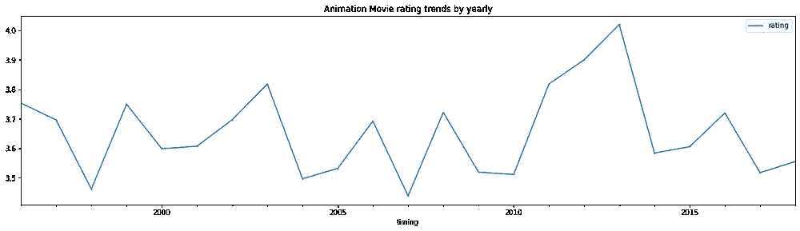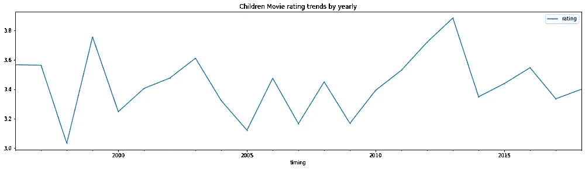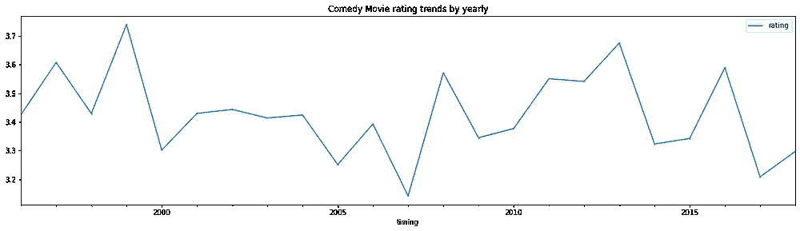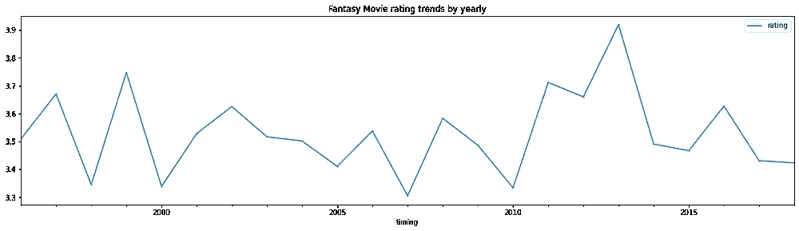

**观察:**这是一个有趣的现象，当每年重新取样时，电影收视率没有年度趋势，结果是一个随机循环的时间序列**，但是**如果你的目标是预测，你可以根据其他类型预测任何类型，因为它们都高度相关，可以一起建模。

## **电影分级分布**

最后，让我们快速浏览一下电影的收视率分布

```
*#executing query over rating table*
query = '''
SELECT rating, count(rating)
FROM Rating
GROUP BY rating
ORDER BY rating
'''
rating_result=db.run_query(query)
y = np.array(rating_result['count'])
mylabels = rating_result['rating']
explode =[0.3,0.1,0.1,0.1,0.1,0.1,0.2,0.1,0.1,0.1]
textprops = {"fontsize":15} *# Font size of text in pie chart*
plt.pie(y, labels = mylabels,explode = explode,shadow = **True**,radius = 3,textprops =textprops)
plt.legend(title = "Rating",loc="lower left")
plt.title("Rating distribution for the Movies",fontsize=15)
plt.show()
```

输出看起来像这样，

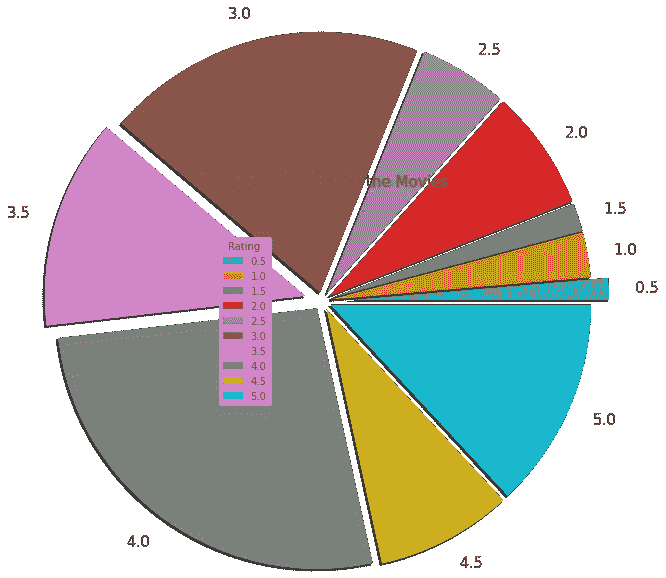

**观察:**看看评分分布，很容易推断出人们很少给 0.5-1.5 窗口的电影评分，尽管在用户中给电影评分在 3.0-4.0 之间是非常普遍的

# 结论

今天，在这个系列的这一部分中，我已经执行了 EDA，这是 ML 管道中最关键的步骤之一。EDA 帮助您在做出任何假设之前更好地理解您的数据，它让您调查明显的错误，并更好地理解数据中的模式。

在本系列的下一部分中，我们将探索混合推荐算法，并将仅使用 NumPy 和 pandas 从头开始实现它，本系列的后续部分将进一步探索特征工程、模型训练、模型评估和部署。

*如果您有任何问题或顾虑，请联系我* [*这里*](https://syedmuhammadhamza.github.io/Hamza_Portfolio/)

*下次见……*