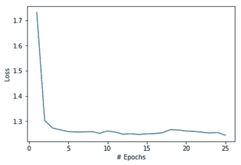

# 基于混合变分自动编码器的欺诈检测模型

> 原文：<https://medium.com/analytics-vidhya/hybrid-variational-autoencoder-based-models-for-fraud-detection-c801d06b1794?source=collection_archive---------1----------------------->


使用堆叠值的异常检测

***简介***

这项工作的目标是使用 Keras/Tensorflow API 开发深度学习模型，以检测异常信用卡交易并对欺诈进行分类。典型的异常检测涉及高度不平衡的数据集。我们在一个无人监管的环境中使用堆叠变分自动编码器(VAE)来有效地对欺诈交易进行分类。使用 Kaggle 信用卡欺诈数据集对模型进行了测试。其他基准测试也是使用 KDD cup 99–10%数据集完成的。

堆叠变分自动编码器(VAEs)用于通过仅用“正常”数据训练它们来学习“正常”信用卡交易的潜在空间表示。通过使用训练的 VAE 网络计算重构误差来识别异常交易。异常高的重建误差表示异常交易/欺诈交易。我们确定了重建误差的最佳阈值，超过该阈值的交易被标记为欺诈，作为产生最高模型准确性的阈值(根据 F1 分数和 ROC 下面积)。

我们还探索了不同的混合模型，包括 VAEs 与监督学习模型(如随机森林分类器)的组合，以提高分类精度。在混合工作流中，堆叠值仅用作生成模型，以增加欠采样数据(即异常)。基于 VAE 的数据扩充用于提高随机森林分类器的性能。

***数据集描述***

我们使用两个数据集进行基准测试，Kaggle 信用卡欺诈数据集([https://www.kaggle.com/mlg-ulb/creditcardfraud](https://www.kaggle.com/mlg-ulb/creditcardfraud))和 1999 年 KDD 杯 10%数据集([http://kdd.ics.uci.edu/databases/kddcup99/kddcup99.html](http://kdd.ics.uci.edu/databases/kddcup99/kddcup99.html))。虽然我们主要使用 Kaggle 信用卡欺诈数据集，但 kddcup99 数据集仅用于额外的基准测试。在本节中，我们将简要探讨 Kaggle 数据集。

Kaggle 信用卡欺诈数据集有 284807 笔信用卡交易，其中 492 笔是欺诈交易(类别标签= 1)，其余 284315 笔是正常交易(类别标签= 0)。数据集高度不平衡，欺诈交易(异常)仅占所有交易的 0.172%。

数据集有 31 列:

['时间'，' V1 '，' V2 '，' V3 '，' V4 '，' V5 '，' V6 '，' V7 '，' V8 '，' V9 '，' V10 '，' V11 '，' V12 '，' V13 '，' V14 '，' V15 '，' V16 '，' V17 '，' V18 '，' V19 '，' V20 '，' V21 '，' V22 '，' V23 '，' V24 '，' V25 '，' V26 '，' V27 '，' V28 '，'数量'，'类']

特征['V1 '，' V2 '，' V3 '，' V4 '，' V5 '，' V6 '，' V7 '，' V8 '，' V9 '，' V10 '，' V11 '，' V12 '，' V13 '，' V14 '，' V15 '，' V16 '，' V17 '，' V18 '，' V19 '，' V20 '，' V21 '，' V22 '，' V23 '，' V24 '，' V25 '，' V26 '，' V27 '，' V28']是用 PCA 获得的。由于保密问题，未提供原始功能。特征“时间”是第一次交易和当前交易之间的时间差，以秒为单位。特征“金额”是交易金额。

数据集中没有缺失值/空值。作为预处理步骤的一部分，我们使用 scikit-learn 的 MinMaxScaler 或 StandardScaler 缩放所有数字特征。

KDD 杯 1999-10%数据集是为第三届国际知识发现和数据挖掘工具竞赛准备的。它包含局域网的 TCP 转储数据。数据集中的每一行指的是源 IP 和目标 IP 地址之间的连接，即在特定时间开始和结束的 TCP 数据包序列。连接被标记为正常或恶意(攻击)。这些攻击被进一步分为 4 个主要类别。我们把所有的攻击作为一个类别，把网络入侵检测问题作为二分类问题来处理。KDD 杯数据集有 494020 个数据点，其中 97277 个(20%)是正常连接，结果是异常(攻击连接)。它有 41 个特征，其中 7 个是分类特征。我们对这些分类特征进行热编码。数据集中没有空值/缺失值。

由于“正常”连接的数据点数较少(仅占所有数据的 20%)，我们在异常数据点(即“攻击”连接)上训练 VAE，然后预测“正常”连接。

***使用堆叠变分自动编码器的异常检测***

我们首先展示堆叠 VAE 的 Tensorflow 实现。Kaggle 数据集中有 29 个要素。我们开发了具有以下架构的堆叠式 VAE。

***车型详情***

输入层的维度为 29

编码器有两个隐藏层，分别有 20 和 15 个神经元。

编码层/潜在层有 5 个神经元

解码器有两个隐藏层，分别有 15 个和 20 个神经元。

输出尺寸为 29

***损失功能和训练***

我们使用 RMSProp 优化器训练 VAE 100 个时期，学习率为 0.001，批量大小为 256。对于这个问题，我们使用不同的损失函数。在简短的文献回顾和相当多的优化以获得高 F1 分数之后，我们在模型中使用以下损失函数，


第一项是均方重建损失，第二项是后验和高斯先验之间的加权 KL 散度。我们可以将α固定为常数，或者在训练过程中给出一个时间表。我们固定α= 1，其他著作使用了不同的α值(理解β-VAE 中的解纠缠，Burgess P. C .等人 arXiv:1804.03599)或者甚至使用了随时期改变α的时间表。我们的 Tensorflow 实现将 alpha 作为输入，并允许所有这些变化。

***异常情况的测定***

我们跟随作者，安，Jinwon，和 Sungzoon 赵。(“使用重建概率的基于变分自动编码器的异常检测”IE 2 专题讲座(2015):1–18。)用于确定异常。然而，我们对他们的算法进行了修改。在网络被训练之后，交易被确定为正常或异常，如下所述，

1.给定输入 x，我们使用编码器网络确定均值(z_mean)和标准差(z_log_var)。

2.我们使用 z_mean 和 z_log_var 抽取 L 个样本。我们在 Tensorflow 实现中固定 L = 10，在 Keras 实现中固定 L = 1。结果变化不大。

3.我们获得了所有 L 个样本的平均重建误差，


4.如果 R_e > R_threshold，则交易被确定为异常或欺诈，否则被确定为正常

**注意:**我们不使用类别标签来确定异常。虽然提供了类别标签，但我们完全将此视为无监督学习问题。通常情况下，数据集中没有标注异常。

我们在 TensorFlow 中展示了一段简单的代码来演示这个想法。

```
tf.reset_default_graph()
# stacked VAE
# encoder has 2 hidden layers with 20 and 15 neurons
# coding layer/latent layer has 5 neurons
# decoder has 2 hidden layers with 15 and 20 neuronsn_inputs = X_train.shape[1]
n_hidden1 = 20
n_hidden2 = 15
n_hidden3 = 5  # codings
n_hidden4 = n_hidden2
n_hidden5 = n_hidden1
n_outputs = n_inputs
learning_rate = 0.001# initialize weights of network
initializer = tf.contrib.layers.variance_scaling_initializer()my_dense_layer = partial(tf.layers.dense,
                         activation=tf.nn.relu,
                         kernel_initializer=initializer)# X is the input data
X = tf.placeholder(tf.float32, [None, n_inputs])# alpha is weight parameter for KL divergence
# this determines the regularization of posterior
# we fix it to 1 here
# this can be tuned refer: Understanding disentangling in beta-VAE arXiv:1804.03599
alpha = tf.placeholder(tf.float32) 
```

***编码器网络***

```
with tf.name_scope("Encoder"):
    hidden1 = my_dense_layer(X, n_hidden1)
    hidden2 = my_dense_layer(hidden1, n_hidden2)
    hidden3_mean = my_dense_layer(hidden2, n_hidden3, activation=None)
    hidden3_sigma = my_dense_layer(hidden2, n_hidden3, activation=None)
    noise = tf.random_normal(tf.shape(hidden3_sigma), dtype=tf.float32)
    hidden3 = hidden3_mean + tf.exp(0.5*hidden3_sigma) * noise
```

***解码器网络***

```
with tf.name_scope("Decoder"):
    hidden4 = my_dense_layer(hidden3, n_hidden4)
    hidden5 = my_dense_layer(hidden4, n_hidden5)
    x_hat = my_dense_layer(hidden5, n_outputs, activation=None)
```

***损失函数***

```
with tf.name_scope("Loss"):
    reconstruction_loss = tf.reduce_mean(tf.square(x_hat - X))
    eps = 1e-10 # smoothing term to avoid computing log(0) 
    latent_loss = 0.5 *(tf.reduce_sum(tf.exp(hidden3_sigma) + tf.square(hidden3_mean) - 1 - hidden3_sigma))

    loss = tf.reduce_mean(reconstruction_loss + alpha*latent_loss)
```

***训练***

```
with tf.name_scope("Training"):
    optimizer = tf.train.RMSPropOptimizer(learning_rate=learning_rate)
    training_op = optimizer.minimize(loss)
```

***重建错误***

```
with tf.name_scope("ReconstructionError"):
    rError = tf.Variable(0.0, name = "ReconstructionError")
    init_error = tf.variables_initializer([rError])
    # take average of 10 samples drawn in the neighborhood X_test sample
    for i in range(10):
        rError = rError + tf.reduce_mean(tf.reduce_sum(tf.square(X-x_hat),axis=1))
    rError = rError/10
init = tf.global_variables_initializer()
saver = tf.train.Saver()
```

我们训练网络 100 个历元，批量大小为 256

```
nepochs = 100
batch_size = 256
nbatches = X_train.shape[0] // batch_size
with tf.Session() as sess:
    init.run()
    for i in range(nepochs):
        Tloss = 0
        RCloss = 0
        Latloss = 0
        print ("----------------------------------")
        print ("Epoch # = {}".format(i+1))
        print ("----------------------------------")for j in range(nbatches):
            X_batch = X_train[j*batch_size:(j+1)*batch_size,:]
            totloss, rcloss, latloss, _ = sess.run([loss, 
                                                    reconstruction_loss, 
                                                    latent_loss,
                                                    training_op], feed_dict = {X:X_batch, alpha: 1.0})
            Tloss += totloss
            RCloss += rcloss
            Latloss += latloss

        # we monitor average loss every epoch
        print ("Average Total Loss for epoch = {:.6f}".format(Tloss/nbatches))
        print ("Average Latent loss for epoch = {:.6f}".format(Latloss/nbatches))
        print ("Average Reconstruction loss for epoch = {:.10f}".format(RCloss/nbatches))

    # calculating the reconstruction error for test data
    rloss_test = []
    for i in range(X_test.shape[0]):
        X_batch = X_test[i].reshape(-1,29)
        init_error.run()
        rloss = sess.run([rError], feed_dict = {X:X_batch})
        rloss_test.append(rloss[0])
```

我们看到，在 100 个周期后，总的训练损失在要求的容限内减少了。

```
- - - - - - - - - - - - - - - - - 
Epoch # = 98
 - - - - - - - - - - - - - - - - - 
Average Total Loss for epoch = 0.001899
Average Latent loss for epoch = 0.000231
Average Reconstruction loss for epoch = 0.0016675723
 - - - - - - - - - - - - - - - - - 
Epoch # = 99
 - - - - - - - - - - - - - - - - - 
Average Total Loss for epoch = 0.001900
Average Latent loss for epoch = 0.000232
Average Reconstruction loss for epoch = 0.0016675660
 - - - - - - - - - - - - - - - - - 
Epoch # = 100
 - - - - - - - - - - - - - - - - - 
Average Total Loss for epoch = 0.001898
Average Latent loss for epoch = 0.000231
Average Reconstruction loss for epoch = 0.0016675662
```

我们定义了效用函数来获得诸如 F1 分数、精确度、召回率、ROC 下面积

```
def tf_get_metrics(rloss, threshold):
    f1score = np.zeros(threshold.shape)
    precision = np.zeros(threshold.shape)
    recall = np.zeros(threshold.shape)
    rocauc = np.zeros(threshold.shape)for i in range(threshold.shape[0]):
        anomaly = pd.DataFrame({'TrueClass':y_test.values, 'ReconstructionLoss':rloss})anomaly["PredictedClass"] = (anomaly['ReconstructionLoss']>threshold[i])*1y_true = anomaly['TrueClass'].values
        y_pred = anomaly['PredictedClass'].values
        f1score[i] = f1_score(y_true, y_pred)
        precision[i] = precision_score(y_true, y_pred)
        recall[i] = recall_score(y_true, y_pred)
        rocauc[i] = roc_auc_score(y_true, y_pred)
    return f1score, precision, recall, rocauc
```

为了找到重建误差的最佳阈值(R_threshold ),我们改变阈值并确定结果 F1 分数。我们选择 R_threshold，使 F1 分数和 ROC 下的面积最大化(图 1)。


**图一**。我们改变阈值重建误差(R_threshold ),并确定结果精度、召回率、F1 分数和 ROC 下面积。最佳 R_threshold 是使 F1 分数和 ROC 下面积(即 ROC AUC 分数)最大化的阈值。最佳 R_threshold 为 0.3774，最大 F1 值为 0.467。

***与隔离林的比较***

我们用隔离森林作为我们最好的 F1 分数(0.467)的基准(图 2)。隔离森林是另一种无监督的机器学习技术。它使用决策树中从根到叶的路径长度作为异常值。发现异常具有较小的路径长度。使用树的集合来确定分数。由于我们的异常检测模型是一个无监督的机器学习模型，我们将我们的结果与另一个众所周知的无监督机器学习模型进行比较。尽管我们没有对隔离林进行严格的超参数调整，但我们尽力使用 GridSearchCV 方法找到最佳参数。为了简洁起见，我们没有显示这些结果。我们在隔离森林模型中使用半调优超参数。

我们将污染(异常数量)固定为 0.00172，因为 0.172%的数据是欺诈性的。


图二。与隔离林的比较

***KDD cup 99–10%数据集的堆积 VAE***

我们在 ***Keras 功能 API*** 中开发模型。对于这个数据集，我们获得了非常令人鼓舞的结果。事实上，我们能够获得与文献中获得的一些顶级 F1 分数类似的结果(宗，b .，宋，q .，闵，M.R .，程，w .，卢美扎努，c .，赵，d .和陈，h .，2018)。用于无监督异常检测的深度自动编码高斯混合模型。)

我们开发了一个隐藏层数比 Kaggle 数据集多的堆叠 VAE。我们的网络包括:

维度为 121 的输入层

包含具有神经元 100、80、60、40 和 20 的 5 个隐藏层的编码器

具有 10 个神经元的潜在层

解码器包含具有神经元 20、40、60、80 和 100 的 5 个隐藏层。

输出的维度为 121。

我们使用 Keras functional API 来构建模型。我们在下面展示代码片段。

```
K.clear_session()
input_dim = X_train.shape[1]
encoding_dim = [100, 80, 60, 40, 20]
coding_vector_size = 10
decoding_dim = [20, 40, 60, 80, 100]x = Input(shape = (input_dim, ))
```

***编码器***

```
encoder_layer =  Dense(encoding_dim[0], activation = tf.nn.tanh)(x)
for i in range(1, len(encoding_dim)):
    encoder_layer = Dense(encoding_dim[i], activation =tf.nn.tanh)(encoder_layer)
```

***潜层***

```
#coding layer
z_mean = Dense(coding_vector_size)(encoder_layer)
z_log_var = Dense(coding_vector_size)(encoder_layer)def sampling(args): 
    z_mean, z_log_var = args
    batch = K.shape(z_mean)[0]
    dim = K.int_shape(z_mean)[1]
    epsilon = K.random_normal(shape=(batch, dim))
    return z_mean + K.exp(0.5 * z_log_var) * epsilon# reference: https://keras.io/examples/variational_autoencoder/
z = Lambda(sampling, output_shape=(coding_vector_size,), name='z')([z_mean, z_log_var])
```

***解码器***

```
decoder_layer = Dense(decoding_dim[0], activation = tf.nn.tanh)(z)
for i in range(1, len(decoding_dim)):
    decoder_layer = Dense(decoding_dim[i], activation = tf.nn.tanh)(decoder_layer)

x_hat = Dense(input_dim)(decoder_layer)
```

我们使用 256 的批量大小训练 25 个时期(图 3a)。



图 3a。培训损失与#个时期

我们获得最佳 F1 分数 0.942，最佳 AUROC 分数 0.983(图 3b)。


**图 3b。**使用 Keras functional API 对 KDD 杯 99–10%数据集进行了与图 1 和图 2 相同的分析。最佳阈值= 0.262，最佳 F1 分数= 0.942，最佳 AUROC = 0.983


**图 3c。**异常和正常数据点的重建误差，我们观察到在重建误差方面正常和异常数据点之间的明显分离。因此使用这种方法获得了高 F1 分数。

此外，堆叠 VAE (F1 得分= 0.942)的表现比隔离森林(F1 得分= 0.488)好得多。

***用于欺诈检测的混合非监督/监督学习模型***

我们试图探索堆叠 VAE 是否可以与监督机器学习模型(如随机森林、梯度推进树或 XGBoost)结合使用，以帮助提高异常检测准确性(即 F1 得分)。

我们制定了两种开发混合模型的方法。在第一种方法中，我们使用正态数据(如在第 2 章中)训练堆叠 VAE，并开发用于监督分类模型的新特征。我们开发了两个特性，

1.余弦-在输入数据和重建数据之间计算的相似性

2.输入数据和重建数据之间的重建误差

我们使用这些特性中的一个作为我们的监督模型中的附加特性，以探索任何性能优势。我们将我们的结果与没有这个附加特征的基线随机森林模型进行比较。

在第二种方法中，我们使用异常/欺诈交易数据来训练我们的堆叠 VAE。对欺诈交易数据学习潜在空间压缩。然后，我们通过从学习到的潜在空间特征中取样来生成更多的欺诈性数据。因此，我们使用堆叠 VAE 来增加欺诈性数据。我们生成大约 20，000 个欺诈数据样本(类别标签= 1)。这被附加到原始数据集，并且结果数据集被用于训练随机森林模型。为了测试数据扩充的好处，我们将我们的结果与未经数据扩充训练的基线随机森林模型进行了比较。

以下是实验总结:

1.  我们得到基线 F1 分数为 0.809，AUROC 为 0.857。我们试图使用堆叠 VAE 来提高这一基线模型的性能
2.  通过使用堆叠 VAE 开发的附加特征，我们观察到我们获得了 0.802 的 F1 分数和 0.851 的 AUROC。因此，它无助于改进基线模型。
3.  我们看到使用 VAE 的数据增强已经改善了基线 RF 分类器的性能。在数据扩充后，我们得到 F1 分数为 0.843，AUROC 为 0.882，而基线 F1 分数为 0.809，基线 AUROC 为 0.857。因此，使用叠加 VAE 的数据扩充使 F1 得分提高了 4.08%，AUROC 提高了 3.03%

***观想潜空间***

为了可视化 2D 空间中的潜在向量，我们将编码向量大小减少到 2。我们在 KDD Cup99 数据集中可视化“正常”连接和“攻击/恶意”连接的潜在空间表示


**图四。**在 2D 可视化潜在空间表征“攻击”连接(深蓝色小圆点)和“正常”(较大的黄色圆圈)。为此，我们使用 KDD cup 99–10%数据集。我们看到在“正常”和“攻击”连接之间有一个明显的界限。这可能是我们的堆叠 VAE 在 KDD cup 99–10%数据集上获得更高 F1 分数的原因。这个堆叠的 VAE 的编码向量大小只有 2，为了可视化的目的，我们减少了它。

***结论与未来工作***

我们证明了使用重建误差作为度量的堆叠 VAE 可以用于检测数据中的异常。此外，堆叠 VAE 还可以用于生成更多异常数据，以减少监督分类中的类别不平衡。这可以提高模型性能。

在这项工作的过程中，我们还尝试了生成敌对网络(GANs)。我们将在未来几周跟进这项工作。此外，在文献中很少有使用 GANs 进行异常检测的研究，这是一个值得进一步探索的有趣课题。

***参考文献***

[1] Zong，b .，Song，q .，Min，M.R .，Cheng，w .，Lumezanu，c .，Cho，d .和 Chen，h .，2018 年。用于无监督异常检测的深度自动编码高斯混合模型。

[2]理解解开——VAE，arXiv:1804.03599

[3]用于新颖性检测的生成式深度模型真的更好吗？，奇工场，SIGKDD，2019

[4]安、金元和赵成宗。“使用重建概率的基于变分自动编码器的异常检测”IE 2 专题讲座(2015):1–18。