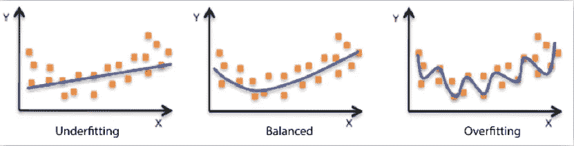

# 线性回归中的超参数调整。

> 原文：<https://medium.com/analytics-vidhya/hyperparameter-tuning-in-linear-regression-e0e0f1f968a1?source=collection_archive---------1----------------------->

在此之前，让我们了解一下为什么要调整模型。

# 调音的目的是什么？

我们将模型调整到**最大化模型性能而不过度拟合，并减少我们模型中的方差误差**。我们必须为我们的模型应用适当的超参数技术。

# 错误类型

# 1.什么是方差误差？

它是指如果使用不同的训练数据，预测值将发生的变化量。

# 2.什么是偏置误差？

这是由于为了简化模型而做出的模型假设造成的误差。

# 正规化

它降低了模型的过度拟合特性。即使模型运行良好，这样做也是为了防止将来出现问题。这是通过引入更多的错误并使模型学习更多来实现的。这将有助于模型了解更多。因此，即使在后期添加了更多的数据，模型也能够毫无问题地处理这些数据。现在，模型性能将会提高，并且将会比非正则化模型更好。

**系数收缩每当我们做正则化**。我们需要确保我们的模型不会因为 alpha 调整太多而不合适。α是一个惩罚因子。通过画一条不接触大多数点的线，在系统中引入了误差。这些正则化模型会缩小系数，因为它们构建的模型会降低斜率，而斜率对于新数据不会有太大变化。系数的收缩完全取决于变量。**如果特征显著，则收缩较小，但如果特征不显著，则收缩较大。**如果特征非常不重要，则系数将变为 0。这种正则化模型的优点是，即使假设没有被检查，模型也会做所有的工作。

# 什么是过度拟合？

当您的模型从训练数据中学习所有复杂和噪声，并且在训练数据中表现良好，但在验证数据时表现不佳，则我们的数据过度拟合。

# 什么是不合身？

当我们的数据不足时，我们的模型会学习潜在的趋势数据。当我们只有较少的数据来构建模型时，或者当我们试图用非线性数据构建线性模型时，就会出现这种情况。

# 什么是交叉验证？

交叉验证本质上是一种用于**评估模型在新的独立数据集**上表现如何的技术。

交叉验证最简单的例子是将数据分为三组:训练数据、验证数据和测试数据，其中训练数据用于构建模型，验证数据用于调整超参数，测试数据用于评估最终模型。

# **正规化的类型**

## **1。** **山脊规则化**

它将系数的**平方值**作为惩罚项添加到损失函数中。这被称为 L2 点球

**SSE = NP . sum((y-b1x 1-B2 x2-…-bo)* * 2)+(alpha *(B1 * * 2+B2 * * 2+B3 * * 2+…+bo * * 2))**

## 2.**套索正规化**

(最小绝对收缩和选择算子)将系数的大小的绝对值作为惩罚项添加到损失函数中。这被称为 L1 点球。

**SSE = NP . sum((y-b1x 1-B2 x2-…-bo)* * 2)+(alpha *(| B1 |+| B2 |+| B3 |+…+| bo |))**

## 3.**弹性网回归**

它是山脊和套索的组合。

**SSE = NP . sum((y-b1x 1-B2 x2-…-bo)* * 2)+(alpha _ ridge *(B1 * * 2+B2 * * 2+B3 * * 2+…+bo * * 2))+(alpha _ lasso *(| B1 |+| B2 |+| B3 |+…+| bo |))**

# 梯度下降

我们可以使用这种方法找到最佳α值和最佳正则化。**梯度下降**是在**机器学习**中使用的迭代优化算法，用于最小化损失函数。损失函数描述了在给定当前参数集(权重和偏差)的情况下模型的表现，而**梯度下降**用于寻找最佳参数集。

感谢阅读:)

# 参考

[https://www . analyticsvidhya . com/blog/2017/06/a-comprehensive-guide-for-linear-ridge-and-lasso-regression/](https://www.analyticsvidhya.com/blog/2017/06/a-comprehensive-guide-for-linear-ridge-and-lasso-regression/)