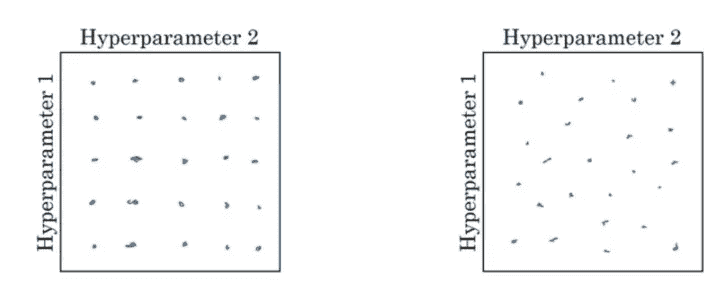
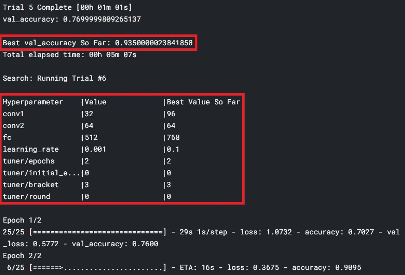

# 使用 Keras 调谐器进行超参数调谐

> 原文：<https://medium.com/analytics-vidhya/hyperparameter-tuning-using-keras-tuner-72a8cb394d0f?source=collection_archive---------7----------------------->

任何深度学习模型最关键的部分是找到超参数的值，这将产生具有高精度的模型。

学习速率、批量大小、层中神经元的数量是模型超参数的一些常见示例。[查看我的文章](/analytics-vidhya/deep-learning-the-summarized-way-part-1-23e2eee01ddd)了解更多关于超参数的知识，以及模型参数和超参数的区别。

# 手动调优过程是如何工作的？

为了执行超参数调整，您从分配给您的超参数的一些初始值开始(根据经验，您将能够找出一些好的初始值)。一旦分配了粗略的值，您就可以训练您的模型，并根据准确性和损失结果，调整模型超参数。手动重复这个过程，直到发现模型精度很高。

# 那么，我们如何才能使这变得简单呢？

上述过程非常耗时，坦率地说，有点烦人。这就是“ ***Keras Tuner*** ”出现的原因，Keras 提供了一个实用程序来自行处理所有这些繁琐的过程。

调谐器希望用户为每个超参数提供特定的值。假设用户想要实验值为 0.1、0.05、0.5 的学习率，以及值为 16、32、64 的第一层中的节点数。所以调优器会创建一个(0.1，16)、(0.1，32)、(0.1，64)、(0.05，16)的组合……然后尝试找到每个组合的模型性能。一旦所有的组合和试验完成，调谐器打印出最佳性能的参数值。Tuner 如何创建这种组合是基于我们要求 Tuner 选择的策略(网格搜索或随机或贝叶斯)。



Tuner 如何为不同的超参数创建组合值。圆点代表超参数值的特定组合。左图:网格搜索，右图:随机搜索[图片[来源链接](https://fiennyangeln.github.io/papers/docs/hyperparameter-tuning/)

> 作为用户，您只需要为您的超参数定义一组值，并将其提供给 Tuner，该实用程序将提供您需要用来获得高精度模型的最佳超参数组合。

请注意，该实用程序不会为您创建模型架构，它只会为给定的模型(作为输入)找到最佳的超参数值。另外，请注意，随着调谐器参数的增加，可能的组合也会增加，从而导致调谐时间增加。因此，明智地选择您想要调整的参数。

# 怎么做到的？

和我所有的文章一样，我将用 Kaggle 上我的笔记本[中的示例代码来解释 Tuner 实用程序。请检查笔记本以便跟进。](https://www.kaggle.com/pdhruv93/fire-detector)

第一部分标记了必要的导入，后面是一些全局变量声明。这里一个新的和重要的声明是 *EARLY_STOPPING_PATIENCE* ，它表示如果经过这么多代之后精度没有提高，Tuner 将中断当前的试验并继续下一个试验以节省资源。下一节“使 ImageDataGenerator 兼容目录”与 Tuner 无关，它用于使数据集与 ImageDataGenerator 兼容。我们导入我们的数据集，在下一节中应用增强，所以没有什么新奇的东西。

接下来是我们定义模型架构的主要部分，我称之为第一步。

# 步骤 1:定义模型架构

我们定义了一个定制函数，通过参数化我们想要调整的模型超参数来构建我们的模型架构。构建模型架构的代码与前面的代码基本相同，只是任何超参数(您希望调整的)都被视为一个*调谐器变量。*

假设我们想要调整 Conv2D 层中的滤波器数量，下面是传统代码的样子:

```
model.add(Conv2D(32 ,(3, 3), padding="same", input_shape=(128, 128, 3)))
```

请注意，我们已经明确地将该层中的过滤器数量定义为 32。使用调谐器，我们可以参数化这个变量。代码将是这样的:

```
model.add(Conv2D(tuner.Int("conv1", min_value=32, max_value=96, step=32),(3, 3), padding="same", input_shape=(128, 128, 3)))
```

我们用表情调谐器替换了 32。Int("conv1 "，最小值=32，最大值=96，步长=32)。

conv1 是我们用来表示该超参数(该层中滤波器的数量)的变量的名称。我们允许该超参数的值范围是[32，96]和 32 的步长。

让我们看另一个例子。我们想要调整模型的学习率。这是我们编写传统代码的方式:

```
lr = 0.1
```

这是我们将调谐器对象用于该变量的方式:

```
lr = tuner.Choice("learning_rate", values=[1e-1, 1e-2, 1e-3])
```

这样，我们可以参数化我们的模型超参数并构建模型。然后，这个模型被传递给 Tuner 对象(下一步),以找到最佳的超参数集。

# 步骤 2:创建调谐器对象

我们创建一个模型对象并传递 *build_model* (我们在上面创建的函数)。每次运行深度学习模型时，初始化和更新都是随机的。所以*种子*值允许模型有一些恒定的起点。该目录是 Tuner 用来生成任何临时文件或某些存储的输出目录。

```
tuner = kt.Hyperband(build_model, objective="val_accuracy", max_epochs=EPOCHS, factor=3, seed=42, directory='./', project_name='my_hyperband_tuner')
```

这里需要注意的是*kt . hyperband。*这是我们希望 Tuner 使用的组合策略。我已经在上面简要描述了组合策略。其他选项有 *kt。卡帕头 RandomSearch。Bayesian 优化*但是我不会在这篇文章中详细讨论这些。

# 第三步:搜索最佳超参数

最后也是最有趣的部分是，Tuner 实用程序开始搜索超参数的最佳值。这是您开始搜索的方式:

```
tuner.search(train_generator, validation_data=test_generator, batch_size=BATCH_SIZE, callbacks=[earlyStopper], epochs=EPOCHS)
```

如果精确度在特定时期后没有增加，则 *earlyStopper* 回调负责中断当前试验的执行。您可以这样定义回调:

```
earlyStopper = EarlyStopping(monitor="val_loss", patience=EARLY_STOPPING_PATIENCE, restore_best_weights=True)
```

我们已经在全局变量中声明了 *EARLY_STOPPING_PATIENCE* 。

# 输出

搜索开始后，调谐器将根据定义的策略创建超参数值的组合。会有多次试验(我找不到一种方法来检查会有多少次试验)。整个过程是自动化的，在这个过程中你不需要做什么，但是完成这个搜索过程需要很多时间，所以耐心地坐着，让它完成。

以下是搜索过程的输出示例:



搜索过程中的输出示例

> 您会注意到，某些超参数的最佳值在所有试验中几乎是相同的。例如，如果您选择尝试 0.1、0.01、0.05 的学习率，并且您注意到所有尝试的最佳值总是 0.1，我建议停止搜索过程并删除学习率的其他值。这是因为其他值(0.01，0.05)在搜索过程中不必要地增加了组合，因此增加了搜索时间。

一旦搜索过程完成，并且获得了超参数的最优值，您就可以使用这些最终值创建模型，并期望得到一个性能良好的模型。

# 最后的话

在了解这个工具之前，我一直认为需要有一些更好的方法来寻找最优超参数。感谢来自 [PyImagesearch](https://www.pyimagesearch.com/) 的 Adrian Rosebrock 博士，我是从他的文章中知道这个工具的。这个实用程序肯定要花很多时间来寻找最佳值，但是请考虑一下您要消除的试错和手工疲劳。除非你是某种专家，能够在不到 10 次的试验中找出最佳值(这是非常罕见的)，否则我强烈推荐使用这种方法来节省你的努力。