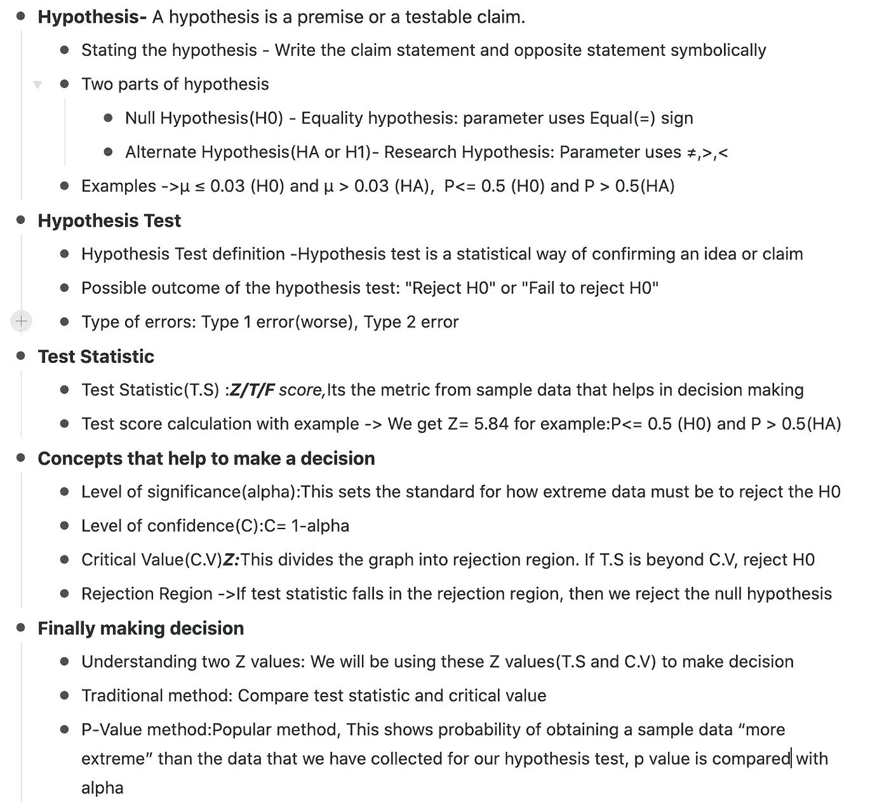

# 简化的假设检验

> 原文：<https://medium.com/analytics-vidhya/hypothesis-test-simplified-b747b8eeeb5c?source=collection_archive---------15----------------------->

Javier Allegue Barros 在 [Unsplash](https://unsplash.com?utm_source=medium&utm_medium=referral) 上拍摄的照片

假设是一个前提或一个可检验的主张。这是一个有根据的猜测，大多基于过去的数据，来自以前的研究或调查。

假设检验是一种证实想法或主张的统计方法，它也有助于决策以限制不确定性。

想象一下，你有一个制造单元，你知道你的生产线平均有 3%的缺陷。然而，一周以来，您发现投诉激增，现在您认为生产线可能出现了一些问题，造成的损坏超过了平均 3%。所以在你采取任何行动之前，确认你所说的“缺陷超过 3%”是明智的。所以你随机检查样本产品，并调查是否有任何缺陷百分比激增。你做的这个调查是假设检验。

**1。陈述假设**

> “良好的开端是成功的一半”——亚里士多德

这是假设检验的第一步。正确陈述主张是得出正确结论的关键一步。

1.象征性地写索赔声明。

2.陈述与该主张相反的观点。

另外，写下假设时需要注意的两件事是下面的参数。

*   是比例(P)吗
*   这是一个意思吗

**2。两部分假设:**

*   **零假设(H0):** 这是**相等**假设。这是当前可接受的参数值。
*   **替代假设(HA 或 H1):** 这也称为“研究人员 c**h”假设，因为这涉及到要测试或调查的违约索赔。**

***3。*例题**

***例题 1:***

*索赔声明:平均缺陷超过 3%，****>****0.03(HA)*

*相反主张:****≤****0.03(H0)*

***例二:*** *对 706 家公司的调查发现，61%的 CEO 是男性。*

这里 61%是比例。所以我们将使用 P 参数。如果超过 50%是男性，这意味着大多数首席执行官是男性。

声明:大多数首席执行官都是男性。P > 0.5(公顷)

相反的陈述:P <= 0.5 (H0)

**现在，无论哪个参数有等号，都变成 H0(零假设)，另一个变成 HA(替代假设)**

> 跟着符号走:符号(>，

**4。假设检验**

我们使用**样本**数据来评估关于**人口**的相互排斥的陈述，以确定哪个陈述或理论最受证据支持。

> **假设**:基于/应用于人群。
> 
> **假设检验**:根据样本数据进行。

**5。假设检验的可能结果。**

1.  拒绝零假设 H0:我有足够的证据证明 H0 是错的，**接受 H1**
2.  未能拒绝零假设的 H0 ->我没有足够的证据，**你什么都不知道。**

**注:如果你想支持索赔，那么你必须在 H1 陈述。**

理想情况下，很难证明任何事情都是 100%真实的，我们评估是否已经收集了足够的证据，我们有信心拒绝零假设并考虑替代方案。

**6。错误类型:**

值得注意的是，我们仍然有小概率出错。

所以这种出错的概率会导致两种错误:

1.  第一类错误— Alpha
2.  第二类错误— Beta

> "在被证明有罪之前是无辜的"
> 
> 与让一个有罪的人摆脱困境相比，判一个无辜的人有罪是最糟糕的后果。

**1 型错误(**假阳性)比**2 型错误**更具灾难性**。**

**7。测试统计数据**

测试统计是从**样本数据**中计算出来的一个指标，用于决定“拒绝 H0”或“拒绝 H0 失败”。

我们从测试统计中得到的结果称为测试分数。

如果基于样本**比例** (P)进行分析，那么下面是计算检验统计量的公式:对于比例，总是正态分布，称为 Z-检验得分。

z =(pˇ-p)/sqrt(p *(1-p)/n)，

pˇ:样本比例，p:假设比例，n:样本量

如果分析基于样本**平均值** (mu)，那么下面是计算检验统计量的公式:

对于均值，如果样本量大于 30，我们采用正态分布和 Z 检验得分。

如果有< 30 sample size, we go student T distribution and with a T-test score.

Z = (x̄ — μ) / (σ / √n)

T = (x̄ — μ) / (S / √n)

*其中:*

*x̄——样本均值*

*μ —总体均值*

*σ —标准差*

*n —样本量*

*S —样本标准偏差*

该测试分数表明该值是否足够稀有。如果很少，那么 H0 被拒绝，我们选择 H1。

**8。考试分数计算与实例。例:对 706 家公司的调查发现，61%的首席执行官是男性。**

H0 : P <= 0.5

H1: P > 0.5

ˇp = 0.61，p = 0.5，n = 706

z =(pˇ-p)/sqrt(p *(1-p)/n)，

z =(0.61–0.5)/√((0.5 * 0.5)/706)

Z= 5.84

我们稍后将决定这是否足够罕见，足以拒绝 H0，而选择 H1。

现在让我们锁定我们得到的这个 **Z 值，Z=5.84** 。我们稍后将使用该值来做出决定。一旦你理解了下面的概念，你会对这个值有一个更直观的理解。

**9。有助于做出决策的概念**

**a .显著性水平(α)**

拒绝零假设的概率。这为数据必须达到多极端才能拒绝零假设设定了标准。

我们对自己的决定有多少信心？

公式:α= 1—C

通常α= 0.05，这意味着 C = 0.95，即结果应显示 95%的置信度。

**c .临界值:**

该值将图形分为**拒绝区域**。这在拒绝区域和非拒绝区域之间产生了边界线。如果检验统计量超过这个临界值，我们拒绝零假设。

对于显著性水平，α= 0.05，

我们得到 **Z= 1.645** 。我们可以从右尾 Z 表中获得这个 Z 值。

让我们也锁定这个 Z 值，我们稍后将使用它来做决定

我们将根据 HA 中定义的方向选择**右尾**(>)**左尾**(<)**双尾**(≦)表(备选假设)。因此请注意，临界值将根据左/右/双尾方向测试而变化。

**d .排斥区域:**

如果检验统计量落在拒绝区域，那么我们拒绝零假设。

10。最终做出决定

**理解获得的两个 Z 值:**

在上述步骤中，我们获得了两个 Z 值:

1.  测试统计 Z 值或 Z 分数。在我们的例子中，Z = 5.84
2.  临界值 Z，在我们的例子中，Z = 1.645

我们将使用这些 Z 值来做决定。

**两种方法**

有两种方法可以做出决定 **:** 这有助于决定我们是必须“拒绝零假设”还是“拒绝失败”。

1.  **传统方法:**比较检验统计量和临界值，现在如果检验统计量落在拒绝区域，我们拒绝 H0
2.  **P 值法:**这是一种比较流行的方法，这是基于与检验统计量相关的概率。

这两种方法给出了相同的决策点。这只是查看测试统计数据并与临界值/alpha/剔除区域进行比较以得出结论的两种不同方式。

**传统方法途径**

我们查看显著性水平，并基于左尾、右尾或 2 尾得到相应的临界值。这个临界值分为排斥区和非排斥区。如果检验统计量落入拒绝区域，或者比 C.V .更极端，我们拒绝 H0。

左尾检验:拒绝 H0 如果 T.S < C.V

Right tailed test: Reject H0 if T.S > C.V

双尾测试:如果 T.S < C.V(left) or T.S > C.V(右)拒绝 H0

在我们的例子中，这是一个右尾测试。我们已经得到了这些值 5.84 > 1.645。所以我们拒绝 H0。(步骤 8 和步骤 9.c)

这证实了“大多数首席执行官都是男性”的说法

**P 值法方法**

这显示了获得比我们为假设检验收集的数据“更极端”的样本数据的概率。它通常在尾部区域。今天，我们可以基于测试分数使用任何编程语言(如 R)获得 P 值

如果 **P 值<=α**，那么我们拒绝 H0。

如果 **P 值>α，**未能拒绝 H0

在我们的示例中，P 值为 2.5995814e-9(您可以使用 P 值计算器或参考 Z 标准表来获得 Z=5.84 的值)

按照标准，α为 0.05。

由于 P < Alpha, We reject H0.

That confirms the claim: “Most CEO’s are male”

**这个结论的结果是统计学上显著的拒绝 H0。**

# 摘要

## 这突出了对上述所有概念的一行总结。

摘要