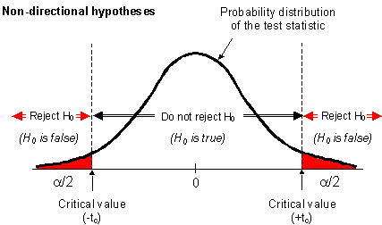
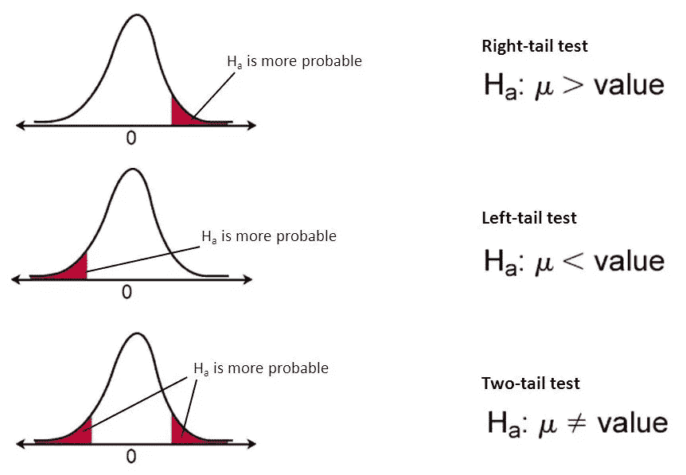

# 假设检验。

> 原文：<https://medium.com/analytics-vidhya/hypothesis-testing-1ec37cd23c?source=collection_archive---------9----------------------->

大家好，我是 Mustafa Sidhpuri，计算机科学与工程专业的学生。最近，我在学习假设检验。起初，我觉得这对我来说有点难以理解，但在阅读了大量关于一个假设的博客和视频后，我能够理解它了。我想和大家分享一下我所学到的东西。

 [## Mustafa Sidhpuri 正在使用 Flutter 撰写博客和开发应用程序。

### 嘿，我叫穆斯塔法，是一名 Flutter 开发者，也是一名兼职博主。

www.buymeacoffee.com](https://www.buymeacoffee.com/mustisid13) 

在这篇博客中，我将尝试解释什么是假设及其类型。

**试试这本关于数据科学的神奇书籍:**

*介绍数据科学:大数据，机器学习，更多使用 Python 工具*https://amzn.to/3EhUYqV

*Python 数据科学手册:处理数据的基本工具*[https://amzn.to/2XpgV6M](https://amzn.to/2XpgV6M)

# 什么是假设？

假设我们有大量的数据。我们从数据集中取出一个样本，并做出一些声明。请注意，主张并不总是有效的，这些只是假设或猜测，这种类型的主张或假设被称为**假设。**

**例 1:**

让我们举一个例子来更清楚地理解它。根据法律，食品制造公司不应该在食品中添加超过 2.5 ppm(百万分之 15)的铅。所以，让我们以 XYZ 公司为例，我们声称 XYZ 公司生产的食品中平均含铅量超过 2.5 ppm。

这只是基于有限数据的说法，并不适用于所有人群。假设检验帮助我们验证对统计值的断言。

**例 2:**

让我们再举一个例子，假设一个人因为一些审判而被指控，陪审团必须决定这个人是无辜的还是有罪的。

它可以转化为两个假设:

**假设一:**被告无罪。

假设 2: 被告有罪。

这两个对立的假设被称为**零假设**和**替代假设**。

## 虚假设

零假设是一种关于人口的普遍看法。它表明情况没有变化或没有差别。

它假设现状(现有的事态)是真实的。

在我们的例子 2 中，被告是社会的一员，这就是为什么他在被证明有罪之前被认为是无辜的。所以我们的无效假设声称被告是无辜的，就像他被指控前一样。

零假设被表示为**H0*。***

请记住，零假设总是有这些迹象:

> =或≤或≥

## 替代假设

简而言之，我们可以将替代假设定义为与零假设相反的

**继续同样的例子 2，我们的另一个假设是他有罪。**

**替代假设被表示为**

***请记住，替代假设总是会有这些迹象:***

> *****！=或>或<或*****

*****需要记住的要点:*****

*   ***H0 和 H1 不可能同时为真。***
*   ***我们只拒绝或不拒绝零假设，我们从不接受它。如果 H1 被拒绝，并不意味着 H0 必须被接受，可能还有其他的可能性。***

***让我们举一些例子，这样你就可以很容易地理解零假设和替代假设。***

*****情况一:** Flipkart 声称其 2016 年 12 月的总估值至少为 140 亿美元。这里的主张包含一个≥号，所以零假设是一个原始主张。***

*****在这种情况下，假设可以表述为:*****

****总估值≥140 亿美元→零假设****

****总估值<140 亿美元→替代假设****

*****情况二:** Flipkart 声称其 2016 年 12 月的总估值比 140 亿美元更有意义。这里的索赔包含>符号，所以零假设是原索赔的补充。***

***在这种情况下，假设可以表述为***

****总估值≤140 亿美元→零假设****

****总估值>140 亿美元→替代假设****

# ***做决定***

***我们已经了解了假设，什么是假设检验，以及它在我们的日常生活中是如何使用的。在知道了我们的备择假设和无效假设之后，我们不得不拒绝或者不拒绝备择假设。***

***假设你的朋友吹牛说他的射箭成绩是 70。你不相信他，你告诉他和他玩 5 局射箭，看看他的分数是多少。不幸的是，他的平均分是 20。所以你不会相信他。如果他的分数是 65 分，你就会相信他。***

***这里你的 **H0:均值= 70** 和 **H1:均值不等于 70*****

***你玩的 5 个游戏是一个样本，他告诉你的平均分数 70 是基于他所有的游戏。这里我们需要一个临界值，告诉我们可以拒绝 H0，也可以不拒绝 H0(我们从不接受 H0)。***

******

***图表左侧的阴影部分是 LCV(较低临界值)，右侧称为 HCV(较高临界值)。***

***上图中，我们看到两边都出现了一个临界区，但并不是每次都是这样。这取决于替代假设的行为。***

***通常有两种可供选择的假设:***

1.  ***无方向性***
2.  ***方向性。***

## ***非定向交替假设***

***以我们上面讨论的同一个例子为例，我们的假设是均值=70 或均值不等于 70，所以我们不知道它是大于 70 还是小于 70。***

***但是，平均值可以小于或大于 70，因此这里没有提到方向。这种类型被称为无方向性交替假设。它也被称为**双尾检验。*****

***非定向交替假设通常用于产品的一致性，尤其是在制药行业。***

## *****方向交替假说*****

***同样拿射箭举例，现在你朋友说他得分≥70。所以我们的假设是:***

***H0:平均值≥70***

***H1:均值<70***

***As we can see in H1, it clearly shows that our critical region will lie on the left side, it is in a specific direction. If our critical region lies on the left side then it is called a **左尾检验*****

***类似地，如果我们有 h1: mean>70，那么我们的临界区域将位于右侧。如果我们的临界区域在右侧，这被称为**右尾测试*****

*****要点记住:*****

*   ***！=在 H1 →双尾检验***
*   ***< in H1 → Left-tail test***
*   ***>在 H1 →右尾试验***

***下图清楚地解释了定向和非定向交替假设。***

******

# ***如何计算临界值？***

***我们现在知道了临界区域，我们需要知道如何计算它。有几种方法可以用来寻找临界区域或临界值。下面提到了其中的两个，您可以探究一下:***

1.  ***临界值法。***
2.  ***p 值法。***

***请注意，还有其他可用的方法。***

*** [## Mustafa Sidhpuri 正在使用 Flutter 撰写博客和开发应用程序。

### 嘿，我叫穆斯塔法，是一名 Flutter 开发者，也是一名兼职博主。

www.buymeacoffee.com](https://www.buymeacoffee.com/mustisid13)***