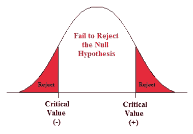
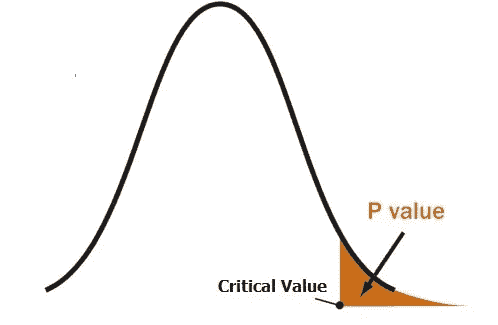
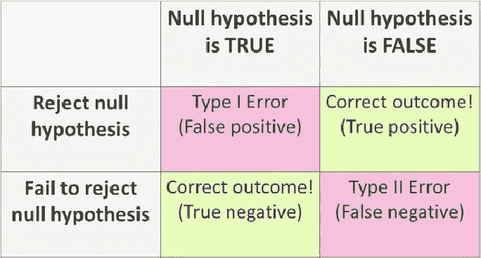

# 假设检验——一个小故事

> 原文：<https://medium.com/analytics-vidhya/hypothesis-testing-a-kutty-short-story-609c2da72ea8?source=collection_archive---------17----------------------->

为了理解假设检验，快速复习一下**会更有帮助**

****

**什么是假设检验？**

**要了解人口，我们通常没有人口数据。所以我们收集样本并从中得出结论。现在，我们如何确保我们的假设或结论是正确的。我们需要测试它，所以我们执行**假设测试****

**假设检验的第一步创建两种类型:**

1.  **无效假设(H0):这就是现状。**
2.  **替代假设:对现状的挑战**

**在 [**CLT**](https://padmanaabhah.medium.com/central-limit-theorem-one-pager-76f9cfea9f25) 的例子中，我们正在计算雇员的通勤时间。既然那样**

1.  ****零假设**将所有员工的平均通勤时间定为 35 分钟。H0 = 35。**
2.  ****替代假设**不会一个员工的平均通勤时间是 35 分钟。H0 ≠ 35**

**我们从这个假设检验中得出了两个结论。**

1.  **当 H0 ≠ 35 时，我们拒绝零假设**
2.  **当 H0 = 35 时，我们未能拒绝零假设(记住我们不会接受替代假设，因为那需要更多的评估)**

****

**有 3 种类型的测试**

**≠在 H₁ →双尾检验→分布两侧**的拒绝区域****

**< in H₁ → Lower-tailed test → Rejection region on **分配左侧****

**>在 H₁ →上尾测试→分布右侧**的剔除区域****

**上面 H1 ≠ 35 的例子是一个双尾检验**

**H1 > 35 将是一个上尾试验**

**H1 < 35 is a lower tail test.**

**We can evaluate the Hypothesis testing by 2 popular methods**

****a)临界值****

****

**举个例子，如果一家医疗设备制造商声称其平均寿命为 120 个月，我们就可以看到这一点。一家机构对这种说法进行了测试。他们取了 50 个设备，发现寿命为 125 个月，标准偏差为 10。如果没有提供显著性水平，我们可以假设为 5%**

**H0 = 120**

**H1 ≠ 120**

**进行临界值测试的公式为 *μ Zc *(σ/* √N *)***

****第一步**:计算 *Zc* 临界分数。这是一个 5%的双尾检验**

**1- (0.05/2) = .975**

***旁注如果这是一个上下尾部测试，我们将得到(1-0.05 = .95)***

**Z 得分 0.975 等于 1.96(参考 Z 表)**

****第二步:**计算标准误差=*σ/*√N****

***σ = 10***

**N = 50**

**因此标准误差= 7.07**

***Zc *(σ/*√N*)= 1.96 * 7.07 = 13.85***

****第三步:**表示*错误***

**UCV 或上临界值:120+13.85 = 133.85**

**LCV 或更低的临界值:120–13.85 = 106.15**

**人口平均数在 106.15 和 133.85 之间。我们得到的样本平均值是 125，介于 UCV 和 LCV 之间。因此**我们未能拒绝零假设。H0=115****

**为了总结我们所做的，我们计算样本平均值，并检查它是否落在另一个临界范围内。**

****b) P 值法:****

**假设这是另一个正在测试我们的假设，让我们用 p 值法测试同样的问题。**

****

**计算 p 值的公式=*(*x*—μ)/(σ/*√N*)。***

**同样的问题陈述**

***我们可以通过一个医疗器械制造商声称其平均寿命为 120 个月的例子来了解这一点。一家机构对这种说法进行了测试。他们取了 50 个样本，发现寿命为 125 个月，标准偏差为 10。如果没有提供显著性水平，我们可以假设为 5%***

****第一步:***(*x*—μ)= 125–120 = 5***

****第二步:** *σ = 10，* √N *=* √50**

***σ /* √N *= 7.07***

***(*x*—μ)/(σ/*√N*)= 0.7072***

****第三步:计算 Z 得分=** .75804**

**因为这是一个双尾检验 2 * (1-.75804) = 0.48392**

**旁注:如果是单边测试，我们就不会乘以 2，即(1-.75804 = .24196)**

**当 0.48392 > 0.05(显著性水平 5%)时，我们未能拒绝零假设。记住这一点的简单方法是当 **P 低为空时进入**。在这种情况下，p 是 0.05，高于 0.48392**

****

**这两种类型的测试都达到了我们的假设是正确的。**

****奖金已读:****

**我们的假设检验可能并不总是正确的。我们可能会做出错误的决定。我们可能会遇到两种错误:**

****类型 1 错误**:当零假设为真时，我们拒绝零假设。这用阿尔法表示**

**H0 =被告无罪**

**H1 =被告有罪**

**当一个人无罪，而他被指控有罪，这是第一类错误。在这种特定的情况下，它应该是最小的**

****第二类错误:****

**当我们未能拒绝一个零假设时，这个零假设是假的。这用β表示**

****例如:**当一个人有罪，而他被指控无罪，这是第二类错误。在这种特定的情况下，它预计是温和的。**

****

**谢谢你坚持到最后。快乐学习**