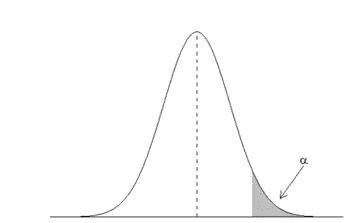
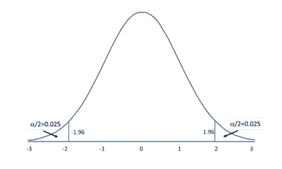

# 初学者假设检验终极指南

> 原文：<https://medium.com/analytics-vidhya/hypothesis-testing-a-simple-guide-fd08454d55f0?source=collection_archive---------5----------------------->

在我们的生活中，我们遇到了太多无法立刻验证其真实性的陈述。有没有想过选哪个？或者哪个陈述将验证我们的真理？或者有没有办法找到统计学上可以接受的简单陈述的答案？当然可以！

怎么会？假设检验。

假设检验是分析学中最重要的概念之一，然而我们中的许多人并不清楚它到底是关于什么的。

照片由[布伦丹·丘奇](https://unsplash.com/@bdchu614?utm_source=unsplash&utm_medium=referral&utm_content=creditCopyText)在 [Unsplash](https://unsplash.com/collections/2256525/choosing?utm_source=unsplash&utm_medium=referral&utm_content=creditCopyText) 拍摄——单向

让我们考虑一些商业组织提出的以下主张，

1.素食者的平均生活不同于肉食者。

2.在州驾照考试中，大约 40%的人第一次就通过了考试。

3.已婚人士拖欠贷款的比例低于单身人士拖欠贷款的比例。

我们如何从统计上验证上述说法/验证其真实性？

这就是假设检验发挥作用的地方。下面我们来看看更多关于这个的内容。

> **假设和假设检验:**假设只不过是对某件事做出的假设/主张/命题，随后会通过统计检验来验证其真实性。
> 
> **假设检验:**假设检验是使用在样本数据中找到的证据来检查声明有效性的过程。

假设检验由两个矛盾的陈述组成，

1.虚假设

2.替代假设

> N **完全 Hypothesis(H₀):** 在零假设中，我们声称**组**之间关于总体参数的值没有关系或差异。

我们通过假设零假设为真来开始假设检验，然后根据样本数据中的证据保留/拒绝零假设。

注意:null 语句必须总是包含某种形式的等式(=，≤或≥)

> A **替代假设(H** ₐ **或 H** ₁ **):** 在替代假设中，我们声称**关于总体参数的值，组**之间存在一些变化/关系。

另一个假设总是与零假设相矛盾，只有上述任何一个假设可能是真的。

注:备选假设用小于、大于或不等于符号表示，即假设检验中的(≦、>)或

**步骤:**

现在让我们来看看进行假设检验的步骤。

1.阐明零假设和替代假设

2.决定显著性水平(α)

3.计算测试统计量

4.计算 p 值

5.拒绝/保留原假设的决定

**1。制定原假设和备择假设:**进行假设检验的第一步是用文字描述原假设和备择假设。这些假设用总体参数来描述，如均值、中值或比例。

例如，考虑下面的假设，

1.素食者的平均生活不同于肉食者。

这里，

H₀:素食者和肉食者的平均生活是一样的

H₁:素食者和肉食者的平均生活是不一样的

H₀: ᵥ= ₘ

H₁: ᵥ ≠ ₘ

ᵥ和ₘ分别是素食者和肉食者的平均寿命。

2.已婚人士拖欠贷款的比例低于单身人士拖欠贷款的比例。

H₀:已婚人士拖欠贷款的比例不低于单身人士拖欠贷款的比例。

H₁:已婚人士拖欠贷款的比例低于单身人士拖欠贷款的比例。

H₀: pₘ ≥ pₛ

H₁: pₘ < pₛ

where pₘ and pₛ are the proportion of married and single defaulters respectively.

After formulating the Null and Alternative hypothesis, based on the evidence from the sample data we retain/reject the Null Hypothesis.

**2。决定显著性水平** (α) **:** 显著性水平(α)只不过是为拒绝零假设而设置的最大阈值。

通常，α设置为 0.05。这意味着有 5%的几率我们会拒绝零假设，即使它是真的。这里如果 p 值<0.05 we reject the null hypothesis even when there is a 5% chance for it to be true.

**临界值和临界区域:**概率为α的抽样分布中统计量的值称为临界值。

超过临界值的区域被称为临界区域/拒绝区域，临界值是指示临界区域边缘的值。

**注:**临界区域描述了拒绝零假设的值的整个区域。如果检验统计量落在临界区域，无效假设将被拒绝。

**单尾检验:**当临界/拒绝区域位于分布的一侧时，称为单尾检验。在这种情况下，如果检验统计量在分布的一侧，或者在左侧，或者在右侧，则无效假设将被拒绝。

**左尾检验:**如果检验是左尾的，面积等于α的临界/拒绝区域将在分布曲线的左侧。在这种情况下，如果测试统计非常小(因为它将落在分布的左端)，则零假设将被拒绝。

这里 P 值= P【检验统计<= observed value of the test statistic]

E.g.: college students take less than five years to graduate from college, on the average

H₀: μ ≥ 5

H₁: μ < 5

This is a left-tailed test since the rejection region would consist of values less than 5.

**右尾检验:**如果检验是右尾的，面积等于α的临界/拒绝区域将在分布曲线的右侧。在这种情况下，如果检验统计量非常大(或落在分布的右端)，则零假设将被拒绝。

这里，P 值= P[检验统计量> =检验统计量的观察值]

拒绝区域向右的右尾测试

一包口香糖声称这种味道可以持续 39 分钟以上。

H₀: μ ≤ 39

H₁: μ > 39

这是一个右尾测试，因为拒绝区域将由大于 39 的值组成。

**双尾检验:**

如果测试是双尾的，α必须除以 2，临界/拒绝区域将在分布曲线的两端。因此，在这种情况下，当测试值位于分布两侧的两个拒绝区域中的任何一个时，零假设将被拒绝。

分布两端都有拒绝域的双尾检验

对于双尾检验，

**p 值= 2 * P[检验统计量>= |检验统计量的观察值|]**

**3。计算检验统计量:**

检验统计量只不过是根据样本估计的参数值(如样本均值)和零假设值(如假设总体均值)之间的标准化差值。它是样本平均值与假设总体平均值之间距离的量度。

检验统计量= (x̄ — μ) / (σ / √n)

其中，x̄ =样本均值

μ =总体平均值

σ =总体的标准偏差

n =观察次数

如果检验统计量落在临界区域，我们拒绝零假设。此外，检验统计量的绝对值越大，假设平均值和样本平均值之间的标准化差异就越大，因此，在这种情况下，p 值就越小，越有证据证明无效假设。

有各种不同的方法来计算测试统计数据。一些常用的测试是 Z 测试和 T 测试。尽管检验统计量的计算非常相似，但可以根据给定的总体或分布参数选择上述任何一种检验。

**T 检验:**T 检验可用于:

-人口分布呈正态或

-抽样分布对称，样本量≤ 15 或

-抽样分布适度偏斜，样本量为 16 ≤ n ≤ 30 或

-样本量大于 30，无异常值。

**Z-检验:**Z-检验可用于以下情况

-当总体呈正态分布且σ已知时。

-样本量 n ≥ 30

现在考虑下面的例子，

> 五年前，七年级学生的平均身高是 145 厘米，标准差是 20 厘米。从随机抽样的 200 名学生中，发现样本学生的平均身高是 147 厘米。七年级学生现在比以前高了吗？

这里，

H₀: ≤ 145

Hₐ: > 145

显然，这是一个右尾检验，因为在这种情况下，拒绝区域(> 145)位于抽样分布的右端。

样本均值，x̄ = 147

人口平均值，μ =145

总体的标准偏差，σ =20

观察次数，n =200

检验统计量=(x̄—μ)/(σ/√n)=(147–145)/(20/√200)= 1.414

上述检验统计意味着样本平均值与总体平均值相差 1.414 个标准偏差，或者样本平均值与假设总体平均值之间的标准化差值为 1.414

对于α = 0.05，单尾检验的临界值是 1.64。因此，如果测试统计值大于 1.64，它将处于拒绝区域。

显然，我们的测试统计值 1.414 小于临界值 1.64，因此不属于拒绝区域。这意味着样本均值与假设的总体均值没有显著差异，因此我们无法拒绝零假设

> **P 值:**P 值就是假设零假设为真，得到检验统计量的条件概率。

**P 值=P(观察检验统计量|零假设为真)**

如果 p 值<= significance level (α), we reject the null hypothesis in favor of the alternative hypothesis.

If p-value >显著性水平(α)，我们无法拒绝零假设，因此接受替代假设。

在上面的例子中，当零假设(≤ 145)为真时，p 值可以表述为观察到检验统计值 1.414 的概率。

即 P(z = 1.414 |≤145)= P(z≤1.414)= 0 . 078681。

显然 p 值，0.0786 大于 0.05(α)。因此，我们不能拒绝零假设。

因此，概括地说，假设检验的过程是从制定无效假设和替代假设开始，设置显著性水平(α),然后计算 p 值，我们根据 p 值接受或拒绝无效假设。

请在下面提供您宝贵的反馈和意见。