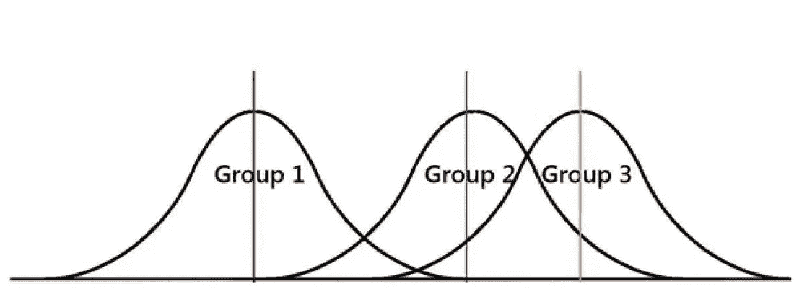
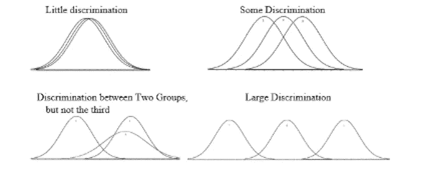
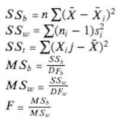
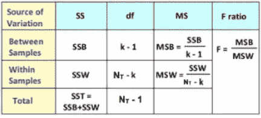

# 假设检验—方差分析(ANOVA)

> 原文：<https://medium.com/analytics-vidhya/hypothesis-testing-analysis-of-variance-anova-52c3df0fbc80?source=collection_archive---------6----------------------->

## **简介:**

ANOVA(方差分析)提供了两个或多个总体均值是否相等的统计检验。假设我们想要确定多个组在测量中是否彼此不同。例如，假设我们想确定纽约市优步乘客的数量是否随季节而变化。您可以使用 t-test 来确定这一点，但是这需要您使用 6 个测试(n(n-1)/2)。你做的测试越多，得出错误结论的风险就越大。为了解决这个问题，你可以使用方差分析测试。ANOVA 不是查看每个个体差异，而是检查组间方差和组内方差的比率，以确定该比率是否足够大，具有统计学意义。

## **方差分析检验的类型:**

*   单向 ANOVA:当您想要测试两个或更多组，以查看它们之间是否有统计差异时使用。t 检验和单向 ANOVA 检验都可以比较两组的平均值，但只有单向 ANOVA 检验可以同时比较多组的平均值。如果你对相同的两组进行单向方差分析和 t 检验，那么结果将是相同的。
*   双向 ANOVA:单向 ANOVA 检验的扩展。双向 ANOVA 测试允许您同时测试两个独立变量的效果。例如，如果您想按国家和性别比较运动员的实力，您可以使用双向 ANOVA 测试来完成这一任务。
*   三向 ANOVA:单向 ANOVA 测试和双向 ANOVA 测试的扩展，允许您同时测试三个独立变量的效果。三因素方差分析测试也称为三因素方差分析测试。

## **计算方差分析:**

对于方差分析检验，我们将建立一个无效的替代假设，如下所示:

*Hnull → 1 = 2 = 3 = 4*

*Halternative → Hnull 不成立。*

要计算方差分析，您可以使用以下公式:

方差分析的自由度:

*   DF *之间=* k -1
*   DF *在*内= N-k
*   DF *总计* = N-1

关键:

*   k =组数
*   N =观察总数
*   n =每组的观察次数

## **单因素方差分析的局限性:**

单向 ANOVA 将帮助您确定两个或更多组是否彼此不同，但它无法告诉您哪些特定组彼此不同。在这种情况下，您应该运行专门的测试来确定哪些组具有不同的平均值。

## **双向方差分析和三向方差分析的假设:**

*   人口接近正态分布
*   样本是独立
*   总体方差相等
*   各组的样本量相等

## **参考文献:**

*   "方差分析检验:定义、类型、例子."*统计如何*，[www . Statistics show To . com/probability-and-Statistics/hypothesis-testing/ANOVA/](http://www.statisticshowto.com/probability-and-statistics/hypothesis-testing/anova/#:~:text=An%20ANOVA%20test%20is%20a,there's%20a%20difference%20between%20them.)
*   古奇坦·辛格。"方差分析:介绍，类型和技术."*分析 vid hya*2020 年 4 月 1 日[www . analyticsvidhya . com/blog/2018/01/ANOVA-analysis-of-variance/。](http://www.analyticsvidhya.com/blog/2018/01/anova-analysis-of-variance/.)