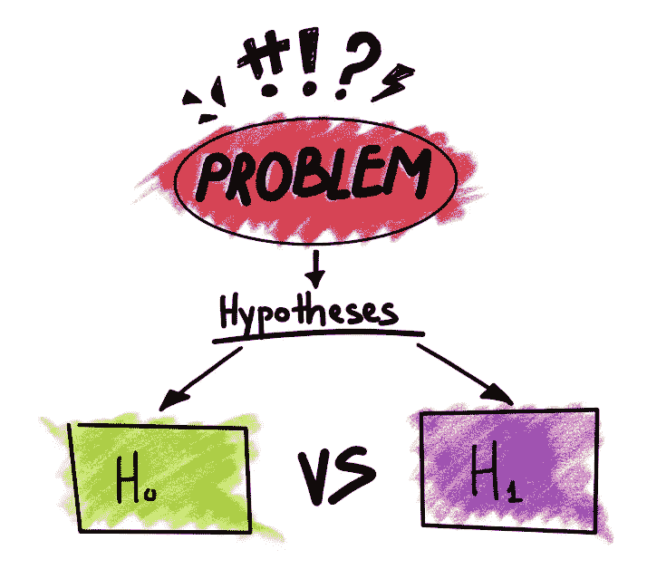
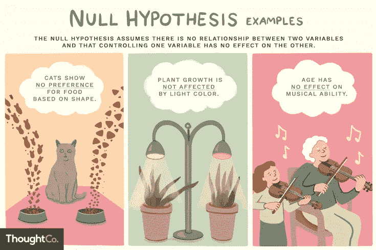

# 假人的假设检验

> 原文：<https://medium.com/analytics-vidhya/hypothesis-testing-for-dummies-5903cff6e82d?source=collection_archive---------6----------------------->

假设检验是更好、更扎实地理解推导结果的重要课题之一。而且，对我来说，这是困扰我好几天的话题之一，让我很困惑。原因是它不仅是技术性的，而且非常直观，所以我计划分享我的发现并帮助他人。

整个拉锯战就是在无效假设和替代假设中决定接受哪个假设，拒绝哪个假设。这将完全取决于我们进行的实验以及公认的显著性水平。现在，这可能看起来有点复杂，充满了术语，比如零假设，替代假设或者显著性水平；但是和我在一起，我们会很顺利地度过这段艰难的旅程。

**假设检验的步骤**

1.从问题陈述中找出零假设

2.陈述无效假设

3.选择要执行的测试类型

4.根据测试结果支持或拒绝零假设

**假设**

假设是对你周围世界的有根据的猜测。它应该可以通过实验或观察来测试。

我们都知道紫外线对眼睛非常有害，所以可以假设紫外线是导致失明的原因。

**假设陈述**

如果我们要提出一个假设，习惯上要写一个陈述。该语句将如下所示:

"如果我(对自变量这样做)那么(这将发生在因变量上)."

例如，如果我减少给药草浇水的量，药草就会增加。

**假设检验**

统计学中的假设检验是我们检验调查或实验结果的一种方法，以查看我们是否有有意义的结果。目标是测试所达到的结果是偶然发生的还是真实的。这可以通过计算几率并将其与显著性水平进行比较来实现。如果结果看起来有偏差或低于显著性水平，则该实验是不可重复的，几乎没有用处。

**零假设**

零假设总是公认的事实。需要通过阅读问题陈述来仔细识别事实。

让我们考虑一个例子，如果膝盖手术患者每周去理疗两次，他们的手术时间会更长。膝盖手术患者的平均恢复时间为 8.2 周。

在这里，我们将研究我们的假设陈述，并找到我们的零假设，即，我们正在寻找的事实或想法是无效的。

因此，我们的零假设将是“平均恢复时间为 8.2 周”。现在，为什么我们选择这个作为我们的零假设？因为这是我们文字问题中的一个既定事实，也是可以取消的。

H0:平均恢复时间是 8.2 周

**替代假设**

替代假设只不过是与原假设相反或相反的陈述。

因此，对于我们上面的例子，另一个假设是

H1:平均恢复时间超过 8.2 周。

**如何拒绝或接受零假设？**

决定如何处理零假设并不总是像陈述的事实那样简单。因此，当且仅当统计量落在临界区域时，我们拒绝零假设。

这个关键区域是什么？这也称为拒绝区域，如果任何检验统计量落在该区域，我们接受替代假设，该区域由显著性水平决定。

现在，什么是显著性水平？显著性水平，也称为α或α，是对样本中必须存在的证据强度的一种衡量，在此基础上，您将拒绝零假设，并得出结论认为该效应具有统计学显著性。研究者在实验前确定显著性水平。

显著性水平是当零假设为真时拒绝零假设的概率。例如，显著性水平为 0.05 表示当没有实际差异时，得出存在差异的结论的风险为 5%。较低的显著性水平意味着您需要更多的实质性证据才能拒绝零假设。

通常，我们默认采用 0.05 作为显著性水平，但是选择显著性水平取决于您的任务。

**用一个例子来理解以上所有:**

问题陈述:给定一枚硬币，判断硬币是否偏向正面。

1.**设计一个实验:**让我们将一枚硬币抛五次，数一数有多少个头。这里人数将是我们的测试统计。

2.做实验:让我们掷硬币五次

3.经过实验，我们发现我们得到了正面五个正面，所以让我们形式化如果 P(X= 5 |硬币不偏向正面)，这里我们的测试统计是' X ',这样 X =正面数

4.**决定零假设:**硬币不偏向正面

5.**确定显著性水平:**在我们的例子中，我们将采用默认值 0.05

6.现在，在进入接受或拒绝零假设的步骤之前，让我们更深入地讨论一下这个问题。如果我们投掷硬币五次，那么我们的样本空间将是这 25 次中的 5 * 5 = 25 次；如果硬币不偏向正面，那么得到五个正面的几率是 1/25，等于 0.04。这里 0.04 是我们的 p 值或 4%的概率，现在让我们进入最后一步。

7.**决定是接受还是拒绝零假设:**从上面的深入分析中，我们发现找到五个头像的概率是 4%，而且，我们已经将显著性水平设置为 0.05，即 5%，因此，假设我们的硬币不偏向头像，我们对一行中 5 个头像的数量的测试统计小于我们的显著性值。如果我们将其形式化，它将类似于 P(X = 5 |硬币不偏向头像)<显著性值

8.**结果:**我们拒绝原假设，接受备选假设。

**参考文献:**

1.  AAIC 课程[ [链接](https://www.appliedaicourse.com/course/11/Applied-Machine-learning-course)
2.  吉姆·弗罗斯特的显著性水平[ [链接](https://statisticsbyjim.com/glossary/significance-level/)