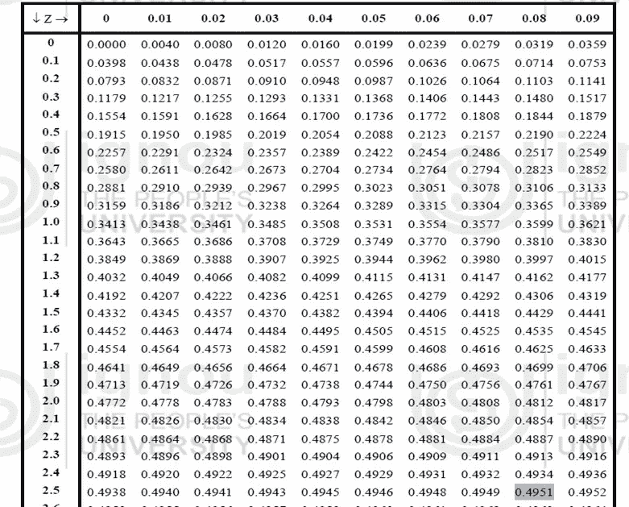

# 假设检验—不仅仅是 p 值

> 原文：<https://medium.com/analytics-vidhya/hypothesis-testing-more-than-p-value-8fc9781ea81?source=collection_archive---------4----------------------->

*主题图*

定义假说

制定无效和替代假设

探索临界区域和显著性水平的概念

描述检验假设的一般程序

解释 p 值及其重要性

用置信区间检验假设

介绍

假设检验是对我们日常生活中经常遇到的主张、陈述或假设的检验。虽然除非我们检查整个人群，否则永远不知道一个主张或陈述的真假，但实际上几乎不可能这样做，因此，我们从被研究的人群中随机抽取样本，并使用样本中包含的信息进行决策(主张是真是假)。

下面的一些例子是指示性的，但是列表是详尽的。

(I)某品牌的空调节省高达 20%的电费或

(二)某一品牌的摩托车行驶里程为 60 公里/升，或

(iii)某种品牌的肥皂可杀死 99.9%的细菌和病毒，

(iv)100 个客户中有 95 个推荐品牌 A，而不是品牌 B，等等。

在大多数情况下，索赔需要通过统计来验证。

这里还要注意的一点是，决策者只对总体参数的推断感兴趣，而对参数值的估计不感兴趣。

定义—假设

假设是关于总体参数值(例如，平均值、中值、方差、比例等)的陈述、主张或假设。).

在假设检验中首要的问题是:

1.确定要测试的假设，并把它写下来。

2.以符号形式表示的确定的假设。

3.用象征的形式写出要求或陈述的补充或反义词

例如——

摩托车消费者可将索赔或假设写成

"这种牌子的摩托车平均每公升行驶 60 公里."

设μ代表平均里程，那么我们的假设在符号形式上就变成了

"这种牌子的摩托车每公升跑 60 公里."

假设的补充成为

"这种牌子的摩托车每公升可跑 60 公里."

简单和复合假设

简单假设—仅指定一个值或确切值的假设

人口参数。例如= 60 公里/升，如上述摩托车示例中所述。

此外，1 = 2 或 1 — 2 = 0，σ1 = σ2 或σ1- σ2 = 0 等。

复合假设-假设指定的不只是一个值，而是总体参数可能采用的一系列值。例如— 1 ≠ 2 或 1 > 2 或 1 — 2 > 0，σ1 ≠ σ2 或

σ1- σ2 ≠ 0 等。

无效假设和替代假设

对于假设检验，要求及其补充以这样的方式形成，即它们覆盖总体参数值的所有可能性(即，整个样本空间)。

制定无效假设和替代假设的经验法则是:

包含相等的陈述是零假设。

也就是说，包含符号=或≤或≥的假设被视为零假设

以及不包含等式的假设，即包含

≠或< or >作为备选假设。

总体上，零假设由 H0 表示，替代假设由 H1 表示。

在我们上面的摩托车例子中，要求是μ = 60 公里/升及其补充

就是μ ≠ 60 公里/升。

H0: μ = 60 公里/升，H1: μ ≠ 60 公里/升

根据 R.A. Fisher 教授的定义，

"无效假设是一种假设，在假设其为真的情况下，对其进行可能的拒绝检验."

与原假设互补的假设称为备择假设。

考虑到研究中的样本，我们假设零假设是真的，直到有足够的证据证明它是假的。

这里要强调的非常重要的一点是:

要说零假设是真的，考虑被研究样本的所有观察结果是很重要的。但是为了拒绝零假设，只需一个表明违反的观察值就足够了。

例如，如果有人想测试人类有两只手，那么要证明这是真的，我们必须检查所有的人，而要证明这是假的，只有一个人有一只手或没有手就足够了。

替代假设又有两种类型:

(一)双边(尾)备择假设

(二)单边(有尾)替代假设

现在我们不要进行单尾和双尾测试。我计划写一个单独的教程，用例子来涵盖这些内容。

判别区域

让我们考虑，X1，X2，…，Xn 作为从具有未知总体参数 p 的总体中抽取的随机样本。X1，X2，…，Xn 的所有可能值的集合是一个称为样本空间(S)的集合，并且 X1，X2，…，Xn 的特定值代表该空间中的一个点。

为了测试假设，整个样本空间被分成两个不相交的子空间，比如说 x 和 s-x = x̅.如果检验统计量的计算值位于 x，那么我们拒绝零假设，如果它位于 x̅，那么我们不拒绝零假设。区域 x 被称为“排斥区域或临界区域”,区域 x̅被称为“非排斥区域”。

从下面的例子可以更好地理解临界区的概念:

假设一批中有 100 个组装件，每批 10 个进行测试，以便在一个工厂中分类为合格组装件或不合格组装件，每个包含 10 个单元的样本按 1 到 10 的等级进行评分。因此，每个样本的平均评级可以是 10(最大值)

如果平均评分为 8 分或以上，则样品中的项目合格，否则不合格。

让这个样本用 X1，X2，…，X10 来表示。

假设我们从每个样本中随机选择一个项目，并想测试所选项目的评分是否为 8 或更高。所以我们可以把无效假设和替代假设看作

H0:选定的装配件合格

H1:选定的装配件不合格

为了对项目做出决定，我们将所有 10 个样本项目的评分平均值定义为。

样本均值

n —样本中的项目数

T10 的范围是 0 ≤ T10 ≤ 10。现在，我们将整个空间(0–10)分为

两个区域为不合格(小于 8)和合格(大于或等于 8)这里，8 是区分合格和不合格区域的临界值。

非排斥区和排斥区

不合格(小于 8) —称为拒绝区域或临界区域或不可接受区域。

合格(大于或等于 8) —称为非拒绝区域或接受区域。

假设检验程序的基本结构需要两个

区域:

(I)拒绝零假设的区域 H0

(二)不拒绝零假设的区域 H0

拒绝区域称为临界区域，用α (alpha)表示，对应于检验统计量的概率分布中的截止值。

在这里，我认为这是双尾测试。然而，基于你的假设框架，你可以把它转换成右尾或左尾测试。过程是一样的。只是不用考虑α (alpha)/2 迎合每个尾部，取α (alpha)做右尾或左尾测试。

下图给出了一个清晰的概念。

临界值、拒绝和非拒绝区域

显著水平

第一类错误的概率被称为检验的显著性水平。它也被称为试验的尺寸或临界区域的尺寸，用α表示。如上所述，如果检验统计量的计算值位于拒绝(临界)区域，那么我们拒绝零假设，如果它位于非拒绝区域，那么我们不拒绝零假设。此外，我们注意到，当 H0 被拒绝，然后自动替代假设 H1 被接受。

通过以一些众所周知的分布形式(如 Z、t、F 等)来表示已知测试统计的临界值或临界值。

p 值

由于以下两个原因，p 值的使用非常普遍:

大多数统计软件提供的是 p 值而不是临界值。

与临界值相比，p 值提供了更多的信息

人们关心的是拒绝还是不拒绝 H0。

为了解释清楚，我们将考虑上述摩托车的例子，并重申假设声明。

H0: μ = 60 公里/升，H1: μ ≠ 60 公里/升

总体平均值的规定值= μ0= 60 千米/升，

总体标准差= σ = 5 公里/升，

样本量= n = 50，

样本平均值= **x̅** = 62 公里/升

显著性水平α设置为α = 0.01 (= 1 %水平)。

测试统计=

测试统计计算

由于样本量很大(n = 50 > 30 ),所以根据中心极限定理，检验统计量的抽样分布近似服从标准正态分布

即检验统计量~ N(0，1)

对于双尾检验，T = 2.83/2 = 1.415

在α= 0.01 时，双尾检验的 Z 表中标准正态分布的临界值或截止值为 Zα = 2.58。

计算 Zα(双尾检验)

1 — α = 1–0.01 = 0.99

α/2 = 0.495

在下面的 Z 表摘录中搜索 0.495 后，得到 2.58。

z 表提取

现在，为了做出关于零假设的决定，我们将检验统计的计算值与临界值进行比较。

由于测试统计的计算值(= 1.415)小于临界值(= 2.58)，这意味着测试统计的计算值在 1%的显著性水平下位于非拒绝区域。因此

我们接受零假设。

因此，我们得出结论，样品确实为我们提供了充分的证据，所以我们可以说摩托车的平均里程是 60 公里/升。

因此，在这里，零假设在显著性水平(α = 0.01)上被接受。但是会有一个显著性水平(α),其中可以拒绝零假设。这个最小的显著性水平(α)被称为“p 值”。

因此，p 值是显著性水平(α)的最小值

可以使用获得的检验统计值来拒绝假设。

为了基于 p 值做出关于零假设的决定，将 p 值与显著性水平(α)进行比较，如果 p 值等于或小于α

那么我们拒绝零假设，如果 p 值大于α，我们不拒绝零假设。

置信区间与假设检验的关系

置信区间= (1 —显著性水平(α)) * 100 %

因此，对于假设检验，如果由零假设指定的参数值在这个置信区间内，那么我们不拒绝零假设，如果这个指定值不在这个置信区间内，那么我们拒绝零假设。

因此，我们可以使用三种方法(临界值、p 值和置信区间)来决定零假设。