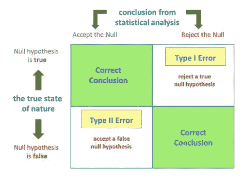
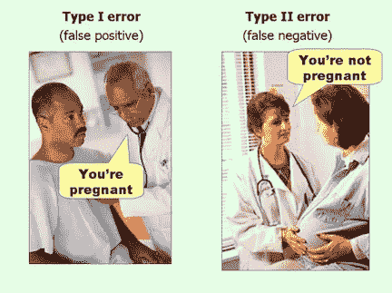

# 假设检验:第一类和第二类错误

> 原文：<https://medium.com/analytics-vidhya/hypothesis-testing-type-1-and-type-2-errors-bf42b91f2972?source=collection_archive---------6----------------------->

**简介:**

在假设检验中，目标是确定一个陈述(零假设)是真还是假。例如，您可能想要测试商店的营销活动是否有效。为了做到这一点，您需要比较统计数据，例如活动前后某一天的平均购买次数。

然而，在某些情况下，研究人员会拒绝或接受无效假设。数据科学家将这些错误称为 I 型(假阳性)和 II 型(假阴性)错误。

**第一类错误:**

当进行假设检验时，总有机会在不应该拒绝的时候拒绝无效假设。置信水平α(*𝛼*)被用作阈值来确定是接受还是拒绝零假设。它也代表了当假设为真时，你拒绝零假设的概率。这种情况被称为 I 型错误或假阳性。

**第二类错误:**

当数据科学家未能拒绝本应被拒绝的无效假设时，就会出现第二类错误。这些错误也被称为假阴性。

**最小化 1 型或 2 型错误:**

不同的情况要求数据科学家尽量减少一种类型的错误。这两个误差彼此反向相关；减少第一类错误会增加第二类错误，反之亦然。让我们来看一些不同的场景，并确定减少 I 型错误还是 II 型错误更重要:

*   测试病人的冠状病毒。
*   信用卡公司在其客户中标记可疑活动。
*   陪审团需要决定某人是否犯有重罪。

在第一种和第二种情况下，您可能希望限制发生的第二类错误的数量。在第一种情况下，由于病毒的传染性，诊断一个没有冠状病毒的病人患有冠状病毒比诊断相反的病人更好。对于第二种情况，错误地将某人标记为可疑的信用卡活动比在某人实际上正在进行欺诈时不标记某人的可疑信用卡活动要好。

在第三种情况下，第一类错误比第二类错误更糟糕。第一类错误意味着你会把一个无辜的男人或女人送进监狱。同时，第二类错误也不完全理想，因为它意味着陪审团让一个有罪的男人或女人逃脱重罪。

**结论:**

当执行假设检验时，理解类型 I 和类型 II 错误之间的差异是很重要的，这样您就可以根据场景确定应该限制哪个错误。在某些情况下，如病毒或疾病检测，限制假阴性的数量更为重要，而在其他情况下，如与司法系统相关的情况，则需要限制假阳性的数量。

**参考文献:**

*   索尔.麦克劳德。"什么是第一类和第二类错误？"*单纯心理学*，单纯心理学，2019 年 7 月 4 日，[www.simplypsychology.org/type_I_and_type_II_errors.html.](http://www.simplypsychology.org/type_I_and_type_II_errors.html.)
*   "犯错是人之常情:什么是第一类和第二类错误？"*统计解决方案*，2020 年 3 月 4 日，[www . Statistics Solutions . com/to-err-is-human-what-is-type-I-and-ii-errors/。](http://www.statisticssolutions.com/to-err-is-human-what-are-type-i-and-ii-errors/.)