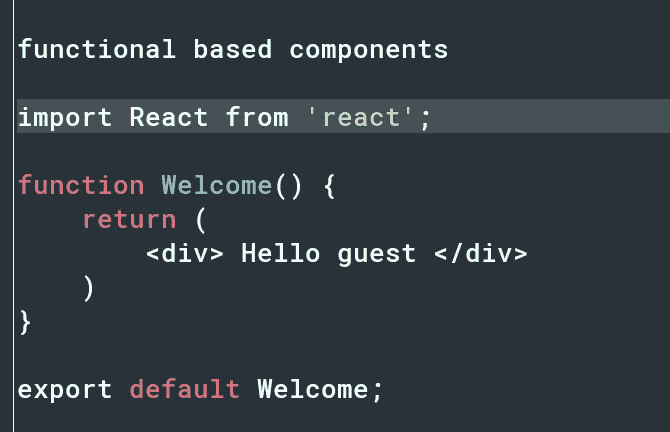
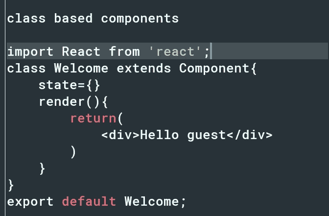
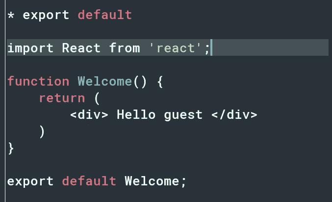
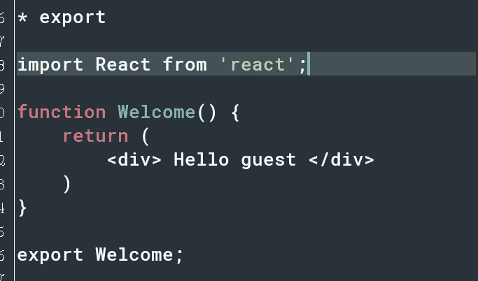
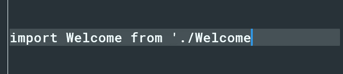
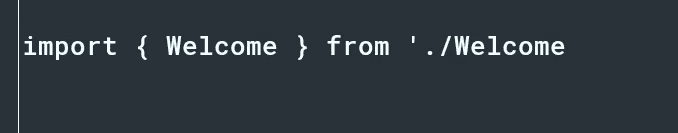
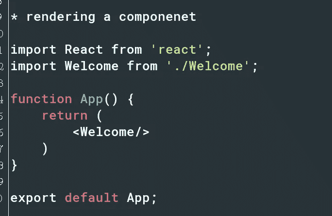
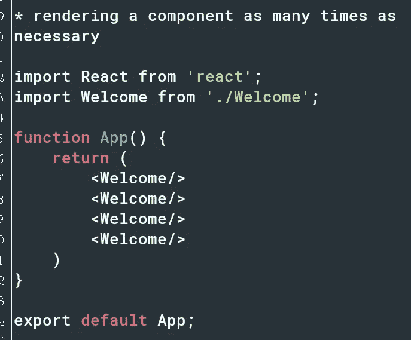
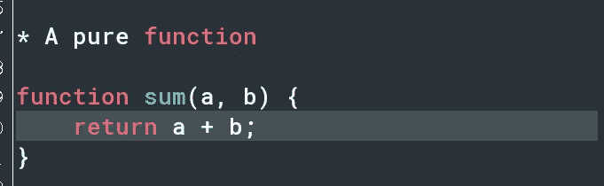
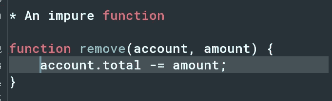

# 我从来不明白反应组件

> 原文：<https://medium.com/analytics-vidhya/i-never-understood-react-components-f7916a24e549?source=collection_archive---------30----------------------->

Ian Stauffer 在 Unsplash 上拍摄的照片

> 直到有人这样解释

当谈到**反应成分**的时候，我很困惑，并且有很多关于它们的**未回答的问题**。

> 你有过这种感觉吗？

**这是直到有人这样向我解释。**

> 注意:阅读到最后，获得改变心态的建议

说完这些，我们上路吧！

# 那么什么是 React 组件呢？

React 组件允许你将你的用户界面(UI)分成**个独立的、可重用的部分**，这些部分可以单独考虑。

这意味着如果你在一个有导航栏、提要、文章区、评论区等等的应用上工作，你可以把整个应用分成小块，你可以把导航栏作为独立于应用其他组件的组件。

这个**将**应用于所有其他组件。

然而，这有助于更好地组织应用程序，并且在生产环境中非常有用。

例如，如果你被告知在现有的 React 应用程序的导航栏上工作，你可以简单地找到应用程序的导航栏组件，并在不影响任何其他组件的情况下进行所需的更改。

因此，这增加了代码的可维护性。

# 它们是如何工作的？

罗斯·斯奈登在 Unsplash 上的照片

最简单的描述 React 组件的方式是把它比作一个 JavaScript 函数。

**组件**接受**输入**，如道具、客观参数，还返回**反应元素**，然后呈现在屏幕上。

# 语法是什么？

米卡·鲍梅斯特在 Unsplash 上拍摄的照片

React 组件有两种类型，每种都有不同的语法。

**1。基于功能的组件**

基于函数的组件实际上是 JavaScript 函数，由此你可以传入 props、带有数据的对象参数，还可以返回一个 React 元素。

不久前它被称为**无状态组件**，但是因为引入了新的特性( **React hooks** )允许我们管理组件的状态，所以它已经改变了。

作者图片

**2。基于类的组件**

这也具有与基于功能的组件相同的**属性**,但区别在于此。
基于类的组件以 **es6 类格式编写。**

作者图片

它利用**生命周期方法**来管理其状态。

# 我还能如何使用 React 组件？

**1。零部件的进口和出口**

为了能够在另一个或多个组件中使用一个特定的组件，您需要导出它，然后导入到您想要使用它的任何地方。

让我说明一下，你可以用 **2 的方式出口一个组件。**这些方法有**不同的**语法用于它们的输入。

首先可以这样使用**导出默认代码**进行导出；

作者图片

您也可以像这样使用**导出代码**进行导出；

作者图片

**前**的导入语法代码是这样的:

作者图片

它是不带花括号的**导入的。**

另一方面，后者是用花括号导入的**，如下面的代码所示。**

作者图片

**2。渲染组件**

如果你完成了将组件导入到另一个或多个组件，你必须**渲染**它**否则**它不会在你的浏览器上渲染。

## 遵循这一步，你就可以开始了

在呈现组件时，您必须呈现组件标签。

您可能想知道什么是组件标签。
一个组件标签是这样写的；
<欢迎/ >

> 每个组件标签的**首字母**必须大写**就像你的每个组件名称的首字母必须大写一样。**

如果你不这样写，React 会像处理 HTML 标签一样把它作为一个 DOM 标签处理，例如，一个 div 标签，而不是一个组件标签。

*下面是呈现组件*的代码片段

作者图片

然而，这意味着你可以像这样在任何你想要的地方任意多次渲染一个特定的组件；

作者图片

**3。道具规则**

有一个函数可以使**永远不修改**的输入，并且总是为相同的输入返回相同的结果。
这个函数叫做**纯函数**

作者图片

不纯函数与纯函数完全相反。

作者图片

> 声明为函数或类的组件绝不能修改自己的属性。

React 非常灵活，但是它有一个非常严格的规则。

> 所有的 React 组件必须像纯函数一样工作。

这意味着一个组件的道具是一个**只读特征**。

# 对开发人员(主要是初级开发人员和初学者)的建议

照片由 Diego PH 在 Unsplash 上拍摄

我总是问这个问题。

> 我应该学习基于功能的组件还是基于类的组件？

我知道大多数初学者和初级开发人员也会问这个问题。

这就是我学到的东西。

> 看完才能理解我的回答。

我更喜欢使用基于功能的组件。

为什么？

*对我来说，基于类的组件非常复杂，很多时候让人困惑，尤其是对于生命周期方法，而基于函数的组件就像 JavaScript 函数一样，非常容易理解.....所以为什么不去争取呢。*

*此外，基于功能的组件使用 React 挂钩，这简化了基于类的组件的生命周期方法。*

到目前为止，我已经提到了为什么我更喜欢基于功能的组件而不是基于类的组件。

但是有一个小问题。

*基于类的组件先于基于功能的组件而产生。
因此，在 React 得到应用的大多数生产环境(公司)中，他们可能已经使用基于类的组件开发了他们的应用程序。*

*因此，如果你只知道基于功能的组件，使用它们会有一点困难，因为你不了解很多基于类的组件。*

*虽然我认为基于功能的组件更好，但你需要同时了解这两者，才能处于优势。*

*了解这两者之后，你可以选择在你的应用中使用更多基于功能的组件。*

我不是什么 [**苏尼尔·桑德胡**](https://medium.com/u/a7b125868703?source=post_page-----f7916a24e549--------------------------------) **或** [**哈莎·瓦尔丹**](https://medium.com/u/fa919f06267?source=post_page-----f7916a24e549--------------------------------) **但我相信根据我的发现，这是解决这个问题的一种现实方法。**

# 最后的想法

**React 组件**基本上类似于接受输入并返回输出的 **JavaScript 函数**。它有**附加于它的其他特性**如进口、出口等，有**严格的规则**控制它的**使用**。

希望这对你有帮助。
感谢您的宝贵时间，祝您好运！

Agbejule Kehinde 赞成。