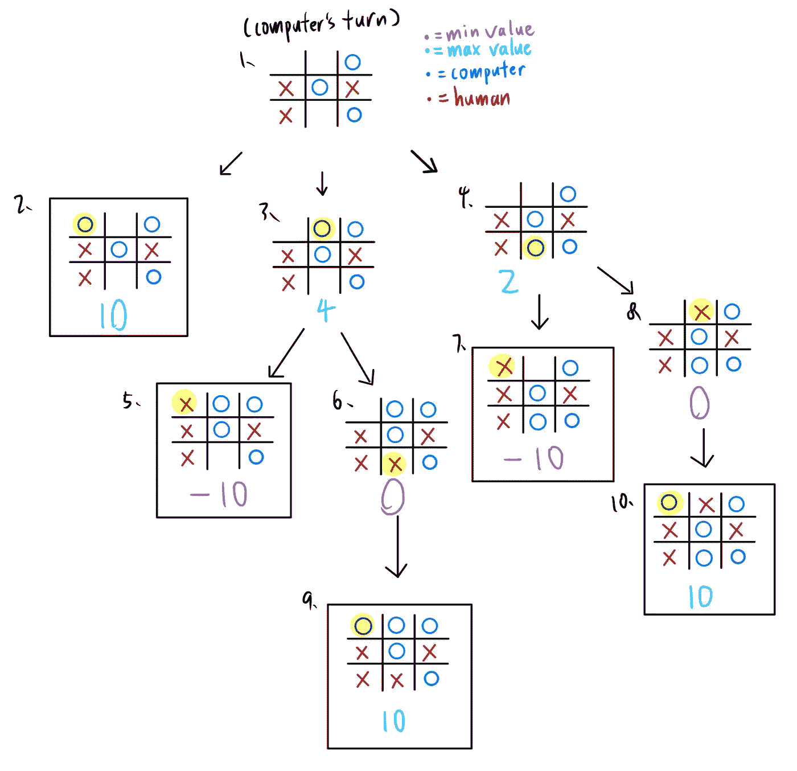

# 我用极大极小算法编程了一个井字游戏，但它是如何工作的？

> 原文：<https://medium.com/analytics-vidhya/i-programmed-a-tic-tac-toe-game-with-minimax-algorithm-but-how-does-it-work-8c689842c9ee?source=collection_archive---------2----------------------->

## 极大极小算法介绍，用 Python 编程

导师:尼古拉斯·格雷夫斯

在本文中，你将了解到**极大极小算法**，以及这个人工智能代理如何让你的**井字游戏**无与伦比。在下文中，我将介绍极大极小的概念和实现极大极小的 python 代码。(完整代码，请访问底部的 GitHub 链接。)

人类(X)对极小极大代理人(O)

**概要**:

*   [井字游戏](/p/8c689842c9ee#540a)
*   [极大极小算法](/p/8c689842c9ee#62ad)

— [最小值](/p/8c689842c9ee#29a3)

— [最大值](/p/8c689842c9ee#19b9)

*   [极小极大的 Python 代码](/p/8c689842c9ee#8112)
*   [下一步是什么](/p/8c689842c9ee#c38f)

# **井字游戏:**

井字游戏是一种游戏，两个游戏者轮流完成一行、一列或一条对角线，在九个正方形的格子中画三个 O 或三个 X。

考虑下面的井字游戏场景:

# **极大极小算法:**

你将和一台有极大极小算法的电脑玩井字游戏，如果正确执行，它永远不会输。现在，到底什么是极大极小算法，为什么要用它？极大极小是人工智能、博弈论、决策理论等中使用的决策规则。极大极小很有用，因为它利用了计算机评估指数增长的一系列可能场景的能力。展望未来的未来。至于游戏，Minimax 常用于对抗性游戏。有两个效用值，称为最小**和最大**值，帮助人工智能代理决定下一步的最佳行动。在这种情况下，代理优先考虑最大值为 10 的移动，然后选择最小值-10。(代理人更想赢而不是阻止它的对手赢)如果没有任何最小或最大值大于或小于 10 的移动，它选择最小加最大值的绝对值最高的移动。再次，极小极大假设它的对手发挥最佳。

*—最小值*

这是人工智能代理寻求**最小化**最坏情况**的可能损失**的值。对于棋盘位置上的每个水平、垂直、对角线通道，如果 3 个位置都没有你的移动，则每个通道的最小值-1。然后，每多一个对手在一条道上移动，你-1(除非你没有在那条道上移动)。但是，如果有 2 个对手移动，你的最小值变成-10(如果你不阻挡那个位置，你的敌人就会赢！).

假设你是玩家(X)，考虑以下棋盘场景:

最小实用板

对于板位置 1，在其行(水平通道)和列(垂直通道)上没有 X。这意味着通过在那里放置一个 X，你消除了 O 获胜的 2 条可能路线。此外，在那一行(水平通道)，除了-2 之外还有一个 O，所以你-1。我们没有从对角线通道中减分，因为它包含一个 X，即使有一个 o。对于棋盘位置 6，最小值是-10，因为它的列(垂直通道)有 2 个 o。

— *最大值*

这是人工智能寻求**最大化**最佳情况**的可能收益**的值。对于棋盘位置上的每一条水平、垂直、对角线的道，如果这 3 个位置没有你对手的移动，你每道+1。然后，你在这条路上每多走一步，你就再+1(前提是你的敌人在这条路上没有走任何一步)。然而，如果你有 2 步棋，你的最大值变成+10(你在那里走一步就赢了！).

假设你是玩家(X)，考虑以下棋盘场景:

最大效用板

对于棋盘位置 1，在它的列(垂直通道)和对角线通道上没有对手(O)移动，你加 2。此外，您在对角线上移动了(X ),因此您将最大值加 1，得到 3。对于纸板位置 8，最大值为 10，因为您在其列(垂直通道)上移动了 2 次(X)。把你的棋放在 8 号位，你就赢了。

# **极小极大的 Python 代码:**

让我们看看生成最小值和最大值的代码！

1.  **第 1–7 行**

已导入库副本。定义了一个名为 Cell 的类，将第 9 行上传递的棋盘上的每个位置转换为单独的对象，存储 4 项:位置、该位置的 2D 指数、最大值和最小值，以便于访问。

**2。第 9–19 行**

定义了一个名为 generate_cells 的函数，它接受 Tictactoe 板(应该是二维的)的输入，并为板上的每个位置返回一个实用板。实用板是一个 2D 列表，每个位置是一个包含 3 个项目的列表:它的位置，最大值和最小值。该函数通过调用第 15–16 行的 max_val 函数(**第 21 行**)和 min_val 函数(**第 32 行**)生成最大值和最小值。

**3。第 21–30 行**

定义了一个名为 max_val 的函数，它接收电路板位置及其 2D 指数，并返回一个最大值。在**行 24** 上，check_horizontal 函数通过检查位置的水平通道生成最大值。

在**第 25** 行，check_vertical 函数通过检查位置的垂直通道生成最大值。

在第 27 行**上，left_diagonal 函数通过检查位置的左上到右下对角线生成最大值。**

在**第 28** 行，right_diagonal 函数通过检查位置的右上到左下对角线生成最大值。

**4。第 32–40 行**

定义了一个名为 min_val 的函数，它接收电路板位置及其 2D 指数，并返回一个最小值。在**行 35** 上，check_horizontal 函数通过检查位置的水平通道生成最小值。在**行 36** 上，check_vertical 函数通过检查位置的垂直通道生成最小值。在**第 37 行**上，left_diagonal 函数通过检查位置的左上到右下对角线生成最小值。在**第 38 行**上，right_diagonal 函数通过检查位置的右上到左下对角线生成最小值。

# **接下来是什么:**

现在你应该能够理解极大极小背后的一般概念。我的程序相对简单，可以通过实现更高级的概念来进一步优化，比如**效用树**和 **alpha-beta 修剪**。

*效用树*:基本上是一个决策树，包含给定电路板的可能电路板状态，用最小值和最大值评估。考虑下面的例子:

*alpha-beta 剪枝:一种*搜索算法，旨在减少搜索树中由 minimax 算法评估的节点数量，以提高程序的时间效率。

**注**:Minimax 算法适用于井字游戏，人工智能代理使这款游戏不可战胜。然而，井字游戏没有充分利用 Minimax 的潜力，而象棋游戏可能是更好的代表。国际象棋充分操纵 Minimax 的力量:完美操纵计算机的力量，有完美的回忆，有完美的记忆，没有场景是无法计算的，比一个人类提前生成了大量可能的场景。与国际象棋相比……Tictactoe 在 3 乘 3 棋盘的情况下，计算机能想出的可能场景更少。

python 代码在 GitHub 上:[https://GitHub . com/729557989/MiniMax-Algorithm-with-tictactoe-optimized](https://github.com/729557989/MiniMax-Algorithm-with-tictactoe-optimized)

有问题吗？评论？您的问题或意见对于帮助我们双方学习非常重要！请在评论区留下您的评论或反馈。感谢您阅读本文！