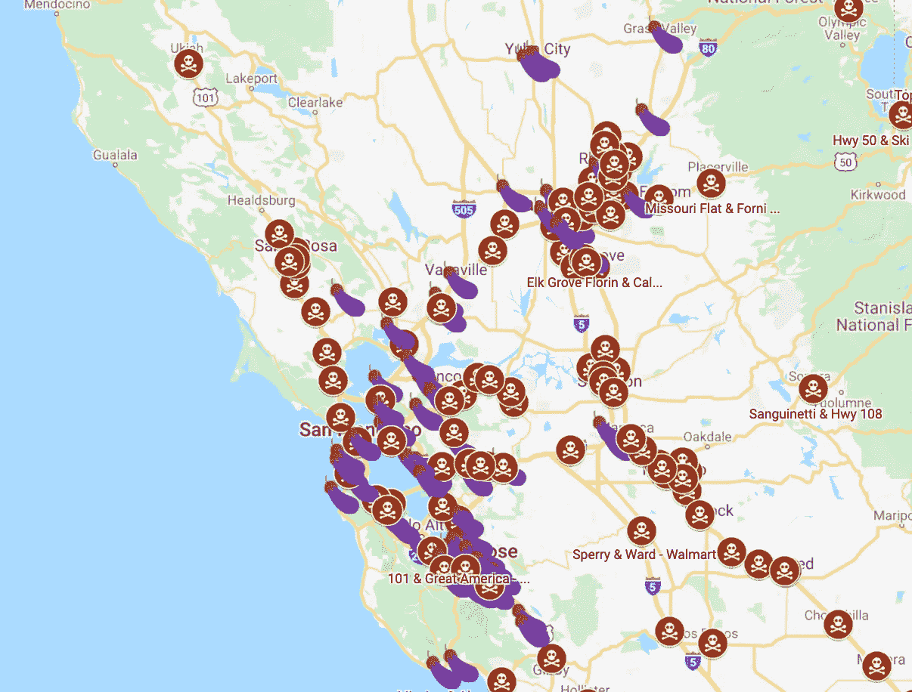

# 我做了一张地图，标出了每个有茄子豆腐的熊猫快递店

> 原文：<https://medium.com/analytics-vidhya/i-reverse-engineered-panda-expresss-internal-api-to-map-every-store-that-has-eggplant-tofu-88fd9c37f184?source=collection_archive---------6----------------------->


编辑:这是这张[地图](https://hypeeats.app/?restaurant=PANDA_EXPRESS&item=EGGPLANT_TOFU)的实景版

TLDR:我做了一张[地图](https://www.google.com/maps/d/edit?mid=1jxiifURZifURWM6uczPJyNgcwgzcrGw_&ll=36.89272103212279%2C-120.73936975735859&z=7)，上面标有美国所有供应茄子豆腐的熊猫快餐的位置。这篇文章的灵感来自拉什克对麦当劳 API 的杰出的[逆向工程](https://twitter.com/rashiq/status/1319346264992026624)。

如果你是素食主义者，你已经知道熊猫快餐是一个神奇的地方。我的晚餐——一碗熊猫烧茄子豆腐是我过去十年的主食。然而，在亚利桑那州上大学后，我知道并不是所有的熊猫都是平等的。有些地点没有茄子豆腐！虽然这是一个更大的问题，如果你想知道哪些地方有茄子豆腐，那就跟着去吧。

# 关于茄子豆腐配送我学到的东西

1.  在我搜索的 1984 个熊猫快递地点中，只有 157 个有茄子豆腐。只有大约 8%的熊猫吃茄子豆腐💀
2.  北加州是这种东西的金矿



3.中西部没有那么好客…


4.除了美景镇的这只独狼？


5.夏威夷是我的安全空间。


# 建造这个东西的一般想法

为了制作这张地图，我基本上是从美国的每一家熊猫快餐店“订购”食物。在订餐过程中，Panda Express 后端服务器返回该位置提供的每个菜单项的列表。我们可以编写代码来检查茄子豆腐是否在列表中。然而，为了做到这一点，我们需要一份美国所有熊猫快递的清单。

# 第一步:获得熊猫快餐在美国的位置列表

*注意:我将用 python 编写本教程中的所有代码*

在做了一些挖掘之后，我发现熊猫对此有一个 API。但是，API 会返回您可能需要的每个位置的每一条元数据。因此，请求需要很长时间。我建议将请求的响应保存到一个文件中，这样您就不必一直发出这个请求。这是你需要的请求:

```
import json
import requests

resp **=** requests.get(url**=**"https://nomnom-prod-api.pandaexpress.com/restaurants/111469/menu?nomnom=add-restaurant-to-menu")
data **=** resp.json()
*#lets save the data in case we need it again later* **with** open("pandaLocations.json", "w") **as** f:
    json.dump(data,f)

*#the data dictionary contains various keys we don't care about. We just want the key that contains all the restaurant data* restaurants **=** data['restaurants']
```

# 让我们过滤这些数据

“restaurants”键包含您可以询问的任何熊猫快餐位置的所有数据。我们真正需要映射一个位置是否有茄子豆腐的唯一东西是 id、纬度和经度键，如下所示。“id”参数是 Panda Express 内部 API 用来引用其每个商店的唯一标识符。我们将使用该值来点击他们的另一个 API，该 API 将为我们提供特定商店的菜单。

```
restaurants[0].keys()dict_keys(['acceptsordersbeforeopening', 'acceptsordersuntilclosing', 'advanceonly', 'advanceorderdays', 'allowhandoffchoiceatmanualfire', 'attributes', 'availabilitymessage', 'brand', 'calendars', 'candeliver', 'canpickup', 'city', 'contextualpricing', 'country', 'crossstreet', 'customerfacingmessage', 'customfields', 'deliveryarea', 'deliveryfee', 'deliveryfeetiers', 'distance', 'extref', 'hasolopass', 'id', 'isavailable', 'iscurrentlyopen', 'labels', 'latitude', 'longitude', 'maximumpayinstoreorder', 'metadata', 'minimumdeliveryorder', 'minimumpickuporder', 'mobileurl', 'name', 'productrecipientnamelabel', 'requiresphonenumber', 'showcalories', 'slug', 'specialinstructionsmaxlength', 'state', 'storename', 'streetaddress', 'suggestedtippercentage', 'supportedcardtypes', 'supportedcountries', 'supportedtimemodes', 'supportsbaskettransfers', 'supportscoupons', 'supportscurbside', 'supportsdinein', 'supportsdispatch', 'supportsdrivethru', 'supportsfeedback', 'supportsgrouporders', 'supportsguestordering', 'supportsloyalty', 'supportsmanualfire', 'supportsnationalmenu', 'supportsonlineordering', 'supportsproductrecipientnames', 'supportsspecialinstructions', 'supportssplitpayments', 'supportstip', 'telephone', 'url', 'utcoffset', 'zip'])
```

现在让我们遍历数据，从每个餐馆中筛选出我们需要的信息。

```
eggPlantData **=** {}
**for** restaurant **in** restaurants:
    eggPlantData[restaurant['id']] **=** {"lat":restaurant['latitude'], 
                                      "lng":restaurant['longitude'], 
                                      "name":restaurant['name'],
                                      "state":restaurant['state']
                                    }
```

好极了。现在，我们的“eggPlantData”拥有我们需要的每家餐厅的所有数据。这是一个字典，其中的键是商店的“id ”,值是商店的地理坐标和街道地址。让我们来看看“eggPlantData”中的一个特定商店条目。

```
eggPlantData[111469]{'lat': 37.331691, 'lng': -121.810975, 'name': 'E Capitol Expwy & Tully', 'state': 'CA'}
```

我们现在已经建立了美国所有熊猫快餐商店的名单。现在让我们弄清楚如何获得每个商店的菜单项。

Panda Express 还有另一个 API，它会告诉我们特定商店的菜单项。它采用的唯一参数是 store 'id '值。幸运的是，该值是我们的“eggPlantData”字典中的关键字。让我们来看一个请求示例:

```
store_id **=** 111469
resp **=** requests.get(url**=**f"https://nomnom-prod-api.pandaexpress.com/restaurants/{store_id}/menu?nomnom=add-restaurant-to-menu")
store_data **=** resp.json()
**print**(store_data){'categories': [{'description': '1 Side & 1 Entree', 'id': 39038, 'images': [{'description': None, 'filename': '72/7288570f72a54140a41afdcfbd0e8980.png?auto=format%2Ccompress&q=60&cs=tinysrgb&w=810&h=540&fit=crop&fm=png32&s=8aff41fd52f99c8e28ffb83d51c3c685', 'groupname': 'mobile-app', 'isdefault': False, 'url': None}, {'description': None, 'filename': '72/7288570f72a54140a41afdcfbd0e8980.png?auto=format%2Ccompress&q=60&cs=tinysrgb&w=810&h=540&fit=crop&fm=png32&s=8aff41fd52f99c8e28ffb83d51c3c685', 'groupname': 'mobile-webapp-menu', 'isdefault': False, 'url': None}, {'description': None, 'filename': '72/7288570f72a54140a41afdcfbd0e8980.png?auto=format%2Ccompress&q=60&cs=tinysrgb&w=810&h=540&fit=crop&fm=png32&s=8aff41fd52f99c8e28ffb83d51c3c685', 'groupname': 'mobile-webapp-customize', 'isdefault': False, 'url': None}, {'description': None, 'filename': '72/7288570f72a54140a41afdcfbd0e8980.png?auto=format%2Ccompress&q=60&cs=tinysrgb&w=716&h=474&fit=crop&fm=png32&s=5c543defe38946e36a8694d0b149fda4', 'groupname': 'desktop-menu', ...}
```

如你所见，我们得到了许多不必要的数据。为了在这里正确显示，我不得不截掉大部分响应。json 很难遍历。本质上，我们需要搜索一个名为“类别”的关键字。这个键包含熊猫提供的不同类型的食物格式的信息。这些东西就像他们的 2 道特色菜，熊猫碗，或个人主菜&配菜。在我们的例子中，我们只对茄子豆腐感兴趣。因此，我们将搜索名为“个人主菜&配菜”的条目的类别关键字。如果找到它，我们将遍历其中另一个名为“Products”的嵌套字典。这本词典将包含一家特定商店出售的所有单品。在这里我们终于可以搜索到一个叫做“茄子豆腐”的词条了。让我们看看单个商店数据的实际情况:

```
categories **=** store_data['categories']
individual_dishes **=** None
**for** cat **in** categories:
    **if** cat['description'] **==** "Individual Entrees & Sides":
        individual_dishes **=** cat['products']
        **break**
**for** dish **in** individual_dishes:
    **if** dish['name'] **==** "Eggplant Tofu":
        **print**("I HAVE EGGPLANT TOFU!!!")
        **break**I HAVE EGGPLANT TOFU!!!
```

完美。上面的代码片段会告诉你一个特定的商店是否有茄子豆腐。现在让我们为美国的每一家商店运行它。

# 第三步:为美国的每一个熊猫快递运行它

```
**for** store_id, data **in** eggPlantData.items():
    **print**(store_id)
    resp **=** requests.get(url**=**f"https://nomnom-prod-api.pandaexpress.com/restaurants/{store_id}/menu?nomnom=add-restaurant-to-menu")
    store_data **=** resp.json()
    *#get categories
*    categories **=** store_data['categories']
    individual_dishes **=** None
    eggPlantData[store_id]['has_eggplant'] **=** False
    **for** cat **in** categories:
        **if** cat['description'] **==** "Individual Entrees & Sides":
            individual_dishes **=** cat['products']
            **break**
    **if** individual_dishes **==** None:
        **print**(f'no individual dishes for: {store_id}')
    **else**:
        **for** dish **in** individual_dishes:
            **if** dish['name'] **==** "Eggplant Tofu":
                eggPlantData['has_eggplant'] **=** True
                **break**

**with** open("eggPlantFinder.json",'w') **as** f:
    json.dump(restaurant,f)
```

我们循环遍历“eggPlantData”字典，并为字典中的每个商店调用商店 API。然后，我们检查特定的商店是否有茄子豆腐。我们将它存储在我们的“eggPlantData”字典中，作为另一个名为“has _ 茄子”的键。这段代码需要很长时间来运行，所以我把它保存到一个文件中。我也会把它放在我的 Github 上。

我们可以就此打住。我们有每一个熊猫快递的清单，以及它的坐标，有茄子豆腐。但是如果我们不绘制地图，它就不是一个完整的项目…

# 第四步:让我们绘制地图

```
import pandas **as** pd
geoCoordInfo **=** []
**for** store, data **in** eggPlantData.items():
    geoCoordInfo.append(data)

df **=** pd.DataFrame(data**=**geoCoordInfo)
df.to_csv("panda_eggplant.csv")
```

我尝试了很多不同的方法来绘制这个项目。然而，我认为最简单的方法是使用谷歌地图。它很容易分享，添加标记也很简单，并且很容易嵌入到网站上。为此，让我们首先格式化我们的数据。我可能使用了最过分的方法，通过使用 pandas 库将‘eggPlantData’字典导出为 CSV。

…还有熊猫，熊猫快递？？有点好笑吧哈哈哈哈哈

> 现在只需将我们的数据导入谷歌地图，并为有/没有茄子豆腐的地点选择一个自定义标志。我不会详细介绍这一部分，因为谷歌有一个 [*很棒的教程来做这个*](https://www.google.com/earth/outreach/learn/visualize-your-data-on-a-custom-map-using-google-my-maps/#prerequisites-)

# 第五步:我们成功了

茄子豆腐搜索器

*图标由*[*Freepik*](https://www.flaticon.com/authors/freepik)*来自*[*www.flaticon.com*](https://www.flaticon.com/)

在这里。我们通往自由的光荣地图。我希望你和我一样喜欢这次旅行。如果您有任何问题或意见，请告诉我！也请考虑关注我更多无意义的内容。同时，我要去吃点茄子豆腐…


e[gg 植物豆腐](https://plantbasednews.org/tag/pandaexpress/)

*原载于 2021 年 1 月 4 日*[*https://amittallapragada . github . io*](https://amittallapragada.github.io/eggplant/tofu/jupyter/notebook/python/apis/panda/express/2021/01/04/egg-plant-tofu-finder.html)*。*