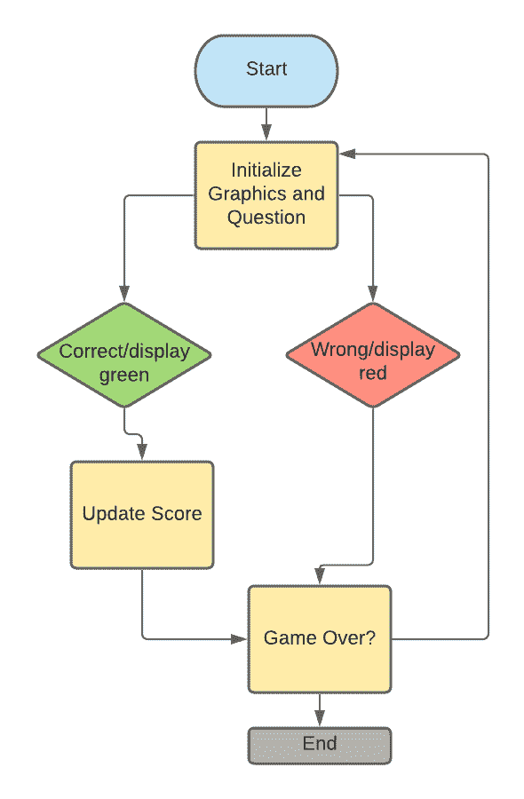

# 我放下工作申请，用 Python 做了一个数据测试

> 原文：<https://medium.com/analytics-vidhya/i-took-a-break-from-job-applications-and-created-a-data-quiz-on-python-fe75474769a?source=collection_archive---------17----------------------->


约书亚·阿拉贡在 [Unsplash](https://unsplash.com/s/photos/code?utm_source=unsplash&utm_medium=referral&utm_content=creditCopyText) 上拍摄的照片

我刚刚从查普曼大学毕业，获得了商业和分析学位。是的，这是一个毕业的好时机——正值疫情，而世界许多地方都在努力从历史上糟糕的劳动力市场中复苏。

在申请了无数份商业/数据分析方面的工作，被招聘人员忽悠，不断遭到拒绝之后，我感到筋疲力尽。我决定短暂休息一下，并认为通过参加在线课程来重新发现编程是一个好主意。

拥有编程技能是数据分析师/科学家不可否认的基本技能；它不仅使您的代码保持高效，而且还抽象出了非结构化数据集的复杂性。在构建自动化的例行流程时，编程也很方便。某种程度上，数据科学家就是兼职程序员。

到目前为止，我学到的关于编程的两个关键话题是:

1.  图形用户界面(GUI)
2.  面向对象编程

然后我心想:“为什么不创建一个简单的真/假数据相关的游戏”？这个项目不仅有利于我的编程技能，还能帮助我练习潜在的工作面试。

# 带 Tkinter 的图形用户界面(GUI)

Tkinter 是一个内置的 Python 包，允许您构建自己的 GUI 框架。GUI 是一种界面，用户可以通过电子设备(如计算机和鼠标)进行交互。关于 Tkinter 的简介和教程可以在[这里](https://tkdocs.com/tutorial/widgets.html)找到。我在这个简单的游戏中使用的主要部件是:

*   标签:建立分数追踪器
*   Canvas:构建一个画布来显示问题文本
*   按钮:捕捉用户响应(对/错)

在定义了 Tkinter 中的关键元素后，我画了一个简单的游戏结构流程图。

## 游戏流程图:



当游戏开始时，它将初始化并显示一个题库中的问题。然后程序会寻找用户输入(真或假)。当用户输入他们的答案时，画布会给用户反馈，告诉他们答案是对还是错(显示绿色/红色)。

如果用户回答正确，分数标签会相应更新。这个过程会一直重复，直到游戏结束(这取决于银行的问题数量)。

当用户退出游戏时，结果将显示在 Python 终端上。

# 面向对象编程简介

解释 OOP 最简单的方法是想象在一个项目中工作。想象一下，你有一个完整的团队在这个项目中工作，在这个团队中，你有几个子团队在这个项目的不同部分工作。通过将这些任务分成不同的模块，团队能够同时更有效地完成整个项目。同样，我们可以在 Python 中创建不同的模块来完成一项任务。此外，所有这些模块都是可重用的，这意味着它不需要像我们使用[](https://www.geeksforgeeks.org/differences-between-procedural-and-object-oriented-programming/#:~:text=Procedural%20Programming%20can%20be%20defined,steps%20to%20be%20carried%20out.)*过程化编程那样重新编码。*

*也就是说，我们可以在 Python 中使用一个名为“class”的特殊构造来将相关的东西放在一起。它也是创建对象和方法的模板。[这里的](https://www.hackerearth.com/practice/python/object-oriented-programming/classes-and-objects-i/tutorial/)是关于类和方法的快速阅读。*

# *代码结构*

*为了对代码进行更好的逻辑组织，我将它们分成了 3 个部分:*

## *1.问题*

*该类保存问题文本和答案属性。当用这个类创建一个新对象时，它将包含这两个属性。*

## *2.脑*

*这个类处理游戏逻辑并管理游戏流程。它跟踪分数、问题的数量，检查用户输入是对还是错，控制是否继续下一个问题，并检查我们是否在测验的末尾。*

## *3.用户界面*

*回头看看我上面设计的流程图，这部分代码将负责创建所有的图形元素，并允许用户给出他们的输入(真/假按钮)。同时，它给用户视觉反馈(红色/绿色)，让他们知道答案是对还是错。除了这些功能，我必须为这个类创建新的方法，以便在用户回答问题后获取新的问题。*

*这个游戏的完整代码可以在这里找到。*

# *游戏预览:*

**

*游戏展示*

*您可以通过更新 data.py 文件中的列表对象问题中的字典来自己更改问题的类型。示例:*

```
*#Example of adding a questionquestions = [
    {
        "Question": "Insert Question Here",
        "correct_answer": "True",
        "incorrect_answers": [
            "False"
        ]
    }*
```

*或者如果你想回答一些小问题，点击[这里](https://opentdb.com/)并使用他们的 API！*

*一旦用户退出游戏，分数将在 Python 终端上打印出来。*

**

# *摘要*

*我使用 Python 进行数据分析已经快两年了，但我以前从未尝试过这样的编程项目。这是一次丰富的经历，它让我对内置的软件包感到感激，如 *NumPy* 、*熊猫*和 *Scikit-learn* 。*

*学习如何编程一个简单的游戏并不像看起来那么容易，我确实花了一段时间来完全理解类和方法是如何工作的。虽然这个项目背后的概念与数据分析/科学几乎没有关联，但它的基础让我进一步熟悉了 Python 编程语言。我很高兴我承担了这个项目！*

*当我展望充满机遇和逆境的未来时，我会继续挑战自己，接受这些项目，相信这样做会创造终生的经验，甚至可能通过与他人合作实现互利互动的良性循环！*