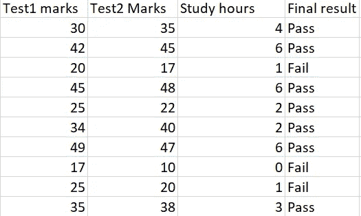

# 识别最大似然算法的正确数据集(监督)

> 原文：<https://medium.com/analytics-vidhya/identify-the-correct-dataset-for-your-ml-algorithms-supervised-7cb3955c5542?source=collection_archive---------19----------------------->

机器学习是当今的一项新兴技术。对于初学者来说，在开始实现机器学习算法时可能会有很多困惑。我实现的最基本的算法是监督学习算法。监督算法包括两类问题，回归和分类。我面临的最初问题是区分这些问题，并为这些算法确定正确的数据集。

> 因此，如果你是一个初学者，这篇文章就是关于为你的 ML 算法找到正确的数据集。

首先让我们了解一下监督学习的基础知识。监督学习是用包括输入和输出对的数据集来训练机器。例如，对于给定的数据集，X 是属性(输入)，Y 是相关联的标签(输出)。现在，机器将运行监督算法，并训练自己根据给定的输入 x 预测 Y。

监督学习数据集。

属性**学生**将不被考虑，因为它只是一个索引而不是实际数据。这就是监督学习。在训练之前，数据集将被分成两部分。**培训**和**测试**。训练元组包括 X 和 y。而测试元组只包括 X，并且必须预测 y。下面是用于分割训练和测试数据的代码。

这里，测试大小=0.3 意味着 30%的数据集将是测试数据。

> 注意:为训练和测试选择的数据将是随机的。

现在，从 X_train 和 y_train 将训练算法，从 X_test 将测试算法。这里，Y_test 用于比较预测结果和实际结果(Y_test)。

另一方面，在无监督学习中，数据集中不会有输出。

*现在让我们来看看监督学习的类型。*

> 监督学习的类型

主要有两种类型的监督学习，

***回归:***

当输出数据为数值时，回归算法适用。举个例子，

回归数据集

在给定的数据集中，输出(最终结果)是描述学生最终分数的离散值。因此，回归算法将预测学生的最终成绩。

***分类:***

在分类算法中，输出是类别/类。举个例子，

分类数据集

在给定的数据集中，输出是类(通过或失败)。所以在这里，分类算法将预测学生在期末考试中通过或失败。

所以，主要的区别是输出的类型(类别或值)。

希望这篇文章对你有用。在下一篇文章中，我将讲述回归和分类算法的实现。我已经上传了分类代码到我的 GitHub 库，[https://github.com/Farnaz08/MLforCOVID](https://github.com/Farnaz08/MLforCOVID)，解释在，[https://farnazfp . medium . com/machine-learning-for-新冠肺炎-2cfc496b28ab](https://farnazfp.medium.com/machine-learning-for-covid-19-2cfc496b28ab)