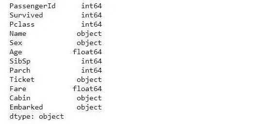

# 识别、清理和替换离群值|泰坦尼克号数据集

> 原文：<https://medium.com/analytics-vidhya/identifying-cleaning-and-replacing-outliers-titanic-dataset-20182a062893?source=collection_archive---------1----------------------->

应用稳健概念处理异常值


shutterstock.com

O 离群值是数据中与数据的主要样本差异极大的值，离群值的存在会显著降低可预测模型的性能和准确性。

衡量机器学习模型有多好取决于数据有多干净，离群值的存在可能是数据收集过程中出现错误的结果，但其中一些极值可能是有效和合法的。例如，将罗纳尔多或梅西的进球得分与其他普通球员进行比较，将道恩·强森和瑞安·雷诺兹等顶级演员的收入与其他演员进行比较，我们可以清楚地看到这是不可比的，差距将非常显著。

因此，在数据分析过程中，该分数和收入可能会显示为异常值，这就是为什么需要对数据进行更广泛和深入的分析，以找出并区分极端值和异常值。

我们将使用 titanic 数据集来识别、清理和替换异常值。现在，让我们探索我们的数据，并做一些基本的数据预处理。

导入库

```
import pandas as pd
import matplotlib.pyplot as plt
import seaborn as sns
```

读取数据集

```
df=pd.read_csv('titanic.csv')
df.head()
```


照片由 Magtech Digital Hub 提供

```
df.dtypes
```



照片由 Magtech Digital Hub 提供

查看统计详细信息

```
df.describe()
```


缺失值的百分比

```
missing_values=df.isnull().sum()
missing_values[missing_values>0]/len(df)*100
```


可视化缺失的值

```
sns.heatmap(df.isnull(),yticklabels=False,cbar=False
```


删除不相关的列

```
df.drop(['PassengerId','Name','Ticket','Cabin'],axis=1,inplace=True)
df.head()
```


缺失值的填充

```
df['Age']=df['Age'].fillna(df['Age'].mode()[0])df['Embarked']=df['Embarked'].fillna(df['Embarked'].mode()[0]) 
```

在上面的代码行中，我们检查了数据类型、缺失值，并删除了一些不相关的列，并用这些列(Age，Embarked)的最频繁(mode)值填充缺失值。

## 异常值识别

有不同的方式和方法来识别异常值，但是我们将只使用一些最流行的技术:

*   形象化
*   歪斜
*   四分位间距
*   标准偏差

## **可视化**

可以使用不同的可视化方法来检测异常值，我们将使用:

*   箱线图
*   柱状图

## 箱线图

boxplot 是一个用于识别异常值的可视化工具，它显示统计观测值的分布，其主体分为四个部分；最低值和最高值(最小值和最大值)、25 个百分点(第一个四分位数(Q1))、中间值(第 50 个百分点)、第 75 个百分点(第三个四分位数(Q3))。

异常值出现在箱线图的最小值和最大值之上或之下。


towarsdatascience.com

下面的代码行绘制了“Fare”变量的箱线图。

```
sns.boxplot(df['Fare'],data=df)
```


从上面的方框图中，用箭头表示的黑色圆点表示变量中存在极值。

## 柱状图

为了可视化数值变量的分布，直方图显示了这些变量分布的方向，异常值将出现在数据的整体分布之外。如果直方图向右倾斜或向左倾斜，则表明存在极值或异常值。


下面的代码绘制了“Fare”变量的直方图。

```
df['Fare'].hist()
```


从上面的直方图来看，直方图似乎分布在左侧，这也表明存在异常值。

## **偏斜度**

对于正态分布，偏斜值应在-1 到 1 的范围内，任何偏离该值的重大变化都可能表明存在异常值。

下面的代码打印了“Fare”变量的偏斜度值。

```
print('skewness value of Age: ',df['Age'].skew())
print('skewness value of Fare: ',df['Fare'].skew())
```

Out[ ]:

```
skewness value of Age: 0.6577529069911331
skewness value of Fare: 4.787316519674893
```

对于正态分布，偏斜值应在-1 到 1 的范围内，任何偏离该值的重大变化都表明存在极值或异常值。

从上面的代码来看，4.78 的“Fare”偏斜值显示变量被正确地偏斜，表明存在异常值。

## **四分位距(IQR)**

四分位数范围是统计离差的度量，计算为第 75 个和第 25 个百分点之间的差值。四分位数将数据集分成四个相等的部分。分隔各部分的值称为第一、第二和第三四分位数。


ScienceDirect.com

此代码显示了“票价”变量的四分位范围值。

```
Q1=df['Fare'].quantile(0.25)
Q1=df['Fare'].quantile(0.75)
IQR=Q3-Q1
```

Out[]:

```
23.0896
```

下面的代码打印了异常值，并分别设置了“Fare”变量的第 25 和第 75 个百分位数，这也将用于异常值处理过程中的下限和上限。

```
Q1 = df['Fare'].quantile(0.25)
Q3 = df['Fare'].quantile(0.75)
IQR = Q3 - Q1
whisker_width = 1.5Fare_outliers = df[(df['Fare'] < Q1 - whisker_width*IQR) | (df['Fare'] > Q3 + whisker_width*IQR)]Fare_outliers.head()
```


## **标准差**

标准差衡量一组值相对于数据平均值的变化量和离差，它显示数据的可变性分布。

高标准偏差表示值高度分散，而低标准偏差表示值的变化或分散较低。


维基百科(一个基于 wiki 技术的多语言的百科全书协作计划ˌ也是一部用不同语言写成的网络百科全书ˌ 其目标及宗旨是为全人类提供自由的百科全书)ˌ开放性的百科全书

下面的代码打印了异常值

```
fare_mean = df['Fare'].mean()
fare_std = df['Fare'].std()
low= fare_mean -(3 * fare_std)
high= fare_mean + (3 * fare_std)
fare_outliers = df[(df['Fare'] < low) | (df['Fare'] > high)]
fare_outliers.head()
```


## **异常值处理**

*   地板和顶盖。
*   修剪。
*   用平均值、中值、众数或其他值替换异常值。

## 地板和顶盖

在这种基于分位数的技术中，我们将对较低值进行下限(例如第 25 个百分位数)处理，对较高值进行上限(例如第 75 个百分位数)处理。这些百分点值将用于基于分位数的下限和上限。

下面的代码通过删除“Fare”变量中低于第 25 个百分点和高于第 75 个百分点的所有值来删除异常值。

```
Q1 = df['Fare'].quantile(0.25)
Q3 = df['Fare'].quantile(0.75)
IQR = Q3 - Q1
whisker_width = 1.5
lower_whisker = Q1 -(whisker_width*IQR)
upper_whisker = Q3 + whisker_width*IQR)
df['Fare']=np.where(df['Fare']>upper_whisker,upper_whisker,np.where(df['Fare']<lower_whisker,lower_whisker,df['Fare']))
```

我们现在可以使用箱线图或其他异常值识别方法来检查是否仍然存在异常值。

下面的箱线图显示不存在异常值。

```
sns.boxplot(df['Fare'],data=df)
```


我们现在将两个箱线图与异常值处理前后的箱线图进行比较。


**修剪**

在这个方法中，我们删除了所有的异常值，下面的代码行为所有的数据点创建了一个索引并删除了索引值。

```
Q1 = df['Fare'].quantile(0.10)
Q3 = df['Fare'].quantile(0.90)
IQR = Q3 - Q1
whisker_width = 1.5
lower_whisker = Q1 - (whisker_width*IQR)
upper_whisker = Q3 + (whisker_width*IQR)
index=df['Fare'][(df['Fare']>upper_whisker)|(df['Fare']<lower_whisker)].indexdf.drop(index,inplace=True)
```


我们将两个箱线图与异常值处理之前和之后的箱线图进行比较，我们仍然观察到有几个极值可能是新生成的。


**用平均值、中值、众数或其他值替换异常值**

在这种技术中，我们用众数代替极值，您可以使用中值或平均值，但建议不要使用平均值，因为它很容易受到异常值的影响。


我们现在还将两个箱线图与异常值处理前后的箱线图进行比较。


magtech dihub

# 结论

在这篇博客中，您已经掌握了一些简单的概念和异常值识别的不同方法，这些方法使用了不同的技术，如可视化、偏斜度、四分位距(IQR)和标准差，以及清理异常值的不同方法，如修剪、铺地板和加盖，以及用平均值、中值或模式替换异常值，您可以应用这些方法来成功识别异常值。

## 参考

[1]维基百科，inter quartile _ range*(2012 年 5 月)，https://en.wikipedia.org/wiki/Interquartile_range*