# 使用卷积神经网络识别狗的品种

> 原文：<https://medium.com/analytics-vidhya/identifying-dog-breeds-using-convolutional-neural-networks-e1a039db87e4?source=collection_archive---------12----------------------->

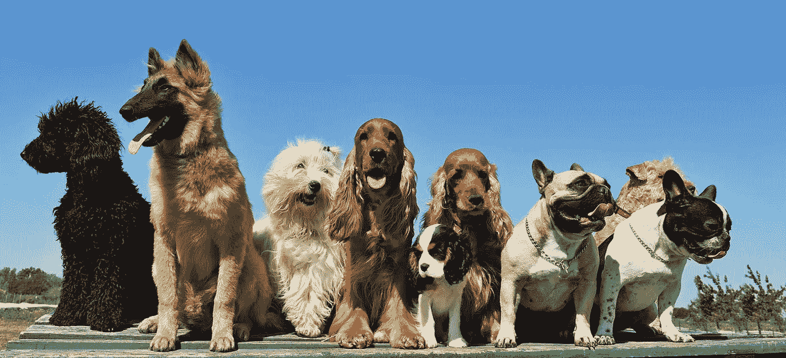

# 项目概述

在这个项目中，我训练了卷积神经网络(CNN)来对图像中的狗的品种进行分类！CNN 是一类深度神经网络，在分析和学习视觉数据模式方面非常强大。然而，CNN 可能需要大量数据集和大量计算时间来训练。为了在有限的训练数据量下达到可接受的分类精度水平，在训练期间应用迁移学习可能非常有用。

迁移学习是一个过程，在这个过程中，您将从以前解决的问题中学到的许多特征提取器作为训练模型的起点。通过这种方法，我们可以利用这样一个事实，即一些模型已经使用数百万张训练图像训练了数千个 GPU 小时。使用这种方法，可以用较少的训练数据和训练时间获得较高的精度。

# 项目目标

目标是创建一个犬种分类器算法，该算法能够正确分类测试数据集中至少 60%的犬种。

该算法接受图像作为输入，并完成以下任务。

*   如果在图像中检测到一只**狗**，返回预测的品种。
*   如果在图像中检测到一个**人**，返回相似的狗品种。
*   如果图像中未检测到**或**，则提供指示错误的输出。

达到这个测试精度后，我们将测试从互联网上收集的一些图像，看看结果。

# 实现目标的策略

为实现这一目标而制定的战略如下:

*   步骤 0:导入数据集
*   第一步:探测人类
*   第二步:探测狗
*   第三步:创建一个 CNN 来分类狗的品种(从头开始)
*   第四步:创建一个 CNN 对狗的品种进行分类(使用迁移学习)
*   第五步:写一个算法
*   步骤 6:测试算法

# 韵律学

我将用来评估每个模型的分类标准是准确性标准。为了测量模型的准确性，我将使用模型来预测测试集中所有图像的狗的品种，然后计算模型正确预测的图像的比例。

尽管数据集的类并不是完全平衡的，但由于类的数量，在这种情况下精确度是一个很好的衡量标准。如果模型只是猜测和预测每个图像都是训练集中最常见的狗品种，那么模型将准确预测不到百分之一的测试图像。

# 探索性数据分析

为了训练和测试我们的狗品种分类器，Udacity 非常好心地给我提供了许多狗的标签图像。通过探索数据，我们看到有 8300 个标记的狗图像，其中标签是 133 个狗品种中的一个。为了训练一个 bog 品种分类器，我把数据分成训练、验证和测试数据集。

训练前，了解数据中犬种的分布很重要。我们可以在下面看到，不同品种之间的数据并不完全平衡，但最低代表品种仍然有超过 25 个训练样本图像。

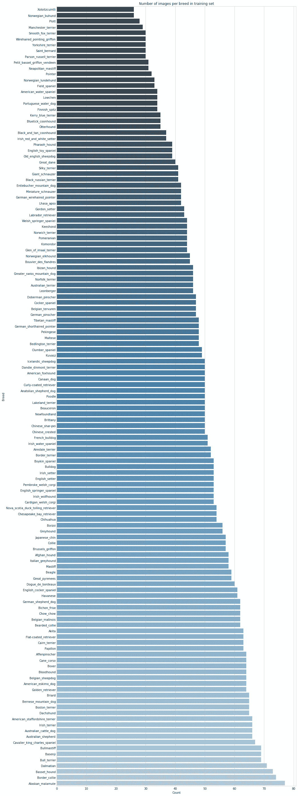

# 数据可视化

同样在训练之前，重要的是要想象一些图像，以确定狗是在什么样的环境中被拍摄的。如果所有的狗都是在室内拍摄的，那么这个模型在室外拍摄的图像上可能就不那么适用了。

下面我们可以看到两个例子，它们很好地展示了整个数据集的样子。这个数据集中的狗是在各种各样的环境中拍摄的，这可能会使我们的模型更难训练，但当它被训练时，它应该可以在许多环境中工作。

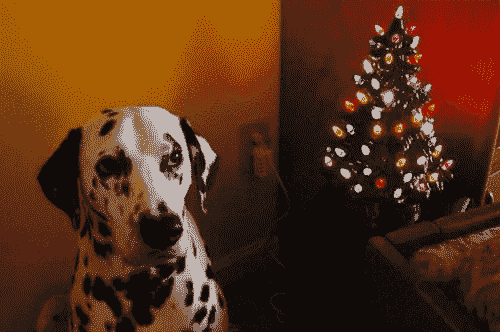

达尔马提亚狗

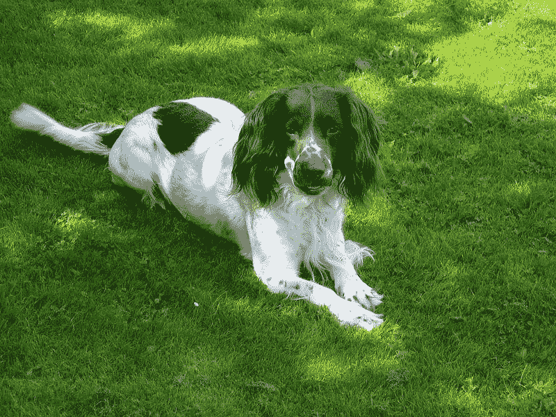

英国史宾格猎犬

# 履行

**步骤 0:导入数据集和必要的库**

以下 2 个数据集由 Udacity 提供

1.  [训练模型的狗图片](https://s3-us-west-1.amazonaws.com/udacity-aind/dog-project/dogImages.zip) s
2.  [人脸检测器](https://s3-us-west-1.amazonaws.com/udacity-aind/dog-project/lfw.zip)

笔记本中使用的库如下

```
from sklearn.datasets import load_files 
from keras.utils import np_utils
import numpy as np
from glob import glob
from keras.applications.resnet50 import ResNet50
from keras.preprocessing import image
from tqdm import tqdmfrom keras.applications.resnet50 import preprocess_input, decode_predictionsfrom keras.layers import Conv2D, MaxPooling2D, GlobalAveragePooling2Dfrom PIL import ImageFile
from keras.layers import Dropout, Flatten, Dense
from keras.models import Sequential
from keras.callbacks import ModelCheckpoint
from extract_bottleneck_features import *import random
import cv2                
import matplotlib.pyplot as plt
```

**步骤 1:检测图像中的人**

OpenCV 实现的[基于 Haar 特征的级联分类器](http://docs.opencv.org/trunk/d7/d8b/tutorial_py_face_detection.html)在这个项目中用于检测人脸。OpenCV 提供了许多预先训练好的人脸检测器，作为 XML 文件存储在 [GitHub](https://github.com/opencv/opencv/tree/master/data/haarcascades) 上。我们已经下载了这些检测器中的一个，并将其存储在`haarcascades`目录中。

下面提供的代码单元演示了如何使用该检测器在样本图像中查找人脸。

```
# extract pre-trained face detector
face_cascade = cv2.CascadeClassifier('haarcascades/haarcascade_frontalface_alt.xml')def face_detector(img_path):
    img = cv2.imread(img_path)
    gray = cv2.cvtColor(img, cv2.COLOR_BGR2GRAY)
    faces = face_cascade.detectMultiScale(gray)
    return len(faces) > 0human_files_short = human_files[:100]
dog_files_short = train_files[:100]
# Do NOT modify the code above this line.
face_dec = np.vectorize(face_detector)
human_face_detected =face_dec(human_files_short)
dog_detected = face_dec(dog_files_short)print(" Human Face Detected with {:.1f}%accuracy".format(sum(human_face_detected)))
print("Dog detected with  {:.1f}% error".format(sum(dog_detected))) 
```

*   正确识别的人数:100
*   被认为有人类的狗的数量:11

结果并不完美，但还可以接受。

**步骤 2:检测图像中的狗**

在本节中，我们使用预训练的 [ResNet-50](http://ethereon.github.io/netscope/#/gist/db945b393d40bfa26006) 模型来检测图像中的狗。

```
from keras.applications.resnet50 import ResNet50# define ResNet50 model
ResNet50_model = ResNet50(weights='imagenet')
```

在输入图像中检测狗的过程包括两个步骤。第一步是处理输入的图像数据，第二步是根据处理后的图像进行预测。

***预处理***

在将数据传递到 Resnet 50 模型进行预测之前，我们需要对图像数据进行一些预处理。我们这样做是因为使用 TensorFlow 作为后端的 Keras CNNs 要求输入是 4D 数组。输入数组的形式如下:

(样本数、行数、列数、通道数)

为了实现以下功能，定义了:

**Path_to_tensor** :这个函数接受一个彩色图像的字符串值文件路径作为输入，并返回一个适合提供给 Keras CNN 的 4D 张量。该函数首先加载图像，并将其调整为 224×224 像素的正方形图像。然后，图像被转换成一个数组，数组的大小被调整为 4D 张量。在这种情况下，由于我们正在处理彩色图像，每个图像有三个通道。

**Paths_to_tensor:** 该函数将字符串值图像路径的 NumPy 数组作为输入，并返回具有所需形状的 4D 张量。在我们的数据为模型做好准备之前，要采取的最后一步包括额外的归一化步骤，即获取 ImageNet 中所有图像的所有像素的平均像素值(用 RGB 表示为[103.939，116.779，123.68])，并从每个图像的每个像素中减去它。这是在导入函数`preprocess_input`中实现的，可以在[这里找到](https://github.com/fchollet/keras/blob/master/keras/applications/imagenet_utils.py)。

这两个函数的代码如下所示。

```
from keras.preprocessing import image                  
from tqdm import tqdmdef path_to_tensor(img_path):
    # loads RGB image as PIL.Image.Image type
    img = image.load_img(img_path, target_size=(224, 224))
    # convert PIL.Image.Image type to 3D tensor with shape (224, 224, 3)
    x = image.img_to_array(img)
    # convert 3D tensor to 4D tensor with shape (1, 224, 224, 3) and return 4D tensor
    return np.expand_dims(x, axis=0)def paths_to_tensor(img_paths):
    list_of_tensors = [path_to_tensor(img_path) for img_path in tqdm(img_paths)]
    return np.vstack(list_of_tensors)
```

***做出预测***

下面显示的函数是用于进行预测的函数，它使用 predict 函数来获得 ImageNet 的 1000 个类的数组。然后，我们使用 NumPy 的 argmax 函数来隔离概率最高的类。

在 ImageNet 类的输出字典中(在这里找到)，条目 151 到 269 表示狗，因此我们编写了第二个函数，使用这个字典来确定图像中的任何已识别对象是否属于这个字典范围。

```
from keras.applications.resnet50 import preprocess_input, decode_predictionsdef ResNet50_predict_labels(img_path):
    # returns prediction vector for image located at img_path
    img = preprocess_input(path_to_tensor(img_path))
    return np.argmax(ResNet50_model.predict(img))def dog_detector(img_path):
    prediction = ResNet50_predict_labels(img_path)
    return ((prediction <= 268) & (prediction >= 151))
```

下面的代码用于测试狗检测器的准确性，结果是 0%的人图像和 100%的狗图像检测到人脸

```
human_files_short = human_files[:100]
dog_files_short = train_files[:100]

dog_dec = np.vectorize(dog_detector)

human_face_detected =dog_dec(human_files_short)
dog_detected = dog_dec(dog_files_short)print("{:.1f}% of Humans are detected as dogs".format(sum(human_face_detected)))
print("{:.1f}% of Dogs detected in the first 100 files".format(sum(dog_detected))) 
```

**第三步:创建一个 CNN 对狗的品种进行分类(从头开始)**

尽管该项目的目标是使用迁移学习建立一个狗品种分类器，但该项目的这一部分对于理解 CNN 的基本原理及其工作方式是有用的。

我们首先通过将每个图像中的每个像素除以 255 来重新缩放图像。

```
from PIL import ImageFile 
ImageFile.LOAD_TRUNCATED_IMAGES = True# pre-process the data for Keras
train_tensors = paths_to_tensor(train_files).astype(‘float32’)/255
valid_tensors = paths_to_tensor(valid_files).astype(‘float32’)/255
test_tensors = paths_to_tensor(test_files).astype(‘float32’)/255
```

我们用下面的代码创建了一个 CNN 来分类狗的品种

```
from keras.layers import Conv2D, MaxPooling2D, GlobalAveragePooling2D
from keras.layers import Dropout, Flatten, Dense
from keras.models import Sequential

model = Sequential()
model.add(Conv2D(filters=16, kernel_size=2, padding='same', activation='relu', input_shape=(224, 224, 3)))
model.add(MaxPooling2D(pool_size=2))model.add(Conv2D(filters=32, kernel_size=2, padding='same', activation='relu'))
model.add(MaxPooling2D(pool_size=2))model.add(Conv2D(filters=64, kernel_size=2, padding='same', activation='relu'))
model.add(MaxPooling2D(pool_size=2))
model.add(GlobalAveragePooling2D())
model.add(Dense(133, activation='relu'))model.summary()
```

大纲:

1.  我们创建了 3 个卷积层，中间有 3 个最大池层，以了解高级功能的层次结构。添加最大池层以减少维度。
2.  我们在 3 个卷积层中使用了 3 个滤波器' 16，32，64 '。
3.  整流线性激活函数或简称 ReLU 是一个分段线性函数，如果它是正的，它将直接输出输入，否则，它将输出零。所以，我们对所有的层都使用了 ReLu 激活函数。
4.  GlobalAveragePooling2D 做了一些不同的事情。它在空间维度上应用平均池，直到每个空间维度都是一个，而其他维度保持不变。
5.  最后一个全连接层中的节点数设置为 133，并使用 ReLu 激活函数来获得预测的概率。

获得的输出:

```
_________________________________________________________________
Layer (type)                 Output Shape              Param #   
=================================================================
conv2d_25 (Conv2D)           (None, 224, 224, 16)      208       
_________________________________________________________________
max_pooling2d_26 (MaxPooling (None, 112, 112, 16)      0         
_________________________________________________________________
conv2d_26 (Conv2D)           (None, 112, 112, 32)      2080      
_________________________________________________________________
max_pooling2d_27 (MaxPooling (None, 56, 56, 32)        0         
_________________________________________________________________
conv2d_27 (Conv2D)           (None, 56, 56, 64)        8256      
_________________________________________________________________
max_pooling2d_28 (MaxPooling (None, 28, 28, 64)        0         
_________________________________________________________________
global_average_pooling2d_2 ( (None, 64)                0         
_________________________________________________________________
dense_10 (Dense)             (None, 133)               8645      
=================================================================
Total params: 19,189
Trainable params: 19,189
Non-trainable params: 0
_________________________________________________________________
```

在编译了上述模型，并使用训练和验证数据对其进行拟合之后，我接着在我们的测试图像上测试了该模型，并看到该模型对 1.0766%的测试图像正确地预测了狗的品种。

为了获得更好的准确性，我们将使用迁移学习，看看我们能获得多大的改进。

**步骤 4:使用 CNN 对狗的品种进行分类(使用迁移学习)**

为了在不牺牲准确性的情况下减少训练时间，我们可以使用迁移学习来训练 CNN。在接下来的步骤中，我们使用迁移学习在我们自己的 CNN 上进行训练。为了提高精确度，我首先尝试使用 VGG-16 模型作为起点。通过在我们的训练和验证数据上训练该模型，该模型能够在 42.7033%的测试图像上正确预测狗的品种。以下是模型总结:

```
VGG16_model = Sequential()
VGG16_model.add(GlobalAveragePooling2D(input_shape=train_VGG16.shape[1:]))
VGG16_model.add(Dense(133, activation=’softmax’))VGG16_model.summary()
_________________________________________________________________
Layer (type)                 Output Shape              Param #   
=================================================================
global_average_pooling2d_3 ( (None, 512)               0         
_________________________________________________________________
dense_11 (Dense)             (None, 133)               68229     
=================================================================
Total params: 68,229
Trainable params: 68,229
Non-trainable params: 0
_________________________________________________________________
```

精确度的提高是一个巨大的进步，但是离我们想要的还很远。接下来，我选择利用在 ImageNet 数据库上训练的 Resnet 50 CNN 来构建我的 CNN。Resnet 50 模型的瓶颈特性是存在的，我只需要下载我们的 Resnet 50 CNN 的文件，然后用下面的代码导入它。

通过运行以下命令提取与训练集、测试集和验证集对应的瓶颈特征:

```
bottleneck_features = np.load(‘bottleneck_features/DogResnet50Data.npz’)
train_Resnet50 = bottleneck_features[‘train’]
valid_Resnet50 = bottleneck_features[‘valid’]
test_Resnet50 = bottleneck_features[‘test’]
```

新数据集很小，并且与原始训练数据相似，因此网络的末端被切掉，并且添加了与新数据集中的类的数量相匹配的完全连接的层。接下来，新的全连接层的权重被随机化；来自预训练网络的所有权重都被冻结。最后，训练网络来更新新的全连接层的权重。

应用 Resnet50 模型后，准确率达到 75%以上。我还添加了一个具有 500 个节点的全连接层和一个 ReLu 激活函数来检测更多的模式和一个 Dropout 以避免过度拟合。

```
from keras.layers import DropoutResnet50_model = Sequential()
Resnet50_model.add(GlobalAveragePooling2D(input_shape=train_Resnet50.shape[1:]))
Resnet50_model.add(Dense(133, activation='softmax'))Resnet50_model.summary()_________________________________________________________________
Layer (type)                 Output Shape              Param #   
=================================================================
global_average_pooling2d_6 ( (None, 2048)              0         
_________________________________________________________________
dense_16 (Dense)             (None, 133)               272517    
=================================================================
Total params: 272,517
Trainable params: 272,517
Non-trainable params: 0
_________________________________________________________________
```

定义架构后，使用下面的代码对其进行编译和训练。

```
Resnet50_model.compile(loss=’categorical_crossentropy’, optimizer=’rmsprop’, metrics=[‘accuracy’])
```

我们跟踪所有时期并加载最佳参数，以确保我们的 CNN 在训练过程中具有最高精度的权重。

```
from keras.callbacks import ModelCheckpointcheckpointer = ModelCheckpoint(filepath=’saved_models/weights.best.Resnet50.hdf5', 
 verbose=1, save_best_only=True)Resnet50_model.fit(train_Resnet50, train_targets, 
 validation_data=(valid_Resnet50, valid_targets),
 epochs=20, batch_size=20, callbacks=[checkpointer], verbose=1)
```

现在，我们已经使用下面的代码加载了具有最佳验证损失的模型

```
Resnet50_model.load_weights(‘saved_models/weights.best.Resnet50.hdf5’)
```

我们测试了用下面的代码实现的模型的准确性，得到了 80.7416%的准确性。

```
# get index of predicted dog breed for each image in test set
Resnet50_predictions = [np.argmax(Resnet50_model.predict(np.expand_dims(feature, axis=0))) for feature in test_Resnet50]# report test accuracy
test_accuracy = 100*np.sum(np.array(Resnet50_predictions)==np.argmax(test_targets, axis=1))/len(Resnet50_predictions)
print(‘Test accuracy: %.4f%%’ % test_accuracy)
```

下一步是将它放入一个函数中，该函数将接收图像路径并预测图像中的狗的品种。为此任务定义的函数如下所示。

```
from extract_bottleneck_features import *def Resnet50_predict_breed(img_path):
 # extract bottleneck features
 bottleneck_feature = extract_Resnet50(path_to_tensor(img_path))
 # obtain predicted vector
 predicted_vector = Resnet50_model.predict(bottleneck_feature)
 # return dog breed that is predicted by the model
 return dog_names[np.argmax(predicted_vector)]
```

**第五步:编写算法**

在这里，我们创建我们的算法来分析任何图像。该算法接受文件路径，并且:

*   如果在图像中检测到一只**狗**，返回预测的品种。
*   如果在图像中检测到一个**人**，返回相似的狗品种。
*   如果在图像中没有检测到**或**，则提供指示错误的输出。

该算法收集我们之前使用的所有函数来创建最终输出并显示图像。

```
def display_img(img_path):
 img = cv2.imread(img_path)
 cv_rgb = cv2.cvtColor(img, cv2.COLOR_BGR2RGB)
 imgplot = plt.imshow(cv_rgb)
 return imgplotdef predict_breed(img_path):
 display_img(img_path)
 if dog_detector(img_path):
 return print(“It’s a Dog and the breed is {}”.format(Resnet50_predict_breed(img_path)))

 if face_detector(img_path):

 return print(“if you were a dog you’ll be a {}!!”.format(Resnet50_predict_breed(img_path)))

 else:
 return print(“Definitely not a Human or a Dog”)
```

**第六步:测试算法**

我用从互联网上随机获取的图片测试了该算法，结果如下:

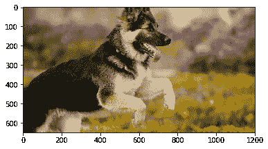

**是狗，品种是 ages/train/071。德国 _ 牧羊犬 _ 狗**

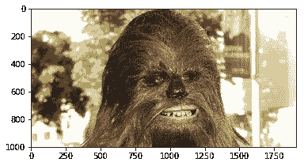

**是一只狗，品种是 ages/train/133。约克夏 _ 梗**

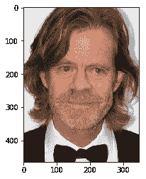

如果你是一只狗，你将会是一只狗。丝滑 _ 梗！！

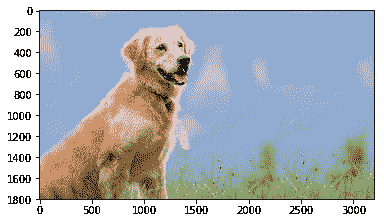

**是狗，品种是 ages/train/076。金毛寻回犬**

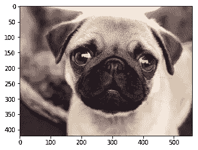

**是狗，品种是 ages/train/041。斗牛犬**

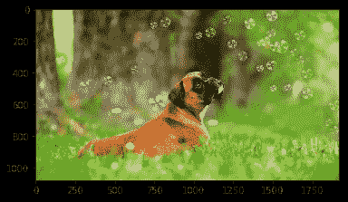

是一只狗，品种是 ages/train/034。拳击手

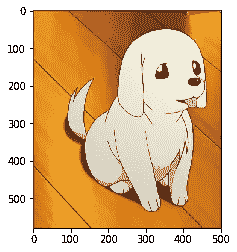

**肯定不是人也不是狗**

# 结果

以下是每个模型在测试集上获得的准确度。

*   CNN 从零开始:1.0766%
*   来自 VGG16 的 CNN:42.7033%
*   来自 Resnet50 的 CNN:80.7416%

**模型评估和验证**

用 Resnet50 训练的 CNN 在测试集上达到了可接受的 80.7416%的准确率。我相信这个精度是可以接受的，因为应用程序的目的。使用这个程序是为了乐趣，所以它应该相当准确，但是一点点的不准确实际上可以增加乐趣！

**理由**

模型之间精度差异的一个原因是每个模型中使用的参数数量。CNN 从头开始使用了 19，189 个参数，VGG-16 模型使用了 68，229 个参数，Resnet50 模型使用了 272，517 个参数。更多的参数可能导致过度拟合，并学习训练集的过于具体的细节。然而，上面的精度是在测试集上用训练中没有使用的数据计算的。因此，我们可以看到，由于测试精度提高，过拟合不是问题。

# **倒影**

产量比我预期的要好。即使图片中有人脸，算法也匹配得很好。然而，对于看起来非常接近的赛狗来说，要把它弄对似乎仍然很棘手。

使用 Keras 从零开始构建 CNN 可能很简单，但它显然不是有效的，只能正确分类百分之一的测试图像。幸运的是，迁移学习有助于解决这个问题。在以两个不同的预训练模型作为起点进行实验后，我偶然发现了 Resnet50 模型，它帮助我在测试集上达到了 80.7416%的准确率，我认为这是可以接受的。

# 丰富

我想尝试以下实验，看看它们是否能进一步提高精确度:

*   图像增强
*   通过增加神经网络的深度

链接到 GitHub:[https://github.com/lakshman533/Dog-Breed-Identifier](https://github.com/lakshman533/Dog-Breed-Identifier)